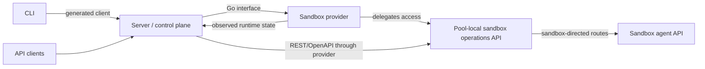
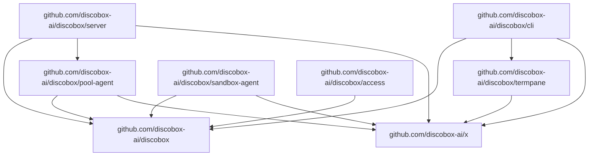
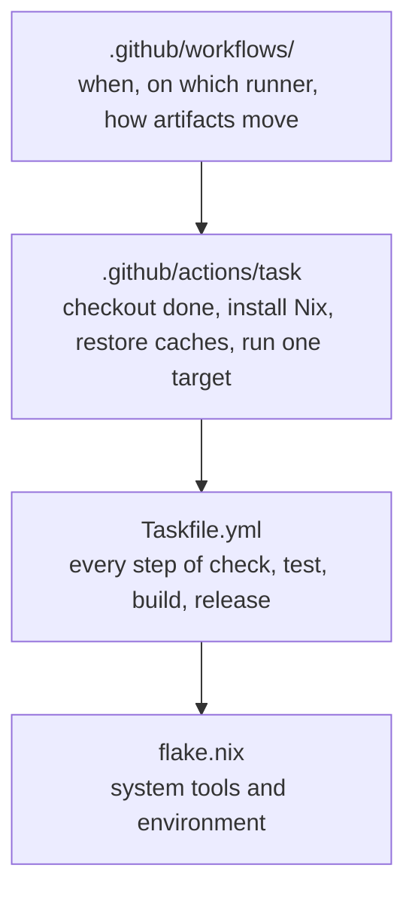
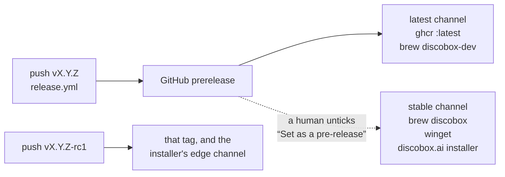
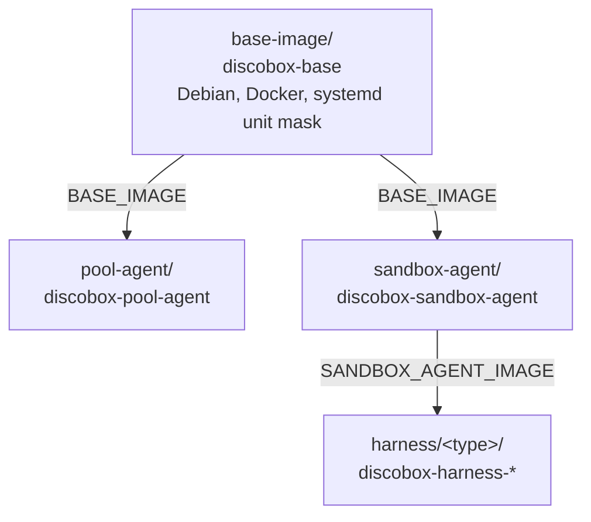

# Design Overview

## System Pattern

The server stores desired resource intent and reconciles actual sandbox runtime
state through sandbox providers. Providers own runtime-specific mechanics and
report or expose observed runtime state back to the server.

Accepted intent is persisted together with a dirty mark for the resource in one
transaction. The level-triggered reconcile engine (`server/internal/reconcile`)
runs that resource's reconciler against the latest persisted state; newer intent
re-marks the same resource rather than queuing or canceling work. See
[`server/internal/reconcile/DESIGN.md`](server/internal/reconcile/DESIGN.md).

## High-Level System Design

At the system boundary, Discobox comprises these cooperating concepts:

- **Server**: the control plane and API surface. It stores which sandboxes
  should exist and with what spec, and coordinates reconciliation toward that.
  It holds no opinion about whether a sandbox is running: power state is
  observed and reported by the pool agent, and start/stop/restart are
  instructions forwarded to it (ADR 0017 §9).
- **Pool**: the user-visible sharing boundary sandboxes are scheduled into,
  and its own runtime host (ADR-0003, ADR-0006). Sandboxes in one pool share a
  cache volume, a resource envelope, and a kernel/host; a pool binds immutably
  to one provider instance, and its host runtime (container/VM/pod) is
  replaceable in place under the pool's identity.
- **Sandbox provider**: the Go-level runtime integration interface implemented
  by provider backends. A provider instance is backend identity only —
  capacity and sharing policy live on pools.
- **Pool-local sandbox operations API**: the REST/OpenAPI runtime-operation
  interface exposed by a pool agent for sandboxes hosted on that pool.
- **Sandbox agent API**: the in-sandbox REST/OpenAPI interface the sandbox agent
  serves from inside each sandbox; the server reaches it through the pool
  agent's sandbox-directed routes.

The root design intentionally stops at this integration view. Interface details
belong to the owning component docs.

## API Contracts

Use contract-first REST API development for public and provider-delegated REST
surfaces:

- Server REST API: control plane API consumed by the CLI and external clients.
- Pool-local sandbox operations API: runtime operations exposed by pool
  agents and reached through provider-delegated access.
- Sandbox agent API: in-sandbox API exposed by the sandbox-agent runtime.

The OpenAPI contract is the canonical API definition. Generate server handlers,
client types, validators, and documentation from the contract instead of deriving
the contract from Go handler code. Current contracts are intentionally split by
surface:

- `api/openapi/server.yaml` is the canonical control-plane REST API contract.
- `pool-agent/api/openapi/pool.yaml` is the canonical pool-local sandbox
  operations API contract. `pool-agent/generate.go` generates combined
  client/server transport code into `pool-agent/api/gen` and stable schema
  aliases into `pool-agent/api/model`; `pool-agent/server` adapts the
  generated server scaffold to local runtime operations.
- Sandbox-agent routes (execs, harness hooks, services, status) are canonical
  in `api/openapi/server.yaml` and marked `x-sandbox-agent` for subset
  generation. `api/openapi/sandbox.yaml` is generated from that server contract
  by `api/internal/gensandboxopenapi` and must not be edited directly.
- `/etc/discobox/sandbox.json` (the sandbox's effective runtime config) is
  not a REST contract and is not OpenAPI-generated. It is the hand-written
  `sandboxconfig` package — see `sandboxconfig/DESIGN.md` and
  `docs/adr/0012-sandbox-config-is-three-attribute-owned-layers.md`.

## Module Boundaries

The repository root is the stable contracts/API module. Server-owned
persistence, provider contracts, and provider implementations live in the server
module so provider adapters can use server-internal control-plane contracts.
`go.work` joins the root and the nested modules below.

- Root module: public API definitions, control-plane OpenAPI documents,
  generated API clients/scaffolds, the cross-module contracts in the package
  map below, and the exec attach stream: the wire protocol
  (`execstream/frame`), the duplex `execstream.Conn`
  seam, resumable positioned delivery (`execstream/resume`), and both roles:
  `execstream/host` serves a process's output to attached clients, and
  `execstream/client` attaches a caller's stdio to a remote process.
  `execstream.Prober` is the optional physical-transport timing capability;
  `resume` combines its heartbeat RTT with positioned-action acknowledgement
  RTT and emits transport-neutral timing events for frontends.
  `execstream.Delivery` is the optional capability reporting how far the host
  has caught up with what the client wrote, which only a positioned stream can
  answer; `execstream/client` uses it to tell an interrupt the remote applied
  from one a stalled stream swallowed. See
  [`execstream/resume/DESIGN.md`](execstream/resume/DESIGN.md) for the consumer
  contract and status interpretation. The platform halves stay with their
  platform — the PTY and
  screen emulator in `sandbox-agent`, terminal control in the CLI — so the
  shared module never grows a terminal dependency. See
  [ADR 0008](docs/adr/0008-attach-stream-packages.md).
- CLI module: `discobox` command implementation; depends on root generated
  clients/contracts for normal user commands and talks to the control plane
  through the Server REST API. It does **not** depend on the server module:
  `discobox admin server` resolves a `discobox-server` binary — one beside the
  executable, or one staged from the manifest the release linked in — and runs
  it as a child, which is also what local auto-launch starts
  ([ADR 0099](docs/adr/0099-the-cli-downloads-the-server-it-starts.md)).
- Server module: control plane implementation, persistence models, sandbox
  provider Go interfaces, provider manager, and Docker/VM/cloud/pool-backed
  provider implementations. It imports the pool-agent module for what the two
  ends of the pool hop share: the boot contract, API types, transport, and auth.
- Shared generic libraries live in [`discobox-ai/x`](https://github.com/discobox-ai/x)
  — `frontmatter`, `gormdb`, `gitutil`, `id`, `selection`, `shorttmp` — consumed
  at the latest commit on its `main`. Nothing there knows about Discobox; a
  helper that would have to is not generic and belongs in the module that needs
  it.
- Pool-agent module: in-guest pool host process, the pool boot contract
  (root `poolagent` package) that providers consume, pool-local runtime DTOs,
  and the generated pool-local sandbox operations API server adapter; depends
  on root contracts and OpenAPI types.
- Root module: the repository's own dev and build tools under `internal/cmd`,
  including the local Docker development image watcher for the shared base,
  pool-agent, sandbox-agent, and harness images, plus the versioned
  development-image manifest contract (`devimage`) shared with the server.
- Sandbox-agent module: in-sandbox agent REST API runtime environment and harness
  implementation; depends on root contracts and generated API types.
- Agent-credential CLI module: `discobox-access`, the in-sandbox client of
  the agent credentials protocol. It is its own module and its own binary — not
  an `argv[0]` alias of the sandbox agent — because it is meant to be liftable
  into another repository, and it depends on nothing but the stdlib-only
  `agentcreds` package. See [`access/DESIGN.md`](access/DESIGN.md).
- Termpane module: `termpane`, a Bubble Tea component that draws a live
  terminal from any stream; the CLI uses it. It depends on nothing else in
  this repository. See
  [`termpane/DESIGN.md`](termpane/DESIGN.md).

Pool-agent and sandbox-agent implementations cannot depend on packages under
Go `internal/` outside their module. Provider implementations are part of the
server module and may depend on `server/internal`.

Root module package map:

| Package/path | Ownership |
| --- | --- |
| [`api/openapi`](api/openapi) | Canonical OpenAPI source contracts owned by the root module: the server REST API, plus generated sandbox-agent subset output. Pool-agent-owned contracts live under `pool-agent/api/openapi`. |
| [`api/gen`](api/gen) | Generated client/server API scaffold from `api/openapi/server.yaml`, plus small handwritten helpers over generated types (list iterators). |
| [`api/sandboxgen`](api/sandboxgen) | Generated client/server API scaffold from generated `api/openapi/sandbox.yaml`, the sandbox-agent subset of the server contract. |
| [`api/model`](api/model) | Generated stable aliases for server REST API schema types. |
| [`api/internal`](api/internal) | The generators behind the `api/model` aliases and the `sandbox.yaml` subset. |
| [`devimage`](devimage) | Versioned watcher/server contract for content-addressed development Docker image sets and their opt-in environment keys. |
| [`agentcreds`](agentcreds) | The agent credentials protocol: the portable list/request/get contract, its client, an `http.Handler` over a `Service` interface, and the stable error codes and client configuration both halves share. It knows nothing about Discobox, which is what lets one in-sandbox CLI work against sandbox-agent and against any other implementation. See [`docs/agent-credentials-protocol.md`](docs/agent-credentials-protocol.md) and [ADR 0031](docs/adr/0031-agent-credentials-are-a-portable-protocol-with-ephemeral-sentinels.md). |
| [`endpoint`](endpoint) | How a client reaches the control plane and how the control plane listens, resolved from a URL scheme. Shared because the CLI and the server must agree on what an endpoint means, and because `git`, websockets, and the generated client all reach the server through the one client it builds. The pool-agent hop is resolved separately by [`pool-agent/wire`](pool-agent/wire). It also owns `Diagnose`, which reports reaching a server layer by layer rather than as the one error the top of the stack produces, and the transport logging behind `discobox --iroh-log` and the server's `iroh.logLevel` — both live here because the layers they describe are this package's, and nothing above it can see them. |
| [`harness`](harness) | The harness image contract (OCI-label metadata, registration) and hook registration drivers for sandbox terminals. See [`harness/DESIGN.md`](harness/DESIGN.md). |
| [`serverstage`](serverstage) | The description of a released server — its assets, where each is published, and what each one's SHA-256 is — and the staging that turns one into verified files on disk, one directory per version. In the root module because it is a release-format contract with two ends: the CLI decodes the manifest a release linked into it, and `internal/cmd/discobox-server-manifest` is what encodes one at build time. See [ADR 0099](docs/adr/0099-the-cli-downloads-the-server-it-starts.md). |
| [`installer`](installer) | The install scripts every release uploads — `install.sh` and `install.ps1` — and the stamp that fixes each copy to one release and its binaries' SHA-256s. In the root module for the reason `serverstage` is: a release-format contract with two ends, written by `internal/cmd/discobox-installers` when a release is published and read by the scripts on a user's machine. See [`installer/DESIGN.md`](installer/DESIGN.md) and [ADR 0110](docs/adr/0110-the-install-script-is-a-release-asset-and-a-channel-names-which-one-runs.md). |
| [`imagecache`](imagecache) | The image store: images kept on this machine as an OCI image layout, and the downloader that fills it, fetching only missing blobs for one platform and verifying each. The CLI stages the images its server names into it before starting that server; the server hands it to its providers, which fetch a VM guest through it, and the engine loads a container image from it into a pool's daemon before pulling, in an archive from which both Docker image stores keep the registry digest a sandbox is pinned to. The layout's format is this package's alone. In the root module because the CLI and the server both use it, and stdlib-only so the CLI's module graph gains no registry client. See [ADR 0113](docs/adr/0113-the-cli-stages-the-images-its-server-loads.md). |
| [`hostscope`](hostscope) | What a credential's host scope covers: a scope covers itself and everything beneath it, never its parent. Shared because three places compare a scope against the destination the proxy observed — the control plane's grant lookup, the pool agent's activation check, and the guard on what a grant may point a secret at — and a rule that differs in one of them is either a credential that stops working for no visible reason or one that travels somewhere nobody approved. |
| [`secretformat`](secretformat) | The shape of credential values: a generative template that mints a sentinel byte-identical to a real provider key, and inference of a template from a real value. Shared because both ends mint sentinels — the control plane the stable one bound to a sandbox, the pool agent the ephemeral one per use — and a sentinel shaped by different rules at each end would be distinguishable from the real thing. |
| [`internal/hostid`](internal/hostid) | This machine's generated, persisted Discobox identity. Shared because a CLI and a control plane on one machine must resolve the same value: that agreement is how the server knows a request came from its own filesystem. |
| [`internal/originkey`](internal/originkey) | Derives the origin key: where a sandbox belongs on the client that created it (ADR 0111). Shared so client and server cannot drift on it. |
| [`internal/filelock`](internal/filelock) | Advisory exclusive file locks for resources that tolerate one process at a time: a server's data directory, a development loop's checkout. |
| [`proxy`](proxy) | The pool-scoped HTTP/HTTPS and SOCKS proxy: certificates, traffic policy, response caching, and audit. Run by the pool agent and sandbox agent. See [`proxy/DESIGN.md`](proxy/DESIGN.md). |
| [`runcca`](runcca) | The runc wrapper that injects the sandbox's MITM CA into every container a nested Docker daemon creates. |
| [`sandboxconfig`](sandboxconfig) | The sandbox's effective runtime config (`/etc/discobox/sandbox.json`) assembled from attribute-owned layers. See [`sandboxconfig/DESIGN.md`](sandboxconfig/DESIGN.md). |
| [`sandboxuser`](sandboxuser) | The identity a sandbox process runs as and the precedence between the layers that describe it. See [`sandboxuser/DESIGN.md`](sandboxuser/DESIGN.md). |
| [`sandboxservices`](sandboxservices) | Names of the services Discobox itself declares inside a sandbox, shared by the sandbox agent that reports them and the CLI that recognizes them. |
| [`layout`](layout) | Where Discobox stores state, as the container sees it, scoped so no two pools share a writable path. |
| [`controlplane`](controlplane) | Shared control-plane endpoint defaults. |
| [`health`](health) | Wire contract for the server's readiness endpoint, which the CLI polls after launching a server. |
| [`version`](version) | The release a binary was cut from, for `discobox --version` and the server's `/healthz`. |
| [`randomname`](randomname) | Friendly Docker-style random names. |

Submodule package docs belong in their owning module trees and are intentionally
not listed here.

## Build, Check, and Release

Three layers, and the top one holds no logic (ADR 0066):

- `flake.nix` owns the toolchain. `nix develop` (or direnv via `.envrc`) is the
  entry point; its `shellHook` exports the `DISCOBOX_*` environment and
  regenerates CLI completions. `GOTOOLCHAIN=auto` means Nix supplies a bootstrap
  Go and `go.mod` names the one that compiles. `devShells.libkrun` adds the two
  things a machine running libkrun pools needs installed — libkrun and passt —
  and stays out of the default shell because that libkrun build is not in
  cache.nixos.org; `nix build .#libkrun-runtime` is the same closure for a
  machine that is not in a dev shell.
- `Taskfile.yml` owns every step. `go tool task --list` is the index; `task`,
  `golangci-lint`, and `ogen` are `go tool` dependencies pinned by `go.mod`, not
  by Nix.
- `.github/workflows/` decides only *when* a target runs and on which runner.
  Every job body is `nix develop -c go tool task <target>`, carried by the
  `.github/actions/task` composite action.

Release binaries are built on the platform they target — darwin has to be, since
`vz` is cgo against Virtualization.framework and its entitlement is applied by
`codesign` at build time (see
[`server/providers/vz/DESIGN.md`](server/providers/vz/DESIGN.md)). Windows is the
exception in both directions: no Nix, so its tests run under `actions/setup-go`,
and no cgo, so its binary is cross-compiled from the Linux job. Agent images are
built once for both architectures by `depot build`, falling back to emulated
`docker buildx`.

A release passes through three states, and only the first is decided by the tag
(ADR 0105). Pushing a tag publishes a GitHub **prerelease** and nothing more:
whether a build turned out to be good is not knowable at push time, so nothing
at push time claims it.

- **`DOT_RELEASE`** — exactly `vMAJOR.MINOR.PATCH` — is the *latest* channel's
  rule, and the only thing the tag itself decides. A dot release moves ghcr's
  `:latest` (`dockerworker.DefaultPoolImage`, what a pool boots when nothing
  named a version) and the `discobox-dev` formula the moment it is cut. An
  explicit prerelease tag (`-alpha`, `-beta`, `-rc`) moves neither, deliberately:
  it is the lowest confidence level — a real release build, signed and pushed,
  that reaches no brew channel at all and is had by pinning the version or by
  asking the installer for its `edge` channel.
- **Stable** is a human clearing the prerelease box on a GitHub release, which
  runs `promote.yml`. That is the only thing that moves `brew install discobox`
  (winget is submitted by hand; see below), and `release:require-dot` refuses to
  promote anything that is not a dot release. It triggers on `released`,
  `edited`, and `published` and gates
  on `release.prerelease == false`, because which activity type a checkbox-only
  edit emits is not something GitHub documents plainly. There is no un-promote —
  both stable channels are recomputed from the newest blessed release, so
  backing one out means blessing a different one.

The two package channels are fed in opposite directions, and the difference is
ownership.

The Homebrew tap is ours, so it **pulls**: `discobox-ai/homebrew-tap` generates
both formulae from this repository's public releases with
`scripts/brew-formula.sh` — `discobox` from the newest blessed release,
`discobox-dev` (`--dev`) from the newest dot release — needing no credential of
ours to read them and its own `GITHUB_TOKEN` to commit. They are two formulae
rather than one because Homebrew will not link two that install the same file,
and holding both at once is the point; `discobox-dev` installs its command under
that name, and the CLI reads which one it is off `argv[0]`. `brew:refresh` is
one dispatch that recomputes both, and is the only thing that starts the tap.
The tap deliberately has no cron: a backstop that covers for a broken release
step is a backstop that stops anyone noticing the step is broken. So a release
that cannot reach the tap fails rather than quietly leaving `brew install` a
version behind. `brew:publish -- [--dev] TAG` remains
the by-hand override for a tag the tap's own rule will not take.

winget cannot be inverted, because `microsoft/winget-pkgs` is not ours and
nothing there can pull from us. So `winget:publish` **pushes**: it opens a pull
request from a fork, which is not something `GITHUB_TOKEN` can do, and ends
there — a validation pipeline and a moderator decide the rest. It runs by hand
only: `promote.yml` has no `winget` job while the first submission waits on a
CLA signature and a moderator, because resubmitting per release re-queues the
package rather than queueing the versions. Both cross-repo steps therefore hold
a token, and both are scoped to the least each needs: the tap's may only start
a workflow already defined there, and winget's may only write public
repositories as the submitting account.

Release assets are also mirrored at `assets.discobox.ai`, a Cloudflare Worker
caching them in R2 on first request — a short, CORS-enabled, range-capable URL
for programmatic downloads. The Worker is generic
(`discobox-ai/release-asset-mirror`); the deployment, its scheduled smoke
tests, and the secrets it needs belong to `discobox-ai/infra`. It fills from
published releases and is never something a release pushes to, so it cannot
break one.

The server manifest names it first and the release URL last: staging tries each
against the single digest the manifest carries and stops at the first whose
bytes match, so the mirror takes the heaviest download we serve without a
shipped binary coming to depend on it (ADR 0106). Both formulae and the winget
manifest resolve `github.com` directly, because neither format has a fallback to
express and a winget manifest, once merged, is permanent and not ours to amend.

The mirror's aliases read the same prerelease bit the channels above do, which makes
`/{namespace}/latest/` the newest blessed release and `/{namespace}/prerelease/`
the newest unblessed one. `prerelease` is not `discobox-dev`, which follows the
newest dot release whether or not it has been blessed, and it drifts back to an
old alpha once every newer release is blessed — so the one consumer of the
aliases, the installer's site below, never takes `prerelease` alone.

Every release also uploads `install.sh` and `install.ps1`, stamped by
`release:installers` with the tag and the SHA-256 of each CLI binary beside
them (ADR 0110; see [`installer/DESIGN.md`](installer/DESIGN.md)). A stamped
installer installs its own release. Asked for a version, or for a channel —
`stable`, `latest`, or `edge`, the newest release of any shape — it hands over
to that release's own installer, so a release is always installed by the code
it shipped. The `discobox-ai/site` Worker serves them: `discobox.ai` gives
curl, wget, and PowerShell the stable release's installer, read through the
mirror's `latest` alias with GitHub behind it, and `edge.discobox.ai` gives
the newer of the two aliases' releases.

Windows is the one platform whose asset is an archive rather than a bare binary.
winget resolves a portable package's command from the file name whenever it
cannot create a symlink, so `release:windows-zip` repackages the same binary as
`discobox.exe` and uploads it alongside the rest.

Container images form one chain, so that a pool host pulling all of them pulls
the shared surface once (ADR 0068):

`discobox-base` is released like the rest even though nothing runs it: its
children must resolve one already-built reference for their layers to be the
same blobs. `release:images` builds them in that order, and the development
image watcher orders its own builds from the same parent links. After any
partial rebuild, the watcher derives both the complete development manifest and
every image setting in `.env` from one inspection of the full local image set;
the two publications must never name different pool or sandbox images. Failed
build or publication work stays pending and retries without requiring another
file change, including the initial build.
Dockerfile verification reuses the Taskfile build recipes with test-only tags,
so checking a Dockerfile cannot move the watcher-owned `:local` tags underneath
a running development server.

The pool VM guest — the kernel, initrd, and root filesystem a VM-backed pool
boots — is built from [`vm-image/`](vm-image/DESIGN.md) and released on its own
`vm/v*` line with its own workflow (ADR 0062 §3); the server pins its digest. It
is one image for every VM backend: `vz` boots its `linux/arm64` variant and
`libkrun` the `linux/amd64` one (ADR 0101). The libkrunfw-patched kernel libkrun
needs is the one artifact it cannot take from there, so it has a third line of
its own, `vm-kernel/v*`.
