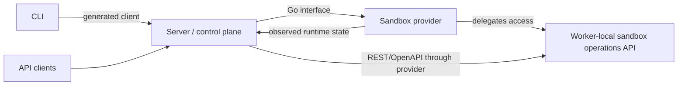
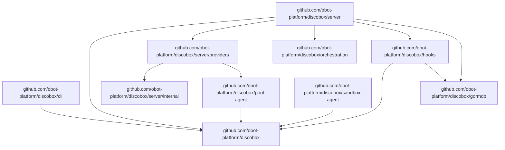

# Design Overview

## System Pattern

The server stores desired resource intent and reconciles actual sandbox runtime
state through sandbox providers. Providers own runtime-specific mechanics and
report or expose observed runtime state back to the server.

Accepted intent changes are persisted with project events and durable reconcile
jobs in one transaction. Reconcile jobs target one resource generation and are
canceled when superseded by newer intent.

## High-Level System Design

At the system boundary, Discobot is three cooperating concepts:

- **Server**: the control plane and API surface. It stores desired state and
  coordinates reconciliation.
- **Pool**: the user-visible sharing boundary sandboxes are scheduled into,
  and its own runtime host (ADR-0003, ADR-0006). Sandboxes in one pool share a
  cache volume, a resource envelope, and a kernel/host; a pool binds immutably
  to one provider instance, and its host runtime (container/VM/pod) is
  replaceable in place under the pool's identity.
- **Sandbox provider**: the Go-level runtime integration interface implemented
  by provider backends. A provider instance is backend identity only —
  capacity and sharing policy live on pools.
- **Worker-local sandbox operations API**: the REST/OpenAPI runtime-operation
  interface exposed by a pool agent for sandboxes hosted on that pool.
- **Sandbox agent API**: the future in-sandbox REST/OpenAPI interface exposed
  from inside an individual sandbox environment.

The root design intentionally stops at this integration view. Interface details
belong to the owning component docs.

## API Contracts

Use contract-first REST API development for public and provider-delegated REST
surfaces:

- Server REST API: control plane API consumed by the CLI and external clients.
- Pool-local sandbox operations API: runtime operations exposed by pool
  harnesses and reached through provider-delegated access.
- Sandbox agent API: in-sandbox API exposed by the sandbox-agent runtime.

The OpenAPI contract is the canonical API definition. Generate server handlers,
client types, validators, and documentation from the contract instead of deriving
the contract from Go handler code. Current contracts are intentionally split by
surface:

- `api/openapi/server.yaml` is the canonical control-plane REST API contract.
- `pool-agent/api/openapi/pool.yaml` is the canonical pool-local sandbox
  operations API contract. `pool-agent/generate.go` generates combined
  client/server transport code into `pool-agent/api/gen` and stable schema
  aliases into `pool-agent/api/model`; `pool-agent/server` adapts the
  generated server scaffold to local runtime operations.
- Sandbox-agent terminal routes are canonical in `api/openapi/server.yaml` and
  marked for sandbox-agent subset generation. `api/openapi/sandbox.yaml` is
  generated from that server contract and must not be edited directly.
- `/etc/discobox/sandbox.json` (the sandbox's effective runtime config) is
  not a REST contract and is not OpenAPI-generated. It is the hand-written
  `sandboxconfig` package — see `sandboxconfig/DESIGN.md` and
  `docs/adr/0012-sandbox-config-is-three-attribute-owned-layers.md`.

## Target Module Boundaries

Make the repository root the stable contracts/API module. Server-owned
persistence, provider contracts, and provider implementations live in the server
module so provider adapters can use server-internal control-plane contracts.

- Root module: public API definitions, control-plane OpenAPI documents,
  generated API clients/scaffolds, cross-module sentinel errors, IDs, pool
  boot metadata contracts, client-facing stream DTOs, and the exec attach
  stream: the wire protocol (`execstream/frame`), the duplex `execstream.Conn`
  seam, resumable positioned delivery (`execstream/resume`), and both roles:
  `execstream/host` serves a process's output to attached clients, and
  `execstream/client` attaches a caller's stdio to a remote process.
  `execstream.Prober` is the optional physical-transport timing capability;
  `resume` combines its heartbeat RTT with positioned-action acknowledgement
  RTT and emits transport-neutral timing events for frontends. See
  [`execstream/resume/DESIGN.md`](execstream/resume/DESIGN.md) for the consumer
  contract and status interpretation. The platform halves stay with their
  platform — the PTY and
  screen emulator in `sandbox-agent`, terminal control in the CLI — so the
  shared module never grows a terminal dependency. See
  [ADR 0008](docs/adr/0008-attach-stream-packages.md).
- CLI module: `disco` command implementation; depends on root generated
  clients/contracts for normal user commands and talks to the control plane
  through the Server REST API. Its `disco server` subcommand embeds the
  server module's public runtime entrypoint so local auto-launch can re-exec the
  current CLI binary instead of depending on a separate `discobox-server`
  executable.
- Server module: control plane implementation, persistence models, sandbox
  provider Go interfaces, provider manager, and Docker/VM/cloud/pool-backed
  provider implementations.
- Hooks module: standalone hook discovery, watch, execution, daemon, and status
  primitives. It depends inward on stable contracts and shared infrastructure
  helpers such as `gormdb`, but must not depend on server internals. See
  [`hooks/DESIGN.md`](hooks/DESIGN.md).
- Pool-agent module: in-guest pool host process, pool-local runtime DTOs, and
  generated pool-local sandbox operations API server adapter; depends on root
  pool boot contracts and OpenAPI contracts.
- Root module: local Docker development image watcher for pool-agent and
  sandbox-agent images.
- Sandbox-agent module: in-sandbox agent REST API runtime environment and harness
  implementation; depends on root contracts and generated API types.

Worker-agent and sandbox-agent implementations cannot depend on packages under
Go `internal/` outside their module. Provider implementations are part of the
server module and may depend on `server/internal`.

Root module package map:

| Package/path | Ownership |
| --- | --- |
| [`api/openapi`](api/openapi) | Canonical OpenAPI source contracts owned by the root module: the server REST API, plus generated sandbox-agent subset output. Pool-agent-owned contracts live under `pool-agent/api/openapi`. |
| [`api/gen`](api/gen) | Generated client/server API scaffold from `api/openapi/server.yaml`, plus handwritten client helpers for transports OpenAPI generation cannot own. |
| [`api/sandboxgen`](api/sandboxgen) | Generated client/server API scaffold from generated `api/openapi/sandbox.yaml`, the sandbox-agent subset of the server contract. |
| [`api/model`](api/model) | Generated stable aliases for server REST API schema types. |
| [`harness`](harness) | Harness hook registration drivers for sandbox terminals. |
| [`id`](id) | Shared identifier helpers. |
| [`internal/hostid`](internal/hostid) | This machine's generated, persisted Discobox identity. Shared because a CLI and a control plane on one machine must resolve the same value: that agreement is how the server knows a request came from its own filesystem. |
| [`internal/originkey`](internal/originkey) | Derives the key identifying a sandbox origin. Shared so client and server cannot drift on it. |

Submodule package docs belong in their owning module trees and are intentionally
not listed here.
