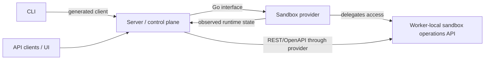
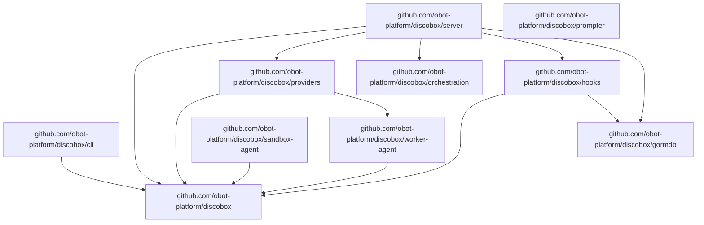

# Design Overview

## System Pattern

The server stores desired resource intent and reconciles actual sandbox runtime
state through sandbox providers. Providers own runtime-specific mechanics and
report or expose observed runtime state back to the server.

Accepted intent changes are persisted with project events and durable reconcile
jobs in one transaction. Reconcile jobs target one resource generation and are
canceled when superseded by newer intent.

## High-Level System Design

At the system boundary, Discobot is three cooperating concepts:

- **Server**: the control plane and API surface. It stores desired state and
  coordinates reconciliation.
- **Sandbox provider**: the Go-level runtime integration interface implemented
  by provider backends.
- **Worker-local sandbox operations API**: the REST/OpenAPI runtime-operation
  interface exposed by a worker agent for sandboxes hosted on that worker.
- **Sandbox agent API**: the future in-sandbox REST/OpenAPI interface exposed
  from inside an individual sandbox environment.

The root design intentionally stops at this integration view. Interface details
belong to the owning component docs.

## API Contracts

Use contract-first REST API development for public and provider-delegated REST
surfaces:

- Server REST API: control plane API consumed by CLI, UI, and external clients.
- Worker-local sandbox operations API: runtime operations exposed by worker
  agents and reached through provider-delegated access.
- Sandbox agent API: future in-sandbox API exposed by the sandbox-agent runtime.

The OpenAPI contract is the canonical API definition. Generate server handlers,
client types, validators, and documentation from the contract instead of deriving
the contract from Go handler code. Current contracts are intentionally split by
surface:

- `api/openapi/server.yaml` is the canonical control-plane REST API contract.
- `worker-agent/api/openapi/sandbox.json` is the canonical worker-local sandbox
  operations API contract. `worker-agent/generate.go` generates both
  `worker-agent/api/clientgen` and `worker-agent/api/servergen` from this JSON
  file; `worker-agent/server` adapts the generated server scaffold to
  local runtime operations.
- `api/openapi/sandbox.yaml` is only a minimal future in-sandbox agent API seed.
  It intentionally contains only `/healthz`, `/readyz`, and `/metadata` today and
  must not be used to judge or generate worker-local sandbox operation routes.

## Target Module Boundaries

Make the repository root the stable contracts/API module. Runtime implementations
live in sibling modules and depend inward on root contracts:

- Root module: public API definitions, sandbox provider Go interface, shared
  provider types, worker boot metadata contracts, control-plane OpenAPI
  documents, and generated API clients/scaffolds.
- CLI module: `discobox` command implementation; depends on root generated
  clients/contracts and talks to the server only through the Server REST API.
- Server module: control plane implementation and composition; depends on root
  contracts and imports provider implementations only at registration/wiring
  boundaries.
- Providers module: Docker, VM, cloud, and worker-backed provider
  implementations; depends on root contracts and the worker-agent module for
  the worker-local API client and runtime helpers. Does not depend on server
  internals.
- Hooks module: standalone hook discovery, watch, execution, daemon, and status
  primitives. It depends inward on stable contracts and shared infrastructure
  helpers such as `gormdb`, but must not depend on server internals. See
  [`hooks/DESIGN.md`](hooks/DESIGN.md).
- Worker-agent module: in-guest worker process, local worker image watcher, and
  generated worker-local sandbox operations API server adapter; depends on root
  worker boot contracts and OpenAPI contracts.
- Sandbox-agent module: future in-sandbox agent REST API runtime environment and
  agent implementation; depends on root contracts and generated API types.
- Prompter module: standalone command that detects the current coding-agent host
  and normalizes requests to start a new prompt session in the current working
  directory. It is intentionally independent until an adapter needs a shared
  contract.

Provider, worker-agent, and sandbox-agent implementations cannot depend on packages under Go
`internal/` outside their module. Cross-module contracts must live in public root
packages.

Root module package map:

| Package/path | Ownership |
| --- | --- |
| [`api/openapi`](api/openapi) | Canonical OpenAPI source contracts owned by the root module: the server REST API and sandbox-agent API seed. Worker-agent-owned contracts live under `worker-agent/api/openapi`. |
| [`api/servergen`](api/servergen) | Generated server-side API scaffold from `api/openapi/server.yaml`. |
| [`api/clientgen`](api/clientgen) | Generated client-side API scaffold from `api/openapi/server.yaml`. |
| [`apiclient`](apiclient) | Hand-written Server REST API client helpers, including non-ogen realtime helpers. |
| [`apperrors`](apperrors) | Shared sentinel errors used across module boundaries. |
| [`id`](id) | Shared identifier helpers. |
| [`model`](model) | Shared resource models used across contracts and persistence boundaries. |
| [`sandboxprovider`](sandboxprovider) | Go-level sandbox provider interfaces, provider manager, and shared provider contract types. |
| [`workerbootstrap`](workerbootstrap) | Shared worker boot metadata contract used by providers and sandbox worker agents. |

Root module package docs:

| Package | Design notes |
| --- | --- |
| [`model`](model) | [`model/DESIGN.md`](model/DESIGN.md) |

Submodule package docs belong in their owning module trees and are intentionally
not listed here.

## UI Design System

The `ui` package uses SvelteKit, Tailwind CSS, and shadcn-svelte as its design
system. UI work should use generated shadcn-svelte primitives from
`ui/src/lib/components/ui` and shadcn token utilities such as `bg-background`,
`text-foreground`, `border-border`, `bg-card`, `text-muted-foreground`, and
`text-destructive`.

The global UI CSS should follow the shadcn-svelte Tailwind/token layer used by
Discobot, with theme state driven by the `.dark` class, `data-theme`, and CSS
variables.
