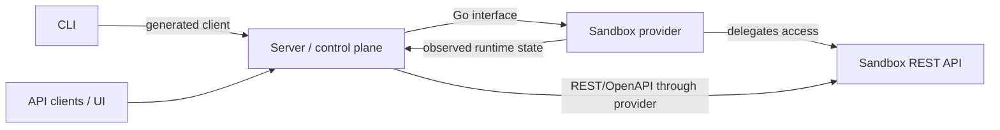
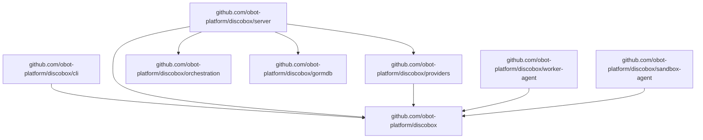

# Design Overview

## System Pattern

The server stores desired resource intent and reconciles actual sandbox runtime
state through sandbox providers. Providers own runtime-specific mechanics and
report or expose observed runtime state back to the server.

Accepted intent changes are persisted with project events and durable reconcile
jobs in one transaction. Reconcile jobs target one resource generation and are
canceled when superseded by newer intent.

## High-Level System Design

At the system boundary, Discobot is three cooperating concepts:

- **Server**: the control plane and API surface. It stores desired state and
  coordinates reconciliation.
- **Sandbox provider**: the Go-level runtime integration interface implemented
  by provider backends.
- **Sandbox**: the REST/OpenAPI-level runtime interface exposed by a managed
  sandbox environment.

The root design intentionally stops at this integration view. Interface details
belong to the owning component docs.

## API Contracts

Use contract-first REST API development for both public REST surfaces:

- Server REST API: control plane API consumed by CLI, UI, and external clients.
- Sandbox REST API: runtime API exposed by sandbox agents and reached through
  provider-delegated access.

The OpenAPI contract is the canonical API definition. Generate server handlers,
client types, validators, and documentation from the contract instead of deriving
the contract from Go handler code. Prefer readable source contracts such as YAML
when maintaining API definitions by hand; generated JSON artifacts are secondary.
Current contract seeds live at `api/openapi/server.yaml` and
`api/openapi/sandbox.yaml`.

## Target Module Boundaries

Make the repository root the stable contracts/API module. Runtime implementations
live in sibling modules and depend inward on root contracts:

- Root module: public API definitions, sandbox provider Go interface, shared
  provider types, worker boot metadata contracts, schema-first sandbox REST
  OpenAPI document, and generated sandbox REST client.
- CLI module: `discobox` command implementation; depends on root generated
  clients/contracts and talks to the server only through the Server REST API.
- Server module: control plane implementation and composition; depends on root
  contracts and imports provider implementations only at registration/wiring
  boundaries.
- Providers module: Docker, VM, cloud, and worker-backed provider
  implementations; depends on root contracts, not server internals.
- Worker-agent module: in-guest worker process and local worker image watcher;
  depends on root worker boot contracts and does not own sandbox REST API code.
- Sandbox-agent module: sandbox REST API runtime environment and future agent
  implementation; depends on root contracts and generated API types.

Provider, worker-agent, and sandbox-agent implementations cannot depend on packages under Go
`internal/` outside their module. Cross-module contracts must live in public root
packages.

Root module package map:

| Package/path | Ownership |
| --- | --- |
| [`api/openapi`](api/openapi) | Canonical OpenAPI source contracts for server and sandbox REST APIs. |
| [`api/servergen`](api/servergen) | Generated server-side API scaffold from `api/openapi/server.yaml`. |
| [`apiclient`](apiclient) | Generated and hand-written clients for the Server REST API, including non-ogen realtime helpers. |
| [`apperrors`](apperrors) | Shared sentinel errors used across module boundaries. |
| [`id`](id) | Shared identifier helpers. |
| [`model`](model) | Shared resource models used across contracts and persistence boundaries. |
| [`sandboxprovider`](sandboxprovider) | Go-level sandbox provider interfaces, provider manager, and shared provider contract types. |
| [`workerbootstrap`](workerbootstrap) | Shared worker boot metadata contract used by providers and sandbox worker agents. |

Root module package docs:

| Package | Design notes |
| --- | --- |
| [`model`](model) | [`model/DESIGN.md`](model/DESIGN.md) |

Submodule package docs belong in their owning module trees and are intentionally
not listed here.
