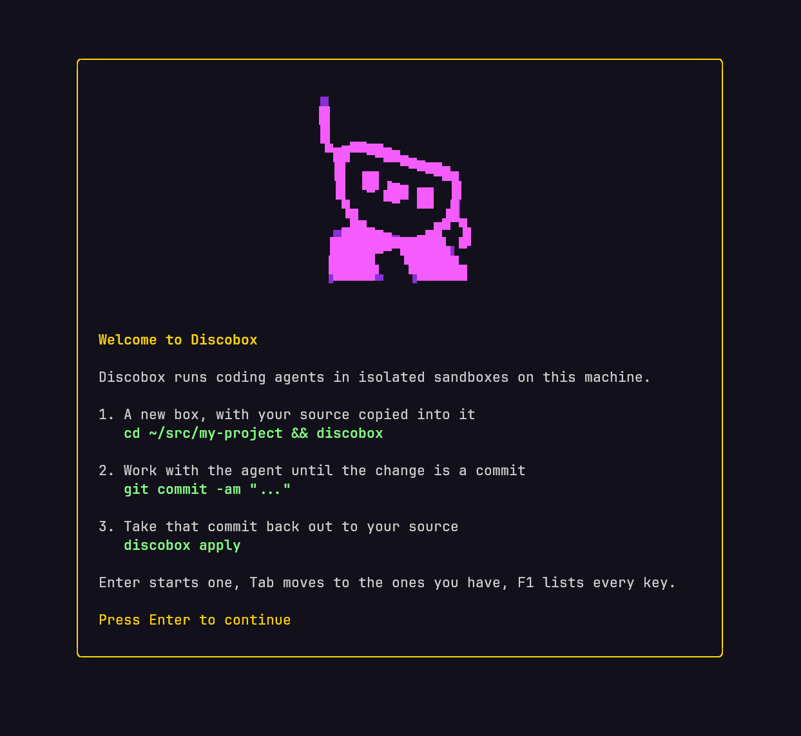
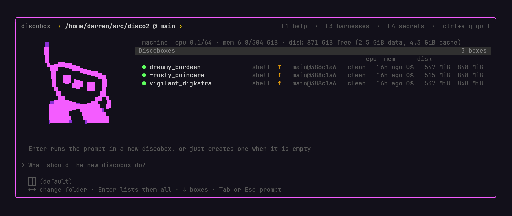
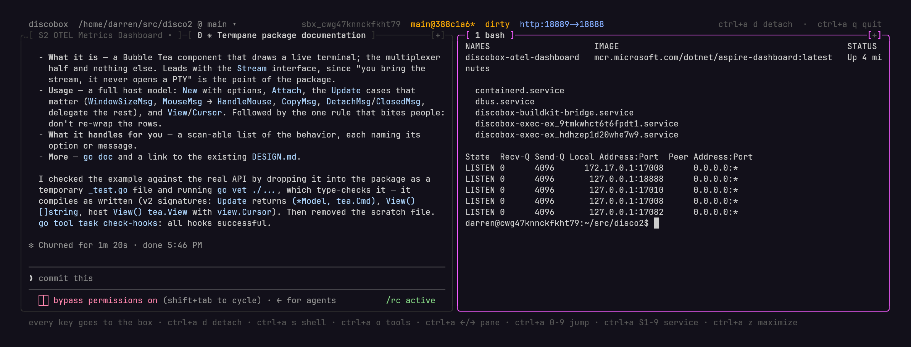
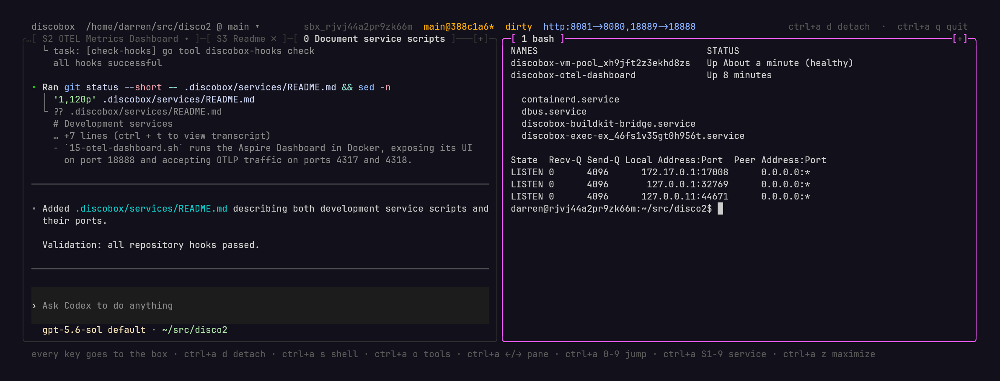
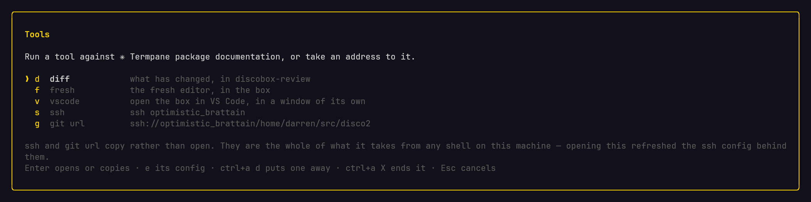
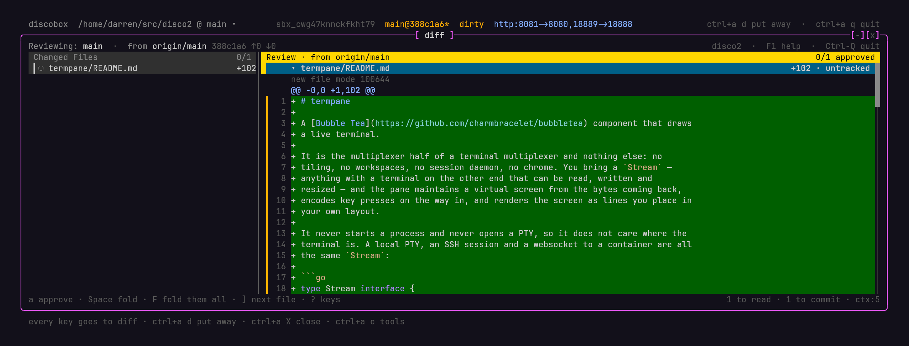

<div align="center">
  
</div>

**Give your agent its own disco.**
A full computer, no supervision, dance like nobody's watching. (Oh but we are.)

```bash
brew install discobox-ai/tap/discobox
```

---

## The discobox way

**1. A new box, with your source copied into it**

```bash
cd ~/src/my-project && discobox
```

**2. Work with the agent until the change is a commit**

```bash
git commit -am "..."
```

**3. Take that commit back out to your source**

```bash
discobox apply
```

<div align="center">
  
</div>

`discobox` on its own opens the launcher: every box you have, in one window.
Enter starts a new one and drops you into it — the agent's terminal, the shells
and services beside it, its forwarded ports. `Ctrl-A d` leaves; the box keeps
working. Or skip the window entirely:

```bash
discobox -p "fix the flaky test in the payments suite"
```

<div align="center">
  
</div>

Nothing was installed on your machine, nothing ran on it, and no credential of
yours entered the box. The work comes back as commits.

---

## Autonomy inside a boundary

Today you either lock an agent down until it can't do real work, or hand it a
machine that has your SSH keys, your cloud credentials, and your `.env` files.
Discobox constrains what an agent can reach instead of what it can do.

Inside the box nothing is in the agent's way: root, package installs, nested
Docker, `rm -rf /` if it decides to. No allowlists, no approvals, no permission
prompts. Everything that leaves goes through one door you control — a per-box
mTLS identity through a MITM proxy, destination policy, every request audited —
and your credentials never enter at all. The agent holds sentinels; the proxy
swaps in the real value on the way out, bound to one domain. For anything it
wasn't given, it asks a human and says why.

**Prompt injection has nothing to take.** An agent running an attacker's
instructions, with root, holds sentinels rather than credentials, and still has
to get past the proxy.

**[Read the full security model →](https://discobox.ai/security)** — the threat
model, the asset matrix including its weak cells, and what Discobox does not
defend against.

---

## Remote development

Remote development has always meant giving up your editor, your shell, your
toolchain and your ports.

Agentic development asks for less of that. You are not typing in the box, you
are steering, reading and running what the agent does. Boxes are disposable,
several run at once, and one keeps working while you read another. Most of what
follows is how a sealed box gets back the things it took away.

<div align="center">
  
</div>

One box, open: Claude Code on the left, a shell beside it, the services the
repository declares as tabs, a forwarded port in the header, and every key
going to the box.

### Getting in

- **`ssh $DISCOBOX_ID` just works**, by id or by name, with nothing to set up.
  Every box that gets created syncs the project's managed `ssh_config`, and
  `~/.ssh/config` carries one Include line pointing at it — on Windows, for both
  ssh installations, this side's and the one Windows tools drive.
- **VS Code and Zed** open on a box in a window of their own, over the editor's
  own remote support: `discobox tools vscode`, `discobox tools zed`.
- **The launcher** is a full TUI: your coding agent's own interface on the left,
  the shells you open on the right, services and forwarded ports beside them.
  The mouse works; `F1` lists every key.
- **Terminals revive in place.** Close the window, reattach from another
  machine, come back tomorrow: same session, same scrollback. Transcripts are
  stored, not held in a tab.
- **`discobox shell`** runs a command or a login shell, **`discobox cp`** copies
  files in and out scp-style, **`discobox tools git`** runs git in the box's
  working tree from here.

### Your toolchain, your project

- **direnv is wired up**, so nix, mise, or whatever your project already
  declares pulls your toolchain in on entry. Nothing to re-declare.
- **The Nix store is a pool-shared cache**, seeded on first use, so a second box
  does not rebuild what the first one already built.
- **`.discobox/services`** declares what runs beside the work — the API, a
  database, a watcher. The box starts them and keeps their output.
- **`.discobox/skills`** gives the agent skills that exist only inside the box.
  Your `~/.claude/skills` on your laptop stays untouched.
- **`.discobox/sources.json`** names the sibling repositories this one is worked
  on with; they're checked out alongside it.
- **Listening ports are found for you** — a watcher reads what's bound and
  probes it, and `discobox proxy` forwards it to a stable local port.

### In the box

- **Claude Code and Codex ship built in**, and the shell is a harness too. Any
  terminal agent you can put in an image becomes one.

<div align="center">
  
</div>

  Same box, same keys, different harness — this one is Codex, picked with
  `-H codex` or set as the project default.

- **Nested Docker works**, builds included: they run on a pool-shared BuildKit
  and trust the proxy through a runc wrapper.
- **`ctrl+a o` opens the tools** — the diff, the editor, VS Code, and the ssh
  and git addresses, ready to copy.

<div align="center">
  
</div>

- **Code review with no forge involved.** `discobox-review` is a review of the
  working tree that lives in the box: line-anchored comments, replies, and
  per-file approval. Two agents run it against each other — one reviews and
  comments, the other fixes and answers — until every thread is closed and every
  file signed off. No push, no pull request, no rebase.

<div align="center">
  
</div>

  Above, it is reviewing what the agent in the shot before it just wrote.

- **`fresh`** is in there as an editor, and both tools come from the image, so
  everyone looking at the same box is looking at the same version.
- **Git authorship is a first-class property** of the box, so commits come back
  attributed correctly.
- **The agent can ask for a credential** it wasn't given, say why, and get a
  scoped, expiring grant from a human.

### Running it

- **Boxes upgrade and repair in place**, preserving power state; deletes archive
  first and purge after.
- **Everything is scriptable.** A full OpenAPI surface and a CLI to match —
  anything the launcher does, a shell script can do.
- **macOS, Linux, and Windows.** libkrun microVMs on Linux,
  Virtualization.framework on macOS, user namespaces by default.

---

## Concepts

- **Discobox** — *the box.* A disposable environment with your source in it, one
  default terminal, and its own git remote.
- **Pool** — *the floor.* The host boxes are scheduled onto and the boundary
  they share: a cache volume, a resource envelope, a kernel.
- **Harness** — *the act.* The agent a box runs. Configure once; every box gets
  it.

---

## Commands

```
discobox            Open the launcher
discobox run        Launch a prompt in a new discobox
discobox ls         List discoboxes started from this directory
discobox shell      Run a command in a box, or open its login shell
discobox attach     Open a box: its terminal and what runs beside it
discobox apply      Cherry-pick a box's commits onto your working tree
discobox push       Push local commits into a box's origin, to rebase there
discobox proxy      Forward a box's listening ports to local ports
discobox cp         Copy files in and out
discobox tools      Run git, ssh, VS Code, or Zed against a box
discobox secret     Manage secrets, grants, and approval requests
discobox configure  Enable, disable, and set the default harness
discobox admin      Pools, projects, harness images, and the API server
```

`discobox --help` for the rest — `tui`, `completion`, and every flag. `run` is
optional: `discobox -p '...'` is a run, and takes every flag `run` does.

---

## Status

Pre-1.0 and under active development; interfaces change. Everything above runs
today. Three things are designed and not yet built:

- **Trusted-side verification of credential use.** The check that a command
  matches its approved use runs *inside* the box today, on a description the
  agent supplies — a guardrail, not a security boundary. Either way the
  credential never enters the box, the
  sentinel only resolves against the granted domain, a human approved the grant,
  and every use is audited.
  ([ADR 0031](docs/adr/0031-agent-credentials-are-a-portable-protocol-with-ephemeral-sentinels.md))
- **Policy compiled from English** to a deterministic engine, plus response-side
  data-flow inspection.
- **Remote pools.** Every box runs on your own machine today; pools are the seam
  where that stops being true.

---

## Documentation

- [discobox.ai](https://discobox.ai) — overview and
  [security model](https://discobox.ai/security)
- [DESIGN.md](DESIGN.md) — system architecture
- [docs/adr](docs/adr) — architecture decisions and the alternatives rejected

## Contributing

The toolchain comes from the Nix flake — `nix develop`, or let direnv do it.
See [CLAUDE.md](CLAUDE.md) for repository conventions and
[Taskfile.yml](Taskfile.yml) for build targets.

### Testing a release before it ships

`brew install discobox` serves the release that has been marked stable. Every
tagged build is published before that, and the tap serves the newest one as a
second formula:

```bash
brew install discobox-ai/tap/discobox-dev
```

It installs beside the stable one and runs as `discobox-dev` — the same CLI,
which calls itself by whichever name you installed it under. Both share one
state directory and one server, so only one of them can be running a server at a
time; stop one before starting the other.

## License

See [LICENSE](LICENSE).
