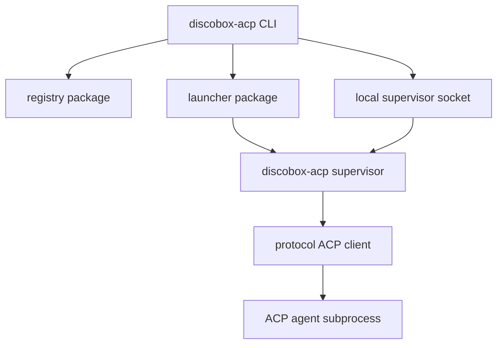

# ACP Design

This module owns the standalone Discobox ACP launcher. It discovers supported
Agent Client Protocol implementations from the official ACP registry shape and
starts ACP agent processes on demand for CLI inspection commands.

## Scope

ACP agents are external processes that speak newline-delimited JSON-RPC over
stdio. This module is an ACP client and process manager; it is not an ACP agent
implementation and does not depend on server internals. Reuse protocol-neutral
transport and JSON-RPC wire helpers from the official MCP Go SDK where practical;
do not use MCP session/client types for ACP method semantics.

Runtime metadata uses XDG-style paths outside repositories:

- process/runtime metadata: `$XDG_RUNTIME_DIR/discobox/acp/`, falling back to `$XDG_STATE_HOME/discobox/acp/run`
- supervisor Unix socket: same runtime directory, one socket per supported agent

## High-Level Architecture

## Module Map

| Package/path | Ownership |
| --- | --- |
| root package | Public ACP model constants shared by subpackages. |
| [`registry`](registry) | Official ACP registry JSON models, fetch, built-in supported agent filtering, and launch distribution selection. |
| [`launcher`](launcher) | Resolve registry package-manager launch commands, construct ACP subprocesses, and track Discobox-launched supervisor runtime metadata. |
| [`protocol`](protocol) | Minimal ACP client for initialize and session/list over the official MCP Go SDK's protocol-neutral transport and JSON-RPC wire helpers. |
| [`cmd/discobox-acp`](cmd/discobox-acp) | CLI entrypoint and command formatting. |

## Supported Implementations

The supported implementation list is explicit even though metadata is registry
backed. This lets Discobox expose only agents whose launch behavior has been
reviewed.

Initial supported agents:

- `codex-acp`: Codex CLI ACP adapter from the official ACP registry.

Future supported agents should add an explicit supported-agent entry before they
are exposed, even when they are already present in the registry. Planned targets
include Claude Agent and OpenCode.

## Launch Policy

Launch metadata comes from the registry distribution object. Package-manager
launches are preferred because they naturally run on demand:

1. Prefer registry `npx` distribution.
2. Fall back to registry `uvx` distribution.
3. Report binary-only distributions as not launchable until direct binary archive
   execution is designed.
4. Keep environment values from the registry distribution, but let the process
   inherit the user environment.

The CLI starts a small Discobox supervisor process per supported agent. The
supervisor owns the ACP stdio process, initializes it once, records runtime
metadata, and exposes a local Unix socket for later CLI commands. `launch`
returns after the supervisor has initialized the ACP agent. `sessions list`
starts the supervisor on demand when it is not already running.

Long-running interactive prompt/session control can be layered on top of the
same supervisor and protocol packages later.

## Protocol Boundary

The first protocol client deliberately implements only:

- `initialize`
- `session/list`

`initialize` advertises no filesystem or terminal capabilities. Commands that
need agent-to-client filesystem or terminal requests must add explicit protocol
handlers before they are exposed.
