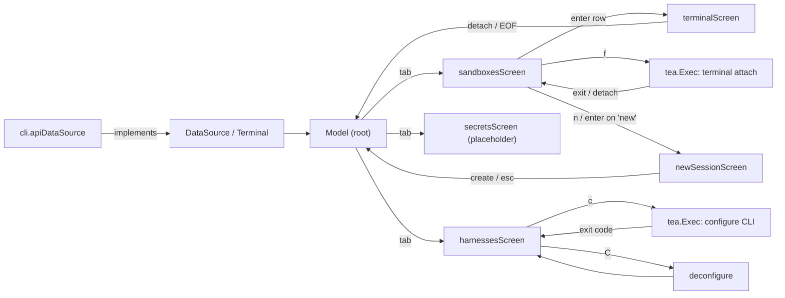

# tui

Interactive terminal UI for the `disco tui` command. k9s-style, keyboard-first.

## Architecture

Elm/Model-View-Update on Bubble Tea v2 (`charm.land/bubbletea/v2`, `bubbles/v2`,
`lipgloss/v2`). Screens are pure state; all IO happens in `tea.Cmd`s, never in
`Update`.

- **Root (`model.go`)** owns window size and shared chrome (header tab bar,
  footer help, status line) and routes messages to the active `screen`. Screens
  implement the `screen` interface; the root gives each its content-area size via
  `resizeMsg`.
- **Tab bar.** The three top-level screens — `sandboxes`, `agents`, `secrets` —
  are peers reached through a header tab strip, not a modal stack. Pressing Up at
  the top of a tab body emits `focusTabsMsg`; the root sets `tabFocused` and then
  owns key input (`handleTabKey`): `h`/`l` (or ←/→) call `switchTab` to move
  between tabs, and Down/Enter drop focus back into the body. `switchTab` builds
  and `Init`s the agents/secrets screens lazily and clamps out-of-range indices.
  `isTabScreen` gates whether the bar renders and arms, so sub-screens (terminal,
  forms) show a breadcrumb header instead and never intercept tab keys. `a` on
  the sandbox list and `esc` on agents remain shortcuts that jump straight into a
  tab body (`switchTab(..., false)` / `goToList`).
- **DataSource seam (`source.go`)** keeps this package free of the ogen client.
  The CLI (`cli/internal/cli/tui.go`) adapts the generated client to it and maps
  `apimodel.Sandbox` → `tui.Sandbox`. This package must not import
  `cli/internal/cli`; frontend-independent workflows belong in sibling packages
  such as `cli/internal/sandboxcreate` and are invoked by the adapter.
- **Screens communicate by message**, not direct calls: `selectSandboxMsg`
  (enter → terminal), `fullscreenSandboxMsg` (f → fullscreen attach), `backMsg`
  (detach → list), `toggleHelpMsg`.

## Screens

- `sandboxesScreen` — live `bubbles/table` of sandboxes. Vim + arrow nav via a
  nav-only `table.KeyMap` (`space`/`d` are reserved for the screen). Auto-refresh
  on a `tickMsg`; marks are keyed by sandbox ID so they survive refresh. `d`
  opens a confirm modal; `y` fires concurrent `DeleteSandbox` commands. `f`
  suspends the TUI and attaches the selected sandbox's primary terminal to the
  real terminal until the attach exits or detaches.
- `terminalScreen` — embeds a live terminal in a bordered pane. Output bytes feed
  a `github.com/charmbracelet/x/vt` emulator whose `Render()` is drawn in the
  pane; keys are encoded (`terminal_input.go`) and written to the `Terminal`.
  A `ttyReader` goroutine turns blocking reads into `ttyOutputMsg`s. Detach is a
  screen-style prefix: `Ctrl-A` then `d`. The `Terminal` event stream reports
  reconnecting/reconnected transitions separately from PTY bytes; the screen
  forwards those transitions to the root footer status line while the shared
  CLI transport performs recovery and drops input received while disconnected.
- `newSessionScreen` — the create-a-sandbox form: harness dropdown, path dropdown
  (cwd plus existing sandbox sources), and a prompt `textinput` focused by
  default. Enter in the prompt submits `CreateSession` (empty prompt is valid),
  whose adapter uses the shared `internal/sandboxcreate` prompt creation path.
  The "new" affordance lives at the top of `sandboxesScreen` (`newSelected`);
  moving up off row 0 selects it, and it is selected by default.
- `secretsScreen` — placeholder for the project secrets tab (no backend yet).
  Renders a centered "coming soon" panel and wires only the shared chrome keys
  plus Up (→ `focusTabsMsg`), so the tab bar has a real third destination.
- `harnessesScreen` — the "coding agents" tab, also reachable from the sandbox
  list with `a` and returning with `esc` (`backMsg`). A live `bubbles/table`
  (★ default, id, name, slug, configured, age) with the same nav-only
  `table.KeyMap` as `sandboxesScreen`.

  The three verbs are **configure / deconfigure / set default** — the harnesses
  are the server's seeded built-ins, and `configured` is the enable flag, so the
  tab is "turn an agent on, turn it off, pick a default": `c` configure, `C`
  deconfigure (y/n confirm), `enter` set default (y/n confirm). Registering a
  custom image is a CLI action (`disco box harness create --image`), not a list
  action, so there is no create/edit form and no delete — deleting a built-in is
  meaningless because the server re-seeds it. Cached on the root
  (`m.harnesses`) so re-entering keeps the cursor.
- **Configure run** — `runConfigureMsg` (list `c`) makes the root suspend the TUI
  via `tea.Exec` with `configureExec`, handing the real terminal to
  `DataSource.ConfigureHarness`. The CLI adapter delegates to the same
  `runHarnessConfigure` the `disco box harness configure` command uses, which is
  why it takes streams rather than a command. The server owns the flow and
  applies the result; the TUI only surfaces the terminal and reports the outcome
  as `harnessConfiguredMsg` once it resumes. See `cli/DESIGN.md`.
- **Deconfigure** — `C` confirms, then `DataSource.DeconfigureHarness`; the
  server removes what the configure flow created and the row re-renders
  unconfigured (`harnessDeconfiguredMsg` re-selects it and refreshes).

## Conventions / pitfalls

- Return the next `screen` from `Update`; the root re-syncs its typed pointers.
- Never block in `Update`. Reads/writes/deletes are commands.
- The alternate screen is set per-frame via `View().AltScreen`, not a program
  option (Bubble Tea v2 has no `WithAltScreen`).
- Never match the vim navigation aliases (`j`/`k`/`h`/`l`) while a text input has
  focus — they are text there, not motion. `newSessionScreen` routes prompt keys
  through `handlePromptKey` (arrows/tab only) and reserves the vim aliases for
  `handleSelectorKey`. `TestFormPromptAcceptsNavLetters` guards this.
- Colors use ANSI slots (0–15) so the UI follows the terminal theme in light and
  dark; see `styles.go`.
- The terminal pane frame is composed by hand (`View`/`fitCells`), never through
  a lipgloss bordered box: lipgloss re-wraps any line as wide as the box, which
  shifts rows and desyncs the hardware cursor from the emulator grid. Every inner
  row is truncated/padded to exactly `innerW` cells so the cursor offsets in
  `cursor()` stay exact. `TestTerminalPaneNeverWraps` guards this.
- The `cli` module cannot `go mod tidy` on its own (it reaches `worker-agent`/
  `gormdb`, resolved only through `go.work`); add deps with `go get`.
