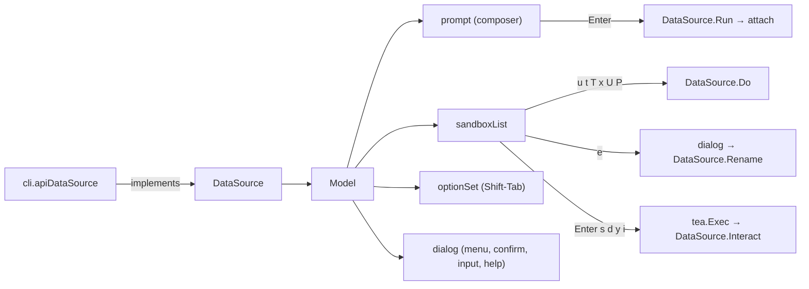

# tui

The `disco tui` launcher: one window that opens with the cursor in a prompt for
a new sandbox, with the project's sandboxes a press of Tab away.

## Shape

Elm/Model-View-Update on Bubble Tea v2 (`charm.land/bubbletea/v2`, `bubbles/v2`,
`lipgloss/v2`). One model, not a screen stack: the window is a prompt, a list,
and one modal layer over both. All IO happens in `tea.Cmd`s, never in `Update`.



## Decisions

**It opens as a prompt and opens out into a window** (`compact.go`). The first
frame is inline and only as tall as it needs: the mark, the composer beside it,
and no sandboxes. That answers the common case at its own size — you came here
to start something, and a screenful of sandboxes you did not ask to see is a
screenful to look past before typing. Reaching past the prompt (`leavePrompt`:
Up, Down or Tab) is the ask for the rest, and opening a terminal implies it too.

`expand` is one way. Having asked for the discoboxes once, flipping the screen
back and forth around them would be the window arguing with you.

Nothing on that first frame suggests there is anything behind it, so it says so
— laid into the very top border line (`titledEdge`), and only until the window
opens out. That line has nothing else on it, which is what keeps a centered word
from being squeezed out: in the header below, between the path on one side and
the keys on the other, there is no room for it at 80 or 100 columns and it was
silently dropped.

**One flourish** (`shimmer.go`): a band of color travels once across "discobox"
in the placeholder when the window opens — about a second — then the prompt is a
prompt. The hues advance with the frame as well as with the letter, so what
crosses the word is a moving rainbow rather than a bright spot. It runs only
where there is color to run it on, and stops on the first keystroke — a
flourish that plays over your own words is not one. Every character from the
second on carries its own color, because the textarea renders the placeholder
inside a style of its own; the *first* is left bare because the textarea puts
the cursor on the placeholder's first grapheme cluster, taken off the raw
string, and an escape there gets split with its remainder printed as text.

**Full screen, once open.** `View` sets `AltScreen` (per frame, which is how
Bubble Tea v2 takes it), so the window owns the terminal and what was on screen
before comes back when it exits. The list fills whatever rows the composer and
chrome leave it rather than shrinking to its contents, so the frame is always
exactly the terminal's height.

This replaced an inline window, and took two mechanisms with it: a settle-timer
that cleared the screen after a resize, because an inline frame is reflowed by
the terminal while the renderer still counts pre-reflow lines; and a row-reclaim
before `tea.Exec`, because an inline frame stayed painted above whatever the
action printed. On the alternate screen the runtime handles both — it drops to
the primary screen around an exec and repaints on resize.

**Three kinds of action.** A `Verb` goes to the API and returns, so the window
stays up and reports on its status line. Most `Interaction`s are drawn in a pane
(`Interaction.paneable`, `pane.go`, over the `termpane` module): attach and
shell are the discobox's own terminals, and diff and status are the CLI's own
commands given a terminal of their own so they can be read beside one. From the
list, apply suspends the window through `tea.Exec` — the list can act on several
discoboxes at once and a pane shows one. The `exec` field on the model is that
handoff, and exists as a field only so a test can run an action without a
terminal to release.

**Rename is a third kind, and only in the list** (`renameKey`, `askRename`). It
is not a `Verb` — a verb is a word the window already has, and this one needs a
name typed first — so `e` opens the input dialog on the name the discobox
*already has*: the usual edit is a word added to a name that is nearly right,
and a blank line would make that a retype. Enter on the unchanged name is the
same as Esc, since neither asked for anything. It takes exactly one discobox,
because a name is a name and a selection cannot share one. It is deliberately
absent from `verbs`/`interactions`, which is what keeps it off the pane screen:
there the leader plus `e` exchanges the two spots, and a discobox you are
already looking at is one you know the name of.

**The pane screen is one discobox in two spots, and everything you can do to
it.** `Model.panes` holds at most one pane per `Interaction.slotted` action —
the harness on one side and a shell on the other — so a screen cannot end up as
two shells, and an empty spot is a spot rather than an absence: the leader plus
`a` or `s` fills the one that is empty *where it stands*, and goes to the one
that is full rather than stacking a second beside it. `Model.paneOrder` is which
side each spot is on, exchanged by the leader plus `e` and outlasting the
terminals in it. The leader plus `h`/`l` or the arrows moves between them,
stopping at the ends rather than wrapping; focus goes with the terminal rather
than staying on a side of the screen. Each pane carries its own detach key
(`paneKeys`), and the header and key hints show the focused one's.

`Model.paneBox` is the discobox the screen is showing, and every one of the
list's own keys is bound behind the leader against it (`paneOptions` over
`interactions` and `verbs`, dispatched through the list's own `actOn`) — one key
map for the two screens, with the same enabled checks and the same
confirmations. `currentBox` re-reads it from the listing at dispatch time, since
the pane was opened on a snapshot and a diffstat that has since arrived changes
what is offered.

**A command that finishes takes the screen over both spots.** `Model.overlay` is
diff, status or apply running full width while the two terminals stay connected,
unresized and undrawn underneath — a diff you opened to read is not something to
read in half a window beside a harness scrolling past, and when it exits the
spots are exactly as they were. It is the only place apply runs in a pane: there
is one discobox on this screen, so the reason the list has for suspending does
not apply. `focusedPane` returns it while it is up, which is what puts the keys,
the cursor, the mouse and the hints on it without a second path through any of
them; `paneByID` reports it as `overlayAt`, which is not a spot.

**A finished command keeps its screen, and can be read back through.**
`Interaction.holdsOnExit` — anything that is not one of the two spots. A shell
that exits is gone and its pane has nothing left to show; a command that ran,
printed and returned is the opposite, and `disco status` on a clean tree is over
in a moment. The pane stays and says so, and its keys become the reader's
(`readFinished`): the arrows and pgup/pgdn walk back through output longer than
the pane, `g`/`G` jump to the ends, the wheel scrolls, and only the keys that
mean done — `q`, Esc, Enter, Ctrl-C — take it away. A stray key leaves the screen
alone, since output worth scrolling is output you are still working through.

**Messages from a pane are addressed to it** (`paneMsg`, `fromPane`). Every
command a pane produces is tagged with its id, because `termpane.ClosedMsg` says
only "the session ended" — and a pane that has just been closed still has a read
in flight, whose parting message would otherwise be taken for the survivor's and
close a session nobody asked to end. Keys and mouse events go to the focused
pane; everything a pane's own commands produced goes to the pane it came from.

**A pane takes the whole window, and wears the border itself.** Attached, the
purple box is drawn around the terminal grid with a cell of air inside it, so
the terminal's output never touches the frame, and everything else sits
*outside* it: one banner above, then the bordered grid, then the keys below.

The banner carries all three of where you are, which discobox this is, and the
way out — the id is folded into its centre rather than given a line of its own,
muted, since it is there to be looked up when wanted rather than read on every
glance. It is centered in the row rather than in what is left of it, so the
transport's status appearing on the right does not shift it, and `spreadCenter`
*shortens* it rather than dropping it when the row is tight: a name that
silently disappears at some widths is worse than a shortened one. The captions are indented to line up with the
terminal's own output rather than with the border.

The title the application sets is laid into the top border (`paneBorderTop`) as
`──[ title ]──`, not above it: it names the terminal rather than the window, and
a border is a line the eye already follows, so a word set into it costs no row.
The brackets are what make it read as set into the line — bare text with space
either side leaves the border looking broken where the title sits. Too long to
sit in the line with rule either side and it is dropped; the terminal's own
title bar carries it too.

Unattached the window is the other way round: one box holding all of it. The two
are different shapes because they are different things — a launcher is a window
with parts, and a pane is a terminal with captions. Focus becomes `focusPane` and *every* key goes to the sandbox
except the reserved ones — and which those are depends on what is in the pane
(`paneKeys`).

**Ctrl-C is the application's, in every pane.** Nothing the window reserves
stands between a program and its own interrupt, so `paneOptions` passes an empty
detach key to `termpane.WithPrefix` and the only way out is `leader q` — `d`,
which is what screen, tmux and a plain `disco attach` detach on, is diff here,
because this leader also carries the list's keys. An attach used to take
Ctrl-C as "back out of this", which reads well right up until it is wrong:
someone who types it to stop an agent and gets a detached session instead has
not stopped anything, and nothing on the screen says so. One key with two
meanings depending on what is in the pane is worse than the keystroke it saved.
The window's own Ctrl-C-quits is therefore suppressed for the whole pane screen
rather than for the panes that took the key. Either way the leader plus `m` hands
the mouse back and forth, and the second key of a leader pair matches with or
without Ctrl held. Typing the leader itself takes it twice in full: its bare
letter is `a` under the default Ctrl-A, and that is attach.

**The leader is configurable, and it is not this package's.** `--leader`/
`DISCOBOX_LEADER` (`internal/keys.NormalizeLeader`, `WithLeader`) because the
leader is the key that *collides* — it has to be a chord nothing you run in a
sandbox wants, and which that is depends on what you run. It cannot be Ctrl-C:
that one is never the window's to take, and a leader that took it would take it
from every program the window ever draws. Its default and its spelling live in
`internal/keys` rather than here, because a plain `disco attach` detaches behind
the same key: one leader for both terminals discobox shows you is one thing to
learn and one thing to change.

The mouse reaches the sandbox only while something in it has asked for one
(`paneMouseMode` mirrors `termpane.MouseMode` into `View.MouseMode`), so native
selection is only lost while it is being used — and `ctrl+a m` takes it back for
when you would rather copy a stack trace than click on it. Events are translated
out of screen space by `paneOriginX`/`paneOriginY`, the same origin the cursor
is placed at. Detaching returns to the list with the cursor still on the sandbox it was opened on.

The title an application sets goes two places: the middle of the window's header
(`spreadCenter`), which says what is in the window, and the real terminal's own
title bar (`windowTitle` → `View.WindowTitle`), which is how you find the window
among the others you have open. In the header it is centered in the row rather
than in the gap beside the folder name, so it does not jitter as that changes
length, and dropped outright when there is no room to center it. With no pane
the terminal's title is left exactly as the shell that started the window left
it. Messages the window does not handle fall through to the pane, because the
terminal's output arrives as `termpane`'s own unexported messages and nothing
here can name them.

**The box is drawn by hand.** `Model.box` writes the border itself instead of
using a bordered lipgloss style, because such a style re-wraps any line as wide
as the box — and a re-wrapped terminal grid shifts every row below the wrap,
putting the hardware cursor on the wrong line for the rest of the session.
`paneCursor`'s offsets are exact for the same reason.

**A pager has to give the screen back.** `LESS=FRX` is git's default and right
at a shell — you quit `less` and the diff is still above your prompt — but under
the launcher it leaves a screenful for the window to redraw over. `disco tui`
sets `App.pagerRestoresScreen`, which drops the `X` so less uses the alternate
screen and restores on exit. See `cli/internal/cli/pager.go`.

**An action takes the window's rows, not the ones under them.** The runtime
flushes and leaves the cursor on the frame's last row, so `interactExec.Run`
walks back up `frame` rows and erases below before the action starts. Without it
every attach opens under a frozen copy of the launcher and leaves it in the
scrollback. `Model.frame` is recorded in `View`, the only place the height is
known.

**The window is a box.** A rounded border in the mark's own purple (`colMark`)
all the way round. Everything inside is laid out at `inner()` —
`width - boxChrome`, the two edges plus a padding cell each side — and the
composer's own rules stop short of the border so they read as separators rather
than as the box broken in half. A dialog stands *in place of* the window and
carries its own border instead.

**The window fits the terminal.** `windowChrome` is what the box, header, list
title, blanks, composer and status cost before a single sandbox is drawn; the
list gives up rows for the composer as it grows and takes none at all when
there is no room. A frame one row too tall scrolls the terminal, which is the
one thing the renderer cannot redraw its way out of.

**The mark sits at the head of what it marks.** `logo.column()` is the art plus
a `logoGutter` on each side — one between it and the box, one between it and the
list. In the full window `logo.view` draws it from the top and pads below: a
mark belongs beside the first rows of the list, not floating halfway down a
column of them. The opening window uses `logo.viewCentered` instead, because
there the mark is the taller of the two and centering is what stops the prompt
reading as a caption on it. The art's own rows stay aligned to each other: it is
a picture, so the block moves, not the lines within it.

**One data seam.** Everything the window needs is on `DataSource` (`data.go`),
implemented once in `cli.apiDataSource`. The interactive actions there build and
execute the real Cobra commands, so the launcher runs `disco attach`, `disco
diff` and the rest rather than a second implementation that drifts from them.

**Color is a value, not a global.** `detectColor` reads the profile once and
`styles.color` carries it. Without color the state glyph gives way to the state
spelled out in a column, the mark is dropped entirely (it is shading, not line
art), and every style is the identity. `highlight` writes the row background
escape by hand and re-asserts it after both spellings of the reset, because a
style cannot paint across content that carries its own colors.

**Placeholders for data that is coming.** `Usage` is on the row and drawn as
dots until something reports it (`Usage.Known`). Nothing does yet; the column is
there because the shape of the row is what is being designed, and a column added
later moves everything beside it.

**The folder is a header control, not a column.** The path in the header is
which folder's sandboxes are listed (`folder.go`). It opens on the directory the
window is running in — what `disco ls` shows — with every folder something was
started from one press away, plus `allFolders`. The choices come from the
listing itself, so the only folders offered are ones with something in them
(plus the current directory, always, since that is where a new sandbox would
go). Because every row on screen has already been filtered to one folder, the
row carries no folder column: it would repeat one value down the whole list.
This replaced the old `f` "only the ones started here" toggle, which was the
same filter with all but one of its choices missing.

The folder is also *where Enter creates*, not just what the list is filtered to:
`optionSet.setFolder` points the run source at it, so the header is one control
rather than two that look alike. `request()` leaves `Source` empty when the
folder is the session's own directory, since that is already what `disco run`
resolves to, and the chip strip shows the source only when an override makes it
differ from what the header says — a strip repeating the header is one you stop
reading.

**Focus is a ladder, and its ends stop.** The folder filter sits above the list
sits above the prompt, and the arrows climb it: Up off the top of the list
reaches the filter, Down past the bottom returns to the prompt. Neither end
wraps — Down at the prompt stays in the prompt and Up at the filter stays there,
because a key that jumped from one end to the other would be moving the opposite
way to the one it names.

Tab is the one key that does go round, in the order the window is drawn, bottom
to top: prompt → discoboxes → folder → prompt. Esc is the short way straight out
to the prompt from either stop. With an empty list, leaving the
prompt lands on the folder filter instead — that is exactly when it is the
control you want, and refusing to move would leave no way to reach it.

Where the cursor lands entering the list is `listLanding`, and only decides the
*first* time (`sandboxList.visited`): Up is a direction, so it lands on the row
nearest the prompt — the last; Tab lands at the top. Opening the window out is
the exception: whichever key did it lands at the top, because "nearest the
prompt" needs rows on screen to be near and there were none. After
that every key returns the cursor to the sandbox it was left on, because leaving
the list to type something and coming back is not the same as arriving at it.
`resetCursor` clears `visited` when the folder changes: a different set of
sandboxes is a list nobody has chosen a row in.

**Diffstats are fetched lazily.** They are not part of a sandbox listing — each
one costs a `git diff --shortstat` inside the sandbox — so only the rows on
screen are asked about, one at a time (`fetchDiff`, `pendingDiffs`), and a
refresh keeps the ones already known. `DiffStat.Known` separates "nothing
changed" from "not asked yet", which is what keeps diff and apply available on a
row whose stat has not landed.

**Keys are matched by name, not keystroke.** Bubble Tea reports a typed `V` as
`shift+v` and a space as `space`; the key list promises letters, so `keyName`
prefers the text the terminal sent.

**A sandbox is a "discobox" on screen**, or a "box" where the column is tight —
counts, key hints, menu details. The API type is still `Sandbox`; only what is
rendered changes, so the code keeps the control plane's word for it and the user
gets the product's.

## Files

| file | what it holds |
| --- | --- |
| `data.go` | `Sandbox`, `Session`, `RunRequest`, `Verb`, `Interaction`, `DataSource` |
| `folder.go` | the header's folder filter: the choices, the dropdown, and applying one |
| `compact.go` | the opening window: the prompt beside the mark, and opening out |
| `shimmer.go` | the opening glint over "discobox" in the placeholder |
| `model.go` | the window: update, actions, run, layout, view, help |
| `list.go` | the sandbox pane: filters, selection, visual range, row rendering |
| `options.go` | `disco run`'s flags as a panel, the chip strip, the command preview |
| `dialog.go` | the one modal layer: message, confirm, action menu, input, help |
| `theme.go` | the palette and every style, built against the detected profile |
| `logo.go` | the mark, embedded from `logo.chars` as captured |
| `editor.go` | Alt-E: the prompt in `$EDITOR` |
| `pane.go` | the terminal pane: opening, detaching, its chrome and cursor |
| `interact.go` | the `tea.ExecCommand` adapter for the command-shaped actions |

## Looking at it without a terminal

```bash
go test ./internal/tui -run TestFrames -v
```

renders every state — prompt, list, multiselect, visual, archived, action menu,
options, help — to the test log.
