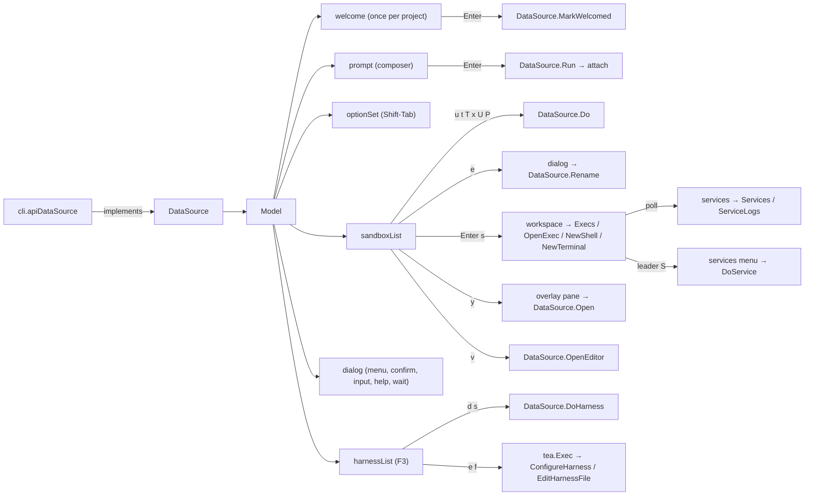

# tui

The `discobox tui` launcher: one window that opens with the cursor in a prompt for
a new sandbox, with the project's sandboxes a press of Tab away.

## Shape

Elm/Model-View-Update on Bubble Tea v2 (`charm.land/bubbletea/v2`, `bubbles/v2`,
`lipgloss/v2`). One model, not a screen stack: the window is a prompt, a list,
and one modal layer over both. All IO happens in `tea.Cmd`s, never in `Update` —
with one deliberate exception, the draft saved on the way out (`draft.go`).



## Decisions

**It opens as a prompt and opens out into a window** (`compact.go`). The first
frame is inline and only as tall as it needs: the mark, the composer beside it,
and no sandboxes. That answers the common case at its own size — you came here
to start something, and a screenful of sandboxes you did not ask to see is a
screenful to look past before typing. Reaching past the prompt (`leavePrompt`:
Up, Down or Tab) is the ask for the rest, and opening a terminal implies it too.

`expand` is one way. Having asked for the discoboxes once, flipping the screen
back and forth around them would be the window arguing with you.

Nothing on that first frame suggests there is anything behind it, so it says so
— laid into the very top border line (`titledEdge`), and only until the window
opens out. That line has nothing else on it, which is what keeps a centered word
from being squeezed out: in the header below, between the path on one side and
the keys on the other, there is no room for it at 80 or 100 columns and it was
silently dropped.

**One flourish** (`shimmer.go`): a band of color travels once across "discobox"
in the placeholder when the window opens — about a second — then the prompt is a
prompt. The hues advance with the frame as well as with the letter, so what
crosses the word is a moving rainbow rather than a bright spot. It runs only
where there is color to run it on, and stops on the first keystroke — a
flourish that plays over your own words is not one. Every character from the
second on carries its own color, because the textarea renders the placeholder
inside a style of its own; the *first* is left bare because the textarea puts
the cursor on the placeholder's first grapheme cluster, taken off the raw
string, and an escape there gets split with its remainder printed as text.

**Full screen, once open.** `View` sets `AltScreen` (per frame, which is how
Bubble Tea v2 takes it), so the window owns the terminal and what was on screen
before comes back when it exits. The list fills whatever rows the composer and
chrome leave it rather than shrinking to its contents, so the frame is always
exactly the terminal's height.

This replaced an inline window, and took two mechanisms with it: a settle-timer
that cleared the screen after a resize, because an inline frame is reflowed by
the terminal while the renderer still counts pre-reflow lines; and a row-reclaim
before `tea.Exec`, because an inline frame stayed painted above whatever the
action printed. On the alternate screen the runtime handles both — it drops to
the primary screen around an exec and repaints on resize.

**The prompt comes off the screen before the window takes it**
(`clearPrinted`). The opening prompt is printed on the primary screen;
everything else the window draws is on the alternate one, and switching screens
does not take the printed rows with it. They stay where they were, behind the
window, and whatever the window later drops back onto the primary screen lands
in the middle of them — a harness setup run through `tea.Exec` prints straight
over the old prompt. So the first frame that takes the whole terminal — opening
out, a modal, the options panel, a pane — is held back for one empty inline
frame, which is how the renderer is asked to erase the rows it printed; it is
the only thing that knows where they are, which is why this is a frame of
nothing rather than an escape sequence of ours. `View` records what it drew
(`printed`) and `Update` reads it, so this is one place rather than a call at
every door onto the screen. The empty frame is held for a couple of the
renderer's own frames, because it flushes on its own clock rather than on ours.

**Four kinds of action.** A `Verb` goes to the API and returns, so the window
stays up and reports on its status line. An `Interaction` is drawn in the window
(`pane.go`/`workspace.go`, over the `termpane` module): attach and shell open
the workspace screen onto the discobox's own terminals, and apply is an overlay
pane over whichever screen asked for it. Every interaction takes exactly one
discobox, which is what a pane shows, and says so on the menu with the reason
when a selection holds more. The window never steps aside for a discobox
action; the `exec` field is the `tea.Exec` handoff the *harnesses* screen still
needs, and exists as a field only so a test can run one without a terminal to
release.

**The row carries both of the server's state axes** (`Sandbox.State`,
`Sandbox.HasRuntime`). Existence and power are separate fields on the server
(ADR 0034 §§1–2), and its `displayState` — which `State` is narrowed from —
merges them error-first: a latched `ErrorMessage` reads `error` however healthily
the container is running, and a settled failure is never cleared without new
intent (ADR 0017 §4). That is right for the mark on the row and wrong for the
guards, so the row keeps the power axis beside it. `HasRuntime` is the presence
of `runtimeState` on the wire, which the API omits until the pool agent has
reported (absent is not `stopped`).

`attachable` asks that axis, not the state name: anything with a container can be
joined, because the pool agent starts a stopped one on demand when the attach
arrives (ADR 0017 §12), and only archived — no container by intent — and a box
nothing ever reported on are refused. An errored discobox with a live container
attaches, and `attachWhy` sends the one that has nothing behind it to repair
(ADR 0035) rather than naming its state back at it. Guards written as a list of
states are the wedge ADR 0017 §4 describes; this one used to be exactly that.

`repairable` is that pair read the other way, and is what puts repair (`R`,
`VerbRepair`) on the list: a latched error, or no container ever reported, are
the two shapes ADR 0035 exists for, and they are exactly where `attachWhy`
already points. So the reason the list gives for refusing attach names an action
the list now offers. Repair rebuilds on the current image (ADR 0062), which is
why its detail says so and why it is not merely a heavier upgrade: upgrade needs
a newer image to exist, repair needs the discobox to be broken.

**Rename is a third kind, and only in the list** (`renameKey`, `askRename`). It
is not a `Verb` — a verb is a word the window already has, and this one needs a
name typed first — so `e` opens the input dialog on the name the discobox
*already has*: the usual edit is a word added to a name that is nearly right,
and a blank line would make that a retype. Enter on the unchanged name is the
same as Esc, since neither asked for anything. It takes exactly one discobox,
because a name is a name and a selection cannot share one. A row named by its
primary terminal's window title (`Sandbox.NameIsTitle`) refuses rename with the
reason: the configured name is not the one on screen there, so accepting a new
one would visibly change nothing. It is deliberately
absent from `verbs`/`interactions`, which is what keeps it off the workspace
screen: rename needs a name typed into a dialog, and a discobox you are
already looking at is one you know the name of.

**vscode is a fourth kind, and is bound on both screens** (`vscodeKey`,
`openEditor`, `DataSource.OpenEditor`). It is neither a `Verb` — it changes
nothing about the discobox — nor an `Interaction` — it takes no terminal: `v`
runs `discobox tools vscode`, which hands the sandbox to the editor and returns.
The editor is another program in another window, so the window carries on
exactly where it was, and the workspace binds it too (`paneOptions`): the
terminal on screen and the editor beside it are two views of one discobox, open
at once. Because it is in neither `verbs` nor `interactions`, both the pane's
key map and `actOn` name it explicitly, the way `renameKey` is named. The
command writes an `ssh_config` and prints what it wrote, so `apiDataSource`
gives it `io.Discard` for both streams — a stray line of stderr would draw over
a full-screen window — and lets the error carry what went wrong to the status
line.

**Services are the left column's second group, and their panes are read-only**
(`services.go`, ADR 0068 §7).

They are drawn from a **listing of their own**, polled beside the exec listing,
and this is the one place the workspace needs a second seam. A service is an
exec, so a running one is in `GET /execs` — but a service that never started,
failed at boot, or cannot run at all has no exec to be in it, and that is
exactly the service whose absence has to be visible. A tab strip drawn from the
exec listing alone is silent about the only one you need to hear about.

Which services get a tab is "would its absence be a surprise": running, failed,
exited, or an unrunnable declaration. A service **stopped on purpose** does
not — you know, and a pane to dismiss every time would be the window nagging.
A pane with no live process draws a card instead: what it is, what state it is
in, why, and then whatever its last run printed, since after a crash the output
is the reason. The card is a `textTerminal` rather than a new kind of pane,
because a pane already knows how to draw, scroll, select and copy a stream, and
teaching the tab strip, the focus, the mouse and the layout about a second kind
would buy none of that.

**A service pane opens on its history, and never on the keys.** A plain exec
has no screen to repaint from (`shimruntime.EnableScreen` installs the replayer
for TTY execs only), so attaching to a running service starts at "now" and the
pane sits empty until it next says something — which for a server that has
finished booting is a long time. The transcript is played in ahead of the live
stream (`historyTerminal`), tailed at a line boundary so the cut never lands
inside an escape sequence. It is read *before* the attach, so the seam can only
lose a moment of output rather than repeat one: a repeated chunk reads as the
service having done something twice, which is worse than a gap.

Focus stays off it. Nobody asked for a service — it appeared because the
discobox is running it — and it is read-only, so focus there is focus nowhere.
An arriving service preserves the pane being worked in by pointer rather than
index, since the arrival may have shifted it along the strip; and the primary
claims its column's active index when it lands, because it usually lands *last*
(it waits on its harness install while a service is already running) and would
otherwise leave the tab that got there first holding the keys. It sets the index
only, so a shell explicitly asked for still keeps them.

**On a service, `t` and `T` are the service's.** They are the list's own stop
and start keys, re-read as the focused service's rather than the discobox's —
the same rule that makes those keys mean the discobox *on screen* rather than
the row the list left its cursor on, applied one level further in. A service is
the only kind of pane with a lifecycle of its own to apply them to.

Only those two move. Upgrade, archive and the rest have no meaning for a
service and keep meaning the discobox, and restart — which the list has no verb
for — stays on the services menu rather than taking a key that means something
else on every other pane.

Unlike the exec listing, the service listing **both opens and closes** panes: a
service is a declaration and the listing is the whole truth about it, so each
service has exactly one writer. A pane records the run it was opened on
(`pane.serviceRun`, `Service.runKey`) so the poll can tell one still looking at
what the server reports from one whose service has since restarted — which
keeps the same exec id (ADR 0038) and moves only its start time — stopped, or
been fixed.

The left side is `[terminals, services]`: what the discobox is running on your
behalf, the harness working on the code and the code itself running, while the
right side is what you opened by hand. Only shells split the window, so a
discobox with three services and no shell still draws its terminal at the full
width. Within the column the two kinds are *grouped* rather than strictly aged
(`execBefore`): a service usually starts before the terminals do — boot
launches both and a harness has files to install first — so strict age would
put services above the primary's neighbors and push them along. `column.insert`
therefore carries `pane.service` into the comparison, since a pane described
by id and age alone would sort as though it were a terminal. Services are then
ordered among themselves by `Exec.ServiceOrder`, their position in the
repository's declaration order, so the strip reads the way `.discobox/services`
does — and the way `discobox admin services ls` does — and holds still across a
restart.

Two things follow from a service running on pipes rather than a PTY: the pane
sends nothing and translates bare line feeds (`termpane.WithReadOnly` — there
is no stdin at the far end to reach, and no line discipline to have supplied
the carriage returns), and a column is no longer only TTY sessions, the one
clause of ADR 0054 §2 this widens, and only for sessions the sandbox itself
records as services.

The running services are therefore already on screen, which is what decides
what a key has to reach: the ones that are *not*. `leader S` opens the menu of
everything declared, read from the server each time rather than cached — a
service stopped from another window, or one whose file was added a minute ago,
is exactly what it is being opened to find out about. Choosing one offers
start, stop and restart, all three always, because the sandbox settles what each
means for the state the service is actually in and a menu that greys out the
verb you came for is arguing with a service that has since moved on.

**The workspace screen is one discobox as the server has it** (`workspace.go`).
Opening it attaches to the primary terminal — the virtual `ExecPrimary` id,
which the sandbox resolves and revives itself — *and* to every other live TTY
session the exec listing reports. Both sides are the same thing, a `column`
(`column.go`): a strip of panes with one visible at a time, in
session-creation order. `Model.terminals` is the left, `Model.shells` the
right, and `onShells` says which has the keys — unless one column has been
maximized over the other, below.

**Which side a session is drawn on is the server's own record, not a layout
this window keeps** (`terminalExec`, ADR-0054). A harness terminal — the
primary, or any exec created in terminal mode, which carries the harness it
runs — is a terminal and goes on the left; everything else is a shell and goes
on the right. So the workspace mirrors the server rather than remembering what
was opened here: a session started from another window appears on its own side,
and reopening the screen restores the same two columns anyone else's window
would draw.

The leader plus `s` always creates a new shell and plus `c` a new terminal —
never going to one; `a` is a place rather than an opener, and focuses the
primary. With no shells the terminals take the full width, and another
terminal is a tab in the box the primary already has rather than a third
column.

**The primary is pane 0, always, and always the leftmost tab.** It is attached
under the virtual id, which carries no creation time, so it sorts to the head
of its column whatever order the attaches land in — and it is the one pane
whose ending ends the workspace (`pane.primary`). The numbering runs across
the screen from it, terminals then shells, which is what the leader's digits
and its arrows count along (`panes`, `paneOrdinal`, `focusOrdinal`). A column
draws its strip once there is more than one pane on the whole screen: the
numbers appear exactly when they mean something.

While the screen is up, a generation-guarded tick loop polls `DataSource.Execs`
(~2s) and opens a tab for every live TTY session it does not already show,
deduped by exec id against open tabs and in-flight attaches (`connecting`) —
which is also what folds the leader-`s` optimistic tab and its listing entry
into one. It is a poll rather than a subscription because the control plane has
no exec event stream: exec state lives on the sandbox-agent and `/execs` is a
raw proxy, so there is nothing server-side to subscribe to yet. The seam is a
snapshot so that a real stream, when one exists, replaces the tick loop and
nothing else. The poll only ever *adds*: the attach streams deliver their own
exits (`termpane.ClosedMsg` is the sole driver of the exited transition), so
each tab transition has exactly one writer. Detach (`leader d`) leaves the
whole workspace — every stream closed at once, every session still running —
and `wsGen` is bumped so stale ticks and in-flight opens are dropped rather
than resurrecting a screen that was left. The primary session ending ends the
workspace too: it is above all a view onto that session.

A tab strip is laid into its box's top border (`tabbedEdge`, a `titledEdge`
with several titles), so it costs no grid row and both halves come out the same
height. Tabs are titled by the application's own title, else the session's
command basename, else its harness, else its id tail — the primary by its
action, since the virtual id names no session — and each carries the number it
answers to. The visible tab is lit and never clipped, and an overgrown strip
shows a window around it with an ellipsis at the clipped end. Hidden tabs keep
emulating off-screen at their drawn size, so flipping to one shows where it is
now.

**Either column can take the whole window** (`maximized`, `toggleMaximized`).
Each box wears a `[+]`/`[-]` button at the right end of its top border
(`zoomControl`, laid in by `titledEdge` and `tabbedEdge` the same way the
titles are), and `leader z` is the same toggle — a workspace control only a
mouse can reach is one half the users cannot reach at all. `columns` is the one
place the two widths are worked out, by tab count rather than off the model, so
the attaches that are sized before their panes exist agree with the layout they
land in. The hidden column is sized for the whole window too, on the rule that
already governs hidden tabs: it keeps emulating, and coming back to it must show
a screen drawn at the size it is shown at.

Which column is maximized *follows the focus* rather than being pinned, so
there is exactly one visible box and it is always the one taking the keys.
Pressing a button therefore also focuses its box, and `leader ←/→` or a digit
moves the maximized view rather than typing into something off-screen. The last
tab closing drops the maximize, since there is then nothing to maximize over.
`onScreen` is what is actually drawn, and the mouse routes against it: the
overlay alone, the two columns of a split, or the single maximized box.

`Model.paneBox` is the discobox the screen is showing, and every one of the
list's own keys is bound behind the leader against it (`paneOptions` over
`interactions` and `verbs`, dispatched through the list's own `actOn`) — one key
map for the two screens, with the same enabled checks and the same
confirmations. `currentBox` re-reads it from the listing at dispatch time, since
the workspace was opened on a snapshot and a diffstat that has since arrived
changes what is offered. The leader plus `h`/`l` or the arrows moves along the
strip the screen is — the terminals, then the shells — stopping at the ends
rather than wrapping, and the leader plus a digit jumps straight to the pane
wearing that number, tmux-style: 0 the primary, and the rest counted across the
screen from it.

Two of the list's keys mean something else here, because from the workspace
they are openers rather than places: `a` focuses the primary, and `s` opens
another shell. The third opener has no counterpart in the list — `c` opens
another terminal, on screen's and tmux's create key, since `t` is stop and the
key map is the list's.

**A command that finishes takes the screen.** `Model.overlay` is apply running
full width — over the workspace, where the terminals stay connected, unresized
and undrawn underneath, and over the list, where it is the whole screen. Its
report is not something to read in half a window beside a harness scrolling
past, and when it closes what was under it is exactly as it was: the workspace
still running, or the list on the row it was opened from (`closeOverlay` →
`leavePanes`). `openOverlay` sets `paneBox` either way, so the banner names the
discobox the command is running against on both paths. `focusedPane` returns the
overlay while it is up, which is what puts the keys, the cursor, the mouse and
the hints on it without a second path through any of them.

**A finished pane keeps its screen, and can be read back through.** The
distinction is positional now: the primary does not hold (its end is the
workspace's), while every other tab and the overlay do. A terminal or shell
that exits stays as
a readable tab, and a command that ran, printed and returned stays as the
screen — an apply with little to say is over in a moment, and a pane that
vanished with it would be a screen you never got to read. What it says it was is
the command's own result where there is one (`exitVerdict`, over the optional
`ExitReporter`): a nonzero exit reads "failed · exit N" in the banner and the
hints, in the error color, because a screen captioned "finished" over an apply
that printed why it could not is disagreeing with itself. A terminal that is a
session rather than a command has no such verdict and is simply finished. The
pane says so, and
its keys become the reader's (`readFinished`): the arrows and pgup/pgdn walk
back through output longer than the pane, `g`/`G` jump to the ends, the wheel
scrolls, `h`/`l` still leave for another pane, and only the keys that mean done
— `q`, Esc, Enter, Ctrl-C — dismiss it. Dismissal is local tab closure, not
detach: the session is already over, and the way to be rid of a *running* shell
is to exit it — there is deliberately no kill-tab key.

**Messages from a pane are addressed to it** (`paneMsg`, `fromPane`). Every
command a pane produces is tagged with its id, because `termpane.ClosedMsg` says
only "the session ended" — and a pane that has just been closed still has a read
in flight, whose parting message would otherwise be taken for the survivor's and
close a session nobody asked to end. Keys go to the focused pane; mouse events
go to the pane under the pointer (`routeMouse`); everything a pane's own
commands produced goes to the pane it came from.

**A pane takes the whole window, and wears the border itself.** Attached, the
purple box is drawn around the terminal grid with a cell of air inside it, so
the terminal's output never touches the frame, and everything else sits
*outside* it: one banner above, then the bordered grid, then the keys below.

The banner carries all three of where you are, which discobox this is, and the
way out — the id is folded into its centre rather than given a line of its own,
muted, since it is there to be looked up when wanted rather than read on every
glance. It is centered in the row rather than in what is left of it, so the
transport's status appearing on the right does not shift it, and `spreadCenter`
*shortens* it rather than dropping it when the row is tight: a name that
silently disappears at some widths is worse than a shortened one. The captions are indented to line up with the
terminal's own output rather than with the border.

**Where the work sits in git rides in the banner beside the id**
(`paneHeaderFields`): the position and its mark, the mark spelled out, and
the diffstat — the list's own git columns, drawn by the list's own `gitStyle`
and `diffText` in the list's own colors, so the two screens cannot drift apart
on what a color or a mark means. It is read through `currentBox` off the
listing the tick refreshes whichever screen is up, not off the snapshot the
workspace was opened on: a header saying "clean" over a session that has been
committing for an hour is worse than no header at all, and it is the same read
the leader keys dispatch against, so a screen that offers `apply` is one whose
banner already said there was something to apply. It costs no request — the
agent pushes git state and the diffstat through the control plane with the
listing.

**What the discobox is serving rides at the end of them** (`portsText`), from
the same push
([ADR 0048](../../../docs/adr/0046-listening-ports-are-polled-and-probed-in-the-background.md)),
grouped by protocol — `http:3000,5173,8080 · https:8443 · tcp:22,5432,6379`.
Grouped rather than one `protocol/port` per port because the protocol is the
repetitive half: a sandbox running three dev servers said "http" three times for
no information, on the row least able to spare it. The protocol leads its group
because it is what decides whether a port is worth opening — `http:5173` is a
page, `tcp:5432` is a database — and the groups run in that order of usefulness,
web first, with any protocol this CLI does not know keeping its own name and
following them. `unknown` draws as `?`: the longest word for the least
information, on the one port where the number is all there is to say. The
separator is the hints line's own `·`, so a group reads as "and" rather than as
a new banner field, which is two spaces.

The bind address is left off entirely: a forward dials from *inside* the
sandbox, where a loopback-only listener answers exactly as a wildcard one does,
so the address would be a field that never changes what you can do. Nothing
listening prints nothing, which is also what an agent that has not reported yet
looks like.

**The workspace forwards those ports, and the header says where to** —
`http:8082->8080,3000->3000 · tcp:5433->5432`. Opening the workspace opens a port
forward (`DataSource.Forward`, `startForward`) and detaching closes it, so the
local ports live exactly as long as the screen that shows them; the mechanics
are `internal/portforward`, the same forwarder `discobox proxy` runs, over the same
tunnel. A port that gets bound while the screen is up appears on it with no key
pressed: the forward wakes the window (`Forward.Events`) and the header redraws
from `Forward.Bindings`.

Both numbers are drawn even when they match. `3000->3000` says the port is
reachable *here*, which a bare `3000` — the shape every unforwarded port already
has — cannot; the arrow is the mark of "this one is open", and a mark that
vanished exactly when the forward got the number it asked for would be the wrong
way round.

A forwarded **web** port is also an OSC 8 link to the local end of it
(`portEntry`, `hyperlink`), so a dev server is one click away rather than a URL
to assemble by hand. Only forwarded ones, because a link to a port nothing is
listening on is worse than no link, and only web ones, because OSC 8 hands the
URL to whatever opens `http://` and there is nothing for a browser to do with a
Postgres socket. The sequences occupy no cells, so every measure and truncation
on this row goes on working on the text; a terminal that does not know OSC 8
shows `8082->8080` and drops the rest, which is why the label is the numbers
rather than a word like "open" that would only mean something where the link
works.

The window never drives the forward. It has no address to dial with — a `Port`
drops the bind address, above — and nothing to decide: the set follows what the
sandbox announces, which is what the header is already drawn from. So the seam
is "start one, draw what it bound, close it", and the polling, the local port
search and the splicing stay on the other side of it.

**The banner's edges are given up before its middle** (`viewPaneHeader`). The
middle is what the window is about; the edges are context the screen carries
elsewhere, so a row too narrow for all three drops edges first, one at a time,
in the order each is worth least *here*:

1. the keys, because the hints line under the grid says the same thing and is
   never dropped;
2. then `discobox` itself — it names the program rather than the work, and you can
   see which program you are in;
3. then the folder, which every row of the list this workspace was opened from
   already shared, and which the list is one key away.

What the transport is doing is not among them: it displaces the keys while it
is happening, and unlike them it is written down nowhere else, so it holds its
place all the way down.

Only a middle that still does not fit drops its own fields, whole from the
right — the ports first, since they are the only field with no bound on their
width (a compose stack brings up as many as it likes), then, in the list's own
order, the diffstat, which the apply report gives you anyway, then the word,
whose mark is on the position regardless. The id never goes. `dropToFit` is the
shared step and `centerRoom` is what it measures against, the same width
`spreadCenter` would have cut them to, which is what keeps the two from
disagreeing about what fits.

The title the application sets is laid into the top border (`titledEdge`) as
`──[ title ]──`, not above it: it names the terminal rather than the window, and
a border is a line the eye already follows, so a word set into it costs no row.
The brackets are what make it read as set into the line — bare text with space
either side leaves the border looking broken where the title sits. Too long to
sit in the line with rule either side and it is dropped; the terminal's own
title bar carries it too.

Unattached the window is the other way round: one box holding all of it. The two
are different shapes because they are different things — a launcher is a window
with parts, and a pane is a terminal with captions. Focus becomes `focusPane` and *every* key goes to the sandbox
except the reserved ones — and which those are depends on what is in the pane
(`paneOptions`).

**Ctrl-C is the application's, in every pane.** Nothing the window reserves
stands between a program and its own interrupt, so `paneOptions` passes an empty
detach key to `termpane.WithPrefix` and the ways out are `leader d` — the
key screen, tmux and a plain `discobox attach` all detach on, free again now that
diff has left the CLI — and `leader q`, which quits the whole window, the exit
Ctrl-C is everywhere else. Both sit in the header's top right. An attach used to take
Ctrl-C as "back out of this", which reads well right up until it is wrong:
someone who types it to stop an agent and gets a detached session instead has
not stopped anything, and nothing on the screen says so. One key with two
meanings depending on what is in the pane is worse than the keystroke it saved.
The window's own Ctrl-C-quits is therefore suppressed for the whole workspace
screen rather than for the panes that took the key. Either way the leader plus
`m` takes the mouse from a box that is using it and gives it back, and the
second key of a leader pair matches with or without Ctrl held. Typing the
leader itself takes it twice in full: its bare letter is `a` under the default
Ctrl-A, and that is attach.

**The leader is configurable, and it is not this package's.** `--leader`/
`DISCOBOX_LEADER` (`internal/keys.NormalizeLeader`, `WithLeader`) because the
leader is the key that *collides* — it has to be a chord nothing you run in a
sandbox wants, and which that is depends on what you run. It cannot be Ctrl-C:
that one is never the window's to take, and a leader that took it would take it
from every program the window ever draws. Its default and its spelling live in
`internal/keys` rather than here, because a plain `discobox attach` detaches behind
the same key: one leader for both terminals discobox shows you is one thing to
learn and one thing to change.

The terminal always reports the mouse while panes are up (`paneMouseMode`):
native selection is traded for the panes' own, which is every multiplexer's
bargain. Events route by position rather than focus — a left press latches the
pane it landed in until release (`routeMouse`, `paneAt`, `Model.mouseCapture`)
and also focuses it — and are translated into that pane's grid at the same
origin its cursor is placed at (`paneOrigin`). What an event *does* is the
pane's decision (`termpane.HandleMouse`, ADR 0036): forwarded to a sandbox
that asked for the mouse, selection otherwise, the wheel to whoever can
scroll. A finished selection — or a copy chord over one, or an OSC 52 copy the
sandbox's own application made — arrives as
`termpane.CopyMsg` and goes to the OS clipboard (`osClipboard`, which crosses
the WSL boundary as base64 because everything else there decodes by code
page), falling back to OSC 52 only when there is no OS clipboard to write —
never both, because they can land on the same clipboard with the last writer
winning, and OSC 52 is the writer terminals mis-decode. `ctrl+a m` seizes the
mouse from a sandbox that asked for it, for
when you would rather copy a stack trace than click on it; the seizure is the
window's, applied to whichever pane events route to.

The chrome — the header with the sandbox id, the hints line, the borders — is
selectable too (`chrome.go`): a press no pane claims drives a second
`selection.Model` over the composed frame itself, drawn back into cells
(`parseChrome`), flat rows with nothing wrapped. Before the selection, the
press means what the cell means (`focusChromeAt`): a tab label selects its
tab — the strip records where each label landed as it is drawn
(`tabbedEdge`, `Model.tabSpans`) — and any other cell of a pane's box
focuses that pane; the gesture then continues into the chrome selection, so
border text stays drag-selectable. The word rules make the
sandbox id one double-click. One selection is on screen at a time — a pane
press clears the chrome's and vice versa — and a chrome selection whose rows
no longer read back identically is cleared rather than left highlighting
whatever the recompose moved under it, which means status-line selections
honestly die — and so does a header selection the moment the git state under
it moves, which is the same honesty: the row it was made on is no longer the
row on screen. Copies and copy chords go through the
same `copyText` path as the panes'. Detaching returns to the
list with the cursor still on the sandbox it was opened on.

The title an application sets goes two places: its own pane's top border
(`titledEdge`), which says what that terminal is running, and the real
terminal's own title bar (`windowTitle` → `View.WindowTitle`), which is how you
find the window among the others you have open. The title bar
always carries the primary terminal's title — never the focused tab's or
the overlay's — because it is read from outside the window, where what matters
is which discobox this is and what its agent is doing; a tab or a report is
something you are doing inside the window and already looking at. With no
primary the terminal's title is left exactly as the shell that started the
window left it. Messages the window does not handle fall through to the pane, because the
terminal's output arrives as `termpane`'s own unexported messages and nothing
here can name them.

**The box is drawn by hand.** `Model.box` writes the border itself instead of
using a bordered lipgloss style, because such a style re-wraps any line as wide
as the box — and a re-wrapped terminal grid shifts every row below the wrap,
putting the hardware cursor on the wrong line for the rest of the session.
`paneCursor`'s offsets are exact for the same reason.

**An action takes the window's rows, not the ones under them.** The runtime
flushes and leaves the cursor on the frame's last row, so `interactExec.Run`
walks back up `frame` rows and erases below before the action starts. Without it
every attach opens under a frozen copy of the launcher and leaves it in the
scrollback. `Model.frame` is recorded in `View`, the only place the height is
known.

**The window is a box.** A rounded border in the mark's own purple (`colMark`)
all the way round. Everything inside is laid out at `inner()` —
`width - boxChrome`, the two edges plus a padding cell each side — and the
composer's own rules stop short of the border so they read as separators rather
than as the box broken in half. A dialog stands *in place of* the window and
carries its own border instead.

**A dialog takes most of the window, centered** (`dialogWidth`/`dialogHeight`).
It is the only thing on screen while it is up, so a box pinned to a fixed 90
columns in the top-left left a wide terminal empty on two sides of a card that
was scrolling. It takes 90% of each axis, and all of an axis below the
threshold where a margin costs more than the frame gives. The run options panel
is sized by the same rule: it is the same kind of modal surface, and two of them
at two sizes read as two different things.

Height is an allowance, not a size — a dialog grows into it and stops at its
content — so the config card fills a tall terminal while "Disable Codex?" stays
the size of the question. Body lines are truncated to the inner width as well as
wrapped to it: a line the wrapper cannot break comes back wider than the box,
lipgloss wraps it again, and the extra row makes the frame taller than the
terminal.

**A dialog with no answer is how a wait is drawn** (`dlgStatus`,
`statusDialog`). Submitting a prompt used to leave the launcher on screen with a
line under it while a pool came up and gigabytes arrived — the window looked
idle beside a list you could still act on, and the next thing that happened was
a terminal appearing without warning. The window goes to the discobox being made
instead, and the provisioning narration (`narration.go`) reports into the
dialog's body rather than only onto the busy line. Enter does not dismiss it:
there is nothing to answer, and closing it would drop the user onto a pane that
has not attached. `provisioningDoneMsg` takes it down; Esc gives up the view of
the discobox, not the discobox.

**The introduction is shown once, and the project is what remembers**
(`welcome.go`, `WithWelcome`, `DataSource.MarkWelcomed`). Every other screen
assumes you know what a discobox is; this one says so, and then never again. The
flag lives on the project (`model.Project.Welcomed`) rather than beside the
CLI's local state, so it does not re-welcome the same person on a second machine
or skip the second person on a shared project. Whether to show it is settled
before `tui.Run` rather than when the session load returns: the first run is the
slowest load there is, and a welcome that arrived late would arrive over a
prompt already being typed into. It takes every key — only Enter does anything —
so a press aimed at the introduction cannot reach a screen the user has not seen.

**The window fits the terminal.** `windowChrome` is what the box, header, list
title, blanks, composer and status cost before a single sandbox is drawn; the
list gives up rows for the composer as it grows and takes none at all when
there is no room. A frame one row too tall scrolls the terminal, which is the
one thing the renderer cannot redraw its way out of.

**An unsent prompt outlives the window** (`draft.go`). What is in the composer
is written through `DataSource.SaveDraft`, keyed by the session's directory, and
`Session.Draft` is what the next window in that folder opens holding. Closing a
terminal is not a decision to throw away several lines you thought about.

Written on the listing's own tick, and only when the field has moved since the
store last had it, so an idle window writes nothing and a window killed outright
loses seconds rather than the prompt. The keys that close the window
(`closeWindow`) write it from `Update` instead — a command batched with
`tea.Quit` races the runtime shutting down, and a prompt lost on the way out is
the whole of what this exists to prevent. A failed write is reported and not
retried until the prompt changes again: the alternative is a window repeating
itself about the same broken disk every five seconds.

Restoring is into an empty composer only. The session lands a moment after the
window is up and the cursor is in the field from the first frame, so anything
typed in that moment wins.

**The composer grows to `promptMaxRows` and then scrolls.** The textarea's
`DynamicHeight` sizes it from its contents — soft-wrapped rows counted, not just
typed newlines — between one row and three, so `layout` sets its width first and
reads the height back rather than computing one. Three rows is enough to see the
sentence you are still writing; a field that kept growing would take the window
over for a prompt you are only halfway through.

**The mark sits at the head of what it marks.** `logo.column()` is the art plus
a `logoGutter` on each side — one between it and the box, one between it and the
list. In the full window `logo.view` draws it from the top and pads below: a
mark belongs beside the first rows of the list, not floating halfway down a
column of them. The opening window uses `logo.viewCentered` instead, because
there the mark is the taller of the two and centering is what stops the prompt
reading as a caption on it. The art's own rows stay aligned to each other: it is
a picture, so the block moves, not the lines within it.

**The harnesses are the window's, not another program's** (`harnesses.go`).
`discobox configure` was a menu of its own over the same harnesses. It is this
screen now — `WithHarnesses()` opens the window straight onto it — because
choosing a harness to run and setting one up are the same job from two ends, and
two lists of harnesses with two sets of keys is one too many. `F3` opens it from
anywhere in the window, including from the run options, whose harness row names
`F3` in its hint.

It is drawn as the discobox list is drawn and acts as it does — chevron cursor,
colored state glyph, a letter per action, the same modal layer for the file
picker, the confirmation and the card — because it is the same kind of screen.
`e` enables or reconfigures, `d` disables (asking first, since deconfigure
deletes what the setup wrote, and releasing the project default when the target
holds it), `s` makes it the default, `v` reads the whole configuration, `f`
edits one of its files.

It stops short of two of the list's keys. There is no `.` action menu: that
answers eleven verbs over a multi-selection, and five actions on one row are
already all on the hint line. There is no `r` either — the screen re-reads
itself on the tick while it is up, and after every action, so a key for it would
ask for what is already happening.

The two that need a terminal — the harness's own setup and `$EDITOR` — go
through `tea.Exec` (`harnessExec`) rather than a pane: they are programs that ask
questions and draw their own screen to ask them on, and unlike apply they are
not one of this CLI's own commands with a discobox to name. `F3` is a function key because the prompt takes every
letter as text and the list has spent them on its own actions, and it is inert
inside a pane, where every key is the sandbox's.

The listing is read at startup, not when the screen is opened, because the run
options' harness choices are built from it (`optionSet.setHarnesses`): enabling
one makes it selectable without the window being reopened, and the default leads
the list so an unchanged option emits no `--harness` at all. It is the one source
of what harnesses exist — `Session` carries none — and is re-read after every
action rather than on a clock, except while the screen itself is up.

The config card is the one place the window shows a file's contents, capped at a
screenful with a note saying `f` opens the rest in an editor: a card is
something to glance at. Which secret answers each variable a harness needs
costs a request of its own (`HarnessSecrets`), so it is asked for when the card
is opened rather than for every row of a listing.

**One data seam.** Everything the window needs is on `DataSource` (`data.go`),
implemented once in `cli.apiDataSource`. The interactive actions there build and
execute the real Cobra commands, so the launcher runs `discobox apply` and the
rest rather than a second implementation that drifts from them.

**Color is a value, not a global.** `detectColor` reads the profile once and
`styles.color` carries it. Without color the state glyph gives way to the state
spelled out in a column, the mark is dropped entirely (it is shading, not line
art), and every style is the identity. `highlight` writes the row background
escape by hand and re-asserts it after both spellings of the reset, because a
style cannot paint across content that carries its own colors.

**Placeholders for data that is coming.** `Usage` is on the row and drawn as
dots until something reports it (`Usage.Known`). Nothing does yet; the column is
there because the shape of the row is what is being designed, and a column added
later moves everything beside it.

**The folder is a header control, not a column.** The path in the header is
which folder's sandboxes are listed (`folder.go`). It opens on the directory the
window is running in — what `discobox ls` shows — with every folder something was
started from one press away, plus `allFolders`. The choices come from the
listing itself, so the only folders offered are ones with something in them
(plus the current directory, always, since that is where a new sandbox would
go). Because every row on screen has already been filtered to one folder, the
row carries no folder column: it would repeat one value down the whole list.
This replaced the old `f` "only the ones started here" toggle, which was the
same filter with all but one of its choices missing.

The folder is also *where Enter creates*, not just what the list is filtered to:
`optionSet.setFolder` points the run source at it, so the header is one control
rather than two that look alike. `request()` leaves `Source` empty when the
folder is the session's own directory, since that is already what `discobox run`
resolves to, and the chip strip shows the source only when an override makes it
differ from what the header says — a strip repeating the header is one you stop
reading.

The harness is on the strip by the same rule, and used not to be: it was lit
whether or not it was chosen, on the reasoning that it is what the sandbox will
*be* rather than a setting. That named the project default as though someone had
picked it, which is both a line you stop reading and a claim the window cannot
stand behind — an unset harness emits no `--harness` at all, and what it
resolves to is settled by the server at create, from the default as it is then
rather than as this listing last saw it. Only a chosen one is named now.

The strip goes with it: with nothing chosen there is nothing to introduce, so
the `⏵⏵` marker is not drawn either and the line is empty. A marker that is
always there is one more thing on screen that never changes.

**The harness row claims nothing it cannot stand behind.** Index zero is the
project default where the project has one, and `(default)` where it does not —
never whichever harness happens to have been registered first, which is what put
a name there that the window then emitted no flag for. There is no `none` among
the choices: running without a coding harness is the `shell` harness (ADR 0043),
one of the project's like any other, so a second way to say it would be a second
thing to keep true.

Submitting a prompt in a project with no default and nothing chosen stops the
run and asks which harness the project should run (`askForADefaultHarness`).
The server refuses that create outright (ADR 0048), so the alternative is the
same refusal a moment later with the answer left to the user to find — and this
is the only point that knows what the project has to offer. A harness that
already works becomes the default outright; one that does not is set up first
and made the default when that succeeds, because a setup that left the project
still without one would ask the same question on the next prompt.

`shell` is not among those choices. It runs like any other harness and is chosen
like any other, but a project whose default is a login shell has no coding
harness by default, which is the state the question exists to leave. It is told
apart by `harness.ShellSlug`, the reserved name, rather than by a literal of the
launcher's own. A project holding nothing else says so instead of opening a menu
with no choices on it.

Both questions interrupt a run, so answering one runs it. The request travels
with the choice and comes back as `resumeRunMsg` once everything it was waiting
for has happened — the setup, then the default. It resumes at `startRun`, past
the questions rather than at the top of `run`: they have been answered, and the
listing has not necessarily caught up, so re-asking would ask the same one
twice. A setup that fails resumes nothing; the harness still cannot carry the
run, and the reason has just been reported.

None of this fires before the listing has landed: an empty listing and one still
in flight look the same and mean opposite things, so a prompt is never refused
on the strength of what has not arrived.

Choosing a harness that has never been through its setup stops the run and
offers the setup instead (`askToSetUpHarness`). The server refuses that sandbox
at create, so the alternative is the same refusal a few seconds later with
nothing to do about it; yes runs the same flow `e` runs on the harnesses screen.
A harness that declares no setup is told apart from one that is merely missing
it — there is nothing to offer, so the window says so rather than asking a
question whose yes does nothing.

**Focus is a ladder, and its ends stop.** The folder filter sits above the list
sits above the prompt, and the arrows climb it: Up off the top of the list
reaches the filter, Down past the bottom returns to the prompt. Neither end
wraps — Down at the prompt stays in the prompt and Up at the filter stays there,
because a key that jumped from one end to the other would be moving the opposite
way to the one it names.

Tab is the one key that does go round, in the order the window is drawn, bottom
to top: prompt → discoboxes → folder → prompt. Esc is the short way straight out
to the prompt from either stop. With an empty list, leaving the
prompt lands on the folder filter instead — that is exactly when it is the
control you want, and refusing to move would leave no way to reach it. Down
from there passes straight through the empty list to the prompt: there is
nothing to move through, and the empty list's own line says to type a prompt.

**A prompt with text in it keeps Up.** Up leaves the composer only while the
composer is empty; with anything typed it is a cursor key in the text, and
holding it walks to the top and stops there. Otherwise the last press of a key
you were using to reread your own paragraph opens the whole window behind it —
and in the opening screen `expand` is one way, so it cannot be taken back. Tab
is the way out, being a key you press once and mean, and the strip under the
composer and the opening frame's top line offer Up only while it works.

Where the cursor lands entering the list is `listLanding`, and only decides the
*first* time (`sandboxList.visited`): Up is a direction, so it lands on the row
nearest the prompt — the last; Tab lands at the top. Opening the window out is
the exception: whichever key did it lands at the top, because "nearest the
prompt" needs rows on screen to be near and there were none. After
that every key returns the cursor to the sandbox it was left on, because leaving
the list to type something and coming back is not the same as arriving at it.
`resetCursor` clears `visited` when the folder changes: a different set of
sandboxes is a list nobody has chosen a row in.

**The git column is where the work sits now.** Every row carries a
branch@commit, and once the sandbox's agent has reported (`GitState`, relayed
with the listing per ADR 0030) it is the position the working tree is on today
rather than the commit the sandbox was cut from. The mark on it is the state
of the work, most losable first: `*` in warning while the tree holds
uncommitted content, `⇡` in the default text for work committed ahead of every
host, which no apply has landed, `✓` in green when the head commit is the last one applied — the state
where nothing in the sandbox would be lost — and unmarked dim when it sits
clean where it was cut. An applied row shows the host-side commit its apply
produced rather than the sandbox head, since that is the SHA findable in the
local repository. The column beside it spells the mark out
(`dirty` / `ahead` / `applied` / `clean` / `-`), in the mark's color, so
the code never has to be decoded — the same words `discobox ls` prints. Until anything reports, the row falls
back to the spawn position, starred when a snapshot of uncommitted work was
carried in. `discobox ls` prints the same column, plus the derivation spelled as
a word (`dirty` / `ahead` / `applied` / `clean`), from the same
`cli.sandboxGitStatus` seam — one derivation, two spellings.

**Diffstats arrive with the listing.** The sandbox-agent measures
`git diff --shortstat` against the spawn commit its manifest records,
forwarded to the merge base with upstream once the sandbox has fetched so
pulled commits do not count (ADR 0018's base rule, carried into the agent by
ADR 0037), and reports the counts with the rest of its status — so the column
costs the list nothing and no git runs anywhere on its behalf. This replaced
a fetch-per-row through `DataSource.DiffStat`, whose exec woke every stopped
sandbox just to draw a column. `DiffStat.Known` separates "nothing changed"
from "nothing reported yet", which is what keeps apply available on a row
whose report has not landed.

**Keys are matched by name, not keystroke.** Bubble Tea reports a typed `V` as
`shift+v` and a space as `space`; the key list promises letters, so `keyName`
prefers the text the terminal sent. Shift-Backspace is folded onto Backspace
before anything looks at it (`unshiftBackspace`, at the head of `updateKey`):
a terminal on the Kitty keyboard protocol reports the two as different keys,
nothing — here or in the textarea's key map — binds the shifted one, and a
Backspace that deletes nothing because Shift was held is not a key anyone can
use.

**A sandbox is a "discobox" on screen**, or a "box" where the column is tight —
counts, key hints, menu details. The API type is still `Sandbox`; only what is
rendered changes, so the code keeps the control plane's word for it and the user
gets the product's.

## The Busy Line Says What It Is Waiting For

The busy line answers "is this window alive"; creating a discobox is where that
stops being enough. Behind a cold image pull the wait is minutes, and one word
held for all of it is indistinguishable from a hang
([ADR 0060](../../../docs/adr/0060-provisioning-progress-is-a-recorded-phase-the-client-polls.md)).

Two kinds of work report onto that line, and `narration.go` makes them the same
to the window. Creating and pushing a source are the client's own steps,
reported by the shared creation path through `DataSource.Run`. Provisioning is
the pool agent's, read off the discobox record by `DataSource.WatchProvisioning`
while the attach waits. Both arrive as lines; the window's only job is to put
the newest one where the busy line goes.

- One operation owns the line. Opening a feed ends the one before it, and each
  feed carries the generation it was opened at, so a report still in flight when
  an operation ends is dropped rather than landing on what replaced it.
- Reports never block the work. The feed is buffered and its sends are dropped
  when full: a status line must not be able to stall what it describes.
- The operation closes its feed when it returns, which is what releases the
  command reading it. That is why the reader is batched alongside the work
  rather than started independently — the two have the same lifetime.
- The workspace's watch ends when a session connects, not when the workspace
  closes: the discobox agent accepts an attach only once the terminal is
  launched and installed, so a connected session means there is nothing left to
  say. It reports nothing at all for a discobox that is already up, so attaching
  to a running one still shows only `attach…`.

## Files

| file | what it holds |
| --- | --- |
| `data.go` | `Sandbox`, `Session`, `Harness`, `RunRequest`, `Verb`, `Interaction`, `DataSource` |
| `harnesses.go` | the harnesses screen: the list, its actions, the config card, `F3` |
| `folder.go` | the header's folder filter: the choices, the dropdown, and applying one |
| `compact.go` | the opening window: the prompt beside the mark, and opening out |
| `shimmer.go` | the opening glint over "discobox" in the placeholder |
| `model.go` | the window: update, actions, run, layout, view, help |
| `list.go` | the sandbox pane: filters, selection, visual range, row rendering |
| `options.go` | `discobox run`'s flags as a panel, the chip strip, the command preview |
| `dialog.go` | the one modal layer: message, confirm, action menu, input, help |
| `theme.go` | the palette and every style, built against the detected profile |
| `logo.go` | the mark, embedded from `logo.chars` as captured |
| `editor.go` | Alt-E: the prompt in `$EDITOR` |
| `pane.go` | one terminal pane: its keys, messages, chrome and cursor |
| `column.go` | one side of the workspace: a strip of panes, one visible |
| `workspace.go` | the workspace screen: open, poll/reconcile, tabs, detach, the port forward |
| `services.go` | the discobox's declared services: the menu behind the leader, and the three verbs |
| `narration.go` | what a slow operation is doing, on the busy line |

## Looking at it without a terminal

```bash
go test ./internal/tui -run TestFrames -v
```

renders every state — prompt, list, multiselect, visual, archived, action menu,
options, harnesses, the config card, help — to the test log.
