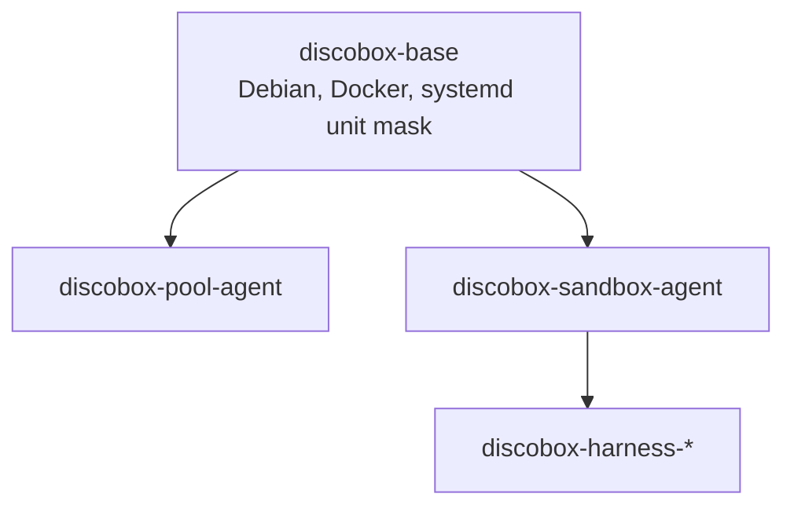

# 0068. Container images share one base image

Status: Accepted

## Context

Discobox ships three families of container image: the pool agent, the sandbox
agent, and one harness image per harness. Harness images have always been built
`FROM` the sandbox agent image, so they share every base layer and add only their
own CLI. The two agent images shared nothing at all.

Measured on the built images before this change, by comparing rootfs layer
digests:

| Pair | Shared layers |
| --- | --- |
| `harness-*` ↔ `sandbox-agent` | 38 / 38 |
| `pool-agent` ↔ `sandbox-agent` | **0 / 19** |

Three causes, none of them deliberate:

- The sandbox image was built on `debian:bookworm` while the pool image, the vz
  guest, and the libkrun guest were all on `debian:13-slim`. Nothing in the
  repository recorded a reason; it looks like a straggler rather than a pin.
- Both images installed Docker, from different sources — Debian's `docker.io`
  for the pool, Docker's own `docker-ce` for the sandbox.
- The 72-entry `systemctl mask` list was duplicated verbatim between the two
  Dockerfiles, down to the byte, while carrying divergent comments that claimed
  the two differed over udev. They did not.

Separately, the sandbox image installed its entire toolchain in a single 4 GB
`RUN`, so adding one apt package re-pulled every language runtime on every pool
host and inside every harness image.

## Decision

**One base image, `discobox-base`, built from `base-image/Dockerfile`.** It
carries Debian, the common runtime packages, Docker, and the trimmed systemd unit
set. Both agent images are built `FROM` it through a `BASE_IMAGE` build argument,
the same shape harness images already use for `SANDBOX_AGENT_IMAGE`. The image
hierarchy is now three deep:

**The base is pushed on release even though nothing ever runs it.** Its children
have to resolve the same reference at build time for their layers to be the same
blobs at pull time.

**Everything is on `debian:13-slim` (trixie).** The package sets of `debian:trixie`
and `debian:13-slim` are identical — slim only strips docs and locales — so the
slim variant the other three images already used is the one that survives.

**Both agents run `docker-ce`, and the base carries the buildx and compose
plugins.** The pool agent does not use those plugins, but the pool host is the
machine that pulls both images, so shared once costs it less than installed
twice.

**The sandbox agent's installs are split into a layer per tool group**, ordered
stablest first: Debian packages, Nix, rustup, third-party apt repositories, pnpm,
the Go toolchain, uv and bun, then the prebuilt CA trust store.

**code-server is removed.** Nothing referenced it; VS Code reaches a sandbox over
Remote-SSH (`discobox tools vscode`, ADR 0057), which is a different mechanism and
is unaffected.

## Alternatives rejected

**Deduplicate the source only — a shared shell script both Dockerfiles `COPY` and
`RUN`.** This is the cheap version, and it removes the same ~150 duplicated lines.
It shares no layers. Layer identity is the content hash of the changeset, and apt
writes timestamps and logs, so two `docker build` runs never produce a
byte-identical apt layer even from an identical command on an identical parent. A
common parent image is the only construct that makes the blobs actually shared.

**Keep the base unpublished, as a purely local build input.** Rejected for the
same reason: the pool and sandbox images are built by separate `docker build`
invocations, potentially on separate machines, and they only share blobs if both
resolve one already-built reference.

**A thin base — Debian and systemd, no Docker — leaving each agent its own Docker
install.** This avoids changing which Docker build the pool host runs, but Docker
is the single largest shareable chunk (~400 MB); a thin base shares ~72 MB and
leaves the rest duplicated. The pool agent's daemon changing from Debian's
`docker.io` to `docker-ce` is a real consequence, accepted deliberately: its
systemd units name `docker.service` and nothing in them or in the pool agent
depends on Debian's packaging.

**Hoist more of the sandbox toolchain into the base.** Only what both images need
belongs there. Nothing else in the sandbox image has a second consumer, and a base
that carried Chromium or Nix would make the pool image pay for a desktop it never
starts.

## Consequences

- A pool host that pulls both images pulls ~1.47 GB where it pulled ~2.24 GB.
  The sandbox image alone went from 1.97 GB to 1.37 GB compressed (7.18 GB to
  5.23 GB on disk); each harness delta roughly halved once the npm cache stopped
  shipping inside it.
- The pool image grew on its own — 269 MB to 309 MB compressed — because it now
  carries buildx and compose. That is the trade the previous point buys.
- Release ordering is now three deep: base, then both agents, then the harnesses.
  `release:images` sequences them, and the development image watcher models the
  dependency generically (`parent`/`parentArg`) rather than special-casing the
  sandbox agent.
- The reclaim label (ADR 0040) is declared once, in the base, and inherited by
  every image below it.
- The vz and libkrun guest images still carry their own smaller mask lists. They
  are boot artifacts assembled into a kernel, initrd, and root filesystem, not
  container images pulled by a daemon, so there are no layers for them to share.
  Revisit only if either ever ships as an image.
