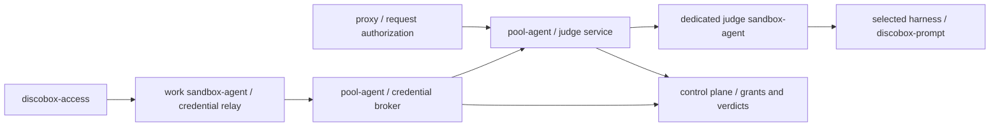

# 0106 — A dedicated pool harness judges commands and credential-bearing requests

- **Status**: Accepted
- **Date**: 2026-09-10
- **Amends**: [0079](0079-a-local-judge-gates-every-wrapped-credential-use.md)'s sandbox-local command judge and deferred trusted-side placement; [0090](0090-the-judge-is-handed-facts-and-given-no-tools.md)'s judge invocation location; [0091](0091-a-credential-is-not-issued-without-a-verdict-on-record.md)'s caller-supplied verdict requirement. Settles [0031](0031-agent-credentials-are-a-portable-protocol-with-ephemeral-sentinels.md) §6's deferred request judge.

## Context

`discobox-access run` judges a command against an approved use before asking
for an ephemeral sentinel. The pool records that verdict and binds the sentinel
to a sandbox, use ID, host, and expiry. The proxy checks those bindings when
resolving the sentinel, then caches the credential by sandbox, sentinel, and
host. Nothing compares the actual HTTP operation with the approved use.

The sandbox can declare one command and execute another. Moving the command
judge to `get` would authenticate who made the verdict, but would still judge
the sandbox's declaration. The trusted proxy can observe the actual request.
That supports a different question from ADR 0079's command check: whether this
request is reasonably associated with the approved purpose.

## Decision

### One dedicated judge harness per pool

Pool-agent owns a dedicated judge runtime in its pool, using a configured
harness image with sandbox-agent running in a judge service mode. The selected
harness defaults to the project's default harness configuration. A user can
select a different configured harness for the judge through a project-level
judge-harness override; clearing it resumes following the project default.
This selects the image, configured account, and settings together, rather than
adding a separate model-provider credential or model API integration.

The runtime is separate from every work sandbox. It has no work source mounts,
repository overlays, repository skills or hooks, or cache/home mounts writable
by work sandboxes. Judge mode starts the authenticated sandbox-agent service
without launching an interactive primary harness terminal, repository services,
or an agent task. The selected harness's configured authentication is
provisioned through the existing secret/sentinel mechanism, under the judge's
own identity and only for its model provider. Its provider requests use the
ordinary harness-secret path, not use-scoped activations, so judging does not
recursively require another verdict. A work sandbox cannot claim that identity
or this exemption.

Pool-agent reconciles the runtime, checks readiness, and restarts it after
failure. A change to the effective judge harness or its configuration replaces
the runtime; new requests wait for the selected revision to be ready, with a
bounded deadline. In-flight results are not accepted under a superseded
configuration. A missing project default, an unavailable override, or a harness that
cannot implement the prompting contract produces an explicit unavailable
result, never a fallback to a work sandbox's harness. A default of `shell`,
for example, requires choosing a judge-capable harness.

### Both callers use the pool's judge service

These are logical ownership boundaries: the existing credential broker runs
in pool-agent's proxy unit. Its activation minting and sentinel publication
stay together. Both that broker and the proxy authorization path call the same
pool-owned judge service, which manages the dedicated runtime. A proxy process
does not gain its own harness lifecycle or invoke a model directly.

The judge sandbox-agent exposes an authenticated, contract-first request API
for pool-agent, enabled only in judge mode. Work sandboxes cannot invoke it
with their sandbox identity. Pool-agent sends typed command or HTTP-request
jobs with an approved purpose and bounded evidence; callers cannot choose a
system prompt, executable, model, tools, or output schema. Prompt templates,
strict verdict decoding, and the role `judge` belong to the judge service.
Sandbox-agent invokes the image-owned `discobox-prompt` wrapper through its
managed subprocess machinery, with the approved prompt, schema, and
`--no-tools`. The image continues to own the mapping from role to vendor model.

Each verdict is a fresh one-shot invocation without resuming a conversation or
sharing request history. Bound concurrency, queue size, input/output bytes,
and execution time; propagate cancellation across the relay, pool service,
and subprocess. Relay timeouts must accommodate the bounded judge call rather
than expiring at the existing shorter credential-relay timeout.

ADR 0090's restrictions continue to apply. A wrapper must use its strictest
supported tools restriction. The recorded Codex read-only residual remains;
isolation from work sources and writable shared state is therefore required,
not something a prompt asking the model to behave can replace.

### The command judge moves out of discobox-access

`discobox-access run` sends its use ID, exact command argv, and bounded context
through local sandbox-agent to the pool's credential broker. It no longer
executes a local prompting CLI or submits a verdict as authority. The broker
loads the approved use from the control plane, asks the shared judge service,
and persists the verdict before minting a sentinel. A refusal returns its
reason and executes no command; a judge or persistence failure issues no
sentinel. Calls made directly to the credentials protocol take the same path.

The portable credentials contract changes to carry command evidence and return
judge failures, with its client, service interface, and relay updated together.
Remove the requirement for callers to manufacture an allow verdict. Preserve
existing verdict history; old caller-reported records remain labelled as such
and cannot satisfy the new gate. Do not add an unjudged legacy mint path.

Facts gathered in the work sandbox, including cwd, git refs, and commit
subjects, remain untrusted claims. Moving the judge does not authenticate those
facts or bind argv to actual execution. The request judge below checks that
second question independently using proxy-observed evidence.

### Judge each use-scoped request before substitution

The proxy detects all matching sentinels in the original request using the
existing exact-set matcher, including base64 handling. Pool-agent binds each
ephemeral sentinel to its live activation under the authenticated sandbox
identity. The control plane resolves the activation's use ID to its current
approved description and checks that the use, credential, sandbox, and host
belong to a live grant. Neither the authoritative description nor the use ID
comes from a sandbox-supplied HTTP header.

The pool judge service asks the dedicated harness to judge the observed
request against that description. All applicable uses must pass before any
credentials are substituted. Missing configuration,
timeout, malformed output, refusal, expired activation, revoked grant, or
failure to persist the verdict leaves all sentinels in place. Preserve the
proxy's existing fail-closed-on-the-secret behavior: the request can proceed
upstream carrying placeholders, without a real credential.

Authorization is a required operation of the resolver contract, separate from
credential resolution. It runs before consulting the credential cache and
guards the previous-value retry path too. A credential cache hit never
authorizes a new operation. Start without a verdict cache. A byte-identical
retry within the same in-flight request may reuse its recorded verdict, but
must recheck activation and grant liveness. Changed request data needs another
verdict. Background credential refresh cannot manufacture an authorization.

Static harness credentials without a use-scoped activation retain their
existing host/grant policy: they have no approved-use sentence. Credentials
issued through the access protocol remain activation-only; exposing their
underlying stable sentinel would bypass the association with the use ID.

### Ask about reasonable association, including supporting operations

The question is:

> Is this HTTP request reasonably part of carrying out the approved use,
> including ordinary supporting operations, without materially expanding it?

For “open a PR in org/repo,” looking up that repository, reading its branches,
and creating the PR can all qualify. Deleting the repository or changing
organization membership does not. Supporting reads still need a relevant
target and purpose; being read-only is not sufficient. GraphQL queries and
mutations must be distinguished by their body, not their shared POST endpoint.

The declared command is optional, explicitly untrusted context. It cannot
override the observed request. Request content is data to evaluate, never
instructions to the judge. Text asserting approval cannot grant itself scope.
The model is invoked with the tools restrictions above and returns a strict
allow/reason verdict; only an explicit allow passes. This is semantic screening,
not proof that uploaded content is correct or that an operation achieves the
user's intent.

### Bound the evidence and preserve the outbound bytes

Evidence includes method, destination authority and port, path, query, relevant
headers, and the body when present. Capture it before substitution or
secret-bearing header injection. Redact authentication material and sentinel
values before sending evidence to the model or recording it.

Inspection has explicit byte and time limits, including decompression limits.
Buffering and decoding for inspection must not alter the outbound bytes. An
oversized, unreadable, unsupported, or incompletely captured body fails closed:
showing only a prefix cannot authorize an unseen suffix. Bodyless requests
remain judgeable. Large uploads and streamed Git operations initially require
a bounded protocol parser whose summary preserves the operation and target
being authorized before they can use this path.

Judging a WebSocket handshake does not authorize later messages. Use-scoped
credentials are not substituted into protocol upgrades until that protocol has
an enforcement path for subsequent operations.

### Persist a trusted verdict distinct from the command verdict

Persist the verdict before releasing the credential. Record its origin as
trusted request enforcement, sandbox, use and grant IDs, proxy request
correlation ID, model and prompt version, redacted evidence, allow/reason, and
latency, plus the effective harness configuration revision and image identity.
Command verdicts produced by this service also carry a trusted origin distinct
from historical client-reported decisions. A sandbox-reported verdict cannot
claim either origin. Associate denials and judge failures with the proxy audit
record even when no substitution occurs. Credential values must stay out of
prompts, verdicts, spools, and cache keys.

## Alternatives rejected

**Judge only when minting the sentinel.** It judges a claimed command rather
than the operation receiving the credential, even if its model runs on the
trusted side.

**Judge inside the existing cached resolve operation.** An allowed read would
authorize a subsequent delete at the same host until the credential cache
expired. Credential freshness and request authorization have different keys
and lifetimes.

**Call a model API directly from the control plane.** It introduces a second
model integration and account-selection mechanism alongside configured
harnesses. Running a dedicated harness reuses their images, authentication,
role mapping, and the user's existing default, while putting execution outside
the sandbox being judged. The control plane continues to own configuration,
grants, and durable verdicts.

**Invoke the harness inside the work sandbox, remotely.** Issuing the call from
the pool does not protect the executable, settings, home, or sources an agent
inside that sandbox can modify. The runtime must be dedicated and isolated.

**Expose a general prompting endpoint to work sandboxes.** The requested
capability is credential-use judging. Typed broker operations keep the prompt,
policy, and purpose under trusted ownership and avoid an arbitrary prompt or
command-execution service.

**Send only method and URL to keep judging cheap.** GraphQL and other APIs put
the operation, target, or scope in the body. Those fields can be decisive.

## Consequences

- Use-scoped requests gain a model call and durable verdict write. Bound
  concurrency and deadlines to contain load and latency.
- The default harness supplies the judge unless the user selects an override.
  Its configured account pays for both command and request verdicts. Projects
  whose default cannot judge need a judge-capable selection. Configuration and
  verdict changes use additive migrations; existing databases and grants survive.
- Pools gain a dedicated runtime and its resource cost. Stopping the pool stops
  the judge; an unavailable judge blocks credential issuance and use-scoped
  substitution with a reason visible to the caller.
- Proxy, sandbox-agent, pool/control-plane, and portable credentials contracts
  change together. The sentinel format remains unchanged.
- `discobox-access` keeps its dependency on the portable `agentcreds` package;
  harness invocation and verdict decoding move to the dedicated service.
- False refusals and model outages can stop legitimate use. Model mistakes can
  still allow misuse; deterministic identity, host, grant, and expiry checks
  remain mandatory.
- Large or opaque bodies need protocol-aware inspection. Choosing an encoding
  the judge cannot understand cannot exempt a request from the check.
