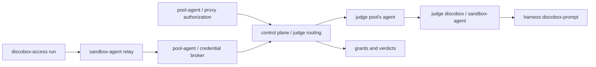

# 26-09-22-838 — A dedicated pool harness judges commands and credential-bearing requests

- **Status**: Accepted
- **Date**: 2026-09-22
- **Superseded in part by**: [26-09-25-428](26-09-25-428-the-judge-may-let-its-allow-stand-for-a-route.md)
  — the judge, not only an endpoint rule, may let an allow stand (§7)
- **Amends**: [0079](0079-a-local-judge-gates-every-wrapped-credential-use.md)'s
  placement of the judge in the sandbox and its deferred trusted-side half;
  [0090](0090-the-judge-is-handed-facts-and-given-no-tools.md)'s invocation
  location; [0091](0091-a-credential-is-not-issued-without-a-verdict-on-record.md)'s
  caller-supplied verdict. Settles
  [0031](0031-agent-credentials-are-a-portable-protocol-with-ephemeral-sentinels.md)
  §6's deferred request judge.
- **Relates to**: [0140](0140-a-discobox-reaches-the-discobox-api-through-its-pool-with-a-fixed-role.md),
  whose gate calls are judged here like any other use.

## Context

A credential a discobox holds is scoped to approved uses: sentences a person
agreed to, like "open a pull request in org/repo". Two things happen between
that sentence and a credential reaching the internet, and neither is checked
by anything that can be trusted.

**The command judge runs inside the sandbox it judges.** `discobox-access run`
invokes `discobox-prompt` in the work sandbox, decides there, and carries its
own verdict on the call that takes the value (ADR 0079, ADR 0091). ADR 0079
said plainly that this is a guardrail and not a boundary: the agent owns that
executable, its PATH, and the `DISCOBOX_PROMPT` override, and it can speak to
the protocol endpoint directly and skip the CLI altogether (ADR 0092). The
verdict the control plane stores is the sandbox's word about itself.

**Nothing judges the request that actually carries the credential.** The
sandbox declares an argv and receives an ephemeral sentinel bound to a use, a
host, and an expiry. What it then sends through the proxy is a different
object: the argv said `gh pr create`, and the request may be anything the
credential is accepted for at that host. The proxy asks its resolver for a
verdict on every request carrying a swapped credential, and on every gate call,
and refuses when it cannot get one — but the pool's implementation returns
allow for everything. The hook is there; nothing decides.

The proxy is the one place that sees the real operation on trusted ground. The
question it can ask is not ADR 0079's question about a declared command. It is
whether *this* request is part of carrying out the approved use.

## Decision

### 1. One judge runtime per project, and it is not a work discobox

A project has one judge: a discobox running the project's **default harness**
image with sandbox-agent in judge mode. Choosing a configured harness chooses
its image, its account, and its settings together, so the judge needs no second
model integration, no model API credential, and nothing to configure of its
own. It exists as soon as the project has a default harness, and follows it:
change the default, and the judge is replaced with it.

**The judge is an ordinary discobox in judge mode**, created and kept ready by
the reconciler that already schedules, starts, replaces, and deletes
discoboxes. Judge mode is not a privilege: it says what a discobox exists for,
and anybody may make one. What makes one *the project's* judge is that the
project points at it, which Discobox writes and nothing else does. A judge is
left out of listings unless it is asked for, and it is not counted against a
pool or a project being deleted, because it runs no terminal and holds none of
the project's work. Everything else about its lifecycle — image pinning,
readiness, replacement when its configuration changes — is the behavior every
discobox already has, rather than a second implementation of it.

*(Amended 2026-09-23, before anything shipped against it: the first draft made
the judge a discobox of a kind only Discobox could create, hidden by a flag of
its own. The mode already says what the discobox is for, and a second marker
saying the same thing is one more thing to keep true.)*

It is not a work discobox and shares nothing with one: no work sources, no
repository skills or hooks, no cache or home a work discobox can write. Judge
mode starts the authenticated sandbox-agent service and no interactive
terminal, no repository services, and no agent task. Its harness credential is
an ordinary harness secret under its own identity, with no approved use and so
no activation, which is why judging never recursively needs a verdict. A work
discobox cannot claim that identity or that exemption.

**One pool hosts it, named on the project.** The judge is a Linux container,
and the pool that runs it is recorded when the project's first pool is
bootstrapped — the per-OS default pool, which runs Linux containers on every
platform Discobox supports today. A pool whose discoboxes are whole VMs of
another operating system therefore never hosts a judge; it asks the project's
judge like any other pool. One judge is what a project starts with, and
routing (§2) picks a ready judge rather than the judge, so a second is
configuration rather than redesign.

**An unavailable judge refuses.** No verdict, no credential: no fallback to a
work discobox's harness, no allow with a warning. A project whose default
harness cannot judge — none set, or one with no prompting wrapper, such as
`shell` — has no judge, and says so. The reason reaches the caller, because a
refusal nobody can read is indistinguishable from a broken credential.

### 2. Every caller asks through the control plane

A pool asks the control plane, with the pool identity it already holds. The
control plane finds the project's ready judge and forwards the job to the pool
hosting it, over the channel it already uses to create and start discoboxes
there, with a token minted for that judge alone. Pools never call each other:
they sit behind NAT, in clouds, and inside VMs, and the only thing every pool
can reach is the control plane. This costs no availability that was not already
spent, because a pool already asks the control plane to resolve every sentinel
and check every grant.

The evidence therefore leaves the pool. The control plane holds the credentials
themselves and records the verdicts, so it is not a new trust boundary, but the
redaction §6 requires happens before evidence is sent, not when it arrives. The
proxy's audit record stays where it was written (ADR 0130).

A caller supplies evidence and the approved use. A caller never supplies a
system prompt, an executable, a model, tools, or an output schema: those belong
to the trusted side, with the role `judge` that the image maps to a model of
its choosing. Sandbox-agent invokes the image's own `discobox-prompt` with
`--no-tools` and the fixed schema, and decodes the verdict strictly: an answer
that is not exactly one verdict object is no verdict. Printing the verdict and
nothing else is therefore part of the wrapper contract every harness image
implements, and a wrapper that frames its answer in a transcript is tightened
rather than parsed around.

Each verdict is a fresh one-shot invocation, with no conversation carried over
and no history shared between requests. Concurrency, queue depth, input and
output bytes, and wall-clock time are bounded at each hop, and cancellation
propagates from the request being held to the subprocess. ADR 0090's
restrictions still apply: the judge gets no tools, and isolation from work
sources is what makes that true rather than a sentence in a prompt asking for
it.

### 3. The command judge moves out of the sandbox

`discobox-access run` sends its use ID, the exact argv, and its bounded context
through sandbox-agent to the pool's broker, and executes nothing until the
broker answers. It runs no prompting CLI and reports no verdict of its own. The
broker loads the approved use from the control plane, asks it for a verdict
(§2), persists that verdict, and only then mints a sentinel. A refusal mints nothing,
so ADR 0079 §1's order — judge, then take — is preserved with the judge moved.

The portable credentials contract carries the command and returns the judge's
answer, rather than requiring the caller to present a verdict it made itself.
Verdicts already recorded keep their origin and stay readable; they cannot
satisfy the new gate. No unjudged path is added for old clients.

Facts the sandbox reports about where a command runs remain untrusted claims.
Moving the judge authenticates who asked, not what the sandbox said.

### 4. A use-scoped request is authorized before its credential is resolved

Authorization is a required operation of the proxy's resolver contract,
separate from resolving a value, and it runs **before** resolution: a refused
request never decrypts a credential, and a cached value never authorizes a new
operation. The retry path after a rejected credential is authorized the same
way; a background refresh authorizes nothing.

The proxy finds every sentinel in the request with its existing exact-set
matcher. Pool-agent binds each to a live activation under the authenticated
sandbox identity, and the control plane resolves the activation's use to its
current approved description, checking that the use, credential, discobox, and
host still belong to a live grant. Neither the description nor the use ID comes
from a header the sandbox wrote. Every applicable use must pass before any
substitution happens. Liveness is rechecked after the verdict, because a
verdict takes a while and a grant can be revoked inside it.

Anything that is not an explicit allow refuses: a refusal, a timeout, a
malformed verdict, an expired activation, a revoked grant, or a failure to
persist. No credential is resolved, and the proxy answers the request itself
with 403 and the reason, as it already does for a refused verdict. That reason
is the only thing the discobox learns, and it is worth more to it than the 401
it would get from sending the request upstream with the sentinel still in it.

That is a different case from a sentinel nothing can resolve, which keeps the
proxy's existing behavior: the placeholder stays, the request goes on, and the
upstream rejects it. A refusal is a decision about the request; an unresolvable
sentinel is the absence of a credential.

A static harness credential with no activation has no approved-use sentence
and keeps its existing host and grant policy. A credential issued through the
access protocol stays activation-only.

### 5. The question is reasonable association, including supporting operations

> Is this request reasonably part of carrying out the approved use, including
> ordinary supporting operations, without materially expanding it?

For "open a PR in org/repo", looking the repository up, reading its branches,
and creating the pull request all qualify. Deleting the repository or changing
organization membership does not. A supporting read still needs a relevant
target: being read-only is not authorization.

The declared command is optional context and explicitly untrusted; it cannot
override the observed request. Request content is data to judge, never
instructions to the judge, and text inside it claiming approval grants nothing.
Only an explicit allow passes. This is semantic screening, not proof that what
is being sent is correct or that it achieves what the person wanted.

### 6. Evidence arrives in rounds, and the judge asks for what it needs

The first ask carries what identifies the operation: method, destination
authority and port, path, query, the relevant headers, and a description of the
body — its media type and length — but not its bytes. Most requests are decided
here, and a body sent every time would be tokens spent on requests the URL
already answers.

**The verdict has a third answer**: allow, deny, or *this is what I need*. The
judge may ask for the body as text or as JSON, with a byte budget the trusted
side caps, and the next ask carries it, redacted and marked as untrusted data.
Asking is bounded: at most three asks in total, all inside one deadline, and an
ask that repeats what was already supplied makes no progress and refuses. A
judge that never resolves to allow or deny has not allowed anything.

**A body that cannot be supplied whole is described rather than hidden.** Too
large, unreadable, an encoding the proxy does not decode: the judge is told
which, and how much is there, and decides on that. It may refuse — and for
routes where an unseen suffix matters, an endpoint rule can refuse first (§7) —
but the decision is the judge's, not a blanket refusal that would stop every
large upload whatever it is.

Evidence is captured before substitution and before any credential-bearing
header is injected, and authentication material and sentinel values are
redacted out of everything sent to the model or written down. Capturing must
not alter the bytes that go upstream, and has explicit byte, time, and
decompression limits.

Judging a handshake does not authorize what an upgraded stream then carries.
Use-scoped credentials are not substituted into an upgrade unless an endpoint
rule names it as one whose handshake says everything there is to judge.

### 7. Endpoint rules add what Discobox knows about an API

One general question fits every request, but a request to an API whose shape is
known is judged better with what is known about it. The `judge` package holds
**endpoint rules**: trusted code keyed by host, method, and path pattern, that
the pool applies before and around the model's verdict. A rule may:

- **Explain the endpoint** — what the route does and what to weigh, added to
  the ask.
- **Decide without the model** — refuse a route whatever the use says. A rule
  only ever narrows: nothing a credential's own authorization refuses can a
  rule allow.
- **Add trusted facts** — look up in the control plane what the request does
  not carry, such as what a named discobox is and who created it, and hand it
  to the judge marked as trusted, beside the untrusted request.
- **Name an upgrade** whose handshake is the whole of what there is to judge,
  or **let an allow stand** for a bounded time for the same activation, method,
  path, and facts, so a lead polling its workers does not occupy the judge.
  Liveness is still checked on every request.

Rules ship with the pool. Nothing a request, a sandbox, or a use says can add
or change one. The discobox API is the first rule set, since its whole surface
is one credential's worth of authority over other discoboxes.

### 8. A trusted verdict is persisted, and is distinct from a reported one

A verdict is persisted before the credential is released, and records its
origin as trusted enforcement, the discobox, the use and grant, the proxy's
request correlation, the prompt version, the redacted evidence, the answer and
its reason, the latency, and the harness revision and image that produced it.
Command verdicts from this service carry the same trusted origin. A verdict a
sandbox reported can never claim it. A refusal is associated with the proxy's
audit record even though no substitution happened, and credential values stay
out of prompts, verdicts, and audit rows.

## Alternatives rejected

**One judge per pool.** Every pool would run its own, which is a second warm
runtime and a second copy of the harness account for a project that has two
pools, and on a pool whose discoboxes are whole VMs of another operating
system it is an entire VM whose only job is to answer prompts. The judge needs
a Linux container, not a local one.

**Pools call each other's judges directly.** It requires connectivity between
pools that mostly does not exist — NAT, cloud networks, VM boundaries — and a
second mutual authentication scheme, to avoid one hop through a control plane
every pool already talks to.

**A judge harness chosen separately from the default.** One more thing to
configure, for a distinction nobody has asked for: the default harness is the
one the project already trusts to do its work. A separate selection can follow
if a project turns out to want a cheaper model for judging than for working.

**Schedule the judge like a work discobox and let placement decide.** Placement
would put it wherever there is room, including a pool whose discoboxes are
VMs. Which pool hosts the judge is a property of the project, decided when its
first pool is made.

**Keep judging in the sandbox and authenticate it better.** There is nothing to
authenticate: the executable, its inputs, and the decision all belong to the
agent being judged. Signing its answer would record who said it, not whether it
was asked.

**Judge only when the sentinel is minted.** That judges a claimed command, even
with the model on trusted ground. The request that carries the credential is a
different object, and it is the one that reaches the internet.

**Judge inside the cached resolve.** An allowed read would authorize a later
delete at the same host for as long as the value stayed cached. Credential
freshness and request authorization have different keys and lifetimes.

**Call a model API from the control plane.** A second model integration, a
second account to choose, and a second thing to configure, to reach what a
configured harness already has. Running the harness in the pool reuses its
image, its authentication, and its role mapping, and keeps execution outside
the sandbox being judged.

**Run the harness in the work sandbox from the pool.** Issuing the call
remotely does not protect the executable, the settings, or the home directory
the agent can rewrite. The runtime has to be dedicated.

**Expose a general prompting endpoint to work sandboxes.** What is needed is
judging, and a typed job keeps the prompt, the policy, and the purpose on the
trusted side instead of shipping an arbitrary prompt-and-execute service.

**Send the body with every ask.** Tokens and latency on every request, to
answer a question the URL usually settles. The judge asks when the body is
where the operation lives, and a rule can say so for a route where it always
is.

**Let the judge ask as often as it likes.** The proxy is holding a request open
while it asks. Three asks is enough for "I need the body, and now I can
decide"; more is a conversation, and a conversation has no deadline.

**Refuse whenever the body cannot be captured whole.** It fails a large upload
on its size rather than on what it is, and the size is often the point of the
operation. Describing what is missing keeps the decision with the judge, and a
route where a partial body must never be allowed is a rule.

**Endpoint rules in project configuration.** A rule that can allow is
authority, and project configuration is written by whoever can write the
project. Rules start as code; a configurable layer that can only narrow can
follow once the built-in rules show what a project needs to say.

**Judge an upgraded stream's contents.** A terminal attach carries keystrokes
and output both ways for hours. There is no request in it to judge; the
handshake is where the intent is.

## Consequences

- Every use-scoped request gains a model call and a durable verdict, and a
  second call when the judge asks for the body. Bounded concurrency and
  deadlines are what keep that from becoming the cost of the proxy.
- The judge is paid for by the project's own default harness account, and a
  project whose default cannot judge has no judge until it sets one that can.
- A project gains one runtime it always keeps ready, in the pool named at
  bootstrap. Stopping that pool stops the judge for every pool, which is the
  price of not running one per pool; the routing picks a ready judge, so a
  second one is added without redesigning anything.
- Evidence crosses from the pool to the control plane, redacted before it
  leaves. Audit records stay in the pool that wrote them.
- Proxy, sandbox-agent, pool-agent, control-plane, and the portable credentials
  contract change together. The sentinel format does not change.
- `discobox-access` keeps the portable `agentcreds` dependency and loses its
  prompting and verdict decoding. The `shell` harness's stand-in wrapper stops
  being needed for the `judge` role once §3 lands.
- False refusals and model outages can stop legitimate work. Model mistakes can
  still allow misuse, which is why identity, host, grant, and expiry checks
  remain deterministic and mandatory.
- Rules are trusted code, reviewed as policy. A rule that decides without the
  model, or lets an allow stand, trades the model's reading of one request for
  a fixed judgment about a route.
