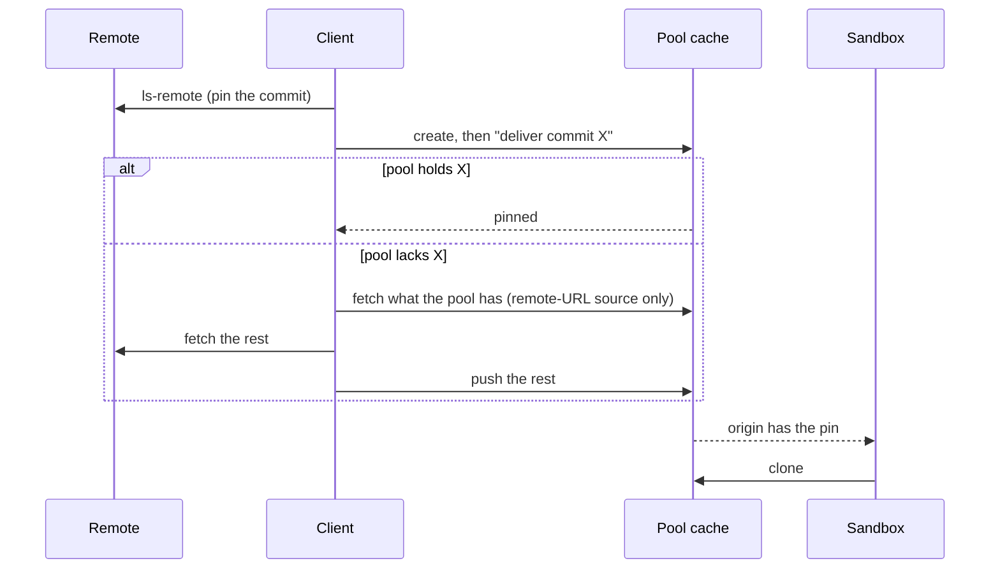

# 26-10-10-545 — Git reaches a pool only from a client, and is cached there per remote

- **Status**: Proposed
- **Date**: 2026-10-10
- **On acceptance supersedes**, for sandboxes created after it except where
  a line says every sandbox:
  [0001](0001-sandbox-origin-and-remote-source-push.md) §3 (local bind as a
  provider capability) and §4's placing of the push after provisioning;
  [0045](0045-a-directory-with-no-repository-is-delivered-by-push.md) §3,
  [0093](0093-a-local-sources-origin-is-its-git-directory.md) §§1–3 and
  [26-09-24-630](26-09-24-630-a-discobox-delivers-the-source-of-the-discoboxes-it-creates.md)
  §3, as inputs to a choice of delivery that is no longer made;
  [0056](0056-a-repository-declares-the-sources-it-is-worked-on-with.md) §1's
  "a remote primary source declares nothing";
  [0058](0058-a-push-delivered-source-has-a-pool-side-origin.md) §1 (one bare
  repository per sandbox), §5's "only push-delivered sources have a mirror"
  and its `UpstreamRef`;
  [0123](0123-a-discobox-is-exported-as-its-spec-and-its-durable-tree.md) §4
  and what `tree/origins/` is written from (§9 here);
  [0126](0126-a-sandbox-does-not-share-a-host-or-a-filesystem-with-its-pool.md)
  §4's live origin for every sandbox (§8 here), and, for new ones, its
  bare-origin fallback and "a source that is a remote URL still clones that
  remote directly";
  [26-09-24-005](26-09-24-005-attaching-to-a-discobox-awaiting-its-source-delivers-it.md)
  §2's origin-host rule, for a remote-URL source;
  [26-09-05-008](26-09-05-008-an-attached-client-pushes-the-commits-made-where-it-runs.md)
  §2's condition that only a `push`-delivered source is pushed, for every
  sandbox (§8 here). 0058 §§3, 6 and 7, 0126's
  Git HTTP route and its convergence, and
  [26-10-08-561](26-10-08-561-a-sandbox-reaches-its-origins-at-a-host-its-pool-proxy-answers.md)
  stand.
- **On acceptance rejects**:
  [0128](0128-a-private-remote-source-is-fetched-with-a-credential-the-client-lends.md),
  which was never accepted or built. Its deferred pool-shared object cache is
  what this decides.
- **Relates to**: [0055](0055-a-delivered-source-settles-before-its-sandbox-runs.md),
  [0111](0111-the-origin-is-the-client-and-its-key-names-where-the-source-came-from.md),
  [0129](0129-the-sandbox-agent-reads-the-tree-an-export-carries.md).

## Context

A source reaches a sandbox three ways today, chosen by `sourceNeedsPush`:

| Source | Delivery | The sandbox clones from |
| --- | --- | --- |
| Remote URL | clone | the remote itself, through the pool proxy |
| Local, client and server on one host | clone | the pool, serving the developer's live Git directory |
| Local, anything else | push | the pool, serving a bare repository made for that sandbox |

Issue #139 measured what that costs. A remote-URL source is a full-history
clone over the WAN, made by every sandbox, after it boots: 16–47s for a
27.6 MiB repository, set by the remote's speed at that moment. A pushed source
moves the same full history into an empty repository on every create. Nothing
a pool has received is reused by the next sandbox.

Three further problems share that cause:

- **A private remote has no delivery.** ADR 0128 proposed lending the user's
  credential to the pool for one fetch. It puts a user credential on the
  control plane and the pool, and it was not built.
- **The same request behaves differently by where the server runs.** The live
  origin exists only for a co-located client, behind a host-identity comparison
  and a provider's local source roots, and it is a second way of serving an
  origin (`live-origins.json`, the snapshot in `pool-agent/githttp`) with its
  own failure, a race with the developer's `git gc`.
- **The sandbox's remotes describe the plumbing.** `origin` is the pool and the
  real remote is `upstream`, so an agent's `git push origin` and every tool
  that reads `origin` point at the wrong place.

## Decision

### 1. Git comes from a client, always

Every Git source of a new sandbox is delivered by a client pushing it. Nothing
chooses between deliveries, on the server or anywhere else.

- **The pool never fetches from a remote and never holds a credential for
  one.** It receives pushes and serves fetches.
- **The server never runs Git.** It stays the byte proxy between a client and a
  pool that ADR 0058 §6 describes.
- **A sandbox's first clone is always from its pool.**

A client is whatever runs the CLI with the user's Git credentials: a person's
machine, or a discobox creating discoboxes with a credential it was granted
(ADR 26-09-24-630). A create that names a Git source and has no client parks in
`awaiting_source` and fails when that state times out (ADR 0001 §4). A
remote-URL source can be delivered by any client that can read the URL, not
only the one that created it.

### 2. A pool keeps one repository per remote

A pool holds a cache of bare repositories. Each source of each sandbox has a
Git namespace in one of them, `refs/namespaces/<sandboxID>-<slug>/`, in place
of a repository of its own. One object store per remote is what makes a push a
delta: the receiving side advertises what it already holds, from every
namespace, and the client sends the rest.

The cache is the pool's. It is not mounted into any sandbox and is not part of
any sandbox's tree. A namespace follows its sandbox: it is kept while the
sandbox is archived, removed when the control plane says the sandbox is gone,
and written out by an export (§9).

| The source | The cache key |
| --- | --- |
| Has a remote | the remote, normalized |
| Has none, and its client has a host identity | the source-data key, `originkey.Of(hostID, GitSource.Root())` |
| Neither | none: a cache of its own, removed with the sandbox |

- **A remote-URL source's remote is its URL. A local checkout's is reported by
  the client**: the remote its checked-out branch tracks, else `origin`, else
  its only remote. A branch that tracks nothing — how most work starts — must
  not move a checkout out of its remote's cache, so tracking is the first
  answer and not the only one; a branch that tracks a fork is in the fork's
  cache. A remote on a pool's origins host (ADR 26-10-08-561) is not a remote and
  is skipped: it is another sandbox's plumbing.
- **A remote is normalized** to host and path — lower-cased host, no scheme,
  user, default port, trailing slash or `.git` — so the HTTPS and SSH spellings
  of one repository share a cache.
- **The source-data key is the one that already names a source's pool
  storage** (`sourceDataKey`, `layout.SourceData`). It is not the sandbox's
  origin key (`SandboxOriginKey`), which names the primary source only and
  falls back to the host alone. It is empty without a host identity, which is
  the third row.
- **The scope is the pool.** A remote's cache is shared by every user of the
  project the pool belongs to, and the host identity is deliberately not part
  of a remote's key. Members of a project are trusted with each other's
  source, unpushed commits and dirty-workspace snapshots included. §7 bounds
  what a sandbox, which is not a member, can reach.
- **A cache is never shallow.** `receive.shallowUpdate` stays off: a
  repository's `shallow` file is the repository's, not a namespace's, and one
  shallow push would truncate every other sandbox's clone of that remote.

### 3. Delivery is a pin, or a fetch and a push, and it does not wait for the box

1. **Pin.** The client names every ref of the delivery (the table below) and
   the object each points at; for a remote URL, `ls-remote` gives it all of
   them. The pool creates each ref whose object its cache already holds,
   reachable from a ref. When that is all of them, nothing is transferred. An
   object that is present but unreachable is not pinned.
2. **Otherwise the client supplies what the pin could not.** From a local
   checkout it already holds the objects and pushes. For a remote URL it keeps a bare repository per
   remote in its own cache directory, fetches into it from the pool and then
   from the remote, and pushes; the second fetch is negotiated against the
   first, so each leg carries only what the next host lacks.
3. **The push starts when the create returns.** The route is addressed by
   sandbox and slug as today (0058 §3). The server names the cache and the
   namespace when it forwards, so the pool needs no record of the sandbox and
   no container to accept it. The push, and the fetch that feeds it, run while
   the image is pulled and the sandbox boots; a pool that is not up yet is the
   only thing they wait for. A sandbox whose source has landed by the time its
   agent answers never parks.

The first create for a remote that neither the client nor the pool has seen
moves the full history twice, remote to client to pool. That is the price of
§1, and it is paid once per remote per pool.

What is delivered, into the source's namespace:

| Refs | Hold |
| --- | --- |
| `refs/heads/*` | what the sandbox starts from, as today: the source's branch, or the conventional branch a tag or bare commit is pushed to; and what `discobox push` adds later |
| the snapshot ref | a dirty workspace (ADR 0001); a directory with no repository (ADR 0045) is delivered as it is today |
| `refs/remotes/origin/*`, `refs/tags/*` | the remote's branches and tags as the client knows them: all of them for a remote-URL source, the checkout's remote-tracking refs and tags for a local one |

The last row is what lets a sandbox read as a clone of the remote (§6)
without reaching it: a remote-URL sandbox has every branch and tag, as it does
today, and a local checkout's `origin/<branch>` is where the remote was, not
where the developer's unpushed commits are.

**A shallow checkout is refused by the client**, with the reason and `git
fetch --unshallow`. It cannot be pushed into a cache (§2), and deepening
someone's checkout is not the CLI's to do.

### 4. Every source of a sandbox is delivered this way

A sandbox's sources are its primary, each `--include`, and each source its
primary declares in `.discobox/sources.json` (ADR 0056). Each is its own
source with its own cache key (§2) and its own namespace, pinned or pushed as
§3 says, all at once. Nothing distinguishes how they travel.

ADR 0056 stands — a local checkout beside the primary wins, a fallback lands
where that checkout would have, explicit beats declared, no recursion — with
one change: **a remote primary declares sources too.** 0056 refused it because
reading the file meant cloning on the client. It does not: the client reads
the one file from the remote at the pinned commit.

The sources of a create are fixed in the create request, so the file is read
before the create, and reading it must not wait on the history. The client
fetches the pinned commit alone, with no trees or blobs (`--depth=1
--filter=tree:0`), into a throwaway repository and reads the file from there,
which fetches the few objects on its path. Tried against
`discobox-ai/discobox` on GitHub while this was written, that took about a
second and 100 KiB. The throwaway repository is not the client's cache of the
remote, which stays complete. A remote that refuses a filtered fetch gets the
commit at depth 1 instead.

### 5. The cache remembers a remote; a namespace remembers a sandbox

- **A namespace holds what was delivered for one source of one sandbox** (§3),
  and nothing else writes it.
- **The cache holds the remote's own branches and tags**, as last delivered,
  under refs outside every namespace. That is what keeps a remote's history after
  its last sandbox is deleted, and what a client fetches in §3.
- **Everything else is unreachable once its sandbox is gone**, and `gc` prunes
  it.
- **The pool agent runs `git gc` on every cache on a schedule.** It is the
  pool's own periodic job, not a side effect of a push, so a cache that is
  only read is still repacked and pruned.
- **`gc` has a cache to itself.** Git's prune grace period runs from an
  object's age, and a pin or a delta push creates a ref at objects that may be
  old. So the pool agent holds a cache exclusively while it prunes, and a pin,
  a push or a namespace's removal waits. One repository per remote keeps that
  wait to the sandboxes of one remote.
- **A cache with no namespace that has gone unused for a retention period is
  removed whole.**

There is one repository per remote, not one object store for the pool. Each
is repacked, pruned, measured and removed on its own, and a damaged one costs
one remote's history.

### 6. A sandbox's remotes read as a clone of the real remote

The sandbox agent clones the source's namespace from the pool and then sets
the repository up as though it had cloned the source's remote:

| Remote | URL | Its remote-tracking refs come from |
| --- | --- | --- |
| `origin` | the source's remote | the namespace's `refs/remotes/origin/*`, once, at materialization |
| `discobox` | the pool's origin route | the namespace's `refs/heads/*`, on every fetch |

Tags come with the clone. The checked-out branch tracks `origin/<branch>` when
the remote has that branch. A source with no remote has `discobox` alone, and
its branch tracks that.

- **The pool is never `origin` and the remote is never `upstream`.** The agent
  asserts the `discobox` remote's URL on every pass, as it asserts `origin`'s
  today; `origin` belongs to the sandbox after materialization, and moves when
  the sandbox fetches the real remote.
- **A sandbox sees new local commits only when a client pushes them.**
  `discobox push` and the attached client's push (ADR 26-09-05-008) update
  `discobox/<branch>`; whoever works in the sandbox fetches and rebases. The
  ref a sandbox's reported diff base follows (`UpstreamRef`, ADR 0058 §5) is
  therefore `refs/remotes/discobox/<branch>`, not `origin`'s.
- **A fetch from `origin` inside the sandbox goes to the real remote**, with
  the agent-credentials protocol where it is private (ADR 0031).

### 7. What a sandbox can reach is its own namespaces

Project trust (§2) is between people. A sandbox runs code nobody has read,
and the pool agent is what confines it. Hiding ids does not: a sandbox can
list the project's sandboxes and read the commit each was created at.

- **A sandbox's own route serves `git-upload-pack` only**, scoped to its
  source's namespace, on protocol v0. A v2 `upload-pack` serves any object
  asked for by id whatever namespace it is in — the reason ADR 0126's live
  origin is already pinned to v0 — and v0 refuses a want that no advertised
  ref reaches, but only while `uploadpack.allowAnySHA1InWant`,
  `allowReachableSHA1InWant`, `allowTipSHA1InWant` and `allowRefInWant` are
  off and `http.getanyfile` is false. The pool agent forces all five on the
  command line of every request it serves a sandbox, as it does for a live
  origin today, so nothing in a cache's own configuration can loosen them.
- **A sandbox never writes its own namespace.** Work leaves a sandbox through
  the worktree route, as now.
- **A discobox delivering to one it created** (ADR 26-09-24-630) is held to
  what it sent and what it already has. The pool agent accepts a ref from it
  only when every object the ref reaches arrived in that push or is reachable
  from the calling sandbox's own namespaces, and it pins only at a commit
  those namespaces reach. Git itself accepts a ref at any object the store
  holds, sent or not, so this is the pool agent's check and not Git's. The
  caller is told what its own namespaces hold and nothing more, which still
  makes a child cut from its own checkout a delta.
- **The cache a sandbox caller names is its own claim** — the remote and the
  host identity are its word. The check above is why that is harmless: naming
  another cache gives it nothing there it did not send.
- **Fetching a cache's remote tips (§3) is a project member's**, never a
  sandbox's. A discobox creating from a remote URL fetches from the remote
  alone.

### 8. Existing sandboxes are left as they are

Nothing that exists is rewritten, in a sandbox or on a pool.

- **A source's recorded delivery stays the record of how it was delivered.**
  `clone` and `push` keep their meaning for the sources that have them, a new
  create records a third value, and the pool, the agent and the CLI go by it.
- **An existing sandbox's remotes stay as they are.** A local source's
  `origin` is the pool and `upstream` its remote; a remote-URL source's
  `origin` is the remote and it has no pool origin. The agent keeps asserting
  what it asserted. Renaming remotes under work in progress is not the pool's
  to do.
- **A per-sandbox bare repository stays where it is** (0058 §1), is served and
  pushed into as before, and is reaped with the sandbox. It is not moved into
  a cache.
- **A sandbox whose origin was live gets a per-sandbox repository**, empty
  until a client next pushes; its checkout is untouched. Its recorded delivery
  stays `clone`, so `discobox push` and the attached client's push accept a
  local source recorded as `clone` and push into that repository, where today
  they refuse anything but `push`. One created before this and not yet
  materialized parks in `awaiting_source` for its client to push, as a
  push-delivered source does.

Only a source created after this has a namespace in a cache.

### 9. An export carries the namespace as a repository

The export contract keeps its shape (ADR 0123, 0126 §8, 0129): the spec plus
`data`, `sources` and `tree/origins/<slug>.git`. For a cache-delivered source
the pool writes that repository out of the namespace, and an import reads it
into a namespace of the importing pool's cache, keyed as §2 says. Both are
local to a pool. An archive written before this imports as it was exported,
into a per-sandbox repository (§8); the recorded delivery says which.

## Alternatives rejected

- **The pool fetches with a credential the client lends (ADR 0128).** The data
  moves once, which is its whole advantage. A user's credential transits the
  server and the pool, and a create becomes a credential-bearing request.
- **The pool fetches anonymously when the remote is public.** No credential is
  involved, but it is a second delivery chosen by probing a remote, and the
  pool is back to depending on a remote's speed and reachability.
- **The pool fetches through the client, which adds the credential.** It needs
  a channel from a pool to one particular client — what 0128 rejected a
  credential callback for — and the bytes still cross the client's link.
- **A cache per user.** It needs no trust between project members. It also
  gives no reuse between them, which is where a team's reuse is.
- **One repository per sandbox borrowing objects through `alternates`.** 0058
  §4 rejected alternates because a repack on either side breaks the chain. A
  namespace is one repository with one object store, and has no chain.
- **A shallow or partial clone in the sandbox.** `--depth` takes away the
  history an agent reads. `--filter=blob:none` fetches blobs from the remote
  for the life of the sandbox, on demand, with a credential it may not have.
- **Keeping the live origin for a co-located client.** It saves one local
  push. It keeps the host comparison, the provider's source roots and a second
  origin implementation, and it keeps a local server behaving unlike a remote
  one.
- **Reading a declared-sources file through `git archive --remote` or a
  host's file API.** GitHub answers the first with an error over HTTPS, and
  the second is one integration per host with its own credential.
- **Caching Git in the pool proxy.** A fetch is a negotiated `POST`; no two
  are the same request.

## Consequences

- A second sandbox from a repository costs a delta, or nothing, whatever the
  source is and wherever the server runs. The local push path gains this as
  much as `-C` does.
- A private remote works with the user's own Git configuration, and no
  credential for it exists anywhere but the client.
- `sourceNeedsPush`, the host-identity comparison, `LocalSourceRoots`,
  `live-origins.json` and the live snapshot in `pool-agent/githttp` are
  removed, the live origin for existing sandboxes as well as new ones (§8).
  The per-sandbox origin of 0058 §1 stays, for the sandboxes that have one,
  until the last of them is gone.
  `NoLocalRepository`, `NoLocalCommits` and `NoLocalGitDirectory` stop
  deciding anything on the server.
- A remote-URL create needs a client until its source is delivered. It needed
  none before.
- A shallow local checkout cannot be a source. Co-located, it could.
- A delivery to a remote's cache waits while that cache is pruned.
- The first create for a remote is slower than today when the client's link to
  the remote is worse than the pool's. Issue #139 measured that link as the
  slowest of the three.
- A pool's disk holds every remote its sandboxes have used, and unpublished
  commits and snapshots are readable by every member of the project while a
  sandbox holds them.
- A sandbox no longer follows the developer's repository unattended. It
  follows it when a client pushes.
- `origin` in a sandbox is the remote, which is a visible change for anything
  written against `upstream`.

## Deferred

- **Streaming the remote's pack through the client into the pool**, so the
  first create moves the history once through the client instead of fetching
  and then pushing. It needs pack-protocol code in the client that stock Git
  does not offer. Revisit when the first create for a large repository is what
  people wait on.
- **Sharing objects between a repository and its forks**, or one object store
  for the whole pool. Each remote is its own cache (§5). Revisit if fork-heavy
  projects fill a pool's disk.
- **Completing a shallow checkout's history from its remote in the client's
  own cache**, in place of refusing it. Revisit if shallow checkouts turn out
  to be how people start discoboxes.
- **What replaces `apply`** for a source that came from a local directory. It
  is decided separately, and it does not write the cache (§7).
