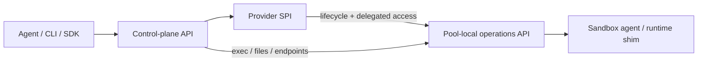

# Agent sandbox API and CLI (design proposal)

> Status: exploratory proposal. Not accepted and not implemented. This document
> records research and a possible design for future consideration; it does not
> describe current Discobox behavior or commit the project to implementation.
>
> Research snapshot: 2026-07-21. Provider details are time-sensitive and should
> be verified again before using this proposal as an implementation specification.

## Purpose

Discobox may eventually expose a provider-independent API for AI agents that
need to create an isolated environment, move source and artifacts across its
boundary, run commands, access services, preserve useful state, and tear the
environment down.

This proposal explores:

- the common concepts exposed by current agent sandbox providers and frameworks;
- a TypeScript-shaped public client API that is ergonomic without hiding
  lifecycle or failure state;
- a CLI designed primarily for invocation by AI agents, while remaining usable
  by humans;
- how that public API should relate to Discobox's control plane, pool-local
  operations API, sandbox agent, and provider SPI.

It intentionally does not propose an implementation sequence, database schema,
or migration. Those belong in a future accepted ADR and implementation task if
the project chooses this direction.

## Summary recommendation

Do not define the common API as the intersection of provider SDKs. Define a
stable Discobox operations API and implement it consistently through the
pool/sandbox agent. Keep the provider SPI focused on runtime lifecycle,
placement, and delegated connectivity.

The public model should have these separate concepts:

```text
Sandbox
├── desired specification
├── observed status
├── Exec[]
├── Filesystem
├── EndpointLease[]
└── Snapshot[]
```

The first useful portable contract would guarantee:

1. sandbox lifecycle;
2. durable exec resources;
3. native file operations and bulk transfer;
4. authenticated private HTTP endpoints;
5. resumable lifecycle and exec event streams.

Templates, filesystem snapshots, memory checkpoints, pause/resume, public
endpoints, GPU allocation, computer use, and configurable network egress should
be explicit capabilities. A capability should represent a genuine runtime
difference, not serve as a way to avoid implementing required behavior across
providers.

## Ecosystem observations

The products use different names, but their main abstractions converge.

| Concept | Common behavior |
| --- | --- |
| Sandbox, devbox, or machine | Stable isolated workspace with a filesystem, process space, and network identity. |
| Image, template, or blueprint | Reusable starting environment, normally prepared before sandbox creation. |
| Exec or command | Process with output, status, and an exit result; some products also provide stateful shells. |
| Filesystem API | Native read/write/upload/download separate from command execution. |
| Preview or endpoint | Authenticated or public access to a sandbox-local port. |
| Stop, suspend, or pause | Stop active compute while retaining some or all state. |
| Snapshot, fork, or checkpoint | Reusable disk state and, for some runtimes, live memory/process state. |
| Policy | Resource limits, lifetime, network egress, secrets, and placement. |
| Events and logs | Observe lifecycle and long-running commands without treating one HTTP request as the lifetime of the operation. |

Notable reference points:

- [E2B](https://e2b.dev/docs) has a small `Sandbox -> commands/filesystem`
  model. It distinguishes one-to-one
  [pause/resume](https://e2b.dev/docs/sandbox/persistence) from one-to-many
  [snapshots](https://e2b.dev/docs/sandbox/snapshots); current snapshots may
  include filesystem and memory state.
- [Daytona](https://www.daytona.io/docs/en/sandboxes/) exposes process,
  filesystem, Git, PTY, interpreter, preview, fork, volume, and lifecycle
  features. Its [preview API](https://www.daytona.io/docs/en/preview/) makes the
  authentication and expiry of port access explicit, and its
  [network policy](https://www.daytona.io/docs/en/network-limits/) supports
  deny-all and domain/CIDR allow lists.
- [Modal](https://modal.com/docs/guide/sandbox-files) provides native filesystem
  access and distinguishes filesystem, directory, and experimental memory
  [snapshots](https://modal.com/docs/guide/sandbox-snapshots).
- [Cloudflare Sandbox](https://developers.cloudflare.com/sandbox/concepts/sessions/)
  treats a session as a stateful shell context. Sessions retain working
  directory and environment but share the sandbox filesystem and process space;
  they are not a tenant isolation boundary. Its
  [command API](https://developers.cloudflare.com/sandbox/api/commands/) exposes
  cwd, environment, stdin, timeout, output, and exit code.
- [Runloop Devboxes](https://docs.runloop.ai/docs/devboxes/overview) separate
  commands, files, blueprints, snapshots, network policies, and suspend/resume.
  Its [snapshot API](https://docs.runloop.ai/docs/devboxes/snapshots) is useful
  for disk-state fan-out and rollback.
- [Vercel Sandbox](https://vercel.com/sandbox) uses isolated Linux microVMs,
  structured command execution, port URLs, and snapshot-based fan-out.
- [Kubernetes Agent Sandbox](https://agent-sandbox.sigs.k8s.io/docs/) defines
  declarative Sandbox, SandboxTemplate, SandboxClaim, and SandboxWarmPool
  resources. It is a useful scheduling and lifecycle reference, but not a
  complete agent operations API.
- [Docker Sandboxes](https://docs.docker.com/ai/sandboxes/) emphasizes local
  microVM isolation, workspace mounting, network policy, reusable templates,
  and agent-specific configuration kits.
- [Fly Machines](https://fly.io/docs/machines/) is a useful lower-level VM
  lifecycle reference. Its API includes explicit mutation leases, which
  illustrate the need for concurrency control below a friendly SDK.
- [LangChain Deep Agents](https://docs.langchain.com/oss/javascript/deepagents/sandboxes)
  demonstrates a framework-level minimum: implement `execute()` and construct
  agent filesystem tools on top. It also distinguishes agent-facing file tools
  from native upload/download across the sandbox boundary. That small adapter is
  appropriate for a framework integration, but it is too lossy to be the
  Discobox public contract.

## Design principles

### Separate control-plane resources from runtime adapters

Discobox already divides the system into a control plane, provider integration,
pool-local sandbox operations API, and sandbox-agent API. Preserve that split:



The public API should not expose Docker containers, Kubernetes pods, Fly
Machines, or provider-native preview tokens. Those are implementation details.

The provider SPI should not have to reproduce every public operation. Providers
should create and observe runtimes and provide a scoped transport lease to the
pool-local or sandbox-local API. That API supplies uniform exec, files, endpoint
proxying, and events regardless of the underlying provider.

### Keep desired specification separate from observed status

A sandbox mutation changes desired intent. Provisioning and provider effects are
asynchronous. The mutation response should identify both the resource and the
operation that will converge it. The resource should expose a generation and an
observed generation so callers can distinguish an accepted request from an
observed result.

SDK `wait` methods and CLI `--wait` behavior are conveniences over this model;
they are not separate lifecycle operations.

### Make exec durable and explicit

An exec is a resource rather than the lifetime of one HTTP request. Creating it,
attaching to it, waiting for it, retrieving logs, and deleting it are distinct
operations.

The canonical command form is argv. A shell script is an explicit tagged
alternative because it changes quoting, expansion, and injection semantics.

`detach` is client behavior: the server creates the same exec whether the client
attaches immediately or returns its ID. Likewise, buffered `run` is an SDK
convenience over create, logs/attach, and wait.

### Do not make stateful shell sessions the default

A persistent session retains implicit state such as cwd, exported environment,
shell options, aliases, and background processes. That is convenient for a
human terminal but makes an agent operation less reproducible.

Ordinary execs should be isolated and carry cwd and environment explicitly.
Persistent terminal/session resources remain valuable for interactive shells,
REPLs, and long-lived agent harnesses, but are not the basic exec abstraction.

### Treat file transfer as a first-class boundary

Native file operations avoid shell quoting, binary encoding, output limits, and
dependence on tools installed in the image. The core should include stat, list,
read, write, mkdir, move, remove, and bulk archive upload/download.

Text editing, glob, grep, and patch application are useful agent tools, but do
not need to be provider capabilities. They can be built consistently on the
sandbox agent's filesystem and exec APIs. Writes should allow an expected hash
so concurrent edits fail rather than silently clobbering data.

### Lease access to ports

A port mapping is runtime information; an endpoint is an authorized client
capability. The public API should return an endpoint lease with visibility,
expiry, URL, and any required headers. Private authenticated access should be
the default. Embedding a bearer credential in a shareable URL should require an
explicit public/share operation.

### Distinguish stop, filesystem snapshot, and memory checkpoint

These operations have different semantics:

- stop preserves the sandbox identity but not necessarily live process state;
- a filesystem snapshot creates reusable disk state, normally one-to-many;
- a memory checkpoint captures live process/memory state and has stronger
  provider constraints;
- a fork creates a new sandbox identity from a snapshot or checkpoint.

The portable API should not imply that stop preserves memory. Filesystem
snapshot is the likely common feature. Memory checkpoint should be a separate
capability and snapshot kind.

### Make retries and failure machine-readable

Agent callers will retry after timeouts and lost connections. Mutations should
accept an idempotency key. Updates should optionally carry an expected
generation for optimistic concurrency.

Errors need a stable code, retryability classification, request ID, and
structured details in addition to a human message.

## Candidate TypeScript client API

This is an SDK-shaped prototype. The REST paths and generated transport types do
not need to mirror the nested service objects literally.

```ts
type ID = string;
type Timestamp = string;
type Duration = string; // Examples: "30s", "15m", "2h".

interface Discobox {
  sandboxes: SandboxService;
  execs: ExecService;
  files: FileService;
  endpoints: EndpointService;
  snapshots: SnapshotService;
}

interface SandboxService {
  create(
    spec: SandboxSpec,
    options?: MutationOptions,
  ): Promise<Mutation<Sandbox>>;

  get(id: ID): Promise<Sandbox>;

  list(options?: {
    projectId?: ID;
    labels?: Record<string, string>;
    state?: SandboxState[];
    cursor?: string;
    limit?: number;
  }): Promise<Page<Sandbox>>;

  update(
    id: ID,
    patch: SandboxPatch,
    options?: MutationOptions,
  ): Promise<Mutation<Sandbox>>;

  start(id: ID, options?: MutationOptions): Promise<Mutation<Sandbox>>;
  stop(id: ID, options?: MutationOptions): Promise<Mutation<Sandbox>>;
  delete(id: ID, options?: MutationOptions): Promise<Mutation<Sandbox>>;

  wait(
    id: ID,
    options: {
      for: SandboxState | SandboxState[];
      timeout?: Duration;
      signal?: AbortSignal;
    },
  ): Promise<Sandbox>;

  watch(
    id: ID,
    options?: { after?: string; signal?: AbortSignal },
  ): AsyncIterable<SandboxEvent>;
}

type SandboxSource =
  | { type: "image"; image: string }
  | { type: "template"; templateId: ID }
  | { type: "snapshot"; snapshotId: ID };

interface SandboxSpec {
  name?: string;
  source: SandboxSource;

  resources?: {
    cpu?: number;
    memoryBytes?: number;
    diskBytes?: number;
    gpu?: { type?: string; count?: number };
  };

  workingDirectory?: string;
  user?: { name?: string; uid?: number; gid?: number; home?: string };

  env?: Record<string, string>;
  secrets?: Array<{
    name: string;
    target:
      | { type: "env"; variable: string }
      | { type: "file"; path: string; mode?: number };
  }>;

  network?: {
    egress?: "allow" | "deny" | "restricted";
    allowDomains?: string[];
    allowCidrs?: string[];
  };

  lifecycle?: {
    idleTimeout?: Duration;
    maxLifetime?: Duration;
    stoppedRetention?: Duration;
  };

  mounts?: Array<{
    source:
      | { type: "volume"; volumeId: ID }
      | { type: "source"; sourceId: ID };
    path: string;
    readOnly?: boolean;
  }>;

  placement?: {
    poolId?: ID;
    providerId?: ID;
    region?: string;
  };

  labels?: Record<string, string>;
  metadata?: Record<string, string>;
}

interface SandboxPatch {
  name?: string;
  lifecycle?: SandboxSpec["lifecycle"];
  network?: SandboxSpec["network"];
  labels?: Record<string, string>;
  metadata?: Record<string, string>;
}

interface Sandbox {
  id: ID;
  projectId: ID;
  spec: SandboxSpec;
  effectiveSpec: SandboxSpec;

  status: {
    desiredState: "running" | "stopped" | "deleted";
    state: SandboxState;
    reason?: string;
    message?: string;
    generation: number;
    observedGeneration: number;
    provider?: { kind: string; runtimeId?: string };
  };

  capabilities: {
    pause: boolean;
    filesystemSnapshot: boolean;
    memorySnapshot: boolean;
    privateEndpoints: boolean;
    publicEndpoints: boolean;
    configurableEgress: boolean;
    gpu: boolean;
  };

  createdAt: Timestamp;
  updatedAt: Timestamp;
}

type SandboxState =
  | "pending"
  | "provisioning"
  | "running"
  | "stopping"
  | "stopped"
  | "deleting"
  | "deleted"
  | "failed";

interface ExecService {
  create(
    sandboxId: ID,
    spec: ExecSpec,
    options?: MutationOptions,
  ): Promise<Exec>;

  get(sandboxId: ID, execId: ID): Promise<Exec>;
  list(sandboxId: ID, options?: PageOptions): Promise<Page<Exec>>;
  signal(sandboxId: ID, execId: ID, signal: string): Promise<void>;
  delete(sandboxId: ID, execId: ID): Promise<void>;

  wait(
    sandboxId: ID,
    execId: ID,
    options?: { timeout?: Duration; signal?: AbortSignal },
  ): Promise<Exec>;

  attach(
    sandboxId: ID,
    execId: ID,
    options?: {
      stdin?: ReadableStream<Uint8Array>;
      signal?: AbortSignal;
    },
  ): AsyncIterable<ExecFrame>;

  logs(
    sandboxId: ID,
    execId: ID,
    options?: { after?: string; follow?: boolean; signal?: AbortSignal },
  ): AsyncIterable<ExecFrame>;

  // Convenience: create, collect bounded output, and wait.
  run(
    sandboxId: ID,
    spec: ExecSpec,
    options?: MutationOptions & { maxOutputBytes?: number },
  ): Promise<ExecResult>;
}

interface ExecSpec {
  command:
    | { type: "argv"; argv: [string, ...string[]] }
    | { type: "shell"; script: string; shell?: string };

  cwd?: string;
  env?: Record<string, string>;
  user?: { name?: string; uid?: number; gid?: number };
  tty?: { rows?: number; cols?: number };
  stdin?: Uint8Array;
  timeout?: Duration;
  metadata?: Record<string, string>;
}

interface Exec {
  id: ID;
  sandboxId: ID;
  spec: ExecSpec;
  state: "queued" | "starting" | "running" | "exited" | "failed" | "lost";
  pid?: number;
  exitCode?: number;
  error?: APIError;
  createdAt: Timestamp;
  startedAt?: Timestamp;
  exitedAt?: Timestamp;
}

interface ExecResult {
  exec: Exec;
  stdout: Uint8Array;
  stderr: Uint8Array;
  truncated: boolean;
}

type ExecFrame =
  | { sequence: number; type: "stdout" | "stderr"; data: Uint8Array }
  | { sequence: number; type: "status"; exec: Exec }
  | { sequence: number; type: "truncated"; availableFrom: string };

interface FileService {
  stat(sandboxId: ID, path: string): Promise<FileInfo>;
  list(
    sandboxId: ID,
    path: string,
    options?: PageOptions,
  ): Promise<Page<FileInfo>>;

  read(
    sandboxId: ID,
    path: string,
    range?: { offset?: number; length?: number },
  ): Promise<Uint8Array>;

  write(
    sandboxId: ID,
    path: string,
    content: Uint8Array,
    options?: {
      createParents?: boolean;
      mode?: number;
      expectedSha256?: string;
    },
  ): Promise<FileInfo>;

  mkdir(
    sandboxId: ID,
    path: string,
    options?: { recursive?: boolean; mode?: number },
  ): Promise<void>;

  move(sandboxId: ID, from: string, to: string): Promise<void>;
  remove(
    sandboxId: ID,
    path: string,
    options?: { recursive?: boolean },
  ): Promise<void>;

  uploadArchive(
    sandboxId: ID,
    destination: string,
    archive: ReadableStream<Uint8Array>,
  ): Promise<void>;

  downloadArchive(
    sandboxId: ID,
    paths: string[],
  ): Promise<ReadableStream<Uint8Array>>;
}

interface EndpointService {
  create(
    sandboxId: ID,
    request: {
      port: number;
      protocol?: "http" | "https" | "tcp";
      visibility?: "private" | "public";
      expiresIn?: Duration;
    },
  ): Promise<EndpointLease>;

  revoke(sandboxId: ID, endpointId: ID): Promise<void>;
}

interface EndpointLease {
  id: ID;
  sandboxId: ID;
  port: number;
  protocol: "http" | "https" | "tcp";
  visibility: "private" | "public";
  url: string;
  headers?: Record<string, string>;
  expiresAt?: Timestamp;
}

interface SnapshotService {
  create(
    sandboxId: ID,
    spec: {
      kind: "filesystem" | "memory";
      paths?: string[];
      expiresIn?: Duration;
      labels?: Record<string, string>;
    },
    options?: MutationOptions,
  ): Promise<Mutation<Snapshot>>;

  get(snapshotId: ID): Promise<Snapshot>;
  delete(snapshotId: ID, options?: MutationOptions): Promise<Mutation<Snapshot>>;
}

interface Snapshot {
  id: ID;
  sourceSandboxId: ID;
  kind: "filesystem" | "memory";
  state: "pending" | "creating" | "ready" | "failed" | "deleting";
  error?: APIError;
  createdAt: Timestamp;
  expiresAt?: Timestamp;
  labels?: Record<string, string>;
}

interface MutationOptions {
  idempotencyKey?: string;
  expectedGeneration?: number;
}

interface Mutation<T> {
  resource: T;
  operation: {
    id: ID;
    state: "pending" | "running" | "succeeded" | "failed";
  };
}

interface APIError {
  code: string;
  message: string;
  retryable: boolean;
  requestId?: string;
  details?: Record<string, unknown>;
}

interface PageOptions {
  cursor?: string;
  limit?: number;
}

interface Page<T> {
  items: T[];
  nextCursor?: string;
}
```

`FileInfo`, `SandboxEvent`, and lower-level attach input frames are omitted from
the sketch only to keep the proposal readable. A real contract must define them
before implementation.

## Candidate REST resource mapping

The OpenAPI contract could expose conventional resources while the TypeScript
SDK supplies the object-oriented conveniences:

```text
POST   /projects/{project}/sandboxes
GET    /projects/{project}/sandboxes
GET    /projects/{project}/sandboxes/{sandbox}
PATCH  /projects/{project}/sandboxes/{sandbox}
DELETE /projects/{project}/sandboxes/{sandbox}
POST   /projects/{project}/sandboxes/{sandbox}:start
POST   /projects/{project}/sandboxes/{sandbox}:stop

POST   /projects/{project}/sandboxes/{sandbox}/execs
GET    /projects/{project}/sandboxes/{sandbox}/execs
GET    /projects/{project}/sandboxes/{sandbox}/execs/{exec}
DELETE /projects/{project}/sandboxes/{sandbox}/execs/{exec}
POST   /projects/{project}/sandboxes/{sandbox}/execs/{exec}:signal
GET    /projects/{project}/sandboxes/{sandbox}/execs/{exec}/logs
GET    /projects/{project}/sandboxes/{sandbox}/execs/{exec}/attach

GET    /projects/{project}/sandboxes/{sandbox}/files:stat
GET    /projects/{project}/sandboxes/{sandbox}/files:read
PUT    /projects/{project}/sandboxes/{sandbox}/files:write
POST   /projects/{project}/sandboxes/{sandbox}/files:mkdir
POST   /projects/{project}/sandboxes/{sandbox}/files:move
DELETE /projects/{project}/sandboxes/{sandbox}/files
POST   /projects/{project}/sandboxes/{sandbox}/archives:upload
POST   /projects/{project}/sandboxes/{sandbox}/archives:download

POST   /projects/{project}/sandboxes/{sandbox}/endpoints
DELETE /projects/{project}/sandboxes/{sandbox}/endpoints/{endpoint}

POST   /projects/{project}/sandboxes/{sandbox}/snapshots
GET    /projects/{project}/snapshots/{snapshot}
DELETE /projects/{project}/snapshots/{snapshot}
```

The exact action syntax is open. Existing Discobox route conventions may favor
subresources rather than `:action`; consistency with the rest of the canonical
OpenAPI contract is more important than these example paths.

Every mutation should accept an idempotency key in request metadata. A response
that only means "intent accepted" should not look identical to a response that
means "runtime result observed." HTTP `202 Accepted` plus a resource and
operation body is one reasonable representation.

## Candidate CLI

The CLI should provide a composable resource layer and one task-oriented
convenience command.

### Resource operations

```bash
disco sandbox create \
  --from image:ubuntu:24.04 \
  --cpu 2 \
  --memory 4GiB \
  --idle-timeout 20m \
  --wait \
  -o json

disco sandbox get SBX_ID -o json
disco sandbox stop SBX_ID --wait
disco sandbox start SBX_ID --wait
disco sandbox delete SBX_ID --wait

disco exec SBX_ID -- go test ./...
disco exec SBX_ID --timeout 10m -- npm test
disco exec SBX_ID --detach -- npm run dev
disco exec logs SBX_ID EXEC_ID --follow
disco exec signal SBX_ID EXEC_ID INT

disco file read SBX_ID /workspace/package.json
disco file write SBX_ID /workspace/config.json --from ./config.json
disco file upload SBX_ID ./src /workspace/src
disco file download SBX_ID /workspace/results ./results

disco endpoint create SBX_ID 3000 --private --expires 1h -o json
disco endpoint revoke SBX_ID ENDPOINT_ID

disco snapshot create SBX_ID --filesystem --wait -o json
disco snapshot get SNAPSHOT_ID -o json
```

The existing root `disco exec` may continue to select a sandbox implicitly for
human use. Agent callers should pass an explicit sandbox ID or set
`DISCO_SANDBOX_ID`; an explicit argument always wins.

### Task convenience

Because the current `disco run` is harness/prompt-oriented, use a separate task
command for generic create-exec-cleanup composition:

```bash
disco task run \
  --from image:node:24 \
  --upload .:/workspace \
  --workdir /workspace \
  --cleanup success \
  -- npm test
```

Conceptually this performs:

```text
create -> wait until running -> upload -> exec -> wait -> conditional cleanup
```

`--cleanup success|always|never` should default to `success`: successful
ephemeral work disappears, while a failure leaves its sandbox available for
inspection. The response should include the sandbox and exec IDs even if a later
step fails.

### Agent-oriented CLI contract

The CLI is a protocol boundary when an agent invokes it. Its behavior should be
as stable as the HTTP API.

- Accept an explicit resource ID on every resource operation.
- Provide `--no-input`; never prompt or open a picker in that mode.
- Reserve stdout for the selected output format or attached process stdout.
  Send progress and diagnostics to stderr.
- Preserve the remote exit code for a foreground `disco exec`.
- Reserve exit code `125` for CLI or control-plane failure, leaving `126` and
  `127` with their conventional process-execution meanings.
- Support `table`, `json`, `jsonl`, and `raw` output modes.
- Use JSON Lines for event and log streams. Every record includes resource IDs,
  event type, sequence/cursor, and timestamp.
- Disable color, spinners, terminal escape sequences, and column truncation in
  machine-readable modes.
- Accept `--idempotency-key` on every mutation.
- Accept `--timeout` as a client wait bound. Keep an exec's runtime timeout a
  distinct option if both are present.
- Put raw command arguments after `--`; never reconstruct argv as a shell string.
- In a machine output mode, emit a structured error object on stderr.
- Define output truncation explicitly. Never silently discard output; return a
  cursor or artifact path from which the remainder can be read.

Example machine-readable error:

```json
{
  "error": {
    "code": "sandbox_not_running",
    "message": "sandbox sbx_123 is stopped",
    "retryable": false,
    "requestId": "req_456",
    "details": {
      "sandboxId": "sbx_123",
      "state": "stopped"
    }
  }
}
```

Example JSON Lines exec stream:

```jsonl
{"type":"exec.status","sandboxId":"sbx_123","execId":"exe_456","sequence":1,"state":"running","timestamp":"2026-07-21T12:00:00Z"}
{"type":"exec.stdout","sandboxId":"sbx_123","execId":"exe_456","sequence":2,"data":"dGVzdHMgcGFzc2VkCg==","encoding":"base64","timestamp":"2026-07-21T12:00:01Z"}
{"type":"exec.status","sandboxId":"sbx_123","execId":"exe_456","sequence":3,"state":"exited","exitCode":0,"timestamp":"2026-07-21T12:00:01Z"}
```

## Relationship to current Discobox design

This proposal builds on several existing choices:

- The server already stores desired intent and observed runtime state and
  reconciles by generation. That is the correct base for asynchronous lifecycle
  mutation.
- The architecture already separates the control-plane REST API, provider Go
  interface, pool-local sandbox operations API, and sandbox-agent API. The
  proposed common API should strengthen rather than collapse those boundaries.
- Sandbox execs are already durable resources with argv, cwd, environment,
  user, PTY state, timestamps, output logs, runtime events, and exit status.
- The CLI already treats root `disco exec` as a local-command-like operation:
  it chooses a PTY only when all streams are terminals, preserves stdout and
  stderr behavior, forwards signals, and returns the remote exit status.
- Provider `AcquireHTTPClient` already points toward delegated, scoped access to
  worker-local operations rather than provider-specific implementations of
  every public endpoint.

The proposal also identifies areas to reconsider if this work is pursued:

### Structured errors

The current public error schema is a human-readable string. Agent clients need a
stable error code, retryability, request ID, and structured details. Human text
remains useful but cannot be the programmatic contract.

### Idempotency and optimistic concurrency

Create and mutation retries must not duplicate resources. Accept a caller
idempotency key and persist its result within a defined scope and lifetime.
Updates should support an expected generation so concurrent controllers do not
silently overwrite each other's desired state.

Provider-native mutation locking, such as Fly Machine leases, should remain
inside the provider implementation. Public generation preconditions and
provider-native locks solve different concurrency problems.

### Source and starting state

The existing sandbox configuration has an image and Git-oriented source fields.
The more general runtime starting point is a tagged image/template/snapshot
union. Git sources and client workspace delivery remain mounts or source inputs,
not alternatives to the runtime image.

### Native files and endpoint leases

The public API currently has exec and proxied HTTP behavior but not a general
native filesystem contract or an endpoint-lease resource. These should be
implemented by the pool/sandbox agent and exposed consistently through the
control plane, not added independently to each provider.

### Provider launch input

The current provider create options include product-level details such as
harness configuration, model selection, prompt, Git sources, agent server URL,
and OAuth redirect base. If the common API is adopted, the service layer should
resolve those into a provider-neutral launch input:

```ts
interface ProviderLaunchSpec {
  image: string;
  resources: ResourceAllocation;
  env: Record<string, string>;
  mounts: ResolvedMount[];
  network: ResolvedNetworkPolicy;
  bootstrap: ResolvedBootstrapMaterial;
  placement: ResolvedPlacement;
  labels: Record<string, string>;
}
```

The provider should not need to understand models, prompts, harness
configuration inheritance, Git delivery policy, or secret ownership. The
control plane resolves those concepts and supplies the public non-secret
sandbox manifest and separate provider-owned bootstrap channel.

The current provider input also carries one `ResourceConfig` plus separate CPU,
memory, and storage fields. A future contract should have one normalized
resource allocation type with requested and effective values represented
clearly.

## Security considerations

A sandbox protects the host from code inside the sandbox; it does not by itself
protect secrets or external systems from a compromised or context-injected
agent.

- Default outbound network access should be an explicit documented policy.
- Domain/CIDR allow lists must define DNS rebinding and resolution behavior.
- A credential readable inside a sandbox should be assumed exfiltratable.
- Prefer scoped, short-lived proxy capabilities over injecting reusable provider
  credentials into the sandbox.
- Endpoint leases should default to private, authenticated, and expiring.
- Public endpoint creation should be separately authorized and auditable.
- File paths must be normalized and constrained at the sandbox-agent boundary;
  symlink behavior requires explicit tests.
- Archive extraction must reject traversal outside the requested destination.
- Exec output, file transfer, snapshots, and event history need explicit size
  and retention limits.
- A stateful shell session is not a tenant boundary. Separate tenants require
  separate sandboxes or a stronger independently specified isolation boundary.
- Memory checkpoints can contain secrets and live credentials even when the
  filesystem does not. Their storage, encryption, sharing, and expiry policies
  require separate treatment.

## Open questions before this could become a decision

1. Is this API intended for general-purpose sandbox consumers, Discobox harness
   orchestration, or both? Which product concepts belong in the public sandbox
   spec versus a higher-level harness API?
2. Should create return `202` plus a mutation/operation, or return the sandbox
   alone and use generation observation as the only completion mechanism?
3. Are operations first-class listable resources, or only handles used by SDK
   waiting and diagnostics?
4. Which file operations must be atomic, and what consistency is promised while
   processes concurrently mutate the same paths?
5. Should `write` use SHA-256 preconditions, an opaque file version, or both?
6. Are endpoint leases persisted resources, derived capabilities, or signed
   tokens minted on demand without persistence?
7. Does a stopped Discobox sandbox promise filesystem persistence across all
   providers? If not, how is the effective persistence policy exposed?
8. Is filesystem snapshot a required provider capability, or can the
   pool/sandbox layer emulate it through archive export and image construction?
9. Should memory checkpoint and provider-native fork be exposed in the common
   API before at least two production providers implement compatible semantics?
10. What is the default network egress policy, and can organization or pool
    policy restrict a sandbox below its requested policy?
11. How are requested and effective resources reported when a provider rounds or
    substitutes CPU, memory, storage, GPU, or region?
12. What output is retained for an exec, for how long, and how does a client
    resume after its cursor falls outside retention?
13. Should the CLI's default create/start/stop/delete behavior wait for
    convergence, or should waiting always be explicit?
14. Can the existing `disco exec` syntax accept a positional sandbox ID without
    making ordinary command argv ambiguous, or should the unambiguous machine
    form live under `disco box exec`?
15. Which capability differences are acceptable, and which must be normalized by
    the worker/sandbox agent so callers never branch on provider kind?

## Alternatives to evaluate later

### Minimal `execute(command)` provider interface

This is easy to integrate with agent frameworks and sufficient to construct
text-oriented file tools through shell scripts. It is not sufficient as the
Discobox public API because it loses binary-safe transfer, atomic file behavior,
durable process identity, endpoint authorization, lifecycle observation, and
resumable output.

It remains useful as a small adapter from this richer API into frameworks such
as LangChain Deep Agents.

### Expose each provider SDK directly

This maximizes feature availability but leaks credentials, identifiers,
lifecycle semantics, security policy, and retry behavior into every caller. It
also prevents the CLI and agent harness from behaving consistently across local,
VM, cloud, and pool-backed runtimes.

Provider-native escape hatches may still be appropriate for administrator
diagnostics, but should not be the normal sandbox contract.

### Make provider capabilities optional interfaces

This can make a Go diff small, but pushes feature negotiation into server code
and callers. Required behavior should remain on the owning core interface and be
implemented everywhere. A capability interface or capability declaration is
justified only where the runtime feature genuinely may not exist, such as GPU,
memory checkpointing, or public ingress.

### Model everything as an exec

This produces a very small protocol, but makes correctness depend on shell
availability, quoting, installed tools, command output limits, and image-specific
behavior. Exec should remain the universal escape hatch, not the only primitive.

## Revisit condition

Revisit this proposal when Discobox needs one or more of the following:

- a public TypeScript SDK for non-CLI consumers;
- integration with multiple external sandbox providers behind one contract;
- reliable machine-driven file and artifact transfer;
- sandbox snapshots or forked agent work;
- short-lived authenticated port access;
- a generic one-shot task runner distinct from harness-oriented `disco run`.

At that point, verify the provider research, narrow the open questions into an
explicit decision, and draft a Proposed ADR before implementation. Once code
lands, update the applicable `DESIGN.md` files to describe only the implemented
current state.
