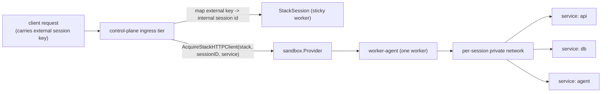
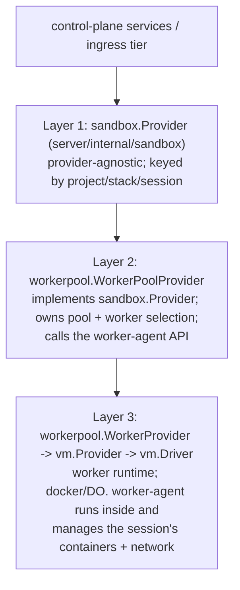
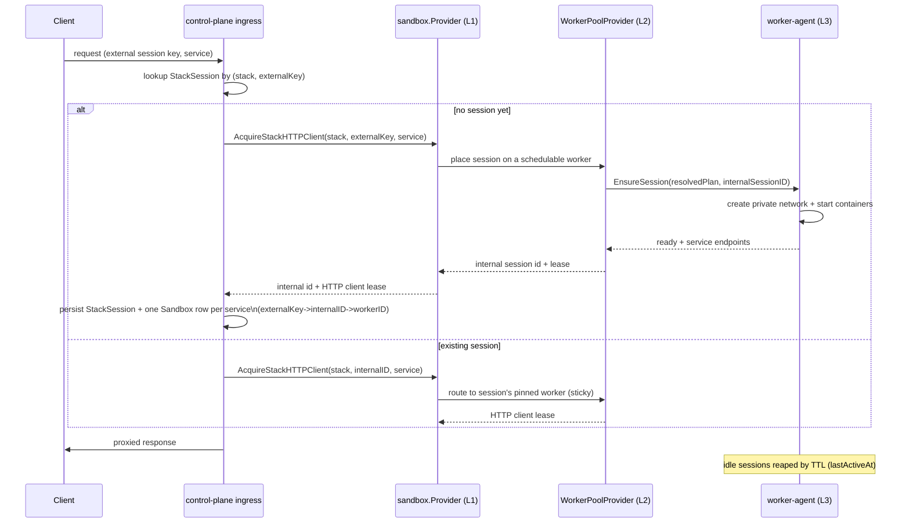
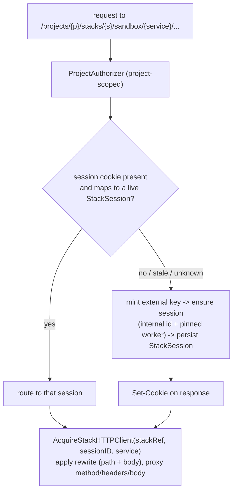

# Stacks (design proposal)

> Status: proposal. Not yet implemented. This doc captures the intended design so
> the layering and resource model are agreed before code lands.

## Concept

A **Stack** is a compose-like template that describes a set of sandboxes plus how
they connect and how ingress reaches them. A Stack is *deployed* to a sandbox
provider once. Thereafter the provider mints a **Session** per client-supplied
session key: each session is a private, isolated instance of the stack's
sandboxes, created on demand and torn down when idle.

The design goal is that all expensive, variable work is resolved at **deploy**
time so that creating a session is close to a set of container `start`
operations. A stack definition is intentionally close to "a list of sandbox
create requests" plus service wiring and ingress rules.



## Provider layering

Stacks are added to the existing three-layer provider stack. Getting the layer
boundaries right is the core of this design.



- **Layer 1 — `sandbox.Provider`.** The high-level, provider-agnostic contract.
  It gains stack operations (below). Services and the ingress tier talk only to
  this layer and never learn about workers, networks, or containers.
- **Layer 2 — `workerpool.WorkerPoolProvider`.** Implements `sandbox.Provider`.
  It owns worker-pool sizing, worker selection, capacity waits, and translating
  stack/session operations into worker-agent API calls. **A session is placed on
  exactly one worker here.**
- **Layer 3 — `WorkerProvider` -> `vm.Provider` -> `vm.Driver`.** The worker
  runtime. The worker-agent process inside a worker owns the per-session private
  network, DNS, and the container lifecycle. Because a session's containers must
  share one network, they must share one worker; therefore session mechanics live
  entirely inside a single worker-agent.

A stack-session is fundamentally a *worker-agent* concern: multiple containers on
one host joined to one private network. Non-worker-backed providers cannot host a
stack in any meaningful way, so `sandbox.Provider` stack methods are backed only
by the worker-pool provider. (See open question O1 on interface placement.)

## Ownership: persistence vs. lifecycle

The **core server owns persistence, authorization, and API shape**; providers own
runtime mechanics only. `Sandbox` rows in `server/internal/store` are the single
source of truth for the API. `sandbox.Provider` returns opaque `[]byte` runtime
state that the server persists; `Provider.List()`/`Get()` are the *observed*
runtime view, not the source of truth. Stacks must not move persistence into the
provider.

The design lever for ephemeral sessions is that **persistence is not the same as
reconciliation**. Session sandboxes are persisted rows (so they list and interact
through existing API surfaces) but their lifecycle is driven by the session, not
by the desired-state reconcile pipeline.

## Resource model

Three persisted, control-plane-owned resources.

| Resource | Persisted? | Lifecycle driven by | Purpose |
| --- | --- | --- | --- |
| `Stack` | yes | control plane | Template + resolved plan; deployed to a provider instance. |
| `StackSession` | yes (lightweight) | on-demand + TTL GC | `externalKey -> internalID` mapping, `OwnerUserID`, worker placement, `lastActiveAt`, status. Parent of the session's sandboxes. |
| session sandbox | yes (`Sandbox` row) | session ensure/reap (imperative), **not** the reconcile pipeline | One per service. Adds `StackID`, `SessionID`, `Service` columns to `Sandbox`. |

Session sandboxes are real `Sandbox` rows so that list, agent-terminals, exec, and
the HTTP port proxy work unchanged — they all key on a persisted, project-scoped
row and resolve the worker via `Sandbox.WorkerID`. What differs from a normal
sandbox:

- **Created imperatively during session ensure**, not through intent -> job ->
  reconcile. The worker-agent (provider) mints the runtime id per service and
  returns them; the server writes one `Sandbox` row per service, minting the
  external `Sandbox.ID` and storing the provider id in a `ProviderSandboxID`
  column. See [Identity](#identity).
- **No desired-state generation loop** (`restartGeneration`, per-container durable
  reconcile job). The worker-agent is the lifecycle authority; the server records
  observed status it reports back. The sandbox reconciler skips rows that belong to
  a session (e.g. non-null `SessionID`).
- **Reaped with the session.** Deleting/idling a `StackSession` cascade-deletes its
  sandbox rows.

This keeps the ownership rule intact: server owns the row, auth, and API; the
worker-agent owns runtime lifecycle and reports observed state. The only novelty is
*who triggers row creation* (session ensure) and *what drives lifecycle* (the
session, not a generation).

### Identity

Identity authority follows lifecycle authority: **the provider (worker-agent)
mints internal/runtime ids; the server owns external/API identity and the
mapping.** This mirrors the existing runtime view `sandbox.Sandbox`, which already
carries both a provider `ID` and the server `SandboxID`.

| Thing | External identity | Internal/runtime identity |
| --- | --- | --- |
| session | external session key, namespaced per `project`+`stack`. For the HTTP ingress tier the ingress mints it and carries it in a `HttpOnly` cookie; other ingress types may take a client-supplied key | provider-minted internal session id (resolves to worker placement) |
| session sandbox | server-minted `Sandbox.ID` (API-addressable, project-scoped) | provider-minted id, persisted in a new `ProviderSandboxID` column |

Consequences:

- On session ensure the worker-agent returns one entry per service, each with its
  minted runtime id. The server correlates them to rows by the **service name**
  (natural key `(sessionId, service)`), not by the minted ids, so writes/upserts
  are deterministic.
- Ensure must be **idempotent**: a retried ensure returns the same provider ids for
  the same `(stackId, sessionId)`, and the server upserts by `(sessionId, service)`
  so retries never duplicate rows.
- Interact operations (terminals, exec, HTTP proxy) resolve the row by
  `Sandbox.ID`, route to the session's worker via `Sandbox.WorkerID`, and address
  the container by `ProviderSandboxID` — the worker-agent recognizes its own id, so
  no server-id-to-container mapping is needed on the worker side.
- Rows appear only after ensure returns (the provider mints first). A "provisioning"
  placeholder row during slow cold start is out of scope for the first cut; if
  needed later, write a placeholder keyed by `(sessionId, service)` and backfill
  `ProviderSandboxID` on response.

### Stack definition

A `StackDefinition` is close to `[]worker-local sandbox-create request` plus:

- `service` name per sandbox — used as the network DNS alias for discovery.
- `dependsOn` / ordering hints for start.
- `ingress` — the ingress tier: a declared map of `logical service name -> { HTTP
  port, optional request-rewrite rules }` naming which services are externally
  addressable, on what port, and how to inject session/user identity into the
  upstream request (path template and/or JSON body sets). The first implementation
  is HTTP (see [HTTP ingress tier](#http-ingress-tier-first-implementation)).
- network / egress policy (defaults to isolated; see Networking).

Reuse the worker-agent sandbox-create DTO for each service rather than inventing a
parallel shape.

### External vs internal session id

The client supplies an **external session key** (arbitrary, untrusted, client-
controlled). It is never used directly as the internal handle:

- It is namespaced per `(project, stack)` so distinct clients/stacks cannot
  collide or guess each other's sessions.
- The **internal session id** is minted by the provider and returned to the
  control plane. It encodes/resolves to placement (which worker), enabling sticky
  routing.
- The control plane stores `externalKey -> internalID -> workerID` on the
  `StackSession` row. Clients only ever see the external key.

## Deploy-time resolution (the spine)

Deploy compiles a `Stack` into a frozen `ResolvedPlan`, reusing existing
resolve-up-front patterns in the codebase:

- flatten agent-config layered definitions into concrete argv/files;
- pin every `GitSource` to an immutable commit (no live remote resolution at
  session time);
- resolve images to digests;
- template env + mint sentinel placeholders for secrets (real values still
  resolved at the egress proxy per request — no secret handling on the session
  hot path).

Deploy then **pushes the resolved plan to workers** so each worker can pre-stage
what it can. This is a new push pattern (today workers pull individual sandbox
work): a per-worker reconcile ensures every stack for the worker's provider
instance is staged, including on workers that join later.

Per-worker pre-instantiation at deploy time (best effort — little is truly
possible):

- pull/stage service images (the largest cold-start cost);
- materialize a source template volume that sessions clone;
- pre-resolve config/files.

Session create is then: create the private network + start containers from staged
images + clone the source template. No control-plane round trips for resolution.

## Session lifecycle



- Cold start blocks the first request while the worker-agent starts containers, or
  returns a warming status; the ingress route handles the not-ready state.
- Idle GC: `lastActiveAt` on `StackSession` drives TTL reaping, mirroring the
  existing `Sandbox.LastActiveAt` field.
- If a session's worker dies, the session is gone; the next request re-mints it
  fresh on another worker (sessions are ephemeral, not durable state).

## Networking

Each **session** gets its own private container network.

- **Isolation:** sessions cannot reach each other's containers. Per-session
  networks give this for free; a shared network with per-container policy is
  explicitly rejected as more complex and more error-prone for a hard tenant
  boundary.
- **Service discovery:** container names/aliases are the stack service names, so
  `http://api`, `http://db` resolve within the session via the network's embedded
  DNS. DNS names are stack-relative, not session- or worker-relative.
- **CIDR / network-count management (implementation note):** the docker default
  address pool bounds concurrent networks. Configure `default-address-pools` with
  a large base and small block size (e.g. base `10.0.0.0/8`, size `/24`) so a
  worker can host thousands of session networks. Track a per-worker session/network
  cap; a worker near that cap reports `schedulable=false` so new sessions spill to
  another worker through the existing pull-based scheduler. Per-session networks
  scale to hundreds–low-thousands per host; beyond that, revisit (O2).

## Cross-worker scheduling and sticky sessions

- A **stack** is deployed to (staged on) all eligible workers of the provider
  instance.
- A **session** is scheduled onto exactly one schedulable worker at creation and
  pinned there. Placement is encoded in / resolvable from the internal session id.
- Subsequent requests for that external key resolve to the same internal id and
  therefore the same worker — sticky routing.
- When a worker fills (capacity, or network/CIDR cap), it stops being schedulable
  and **new** sessions land on another worker that already has the stack staged.
  Existing sessions stay put.

This reuses the existing pull-based worker model and the `ready`/`schedulable`/
`degraded` signals; the only addition is per-worker network capacity as an input
to `schedulable`.

## HTTP ingress tier (first implementation)

The ingress tier is a new control-plane component (distinct from the egress
`proxy` package, which handles outbound sandbox traffic + sentinel swap). The
first implementation is a cookie-driven HTTP proxy.

**Route** (hand-wired like the existing sandbox HTTP proxy; pluralization follows
the existing `/projects/{projectId}/sandboxes/...` convention):

```text
/projects/{projectId}/stacks/{stackId}/sandbox/{service}/{path...}
```

The URL addresses only **stack + logical service**. The **session is not in the
URL** — it is carried by a cookie the ingress tier owns. `{service}` resolves
against the stack's ingress map to a container HTTP port.

**Request handling:**



**Cookie management (owned entirely by the ingress tier):**

- **Value** = the opaque external session key; cryptographically random and
  unguessable (it is a bearer handle to the session).
- **Scope** = `Path=/projects/{projectId}/stacks/{stackId}/` so a browser returns
  it only for that stack's ingress subtree — one cookie per stack, no cross-stack
  collisions. Attributes: `HttpOnly`, `Secure`, `SameSite=Lax`, expiry aligned to
  session TTL.
- **Mint on absence.** No cookie -> new session -> `Set-Cookie`. A stale/unknown
  cookie is treated exactly like no cookie (mint fresh, overwrite), so browsers
  self-heal after a session is reaped.
- **Do not forward our cookie to the backend.** The ingress consumes and strips
  its own session cookie from the outbound `Cookie` header; the service never sees
  it. The app's own `Cookie` / `Set-Cookie` headers pass through untouched. These
  two cookie namespaces stay separate.

**Request rewriting (path + body).** The ingress owns the session via an opaque
cookie, so it must inject identity into the upstream request in whatever shape the
agent framework expects. ADK (verified) uses two conventions at once:

- path-based session management: `POST /apps/{app}/users/{user}/sessions/{session}`
  — all ids in the path;
- body-based execution: `POST /run` and `POST /run_sse` take
  `{ "appName", "userId", "sessionId", "newMessage" }` in the JSON body.

So an ingress service declares rewrite rules that place ingress-resolved variables
into either location:

```text
# path injection
pathTemplate: "/apps/{appName}/users/{userId}/sessions/{sessionId}/{path}"

# body injection (JSON selector sets)
body:
  - set "$.appName"   = "{appName}"
  - set "$.userId"    = "{userId}"
  - set "$.sessionId" = "{sessionId}"
```

Variables: `{sessionId}` (non-secret internal id), `{userId}` (owning principal),
`{appName}` (stack/ingress config), `{projectId}`, `{stackId}`, `{service}`,
`{path}` (suffix after the ingress prefix). No rule -> strip the ingress prefix and
pass `{path}` through unchanged.

Rewrite behavior:

- **Body rewriting buffers the (small) request body**, applies the JSON-selector
  sets, and forwards it. Injected values **overwrite** whatever the client sent —
  the ingress is authoritative for identity.
- **SSE responses stream through untouched.** Only the *request* body is mutated;
  `run_sse` streaming is unaffected.
- Selector *reading* (validate a client-sent id, or match a rule) uses the same
  selector mechanism; the first cut only needs *set*.
- Because ADK differs per route (path for session CRUD, body for run), rewrite is a
  **list of rules matched by incoming suffix + method**, each with its own path
  template and/or body sets (see O6).

**Security: never expose the cookie value.** `{sessionId}` is the **non-secret
internal session id** from the identity model — not the cookie's external key. The
cookie value is a bearer handle and must never be placed in a rewritten path, body,
header, query, or log. Only the non-secret internal session id and owning user id
are substituted into upstream requests.

**Cold start.** A first (no-cookie) request triggers session ensure, which may
block on container start. First cut: hold the request until ready with a timeout;
a warming response can come later.

**Authorization.** Project-scoped via `ProjectAuthorizer`, decidable from request
metadata before body interpretation, consistent with existing sandbox-proxy rules.
The cookie selects a session *within* an already-authorized (project, stack); it is
not the auth boundary.

**Session ownership.** Every ingress request under `/projects/{projectId}/...` has
an authenticated principal, so sessions are owned: `StackSession.OwnerUserID` is set
from the principal at mint time and surfaced as the `{userId}` rewrite variable. On
cookie reuse the session's `OwnerUserID` must match the current principal; a
mismatch is treated as no cookie (mint fresh), so a leaked cookie cannot be used by
a different project member. See O6 for what string to expose as `{userId}` and for
the unauthenticated public-traffic case.

## Interface additions

### `sandbox.Provider` (Layer 1)

Stack operations are added to the **core** `sandbox.Provider` interface (decided;
CLAUDE.md prefers required methods over optional interfaces, and every real
provider path is worker-backed). All implementations implement them; a
non-worker-backed provider, if one ever exists, returns a plain "stacks require a
worker-backed provider" error.

- `DeployStack(ctx, StackRef, ResolvedPlan) error` — idempotent deploy/stage.
- `RemoveStack(ctx, StackRef) error`.
- `AcquireStackHTTPClient(ctx, StackRef, sessionKey, service, scopes) (lease, internalSessionID, error)` —
  creates the session if needed, returns a lease to the target service.
- session sandboxes appear in the existing `List(ctx)` with stack/session/service
  metadata; `RemoveProject` also tears down stacks/sessions.

`StackRef` carries `ProjectID` + `StackID`, mirroring `SandboxRef`.

### Worker-agent API (Layer 3)

- `POST .../stacks` — deploy/stage a resolved plan (pull images, stage source
  template).
- `DELETE .../stacks/{stackId}` — remove staged plan + all its sessions.
- `POST .../stacks/{stackId}/sessions` — ensure a session: create private network,
  start containers, return internal id + service endpoints.
- `GET .../stacks/{stackId}/sessions` and `.../sandboxes` — list for `List()`.
- `DELETE .../stacks/{stackId}/sessions/{sessionId}` — tear down network +
  containers.
- per-worker reconcile: ensure all provider stacks are staged on this worker.

## Open questions

- **O1 — interface placement.** Decided: stack methods live on the core
  `sandbox.Provider` interface. See [Interface additions](#sandboxprovider-layer-1).
- **O2 — per-session network scaling.** Per-session networks are correct for the
  isolation requirement but cap out per host. Decide the per-worker session cap and
  whether a future mode (shared network + policy, or userns/netns tricks) is needed
  for high session density.
- **O3 — public app traffic (only if needed).** Settled for control-plane / agent
  traffic: path params address stack+service and a cookie carries the session (see
  [HTTP ingress tier](#http-ingress-tier-first-implementation)). It becomes an open
  question only if a stack must serve raw public app traffic (an end user hitting an
  exposed web app directly, not through the discobox API): that needs host-based
  routing (per-session subdomain + wildcard TLS) because a bare browser request
  carries neither the control-plane path nor a same-origin cookie. Tied to O4.
- **O4 — session vs. request lifetime.** Long-lived (per-user dev env, hours/days)
  vs. short (per-request, seconds/minutes) changes whether to warm-pool sessions or
  boot-on-first-request. Deploy-time staging helps both; warm session pools only
  pay off for short-lived, high-churn sessions.
- **O6 — user identity exposed to the agent.** What string to inject as `{userId}`:
  the raw discobox `User.ID`, the email, or a per-stack derived id that avoids
  leaking the global user id into the agent's own session store. Plus: what
  ownership means if a stack is ever served as unauthenticated public traffic (O3),
  where there is no discobox principal to own the session.
- **O7 — rewrite rule matching.** How ingress rules select per incoming route:
  match by path suffix + method (ADK: path shape for session CRUD, body for run).
  Also whether body rewriting stays set-only via JSON selectors or needs
  read/conditional selectors for validation. Start set-only.
- **O5 — event-stream volume.** Session sandboxes are persisted `Sandbox` rows, so
  list/interact is solved. Open: whether every session sandbox create/reap emits a
  project event (could be high-churn) or whether session churn is summarized at the
  `StackSession` level while still allowing per-sandbox reads.

## Non-goals

- No cross-worker session networking / overlay: a session is single-worker by
  construction.
- No durable desired-state reconcile per session container.
- No data migration / upgrade path (alpha; fresh install per CLAUDE.md).
