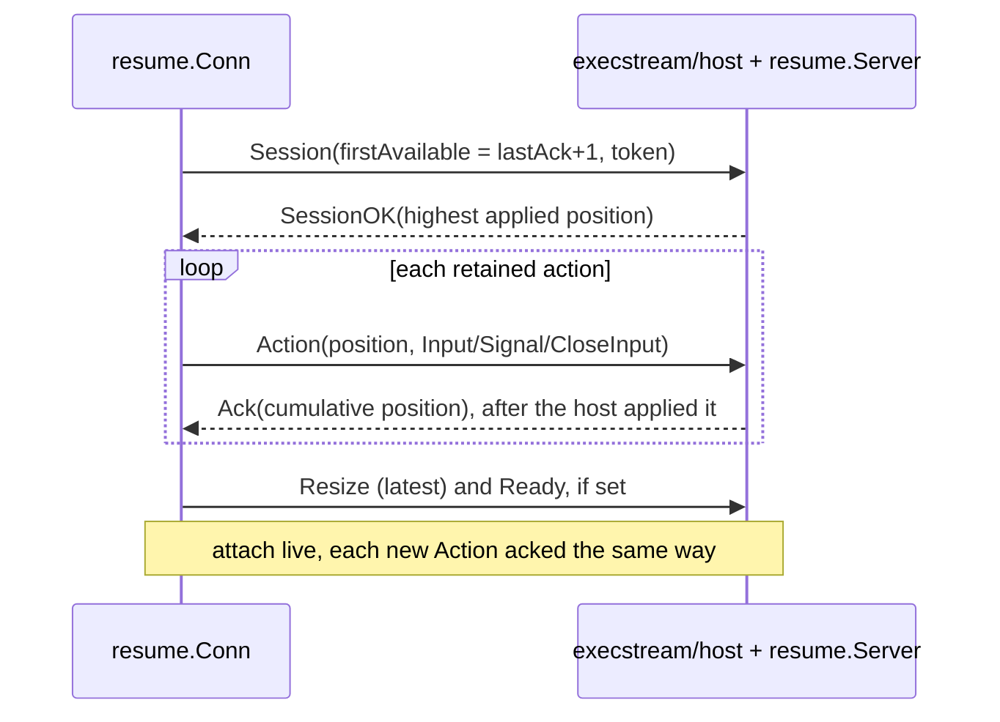

# Resumable Exec Stream

`resume` owns one logical exec attach across replaceable physical connections.
It retains positioned client actions until the host acknowledges applying them,
restores resize and readiness state after reconnect, emits connection and timing
events separately from terminal bytes, and exposes an opt-in per-action
profiling hook. It holds both halves: the client `Conn` (an `execstream.Conn`
decorator) and the host's `Server`/`Receiver`, which `execstream/host` uses.

## Protocol

The RSocket-resumption model: an opaque session token, monotonically
increasing action positions, cumulative host acknowledgement after apply, and
client retention of unacknowledged actions for retransmission.



- Frame classes (`WriteFrame`):
  - `Input`, `Signal`, `CloseInput` are actions: positioned, retained until
    acknowledged, retransmitted on the next connection.
  - `Resize` and `Ready` are unpositioned state: the latest resize is coalesced
    and both are re-sent after every re-establishment.
  - `Repaint` is unpositioned and not retained. A reconnect repaints on its own,
    so a held repaint would land behind that one.
- `Server.Accept` opens or resumes a session; `Receiver.Apply` applies each
  position at most once, serialized per logical session, so a retransmit after
  a lost `Ack` is deduplicated. The server keeps `MaxSessions` (64) session
  positions per hosted process and evicts the least-recently-used inactive
  one. Active sessions are never evicted.
- `Options.MaxPendingBytes` (default `DefaultMaxPendingBytes`, 256 KiB) bounds
  retained action bytes. `WriteFrame` blocks for space instead of dropping.
- A write accepted with no usable connection still succeeds. The action stays
  pending and a reconnect starts in the background.
- Reconnect: `Options.Dial` opens a replacement; nil makes the stream
  non-reconnecting, and a lost connection ends it. `Options.Done` is consulted
  before every redial so an ended process stops the loop. Backoff starts at
  100 ms and doubles to a 5 s cap. `Options.Event` receives
  `ConnectionReconnecting`/`ConnectionReconnected`, never mixed into terminal
  output.
- `ErrRejected` (the host lacks the state to resume safely) and `ErrProtocol`
  are terminal. Other establishment failures redial.
- An attach that never sends `Session` stays a plain direct attach. Once a
  session exists, the host rejects an unpositioned action frame.

## Timing Events

Enable timing observations with `Options.Timing`. With no observer, timing is
disabled: the stream does not run diagnostic heartbeats or take per-action
timestamps.

```go
timingEvents := make(chan resume.TimingEvent, 16)
conn, err := resume.New(ctx, physical, resume.Options{
	Dial: dial,
	Timing: resume.TimingOptions{
		Observe: func(event resume.TimingEvent) {
			select {
			case timingEvents <- event:
			default:
				// Diagnostics must never backpressure the terminal.
			}
		},
	},
})
```

The callback runs synchronously on the stream read/reconnect path for action
acknowledgements and on the heartbeat goroutine for physical probes. It must
return promptly and must not call the observed `Conn`. Consumers should hand
events to a buffered channel, atomic snapshot, or similarly non-blocking state
holder.

An attach must continuously drain `ReadFrame`. That is already true for normal
terminal sessions and is required both to process action acknowledgements and
to let the WebSocket implementation process pong control frames.

### Sources

`TimingHeartbeat` measures one native physical-transport probe. The CLI
WebSocket implementation uses ping/pong, so this covers the route from the CLI,
through the control-plane reverse proxy and pool transport, to the
sandbox-agent WebSocket endpoint. It does not enter the exec shim or the PTY.

- `RoundTrip` is the local monotonic elapsed time.
- `Err` reports a failed or timed-out probe.
- `Slow` is true on an error or when RTT reaches `SlowAfter`.
- Action metadata is zero because a heartbeat is not terminal input.
- A transport without `execstream.Prober` emits no heartbeat samples. Absence
  of that capability is not a probe failure.
- A result from a physical connection replaced while the probe was in flight is
  discarded because it does not describe the current attach.

`TimingActionAcknowledgement` measures from local acceptance of a positioned
action until the host acknowledges applying it. For `frame.Input`, the host
acknowledges only after the sandbox shim's write to the process PTY or stdin
returns.

- `Input()` distinguishes input delivery from signal and close-input actions.
- `Position`, `ActionType`, `PayloadBytes`, and `PendingBytes` describe the
  acknowledged action and remaining client backlog.
- RTT includes time disconnected and reconnecting when an action was accepted
  without a usable physical connection.
- An acknowledgement sample never sets `Err`; a terminal stream failure is
  reported through normal stream and connection events.

Defaults are a two-second heartbeat interval, a two-second heartbeat timeout,
and a 250 ms slow threshold. They are defaults, not a UI policy. A consumer
should retain the actual `RoundTrip` and may apply a different threshold.

## Delivery Positions

`Positions` implements `execstream.Delivery`: the last action position accepted
from the caller, and the last one the host acknowledged applying. A caller that
records the accepted position of one action can later ask whether the host has
caught up to it without retaining the action.

It is a state query, not a time series — unlike `TimingActionAcknowledgement`,
it costs nothing when nobody asks and stays meaningful with timing disabled. It
answers "did this reach the process?", which is the only thing that separates a
remote ignoring input from a stream swallowing it. `execstream/client` uses it
for exactly that: the local escape from an attach whose remote has stopped
answering.

## Action Observer

`WithObserver` attaches a profiling hook to the context a `Conn` is created
from. `TimingEvent` reports only the completed acknowledgement round-trip;
`ActionEvent` annotates each locally observable phase of a positioned action, so
a slow round-trip can be attributed to a layer instead of merely measured.

| Phase | Meaning |
| --- | --- |
| `ActionAccepted` | The action was assigned a position and retained. |
| `ActionPhysicalWrite` | The write to the current physical connection returned; `Duration` is that call. |
| `ActionRetransmitted` | The action was re-sent on a replacement connection after reconnect. |
| `ActionAcknowledged` | The host reported applying it. Match `Position` against the accept event for the apply round-trip. |

- Opt-in and independent of `Options.Timing`. With neither configured, normal
  terminal input pays no clock, allocation, or export cost per keystroke.
- A diagnostic annotation point, not wire protocol. Frames, positions, and
  acknowledgement behavior are identical whether or not an observer is
  installed.
- Callbacks run synchronously on the stream read, write, or reconnect path and
  never while the connection lock is held. The same promptness and no-reentry
  rules as `TimingOptions.Observe` apply.
- Prefer this over a span per keystroke. `test/performance/terminal-latency`
  uses it to get exact monotonic phase timestamps with no exporter; an
  OpenTelemetry adapter can aggregate the same events into histograms without
  changing any attach implementation.

## Interpreting Connection Status

Heartbeat and action-acknowledgement RTT answer different questions. Keep them
as separate time series and never average them into one latency value.

| Observation | What is known | Suggested status |
| --- | --- | --- |
| Heartbeat is slow or times out | The physical WebSocket/proxy path to the sandbox-agent is slow or unavailable. | `Connection slow` or `Connection lost`, with heartbeat RTT when available. |
| Heartbeat is healthy and input acknowledgement is slow | The network path reached the sandbox-agent promptly, but positioned input was delayed before the exec host applied it. | `Input delivery slow`, with acknowledgement RTT. |
| Both are slow | The physical path is already slow and may explain some or all input delay. | Prefer the connection warning; optionally show both RTT values in details. |
| Both are healthy and expected output is absent | Disco delivered input to the PTY promptly. The process may be busy, not reading, intentionally not echoing, or delayed by sandbox scheduling. | Connection is healthy. Do not claim that the application failed. |
| No recent input acknowledgement | There may simply have been no input. | Show heartbeat status only; absence of action samples is not a warning. |
| No heartbeat capability or samples are stale | Physical RTT is unknown. | Show `RTT —` or `Connection unknown`, not a healthy value. |
| Connection lifecycle says reconnecting | The current connection is unavailable regardless of its last sample. | Reconnecting/lost state overrides latency status. |

Terminal output is an opaque byte stream. The library cannot reliably correlate
an output frame with one keystroke: input may intentionally produce no output,
one input may trigger many frames, and background output may arrive without
input. Low heartbeat plus low input-delivery RTT can exonerate the attach path,
but cannot prove application responsiveness.

## UI Sampling Policy

A status UI should treat `Slow` as a sample classification, not immediately
toggle a persistent warning for every isolated spike. A reasonable initial
policy is:

1. Track the latest heartbeat and latest input acknowledgement independently.
2. Enter a slow state after two consecutive slow samples, or immediately on a
   heartbeat timeout or reconnecting event.
3. Clear a slow state after three consecutive healthy samples.
4. Treat heartbeat state as stale after three configured heartbeat intervals.
5. Use only events where `Input()` is true for the user-input delivery display.
6. Show the latest RTT in the compact status and expose both recent RTT series
   in diagnostic details.

These counts are presentation policy and may change without changing the stream
contract. Keep them outside this package.

## Telemetry

`TimingOptions.Observe` is also the integration point for metrics or OpenTelemetry.
An adapter must enqueue or aggregate without blocking the callback. Record
source, RTT, slow state, and a bounded error class; do not record input payloads
or use action position, exec ID, or sandbox ID as unbounded metric labels.

Timing probes are diagnostic only. A failed probe does not itself replace the
physical connection; WebSocket keepalive and the resumable stream's ordinary
read/write failures own liveness and reconnect behavior.
