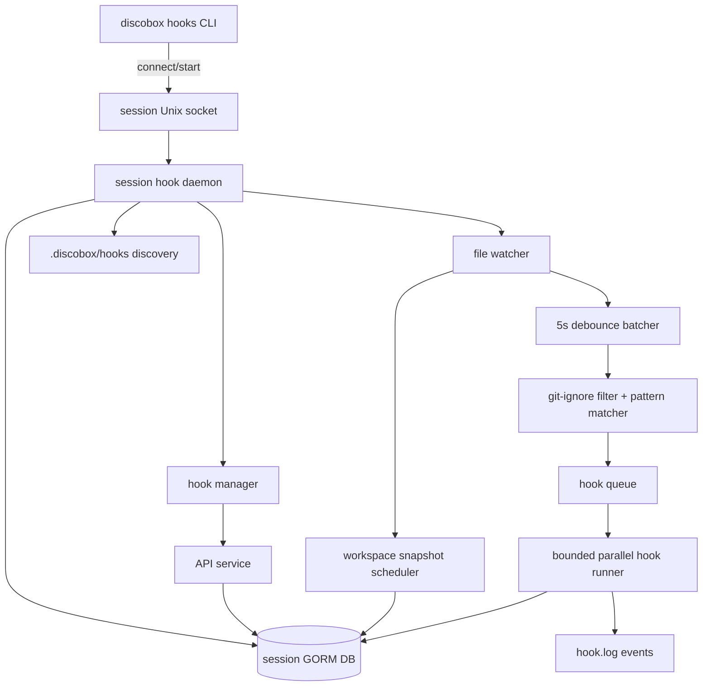

# Hooks Design

This module owns the standalone Discobox hook runner. It turns repository-local
hook definitions into session-scoped daemon work: watch file changes, batch them,
run matching hooks with bounded parallelism, and persist hook state through the common GORM DB
path.

## Scope

Hooks are defined at the Git repository root under `.discobox/hooks`. The runner
assumes it is operating inside a Git worktree and resolves the repository root
before discovery, watching, daemon startup, or pre-commit integration.

The module provides reusable hook primitives plus a CLI/daemon runtime. It must
not depend on server internals or control-plane DTOs. Server or CLI integrations
call public APIs exposed by this module.

## High-Level Architecture

Each session has at most one daemon, one Unix socket, one lock, and one default
SQLite database. CLI commands start the daemon on
demand when the session socket is absent, using a startup lock to avoid duplicate
daemons.

Only hook configuration lives in the Git repository. Runtime/session state must
use XDG-style paths outside the repo:

- hook definitions: `$GIT_ROOT/.discobox/hooks`
- database: `$XDG_STATE_HOME/discobox/session/<session>/hooks/<repo-key>/`, falling back to each platform's own state home — `~/.local/state` on Unix, `%LOCALAPPDATA%` on Windows (`statehome_unix.go`, `statehome_windows.go`)
- socket, startup lock, and runtime metadata: `$XDG_RUNTIME_DIR/discobox/session/<session>/hooks/<repo-key>/`, falling back to the state directory's `run` subdirectory

The session directory is the root namespace for all future session-scoped Discobox
state. Hooks use the repository key under that session so multiple repositories in
the same session do not share daemon state.

## Module Map

| Package/path | Ownership |
| --- | --- |
| root package | Public hook model and orchestration-facing types shared across subpackages. |
| [`models`](models/DESIGN.md) | GORM database models and storage-facing value types. |
| [`api`](api/DESIGN.md) | Unix-socket OpenAPI contract, generated API scaffolding, generated core-model aliases, request/response DTOs, and the audit event type catalog shared by daemon, manager, service, client, and CLI. |
| [`parser`](parser/DESIGN.md) | Hook file format, front matter parsing, discovery, validation, and metadata normalization. |
| [`matcher`](matcher/DESIGN.md) | Git-ignore filtering, glob matching, and changed-file-to-hook mapping. |
| [`watcher`](watcher/DESIGN.md) | Stable filesystem change detection from the Git root. |
| [`runner`](runner/DESIGN.md) | Single hook process execution, environment construction, timeout, and output capture. |
| [`processhelper`](processhelper/DESIGN.md) | Reusable self-reexec stdio helper for tying child process trees to parent liveness. |
| [`store`](store/DESIGN.md) | GORM-backed session persistence, migrations, statuses, queue, and run history. |
| [`service`](service/DESIGN.md) | API-level hook operations over store state and the manager-provided current hook set. |
| [`manager`](manager/DESIGN.md) | Hook-domain runtime state and API-triggered side effects between daemon socket adapters/runtime loops, service, and store. |
| [`daemon`](daemon/DESIGN.md) | Session process lifecycle, watcher/scheduler/runtime loops, bounded parallel queue draining, socket server, SSE transport, and idle shutdown. |
| [`client`](client/DESIGN.md) | Unix-socket client used by CLI and future integrations. |
| [`cmd/discobox-hooks`](cmd/discobox-hooks/DESIGN.md) | CLI entrypoint and on-demand daemon startup. |

`daemon` owns process lifecycle and transport adapters. It constructs `manager`
with the discovered hook set, store, session metadata, drain-loop wakeup callback,
and shutdown cancellation callback. API handlers call `manager`, not `service`
directly, so API-triggered pause/resume, manual runs, audit events, run wakeups,
and shutdown requests have one hook-domain coordination point. `manager` delegates
durable API-shaped reads and writes to `service`/`store`; daemon runtime loops
still own watching, matching, runner execution, snapshot scheduling, and SSE
transport.

## Hook Discovery

Discovery reads non-hidden files directly under `.discobox/hooks` and delegates
file-format details to [`parser/DESIGN.md`](parser/DESIGN.md). At this level, the
important contracts are:

- `.discobox/hooks` is repository-root relative.
- hook IDs are stable and filename-derived.
- file hooks must declare a changed-file `pattern`.
- supported hook types are `session`, `file`, and `pre-commit`.
- supported engines are `script`, `lsp`, compatibility `ai`, and reserved
  `builtin`.

The first implementation should execute command/script hooks only. Native AI hook
execution is intentionally out of scope; AI behavior should be prototyped with
script hooks that call tools such as Claude Code or Codex and exit non-zero when
feedback should block progress.

LSP hooks are file hooks whose script starts a language server over stdio. The
daemon owns the LSP client lifecycle: it starts the server lazily on the first
change matching the hook pattern, forwards file changes the server asks to watch
(falling back to all changes when the server registers no watchers), stores
published diagnostics as first-class current state, and updates the hook status
from diagnostics. LSP hooks do not run through the serial script queue.

## File Watching and Batching

The daemon watches the Git root, ignores `.git`, and ignores paths Git would
ignore. File changes with kind `created`, `modified`, or `deleted` are relevant
if their repository-relative path matches a hook pattern and is not excluded by
hook-specific or global hook ignore patterns.

Use a two-level stability model:

1. The filesystem watcher coalesces low-level editor/kernel noise into stable
   tree change batches.
2. The hook scheduler applies a five-second quiet-period debounce before matching
   hooks and enqueueing work.

If file changes keep arriving continuously, add a maximum batch window before
running a batch so hook execution cannot be starved forever.

## Execution Semantics

Hooks run with daemon-configured bounded parallelism. The default limit is three
in-flight script hooks per session; additional eligible hooks remain in queued
state until a slot opens. The hook queue is deterministic, and the daemon never
starts two concurrent runs for the same hook ID. Hooks with a non-empty `phase`
may be enqueued by file changes, but the daemon does not auto-run them until a
run request explicitly targets them. Phase names are free-form lowercase
identifiers declared in hook files; `all` is reserved for selectors. The CLI
resolves `run` selectors to hook IDs and requests each run individually:
explicit hook IDs always target their hook regardless of phase, while the `all`
ID selector (or an omitted ID list) expands within the phase scope — no
`--phase` selects unphased hooks, `--phase <p1>,<p2>` selects hooks in those
phases, and `--phase all` selects every hook. `run` without at least one phase
or ID selector is an error. The daemon decides per hook whether a requested run
executes: without `--force` it skips hooks that already succeeded, already ran,
or are currently running; `--force` re-runs them with their last run's inputs.
Session hooks do not run during daemon startup; use the
CLI's session-hook run mode to trigger session hooks for the current session.
Failed hooks block future queued hook launches until the failure is resolved by
a later matching change, a manual run, pausing/skipping that hook, or clearing
queued state; hooks already in flight may finish.

Each hook run receives a stable environment. Prefer `DISCOBOX_` names for public
contract variables, including at least:

- `DISCOBOX_SESSION_ID`
- `DISCOBOX_REPO_ROOT`
- `DISCOBOX_WORKSPACE`
- `DISCOBOX_HOOK_ID`
- `DISCOBOX_HOOK_NAME`
- `DISCOBOX_HOOK_TYPE`
- `DISCOBOX_HOOK_PATH`
- `DISCOBOX_HOOK_PATTERN`
- `DISCOBOX_HOOK_RUN_ID`
- `DISCOBOX_CHANGED_FILES`
- `DISCOBOX_CHANGED_FILES_JSON`
- `DISCOBOX_DB_PATH`
- `DISCOBOX_SOCKET_PATH`

Persist hook output as line-oriented database log rows for each run. Each output
line should also emit a `hook.log` event so live watchers can stream output from
the daemon audit/event feed. Persist every observed file change as a database row
with its base commit and per-file Git diff; hook invocations link to those change
record IDs instead of writing payload files under the state directory.

Workspace snapshots are persisted separately from hook inputs. They use a
snapshot quiet period plus a minimum capture interval, run asynchronously, and
must not block file batching or hook execution. Snapshot capture builds a
temporary Git index from `HEAD`, selectively adds tracked and untracked
non-ignored files up to the configured size cap, records omitted paths, writes a
full tree, and stores tree metadata plus base-commit and parent-snapshot patch
bytes in the database instead of creating Git refs. If a file change arrives
while capture is running, the daemon marks snapshot state dirty and schedules
another capture after the current one completes.

## Persistence

Use the shared `gormdb` opener for database access. Default to a session-scoped
SQLite database; keep the schema compatible with other GORM-supported backends
where practical.

Generated hook store row IDs must use the root `id` package's lowercase ULID
strings, matching the server database convention. Fixed singleton or natural
keys, such as hook IDs and daemon state keys, may remain non-generated strings.

The daemon owns writes to the session DB. CLI commands communicate with the
daemon over the session Unix socket rather than mutating SQLite directly.
Read-only commands may use daemon APIs so status reflects in-memory scheduling
state consistently.

Persist these concepts:

- discovered hook definitions and config hash
- current per-hook status (`idle`, `queued`, `running`, `success`, `failure`)
- hook run history
- current LSP diagnostics by hook and document
- hook queue with accumulated changed files
- workspace snapshot history with captured patch metadata and explicit omissions
- daemon/session metadata needed for status and idle shutdown

## Daemon Lifecycle

CLI commands resolve Git root and session ID, compute session paths, and connect
to the Unix socket. If the socket is unavailable, the CLI acquires a startup
lock, starts the daemon detached, waits for readiness, and retries the command.

The daemon exits after a 30-minute idle timeout when there are no active client
requests, no running hook, no queued hook, no pending/running snapshot, and no
file changes within the idle window. `daemon --idle-timeout` overrides the
window; a negative value disables idle shutdown.

## Pre-Commit Integration

Pre-commit hooks should be represented in discovery, but installation should be
explicit. Prefer a generated Git hook that calls the Discobox hooks CLI/daemon
instead of duplicating status updates in shell.

Pre-commit design must account for session identity because Git hooks are
repository-level while this daemon is session-scoped.
