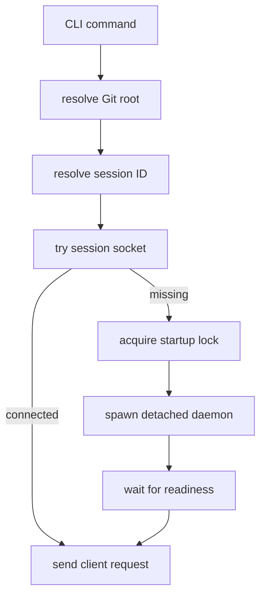

# Discobox Hooks CLI Design

The `discobox-hooks` command is the user-facing entrypoint for the hooks module.
It resolves session context, starts the daemon on demand, and forwards commands
to the session daemon over the client package.

## Responsibilities

- Resolve the Git repository root.
- Resolve or accept the session ID.
- Compute session paths for socket, lock, DB, and runtime metadata.
- Start the daemon on demand when the socket is absent.
- Use a startup lock to avoid duplicate daemon processes.
- Wait for daemon readiness before sending commands.
- Expose commands for daemon status/control, hook listing, run, pause/resume,
  output, events, queue/run/change/snapshot inspection, daemon shutdown, and
  pre-commit integration.

## Path Layout

The CLI keeps hook configuration and runtime state separate:

- configuration is repository-local at `$GIT_ROOT/.discobox/hooks`
- durable session state is under `$XDG_STATE_HOME/discobox/session/<session>/hooks/<repo-key>/`
- socket, lock, and runtime metadata are under `$XDG_RUNTIME_DIR/discobox/session/<session>/hooks/<repo-key>/`

If `XDG_STATE_HOME` is unset, use `~/.local/state`. If `XDG_RUNTIME_DIR` is
unset, use a `run` directory under the state root. Never place the session DB,
socket, lock, or hook output under the repository's `.discobox/hooks` directory.

## Startup Flow

## Commands

Initial command surface:

- `daemon`: run foreground daemon for tests/debugging.
- `daemon status`: show hook daemon status summary.
- `daemon shutdown`: ask the daemon to exit.
- `ls` / `list`: list discovered hooks and their state.
- `run [--session] [--phase PHASE] [--force] [all|hook-id ...]`: request hook
  runs. Without hook IDs, `run` means queued/failed unphased hooks plus the
  default `review` phase; `--phase PHASE` means queued/failed unphased hooks
  plus that phase. `all` is still queued/failed only unless `--force` is set.
  `--force` expands the target set to every matching hook. Explicit phase-hook
  IDs must include the matching `--phase`. `--session all` narrows targets to
  session hooks.
- `pause` / `resume`: global execution control.
- `pause <hook-id>` / `resume <hook-id>`: per-hook execution control.
- `output [all|hook-id ...]`: print captured output for each selected hook's
  latest run. With no arguments or `all`, expand to every discovered hook;
  multiple hooks are formatted with per-hook headers.
- `db runs [hook-id]`: list hook run history through the daemon API.
- `db changes`: list observed file changes and captured diff metadata through
  the daemon API.
- `db snapshots`: list workspace snapshots through the daemon API.
- `db queue`: list queued hook work through the daemon API.
- `events [-f|--follow] [all|hook-id]`: list audit events or follow the daemon's
  SSE event stream; follow mode supports all events or one hook filter.
- `events --list-types`: print every known audit event type and its description
  without contacting the daemon.
- `install-pre-commit`: install Git pre-commit integration when implemented.

## Daemon Replacement

Before sending a normal command, the CLI calls daemon `PingInfo`. If the daemon's
reported numeric version is older than the current client build version, the CLI
asks the daemon to shut down, waits for the socket to become unavailable, and
then starts the current executable as the new daemon under the startup lock.

Development builds derive the client/daemon version from the executable mtime,
which is the Unix epoch of the last local build. Release builds may inject an
explicit numeric version with Go linker flags.

## Daemonization

Use a conservative detach strategy:

1. Acquire the session startup lock.
2. Recheck socket readiness.
3. Start the daemon process with explicit session arguments.
4. Wait for a readiness response with timeout.
5. Release lock.

Avoid silently starting multiple daemons for the same session.

## Non-Responsibilities

- Do not implement hook scheduling.
- Do not execute hooks directly except for an explicit debug mode, if one is ever
  added.
- Do not read or write the store directly for normal commands; expose state
  through daemon API endpoints and the typed client.
