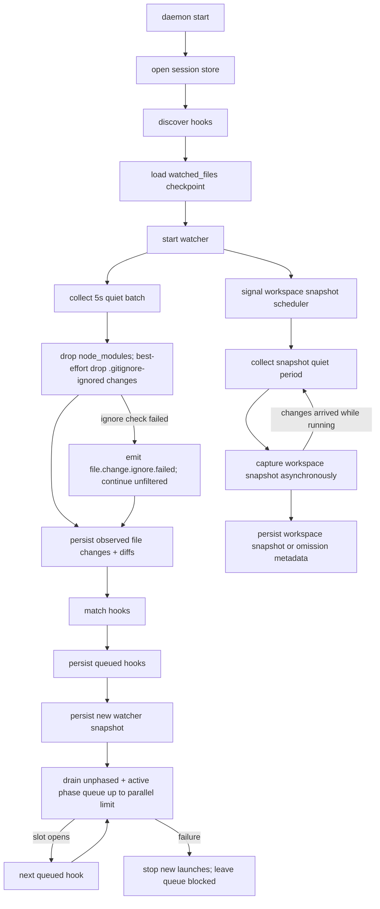

# Daemon Design

The daemon package owns the long-lived session process. It composes discovery,
watching, matching, persistence, execution, and the local socket API into one
session-scoped runtime.

## Responsibilities

- Resolve and validate session configuration supplied by the CLI.
- Open the session store.
- Discover `.discobox/hooks` definitions and refresh stored definitions.
- Leave session hooks idle until an explicit run request.
- Start the watcher and collect watcher batches.
- Apply the five-second hook scheduling debounce.
- Call matcher to enqueue affected hooks.
- Drain the hook queue through runner with daemon-configured bounded parallelism.
- Stop launching new queued hooks after a failed hook while allowing in-flight
  hooks to finish.
- Start and update LSP hook language servers, persist their diagnostics, and map
  diagnostics to hook status without passing them through the serial script
  queue.
- Schedule workspace snapshots on a separate, slower debounce without blocking
  watcher batching, hook queueing, or hook execution.
- Serve the Unix socket API for CLI/client commands through the generated
  OpenAPI server adapter, mapping generated request/response objects to the hook
  `manager` and API-oriented `service` operations.
- Track idle state and shut down after the idle timeout.

## Runtime Flow

## Bounded Parallel Execution Policy

The daemon runs up to `MaxParallelHooks` script hooks at a time per session. The
default limit is three. Additional eligible hooks stay queued until a running
hook finishes and opens a slot. The daemon must not start two concurrent runs
for the same hook ID; if a hook is re-queued while it is running, that queued row
waits while other eligible hooks may use open slots.

A failure blocks future queued hook launches. The daemon may continue to watch
files and merge new changed files into queued state while blocked. Hooks that
were already in flight when the failure happened may finish, but the daemon must
not start more queued work past the failure unless a command or policy explicitly
pauses, clears, or runs the failed hook successfully.

Hooks with `phase` set are queue-gated. File changes may enqueue them, but
`NextPending` selection excludes them until the manager activates that phase from
a phase-targeted run request. The daemon clears active phases after no eligible
queued hook remains so later file changes do not keep auto-running phase hooks.

Changed-file inputs are consumed at run start and persisted on the run row. When
a hook fails, the next run for that hook must include the failed run's changed
files plus any newer changed files. Once a hook succeeds, later file-triggered
runs start from only newly observed changes. Forced manual runs intentionally
copy the latest run inputs even after success.

LSP hooks are exempt from the serial queue. The language server starts lazily on
the first change matching the hook pattern; until then the hook stays `idle`. An
explicit run request (`run <lsp-id>`) also activates an idle server, seeding it
with the working-tree files matching the hook pattern, and refreshes a running
one instead of enqueuing script work.
Once running, the daemon opens pattern-matching documents (`didOpen`/`didChange`/
`didSave`) so the server publishes diagnostics for them, and forwards
`workspace/didChangeWatchedFiles` for the files the server registered watchers
for via `client/registerCapability` (all changes when it registered none). This
is what lets an edit to `go.mod` reload the module graph and clear stale
diagnostics on unrelated `.go` files. Published diagnostics are stored as current
diagnostic rows. Current diagnostics at or above the hook's configured minimum
severity set the hook status to `failure`; no retained diagnostics set the hook
status to `success`.

## Daemon Session Lifecycle

Each daemon process inserts one `daemon_sessions` row at startup and emits a
matching `daemon.started` audit event. The daemon updates `last_heartbeat` about
every 15 seconds. On graceful shutdown, it sets `ended_at`, records an
`end_reason`, and emits `daemon.shutdown`.

Startup is also the recovery point for missed daemon exits. Before inserting the
new row, the daemon marks any prior unended row for the same session as ended at
that row's last heartbeat and emits `daemon.terminated`. This records that file
watch events may have been missed between the last heartbeat and the new startup.

## Ignore Policy

The watcher always prunes `.git` and `node_modules` directory trees. Before the
daemon records observed changes or matches hooks, it also attempts to drop paths
ignored by Git ignore rules from `.gitignore` and related Git ignore sources.
That Git ignore filtering is best-effort: if the Git ignore check fails, the
daemon emits `file.change.ignore.failed` with the repo root, candidate change
count, and error, then continues with the unfiltered candidate changes rather
than dropping the whole watcher batch. This fail-open behavior preserves hook
responsiveness when Git ignore evaluation is temporarily unavailable, but it
means ignored paths may be recorded and matched for that batch.

The matcher performs the same Git ignore check as a final safety net before hook
pattern matching. If both daemon-level and matcher-level ignore checks fail, the
batch may enqueue hooks for paths that would otherwise have been ignored; the
audit event is the operator signal that the daemon ran fail-open.

## Watch Snapshot Checkpoint

The daemon persists the watcher's full post-diff snapshot in `watched_files`.
On first startup with no checkpoint, `HEAD` is the baseline: a clean worktree
schedules nothing, while modified, deleted, staged, and untracked files are
queued as the initial change batch. The daemon records the current watcher
snapshot immediately only when that initial worktree is clean. If initial changes
exist, it advances the checkpoint only after those changes have been durably
recorded and matching hooks have been enqueued.

On later restarts, the daemon seeds the watcher with the persisted snapshot so
the first resync can detect created, modified, and deleted files that changed
while the daemon was stopped. For watcher batches that contain changes, the
daemon replaces the checkpoint with the batch's new full snapshot only after
observed changes and queued hook work are durable. Batches with no semantic
changes may update the checkpoint immediately.

## Workspace Snapshot Scheduling

Workspace snapshots are separate from hook changed-file inputs. The daemon
requests a snapshot whenever it observes a relevant file-change batch, but
capture uses its own `SnapshotDebounce` quiet period and
`SnapshotMinInterval` rate limit so hooks remain responsive and the database
does not get a snapshot row for every editor write.

Snapshot capture must not run on the hook batching goroutine. The daemon owns a
single snapshot scheduler with three pieces of state:

- `snapshotPending`: a snapshot has been requested and is waiting for the
  snapshot debounce and rate-limit gate.
- `snapshotRunning`: a capture is currently building and storing a snapshot.
- `snapshotDirty`: file changes arrived while `snapshotRunning` was true.

When a request arrives and no snapshot is running, the scheduler starts or
resets the snapshot debounce, but never schedules a capture before the minimum
interval since the previous capture start has elapsed. The default quiet period
is 15 seconds and the default minimum capture interval is one minute. When a
request arrives during capture, it marks the scheduler dirty instead of starting
an overlapping capture. After capture finishes, the scheduler checks the dirty
flag; if it was set, it schedules another debounced and rate-limited capture so
long-running snapshots cannot miss later changes.

Capture builds a temporary Git index from `HEAD`, selectively adds tracked and
untracked non-ignored paths that are within the configured file-size cap, writes
a full tree, and persists snapshot metadata and patch bytes to
`workspace_snapshots` only when the resulting tree differs from the latest stored
snapshot. It records omitted paths, such as oversized or unsupported files, in
the snapshot payload. The daemon emits `workspace.snapshot.created` and
`workspace.snapshot.failed` audit events for successful and failed capture
attempts.

Snapshot capture temporary files live under the session runtime directory, not
the process-global OS temp root. Daemon startup removes and recreates that
session temp directory before any capture can run, so stale temporary indexes or
object directories from a crashed daemon are scoped to and cleaned by the next
daemon for the same session/repository.

## State Files

Changed-file payloads, observed changes, hook logs, audit events, queue state,
workspace snapshots, and watcher checkpoints are database state. Do not write
per-run changed-file JSON payload files under the session state directory.
Only short-lived snapshot Git indexes/object directories may be written under
the session runtime temp directory.

## Audit Events

`hook_events` is a global audit stream, not just an index into normalized state.
When the daemon records an audit event, include enough duplicated details for the
event to be understood on its own. File-change audit events duplicate the
observed change path, kind, base commit, diff, timestamp, and row ID in event
details; hook enqueue events duplicate the changed-file list as well as observed
change IDs.

Ignore filtering failures are audited with `file.change.ignore.failed`. That
event means the daemon failed to evaluate Git ignore rules for a watcher batch
and intentionally continued fail-open with the candidate changes it had, so
subsequent observed-change or enqueue events from the same batch may include
paths Git would normally ignore.

The canonical event type and `details` field catalog lives in
`hooks/api.KnownEventTypes`. Production event emitters in daemon, manager, and
store code should populate the required fields documented there so
`discobox-hooks events --list-types` stays useful as an operator reference.

`GET /events` returns a bounded JSON snapshot newest first. `GET /events/stream`
keeps the Unix-socket HTTP request open as Server-Sent Events and polls the store
once per second for events after the last sent cursor. Each SSE message includes
the event row ID as `id`, the audit type as `event`, and the full JSON `api.Event`
as `data`; reconnecting clients may resume with `Last-Event-ID`.

## Session Hooks

Session hooks are manual-only. They remain idle after discovery until the CLI or
client explicitly requests `run --session all` or a specific session hook run.
The default run path skips hooks that already succeeded unless the request is
forced.

## Socket API Ownership

The daemon owns the server side of the Unix socket. The API should support at
least:

- ping/readiness
- status
- list hooks
- pause/resume all hooks
- pause/resume one hook
- run hook
- hook output lookup/download
- graceful shutdown

Use the generated `hooks/api/gen` server as the route, request-decoding, and
response-encoding boundary for ordinary JSON endpoints. The daemon adapter may
convert through `hooks/api` DTOs while service boundaries still use those types.
Keep `GET /events/stream` hand-wired when necessary to preserve streaming flush
semantics; it must still follow the OpenAPI path and payload contract. Do not
define transport DTOs in daemon handlers.

## Idle Shutdown

The idle window is `Config.IdleTimeout`, defaulting to 30 minutes. A negative
value disables idle shutdown for daemons meant to run until stopped explicitly;
because zero selects the default, an auto-started daemon always has the timeout
armed.

Idle means:

- no active socket request
- no running hook
- no queued hook eligible to run
- no pending or running workspace snapshot
- no recent watcher batch within the idle window

On idle shutdown, close watcher resources, close the socket, close DB pools, and
exit cleanly. File changes made after shutdown are recovered on the next daemon
start by diffing the current tree against the persisted `watched_files`
checkpoint.

## Non-Responsibilities

- Do not define the on-disk hook file format; use parser.
- Do not implement OS file watching; use watcher.
- Do not execute processes directly; use runner.
- Do not let CLI code mutate DB state outside daemon APIs.
