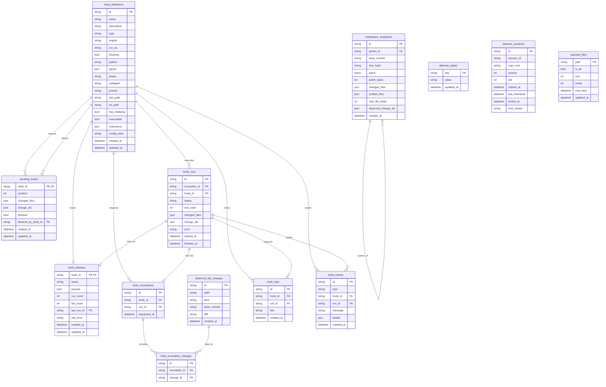

# Models Design

`models` contains the hooks database models used by the GORM store.

## Responsibilities

- Define exported GORM structs for all hook-owned tables.
- Own table names, GORM tags, and model lifecycle hooks such as generated IDs.
- Provide storage-facing value types used inside persisted JSON columns, such as
  changed files and run results.
- Stay independent from daemon HTTP handlers and client transport concerns.

## API Reuse Policy

API responses may reuse a database model from this package when the database
shape is already the intended API contract. If an endpoint needs projection,
redaction, compatibility behavior, or a shape that combines multiple tables,
define that response DTO in `hooks/api` instead.

## Schema ERD

## Table Purposes

`hook_definitions` stores the current discovered hook metadata from
`.discobox/hooks`, including parser-normalized execution settings and the config
hash used to detect definition changes.

`hook_statuses` stores the latest durable scheduler state for each hook,
including pause state, run/failure counters, last run ID, and last error.

`pending_hooks` stores the serial queue. Each row represents one queued hook with
its current position, accumulated changed files, observed change IDs, and any
blocked-by relationship.

`hook_runs` stores hook execution history. It records the run status, process
exit code, consumed changed-file payload, error text, and start/finish times.

`hook_invocations` stores one invocation attempt linked to a hook and run. It is
the stable parent for the observed-change join rows used as that invocation's
inputs.

`observed_file_changes` stores every daemon-observed file change that was
durably processed, including repository-relative path, change kind, base commit,
and best-effort per-file diff.

`workspace_snapshots` stores whole-workspace snapshot history. Rows are
append-only and hold database-owned patch data plus structured summaries of
captured and omitted paths. The parent ID links snapshots into a linear history
per session DB; the tree hash is used to avoid duplicate rows for identical
workspace state.

`hook_invocation_changes` stores the many-to-many join between hook invocations
and observed file changes, preserving the exact change records used as hook
inputs.

`hook_logs` stores line-oriented hook output for each run.

`hook_events` stores the global audit trail for daemon, file, queue, hook,
snapshot, and API actions.

`daemon_sessions` stores daemon process lifetimes. Startup closes any previously
unended row for the same session at its last heartbeat, emits
`daemon.terminated`, then inserts a new row and emits `daemon.started`.
Graceful shutdown sets `ended_at` and emits `daemon.shutdown`; the running daemon
updates `last_heartbeat` periodically.

`daemon_states` stores singleton daemon key/value state, such as global pause
state, that is not tied to a specific hook run or queue item.

`watched_files` stores the daemon's latest full watcher snapshot. It is not tied
to hook definitions; it is a restart checkpoint used to diff the current
repository state after idle daemon shutdown.

`hook_events` is the global audit trail. Event details should intentionally
duplicate the important facts from source tables when needed so an audit reader
can understand what happened without joining through ephemeral queue or history
state. For example, `file.change.observed` duplicates observed change path, kind,
base commit, diff, timestamp, and row ID even though the full row also exists in
`observed_file_changes`.
