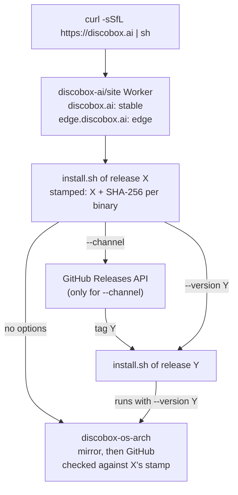

# installer

The scripts that install the discobox CLI — `install.sh` for sh and
`install.ps1` for PowerShell — and `Stamp`, which turns these source copies into
the ones a release uploads. The decision and the alternatives rejected are
[ADR 0110](../docs/adr/0110-the-install-script-is-a-release-asset-and-a-channel-names-which-one-runs.md).

## Shape

- **A stamped installer installs exactly its own release.** Every other request
  — a pinned version, a channel — is resolved to a tag and handed to the
  installer *that* release uploaded, run with `--version <tag>`. The code
  installing a release is always the code it shipped, and every digest checked
  is one that release stamped. The unstamped source copy only ever hands over.
- **Stamping** replaces four marker lines (`release=`, `checksums=`,
  `$release = ''`, `$checksums = @{}`). `Stamp` validates every value against a
  pattern that cannot close a quote in either language, and requires each marker
  exactly once. `internal/cmd/discobox-installers` is its one caller, run by
  `release:installers` over the CLI binaries `release:publish` uploads.
- **Channels** are resolved by the script from one unauthenticated Releases API
  request, never on the default path: `stable` is the newest non-prerelease,
  `latest` the newest `vMAJOR.MINOR.PATCH`, and `edge` the newer (by version
  core, stable winning a tie) of the newest stable release and the newest
  prerelease. Only `v[0-9]*` tags count.
- **Downloads** try `assets.discobox.ai/discobox/<tag>/` and then the GitHub
  release URL, moving on when a source is missing or its bytes miss the digest
  (ADR 0106).
- **The server is not part of the install.** Both scripts close by saying what
  the Homebrew formula's caveats say: the CLI fetches the server it was cut
  against on first use, checked against digests it carries (ADR 0099).
  `--stage` / `-Stage` does that download here instead. It is opt-in because it
  is the heaviest download we serve, and a failed stage is a failed run that
  says the CLI installed anyway.

## Rules

- `install.sh` and `install.ps1` are one installer in two languages: same
  options, environment variables, precedence (a flag beats the environment, a
  version beats a channel), channel rules, and refusals. Change them together.
- The channel rules are written three times — here in both scripts, in the
  Homebrew tap's `update-formula.yml` (`stable`, `latest`), and in the site
  Worker (`edge`, from the mirror's two aliases). A change to one is a change to
  all of them.
- Everything runs inside `main` / `Install-Discobox`, called on the last line:
  a truncated download runs nothing, and `iex` leaves no preference behind.
  `install.ps1` never calls `exit`, which would close the caller's session.
- Both scripts are ASCII, asserted by `TestScriptsAreASCII`: Windows PowerShell
  5.1 reads a file with no byte order mark in the ANSI code page, so one em dash
  in a comment — the punctuation the rest of this repository's prose is written
  with — would make `install.ps1` unreadable to half its Windows users.
  `install.sh` is POSIX sh with BSD-compatible `sed` and `awk`, since macOS runs
  it; `install.ps1` runs under 5.1 and 7.
- A handed-over installer that is not stamped for the tag it was asked for
  stops (`DISCOBOX_INSTALL_DELEGATED`) rather than handing over again.
- The API is parsed without jq, relying on each release carrying one
  `tag_name` and one `prerelease`, in either order, and on escaped quotes
  keeping release notes from matching. Pairing cannot see a release boundary,
  so a key the patterns missed would pair one release's tag with the next
  one's flag and misreport every release after it — a prerelease installed as
  the stable channel, with nothing erroring. The counts of the two keys are
  compared before pairing for exactly that: unequal means an answer this cannot
  read, and it refuses rather than installing something else.

## How it looks

Both scripts draw the TUI's mark and use its palette
(`cli/internal/tui/theme.go`), on the terms the TUI itself applies:

- **The mark is shading, not line art.** A terminal that cannot color it gets
  none of it rather than a monochrome smear — the same rule as `newLogo`. It
  needs 256 colors, a UTF-8 terminal, and 29 columns.
- **The art is generated**, never hand-copied, by
  `internal/cmd/discobox-installer-logo` from `cli/internal/tui/logo.json`:
  24-bit and nearest-xterm-256 variants, since neither script has lipgloss to
  downsample for it. `go generate ./installer` writes it between the
  `BEGIN generated logo` markers, so `task verify` fails on drift.
- **Both files stay ASCII.** sh carries the art as octal escapes for
  `printf %b`; PowerShell carries it as base64 it decodes at run time. The two
  decode to the same bytes, and a test asserts both.
- **Styling is off unless it is wanted.** A pipe, a redirected stream, a
  console with no virtual terminal sequences, `TERM=dumb`, and `NO_COLOR` all
  give plain sentences; `CLICOLOR_FORCE` or `FORCE_COLOR` turns it back on. The
  unstyled text is the same sentence, so nothing reads only in color.
- **Neither script writes its messages into a pipeline.** `install.sh` sends
  them to stderr, leaving stdout to whatever a caller is piping. `install.ps1`
  uses `Write-Host`, which goes to the host rather than down the pipeline —
  `2>` does not capture it, and `irm | iex` is unaffected either way.

## Tests

`installer_test.go` runs the real scripts against a fake mirror, release URL,
and Releases API, installing fake CLIs built from `testdata/fakediscobox`.
`install.ps1` runs under every PowerShell found: `pwsh` from the Nix shell
everywhere, and Windows PowerShell 5.1 as well on the Windows runner.
`DISCOBOX_INSTALL_SOURCES` and `DISCOBOX_INSTALL_API` are what point a script
at the fake; they are also how a private mirror would.
