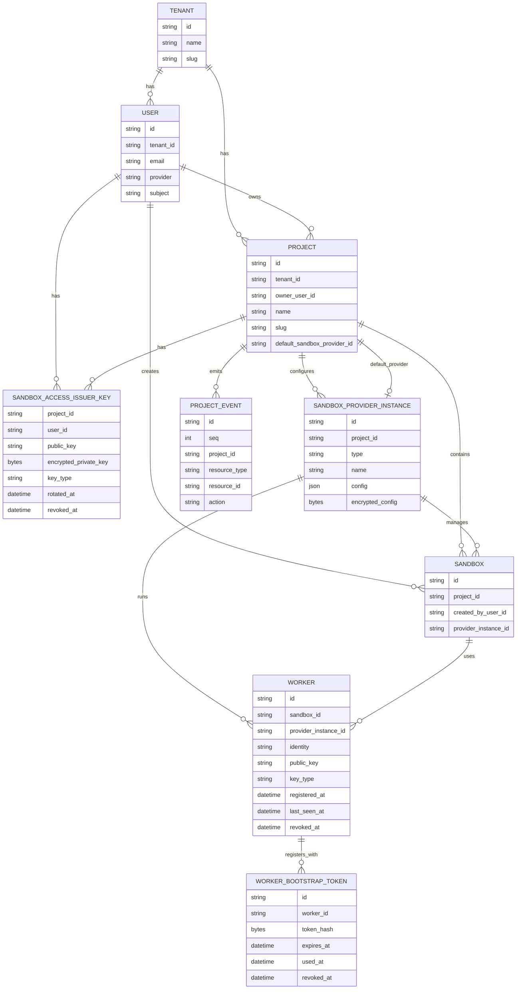

# Model Design

This package contains the current persisted/API model. Today the Go structs carry
both GORM persistence tags and JSON/Huma API-facing tags.

## Core Entities

| Entity | Description |
| --- | --- |
| `Tenant` | Planned top-level boundary for users, projects, and their resources. |
| `User` | Authenticated person. Belongs to a tenant, owns projects, and creates sandboxes. |
| `Project` | Tenant-scoped group for sandboxes, provider configuration, and project events. |
| `Sandbox` | Main managed runtime/session resource. Belongs to a project and is orchestrated. |
| `SandboxProviderInstance` | Project-scoped provider configuration for creating and managing sandboxes. |
| `Worker` | Planned provider-backed runtime worker for launching sandboxes. Has its own identity and public key; private key stays on the worker. |
| `WorkerBootstrapToken` | Planned short-lived, one-time token used by a new worker to register its public key. |
| `WorkerAuthToken` | Planned short-lived runtime token issued after the worker proves possession of its private key; may be stateless. |
| `SandboxAccessIssuerKey` | Design-level name for the current `ProjectUserKey`: per-project, per-user issuer key used by the control plane to sign sandbox access tokens. |
| `ProjectEvent` | Append-only project-scoped resource event for list/watch sync and replay. |

## Shared Lifecycle Shape

Orchestrated resources embed `ResourceLifecycle`.

Current/proposed orchestrated resources:

- `Sandbox`
- `Worker`

Lifecycle fields include:

- `desiredState`: requested steady state.
- `phase`: observed user-facing state.
- `activeOperation`: current queued/running operation.
- `lastOperationStatus`: pending, running, success, or failed.
- `generation`: latest accepted intent.
- `observedGeneration`: latest reconciled generation.

## Relationship Sketch

Auth flows are documented in `internal/sandboxauth/DESIGN.md`.
