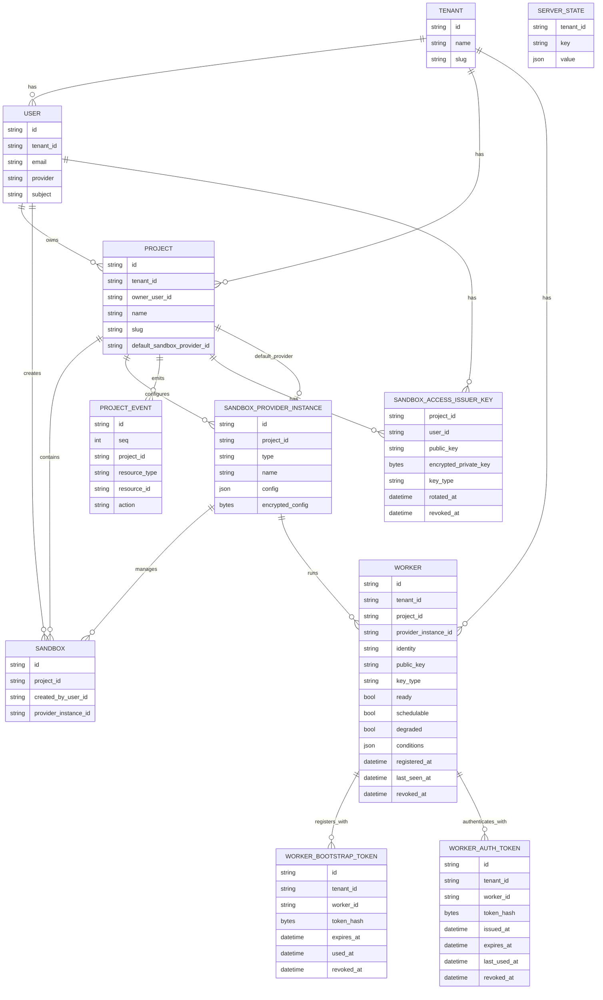

# Model Design

This package contains the current persisted/API model. Today the Go structs carry
both GORM persistence tags and JSON/Huma API-facing tags.

## Core Entities

| Entity | Description |
| --- | --- |
| `Tenant` | Planned top-level boundary for users, projects, and their resources. |
| `User` | Authenticated person. Belongs to a tenant, owns projects, and creates sandboxes. |
| `Project` | Tenant-scoped group for sandboxes, provider configuration, and project events. |
| `ServerState` | Tenant-scoped generic key/value state for server preferences and one-time initialization flags. |
| `Sandbox` | Main managed runtime/session resource. Belongs to a project and is orchestrated. |
| `SandboxProviderInstance` | Project-scoped provider configuration for creating and managing sandboxes. |
| `Worker` | Provider-backed runtime worker for launching sandboxes. Has its own identity and public key; private key stays on the worker. Prewarmed workers belong to a provider instance/pool and can host many sandboxes. Scheduling uses `ready`, `schedulable`, and `degraded` columns; detailed condition data is opaque JSON for display. |
| `WorkerBootstrapToken` | Planned short-lived, one-time token used by a new worker to register its public key. |
| `WorkerAuthToken` | Planned short-lived runtime token issued after the worker proves possession of its private key; may be stateless. |
| `SandboxAccessIssuerKey` | Design-level name for the current `ProjectUserKey`: per-project, per-user issuer key used by the control plane to sign sandbox access tokens. |
| `ProjectEvent` | Append-only project-scoped resource event for list/watch sync and replay. |

## Persistence Scope

Models are split by database/schema scope:

- Global scope: `Tenant`, `User`.
- Tenant scope: `Project`, `Sandbox`, `SandboxProviderInstance`, `Worker`,
  `ServerState`, worker tokens, sandbox access issuer keys, project events, and
  tenant-local orchestration tables.

Tenant-scoped rows still carry `tenant_id` and user ID columns so tokens,
events, and audit records are self-describing. Those columns are shard
boundaries and references to global identities; they are not foreign keys from
tenant databases back into the global schema.

Tenant-local schemas must still define primary keys and unique indexes as if all
tenants could share one physical database/table set. The Postgres driver may
collapse global and all tenant-local data into the same physical database, so
tenant-scoped uniqueness must include a tenant boundary whenever the value is
only unique within one tenant. For project-scoped rows, `project_id` is a
sufficient boundary because projects are tenant-scoped; for tenant-level rows,
use `tenant_id`.

## Shared Lifecycle Shape

Orchestrated resources embed `ResourceLifecycle`.

Current/proposed orchestrated resources:

- `Sandbox`
- `Worker`

Lifecycle fields include:

- `desiredState`: requested steady state.
- `phase`: observed user-facing state.
- `activeOperation`: current queued/running operation.
- `lastOperationStatus`: pending, running, success, or failed.
- `generation`: latest accepted intent.
- `observedGeneration`: latest reconciled generation.

## Relationship Sketch

Auth flows are documented in `internal/sandboxauth/DESIGN.md`.

Tenant database resolution is documented in `internal/database/DESIGN.md`.

## Worker Scheduling Status

Workers report three scheduling-relevant booleans directly on the worker row:

- `ready`: the worker agent/runtime is healthy.
- `schedulable`: the worker is willing to pull new sandbox work.
- `degraded`: the worker can still accept fallback work but should not be
  preferred.

Any richer Kubernetes-style conditions or pressure details are stored as an
opaque `conditions` JSON blob for display and diagnostics. The control plane
does not interpret that blob for scheduling.

The worker decides when local compute/storage/memory pressure should change
`schedulable` or `degraded`. The control plane uses a coarse preference:

- preferred: `ready=true`, `schedulable=true`, `degraded=false`.
- degraded: `ready=true`, `schedulable=true`, `degraded=true`.
- unavailable: not ready, not schedulable, drained, deleted, or revoked.
