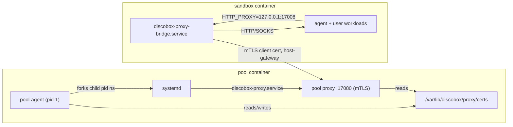

# Pool Agent Design

This module owns the in-guest pool agent process.

The pool agent owns and reads pool bootstrap metadata, authenticates to the
control plane, reports pool health/capacity, and runs the local pool runtime
plumbing needed by provider backends. It also owns the pool-local sandbox
operations HTTP server for sandboxes hosted on that pool. That API is distinct
from the future in-sandbox `sandbox-agent` API.

## Package Map

| Package/path | Ownership |
| --- | --- |
| `api/openapi` | Pool-agent-owned OpenAPI contracts, including the canonical pool-local sandbox operations API. |
| `api/gen` | Generated pool-local sandbox operations client/server scaffold. |
| `api/model` | Generated stable aliases for pool-local sandbox operation schema types. |
| `cmd/discobox-pool-agent` | Pool agent binary entrypoint. |
| `cmd/discobox-vsock-guest` | Local-VM guest services: VSOCK-to-Docker byte splice and orderly shutdown endpoint. |
| `.` | Root `poolagent` Go package: boot contract, registration flow, status reporting, and high-level command orchestration. |
| `server` | Pool-local HTTP server, health/metadata endpoints, and generated sandbox API route/auth adapter. |
| `vsock` | Guest AF_VSOCK listener and host-CID HTTP transport primitives. |
| `sandboxruntime` | Local sandbox runtime implementations used by the pool host server. Provisions the five primary volumes (`/.discobox/{data,cache,config,sources,secrets}`) and mounts them into every sandbox; `cache` is the pool-local directory shared across the pool's sandboxes. Also binds each clone-delivered local source's real origin directory, read-only, onto `/.discobox/origins/<slug>` (ADR 0026). In-sandbox path wiring for the primary volumes is delegated to the sandbox-agent init flow (ADR 0007). |
| `proxyagent` | Worker-scoped proxy wiring: certificate bundle preparation, the `proxy` subcommand entrypoint, and per-sandbox client material staging. |
| `systemd` | Linux/systemd namespace startup and child reaping helpers, with non-Linux stubs. |

## Startup Flow

1. The VM receives bootstrap settings from cloud-init, kernel command-line args,
   or environment variables.
2. The pool agent reads the settings into its `poolagent.Bootstrap`
   contract.
3. The agent generates or loads an Ed25519 pool agent keypair.
4. The agent registers with the control plane using project ID, sandbox ID,
   bootstrap token, and public key; the control plane derives the pool host ID from
   the sandbox assignment.
5. The control plane validates the bootstrap token against the sandbox-assigned
   pool, stores the pool host public key, and returns a short-lived runtime auth
   token.
6. The pool host uses the runtime token for work subscription and status updates.

After registration, the pool host periodically reports scheduling status and local
pressure details. It sets `ready`, `schedulable`, and `degraded` booleans for
control-plane scheduling. Richer pressure/condition details can be sent as an
opaque JSON blob for display.

## Sandbox State Channel

The agent is the only component that can see whether a sandbox is running, so it
says so on its own schedule rather than in reply to anything (ADR 0017 §10). The
control plane holds no opinion about power state and never asks for one.

Two deliveries, both load-bearing:

- **Deltas**, from the Docker event stream — `start`, `die`, `stop`, `destroy`.
  Watching only `destroy` is what once let a whole pool of dead containers go on
  being reported as running: a container that stops and stays put emits nothing
  else.
- **A complete sync**, on agent start and on an interval, listing every sandbox
  this agent hosts. A dropped delta heals at the next sync, where a delta-only
  channel drifts permanently the first time a post fails. A sandbox the control
  plane believes is here and that the sync omits has no container.

Batches carry the agent's boot ID and a per-boot sequence, so a delayed delta
cannot overwrite a newer sync. The interval's arrival doubles as pool liveness.

`starting` and `stopping` are published by the power operations themselves
(`sandboxruntime/power.go`): by the time a Docker event arrives the transition
is over, and a state nobody can report is a state that does not exist. The
channel deliberately has no `failed` — an exited container looks the same
whether it was stopped on purpose or died, so failure is a judgement about an
operation rather than something the runtime can observe.

Power operations (`start`, `stop`, `restart`) answer with acceptance only, and
serialise per sandbox on one mutex. That is also what makes on-demand start safe:
sandbox-directed routes — the HTTP proxy, the sandbox-agent proxy, and the Git
proxy — start a stopped sandbox before proxying (`server/autostart.go`), and ten
concurrent requests produce one start. Control operations never auto-start.

Archived sandboxes are exempt from that latch and fail those routes with 409.
`archive` and `delete` take the same per-sandbox mutex, and both answer only once
the work is done rather than accepting it: each is a destructive act on state
only this agent can see, and for `delete` the control plane removes its row on
the strength of the response (ADR 0022 §§3, 5-6).

- `archive` removes the container and the sandbox's proxy material, keeps
  `data/config/secrets/sources`, and writes a `.discobox-archived` marker.
- `delete` removes all of it, including the durable tree, and confirms.
- `create` clears the marker, which is the whole of what unarchiving needs here:
  the reuse-the-existing-tree path already restores the sandbox.

The marker is what makes retained data legible as retained. On disk an archived
sandbox and one whose container was lost out of band are the same shape, and
only the marker separates "held by intent" from "garbage awaiting the reaper".

The runtime rebuilds any container whose recorded spec fingerprint no longer
matches the one the control plane sent, which covers image upgrades and every
other spec change through one comparison (ADR 0017 §5). A container carrying no
fingerprint label predates that label; it is compared against the pinned image
digest instead, so a missing label never reads as "converged".

Separately, persisted per-sandbox proxy material supplies a periodic
level-triggered sweep that reclaims the material of sandboxes that no longer
have a container here. That is only about reclaiming disk; sandbox loss travels
on the state channel.

The runtime reaps its own dead sandboxes' persistent volume trees
(`pools/{pool_id}/sandboxes/{sandbox_id}`) on the same backstop, keeping each for
a 24h retention window after it is first seen dead (a tombstone starts the
clock). That window is accident recovery — a container removed out of band or
lost while the pool was down — and covers only what never runs through
`delete`. Archived trees are skipped entirely: deliberate retention is a
control-plane policy with a per-project length the agent does not know, enforced
by an explicit `delete` when it expires (ADR 0022 §4).

All per-sandbox state is project- and pool-scoped by path — sandbox
volume trees live under `projects/{project_id}/pools/{pool_id}/` and proxy
material under `proxy/projects/{project_id}/pools/{pool_id}/` — so agents
sharing a host daemon never reap each other's data. Both trees carry the same
scoping because a reaper's scan must not be wider than the authority it is
given (see `pool-sync` below); the shared per-host CA material and client
certificates stay outside them, keyed by globally unique sandbox ID.

`pool-sync` (scope `pool:sync`) is how a shared host daemon reclaims *whole*
orphaned pools, which no single pool agent can do alone (it dies with its pool).
The control plane POSTs the authoritative set of known pool IDs; the agent reaps
the agent-created footprint — sandbox containers and the
`projects/{project_id}/pools/{X}` / `proxy/projects/{project_id}/pools/{X}`
subtrees — of any other pool it observes. It is a no-op where each pool has its
own isolated daemon.

The known set is every pool in the project, across provider instances, because
it is the authority for a reaper that scans project-scoped trees: a set narrower
than the tree reports live pools as orphans, and a tree wider than the set (a
host-global one) puts other projects' live pools in reach. Keeping the two in
step is also what makes the reaper's "no data subtree means this proxy material
is a regenerable leftover, delete it now" shortcut sound — that inference only
holds while both trees cover the same set of pools.

## Worker-Local HTTP Server

After registration, the pool agent runs an HTTP server for provider runtime
operations against sandboxes hosted on that pool. The logical route shape is:

```text
/api/project/{project_id}/pool/{pool_id}/...
```

The generic VM provider reaches this server through a VM-driver-provided HTTP
client lease. Callers use the logical base URL `https://pool`; individual
drivers may rewrite that URL to localhost, a Unix socket, container networking,
private VM networking, or a temporary tunnel. The Docker driver does not need to
serve HTTPS when the rewritten endpoint is localhost-only.

The local libkrun provider injects an AF_VSOCK listener, so the pool agent opens
no TCP listener in that VM. Outbound registration, status, removal reporting,
and proxy secret resolution use an HTTP transport that dials host CID 2. HTTP
routes and authentication are identical across TCP and VSOCK transports.

The pool agent must reject requests whose `{project_id}` or `{pool_id}` do
not match its bootstrap identity. It must also reject sandbox operation requests
without a short-lived PASETO v4.public bearer token signed by the control-plane
key supplied in bootstrap metadata. Tokens are audience-bound to `pool-agent`,
carry `project_id`, `pool_id`, optional `sandbox_id`, and scopes, and generated
API operations must authorize against those scopes. Sandbox operation handlers
under this route own only local runtime work; control-plane persistence, user
authorization, project events, and desired-state orchestration remain outside
this module.

## Worker Proxy Integration

The pool host runs the pool host-scoped proxy (root `proxy` package) so all sandbox
egress is intercepted, recorded, and policy-controlled.



- `proxyagent` prepares the CA bundle and pool server certificate before
  systemd boots, so the `discobox-proxy.service` unit and per-sandbox client
  certificates share one CA without a first-generation race. Both processes see
  the same `/var/lib/discobox/proxy` files because the child systemd namespace
  shares the container filesystem content.
- The proxy binds `0.0.0.0:17080`; sandboxes reach it through a
  `discobox-pool-proxy:host-gateway` entry so the mTLS `ServerName` check stays
  valid regardless of the runtime gateway IP.
- `sandboxruntime.CreateSandbox` issues a per-sandbox client certificate
  (client ID = sandbox ID, the proxy tenant boundary), mounts the public CAs and
  that sandbox's keypair (read-only) nested inside the config volume at
  `/.discobox/config/proxy`, and injects the `HTTP(S)_PROXY`/CA environment into
  both the container and the sandbox manifest so `sandbox-agent`-spawned
  terminals and execs are proxied. The sandbox-agent's PID-1 init recursively
  rebinds the config volume onto `/etc/discobox`, so the proxy material lands at
  its documented `/etc/discobox/proxy` path.
- The pool host provisions five host-backed primary volumes and mounts them at
  `/.discobox/{data,cache,config,sources,secrets}`; it no longer decides
  in-sandbox paths (home, `/var/lib/docker`, source targets). `data`, `config`,
  `sources`, and `secrets` are per-sandbox; `cache` is shared across the pool's
  sandboxes in this project. The durable host layout is
  `/var/lib/discobox/projects/{project}/pools/{pool}/sandboxes/{sandbox}/{data,config,sources,secrets}`;
  disposable shared cache lives independently at
  `/var/lib/discobox/cache/projects/{project}/pools/{pool}/cache`.
  The sandbox-agent wires everything else from the image's declarative volume
  list and the manifest source list. See ADR 0007.
- For every source (primary or `SourceCodeReferences`) that is clone-delivered
  from a `LocalDirectory`, the pool host also binds that real host directory,
  read-only, directly onto `/.discobox/origins/<slug>` — the same `<slug>` as
  the corresponding `/.discobox/sources/<slug>`. Unlike the five primary roots,
  this is not one pool-owned volume: each origin is an independent bind of an
  arbitrary external directory the pool host does not own or provision, so
  there is nothing here for the sandbox-agent to rebind or for the pool host to
  reap. `materializeGitSource` rewrites the cloned repository's `origin` remote
  to that in-sandbox path once materialized, so a sandbox can `git fetch`/`git
  rebase` against the developer's real, live working directory whenever it
  shares a host with the pool. Push-delivered sources are unaffected: they are
  push-delivered precisely because no on-disk origin is reachable from this
  host. See ADR 0026.
- Normalize provider-owned source destination defaults before both mounting
  sources and writing the public sandbox manifest so manifest consumers observe
  the paths actually used by the runtime.
- A source is materialized exactly once, whatever its delivery mode. The first
  create clones (or parks an empty repository for a push delivery and finalizes
  it on the resume) and records a marker in the repository's `.git`; every later
  create returns without touching the workspace. Create is re-driven for reasons
  unrelated to sources — resume, re-pin, reconcile after a failure — and by then
  the sandbox owns the workspace, so re-materializing would discard uncommitted
  work and move the branch off commits made inside the sandbox.
- Forward the sandbox user; never complete it. The pool host cannot resolve a
  sandbox's account or group — both live in the image, and `boot` may still have
  to create them — so it publishes exactly what `config.user` gave and leaves the
  rest unset. No `gid = uid`, no `uid = 1000` for a bare name, and no root when
  the request named nobody: an omitted user means the image's own account
  ([ADR 0025](../docs/adr/0025-the-sandbox-user-is-one-contract-resolved-inside-the-sandbox.md)
  §§4–5). `DISCOBOX_USER_*` is stamped only for what is known, so `boot` can tell
  "unset" from "uid 0", and an unknown id is passed to `chown` as `-1` (omitted
  from the spec) rather than guessed at. The home directory is wired by the
  sandbox-agent from the `data` volume against the `%HOME%`/`%UID%`/`%GID%`
  tokens, which resolve inside the sandbox.
- Keep harness behavior opaque. The pool host transports only selected harness
  identity, `harnessMode`, and the non-secret project file overlay. Commands and
  the project harness catalog are image-owned and never interpreted here.
- MITM CA trust is split by how tools find roots: the sandbox
  `discobox-trust-ca.service` runs `update-ca-certificates` early in boot so the
  system bundle (curl, git, wget, OpenSSL, and the `SSL_CERT_FILE` /
  `REQUESTS_CA_BUNDLE` env for Python) trusts the MITM CA alongside real roots;
  Node.js and Claude Code use `NODE_EXTRA_CA_CERTS` pointed at the mounted MITM
  CA because they ship their own root store.
- The in-sandbox forwarder is the dependency-light `proxy/bridge` package, run by
  the `sandbox-agent proxy-bridge` subcommand as `discobox-proxy-bridge.service`.
  It forwards local plaintext proxy traffic to the pool host proxy over mTLS.
- Sentinel secret swapping is not yet wired: the proxy runs with a nil resolver,
  so it records and forwards traffic but does not substitute secrets.

## Sandbox Image Identity

`sandboxruntime` resolves and pulls sandbox images, so it is where a sandbox's
image pin is enforced (ADR 0016). The create request carries `image` (what to
pull) and `imageDigest` (the config digest it must resolve to).

- `resolveSandboxImage` returns the **image ID to launch**, preferring a pinned
  image already on the host over whatever the tag names now. Launching the
  reference instead would let a rebuilt tag change a sandbox underneath its
  user. If the pin is absent and the reference now resolves to something else,
  it fails naming both digests rather than starting the wrong image.
- `containerImageDrifted` replaces an existing container built from a different
  image. Only a pinned request can drift: the control plane changes the digest
  only when it has decided to upgrade, so this rule needs no policy flag.
- `imageMatchesPin` is the single comparison behind both, so they cannot
  disagree about what the pinned image is. An empty pin matches anything.

A replacement preserves the power state it found (ADR 0021 §3). `CreateSandbox`
takes the sandbox's power lock, records whether the container it is about to
replace was running, stops it the way a stop would, and starts the replacement
only if that container was running or the request asked for a first-create
start. `Start` in a create request is first-create intent, never a desired power
state for a sandbox that already exists, so the two inputs can only add a start.
An upgrade therefore restarts a running sandbox into its new image and never
powers a stopped one on.

Replacing a container makes it vanish, which `WatchSandboxRemovals` reports to
the control plane. The report names the container that was removed
(`Actor.ID`), which is what lets the control plane recognise a report about an
already-replaced container as stale and ignore it (ADR 0016 §8). This module
therefore needs no suppression and no in-flight bookkeeping of its own — it
reports what it saw, and identity does the rest.

Policy lives in the control plane; this module only enforces the identity it is
handed.

## Boundary Rules

- Keep pool boot metadata in the root `poolagent` package; providers should
  consume that contract instead of defining provider-local boot metadata.
- Generate pool-local sandbox operation client/server code from the canonical
  `pool-agent/api/openapi/pool.yaml` contract into
  `pool-agent/api/gen`, with schema aliases in `pool-agent/api/model`. Do
  not generate these pool-local routes from the root `api/openapi/sandbox.yaml`;
  that YAML is itself generated from `api/openapi/server.yaml` for the
  in-sandbox agent API.
- Build the pool-agent image from the repository root with
  `docker build -f pool-agent/Dockerfile ... .` so the Dockerfile can copy
  root support packages without vendoring them.
- Do not import server internals or provider implementation packages.
- Keep future in-sandbox agent API implementation code in the `sandbox-agent`
  module; pool-local provider operation routes and their generated server
  adapter belong under `server`.
