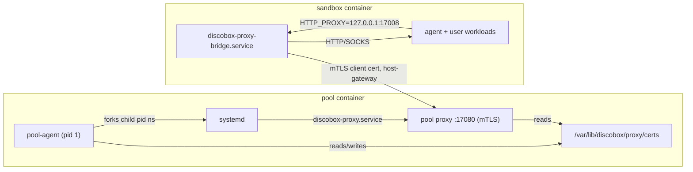

# Pool Agent Design

This module owns the in-guest pool agent process.

The pool agent owns and reads pool bootstrap metadata, authenticates to the
control plane, reports pool health/capacity, and runs the local pool runtime
plumbing needed by provider backends. It also owns the pool-local sandbox
operations HTTP server for sandboxes hosted on that pool. That API is distinct
from the future in-sandbox `sandbox-agent` API.

## Package Map

| Package/path | Ownership |
| --- | --- |
| `api/openapi` | Pool-agent-owned OpenAPI contracts, including the canonical pool-local sandbox operations API. |
| `api/gen` | Generated pool-local sandbox operations client/server scaffold. |
| `api/model` | Generated stable aliases for pool-local sandbox operation schema types. |
| `cmd/discobox-pool-agent` | Pool agent binary entrypoint. |
| `.` | Root `poolagent` Go package: boot contract, registration flow, status reporting, and high-level command orchestration. |
| `server` | Pool-local HTTP server, health/metadata endpoints, and generated sandbox API route/auth adapter. |
| `sandboxruntime` | Local sandbox runtime implementations used by the pool host server. Provisions the four primary volumes (`/.discobox/{data,cache,config,sources}`) and mounts them into every sandbox; `cache` is the pool-local directory shared across the pool's sandboxes. In-sandbox path wiring is delegated to the sandbox-agent init flow (ADR 0007). |
| `proxyagent` | Worker-scoped proxy wiring: certificate bundle preparation, the `proxy` subcommand entrypoint, and per-sandbox client material staging. |
| `systemd` | Linux/systemd namespace startup and child reaping helpers, with non-Linux stubs. |

## Startup Flow

1. The VM receives bootstrap settings from cloud-init, kernel command-line args,
   or environment variables.
2. The pool agent reads the settings into its `poolagent.Bootstrap`
   contract.
3. The agent generates or loads an Ed25519 pool agent keypair.
4. The agent registers with the control plane using project ID, sandbox ID,
   bootstrap token, and public key; the control plane derives the pool host ID from
   the sandbox assignment.
5. The control plane validates the bootstrap token against the sandbox-assigned
   pool, stores the pool host public key, and returns a short-lived runtime auth
   token.
6. The pool host uses the runtime token for work subscription and status updates.

After registration, the pool host periodically reports scheduling status and local
pressure details. It sets `ready`, `schedulable`, and `degraded` booleans for
control-plane scheduling. Richer pressure/condition details can be sent as an
opaque JSON blob for display.

The Docker sandbox runtime also watches managed-container destroy events. When
a sandbox container is removed outside the pool host API, the pool host reports the
sandbox ID through the authenticated control-plane pool route
`/api/pools/{pool_id}/sandbox-removed` and retries until accepted. Persisted
per-sandbox proxy material supplies the periodic level-triggered backstop for
removals that happened while the pool host was down; the material is reclaimed
only after the report succeeds.

The runtime reaps its own dead sandboxes' persistent volume trees
(`pools/{pool_id}/sandboxes/{sandbox_id}`) on the same backstop, keeping each for
a 24h retention window after it is first seen dead (a tombstone starts the
clock). All per-sandbox state is pool-scoped by path — sandbox volume trees and
proxy material both live under `pools/{pool_id}/` — so pool agents sharing a
host daemon never reap each other's data.

`pool-sync` (scope `pool:sync`) is how a shared host daemon reclaims *whole*
orphaned pools, which no single pool agent can do alone (it dies with its pool).
The control plane POSTs the authoritative set of known pool IDs; the agent reaps
the agent-created footprint — sandbox containers and `pools/{X}` /
`proxy/pools/{X}` subtrees — of any other pool it observes. It is a no-op where
each pool has its own isolated daemon.

## Worker-Local HTTP Server

After registration, the pool agent runs an HTTP server for provider runtime
operations against sandboxes hosted on that pool. The logical route shape is:

```text
/api/project/{project_id}/pool/{pool_id}/...
```

The generic VM provider reaches this server through a VM-driver-provided HTTP
client lease. Callers use the logical base URL `https://pool`; individual
drivers may rewrite that URL to localhost, a Unix socket, container networking,
private VM networking, or a temporary tunnel. The Docker driver does not need to
serve HTTPS when the rewritten endpoint is localhost-only.

The pool agent must reject requests whose `{project_id}` or `{pool_id}` do
not match its bootstrap identity. It must also reject sandbox operation requests
without a short-lived PASETO v4.public bearer token signed by the control-plane
key supplied in bootstrap metadata. Tokens are audience-bound to `pool-agent`,
carry `project_id`, `pool_id`, optional `sandbox_id`, and scopes, and generated
API operations must authorize against those scopes. Sandbox operation handlers
under this route own only local runtime work; control-plane persistence, user
authorization, project events, and desired-state orchestration remain outside
this module.

## Worker Proxy Integration

The pool host runs the pool host-scoped proxy (root `proxy` package) so all sandbox
egress is intercepted, recorded, and policy-controlled.



- `proxyagent` prepares the CA bundle and pool server certificate before
  systemd boots, so the `discobox-proxy.service` unit and per-sandbox client
  certificates share one CA without a first-generation race. Both processes see
  the same `/var/lib/discobox/proxy` files because the child systemd namespace
  shares the container filesystem content.
- The proxy binds `0.0.0.0:17080`; sandboxes reach it through a
  `discobox-pool-proxy:host-gateway` entry so the mTLS `ServerName` check stays
  valid regardless of the runtime gateway IP.
- `sandboxruntime.CreateSandbox` issues a per-sandbox client certificate
  (client ID = sandbox ID, the proxy tenant boundary), mounts the public CAs and
  that sandbox's keypair (read-only) nested inside the config volume at
  `/.discobox/config/proxy`, and injects the `HTTP(S)_PROXY`/CA environment into
  both the container and the sandbox manifest so `sandbox-agent`-spawned
  terminals and execs are proxied. The sandbox-agent's PID-1 init recursively
  rebinds the config volume onto `/etc/discobox`, so the proxy material lands at
  its documented `/etc/discobox/proxy` path.
- The pool host provisions four host-backed primary volumes and mounts them at
  `/.discobox/{data,cache,config,sources}`; it no longer decides in-sandbox paths
  (home, `/var/lib/docker`, source targets). `data`, `config`, and `sources` are
  per-sandbox; `cache` is shared across the pool's sandboxes in this project. The
  host layout is
  `/var/lib/discobox/projects/{project}/pools/{pool}/{cache,sandboxes/{sandbox}/{data,config,sources}}`.
  The sandbox-agent wires everything else from the image's declarative volume
  list and the manifest source list. See ADR 0007.
- Normalize provider-owned source destination defaults before both mounting
  sources and writing the public sandbox manifest so manifest consumers observe
  the paths actually used by the runtime.
- Publish the pool host-resolved sandbox user (name, UID, GID, and home) in the
  manifest even when the request omitted or partially specified `config.user`.
  The home mount, container environment, sandbox-agent exec defaults, and
  home-relative harness files must all use that same identity. The home
  directory is now wired by the sandbox-agent from the `data` volume against the
  `%HOME%`/`%UID%`/`%GID%` tokens the manifest identity resolves.
- Keep harness behavior opaque. The pool host transports only selected harness
  identity, `harnessMode`, and the non-secret project file overlay. Commands and
  the project harness catalog are image-owned and never interpreted here.
- MITM CA trust is split by how tools find roots: the sandbox
  `discobox-trust-ca.service` runs `update-ca-certificates` early in boot so the
  system bundle (curl, git, wget, OpenSSL, and the `SSL_CERT_FILE` /
  `REQUESTS_CA_BUNDLE` env for Python) trusts the MITM CA alongside real roots;
  Node.js and Claude Code use `NODE_EXTRA_CA_CERTS` pointed at the mounted MITM
  CA because they ship their own root store.
- The in-sandbox forwarder is the dependency-light `proxy/bridge` package, run by
  the `sandbox-agent proxy-bridge` subcommand as `discobox-proxy-bridge.service`.
  It forwards local plaintext proxy traffic to the pool host proxy over mTLS.
- Sentinel secret swapping is not yet wired: the proxy runs with a nil resolver,
  so it records and forwards traffic but does not substitute secrets.

## Boundary Rules

- Keep pool boot metadata in the root `poolagent` package; providers should
  consume that contract instead of defining provider-local boot metadata.
- Generate pool-local sandbox operation client/server code from the canonical
  `pool-agent/api/openapi/pool.yaml` contract into
  `pool-agent/api/gen`, with schema aliases in `pool-agent/api/model`. Do
  not generate these pool-local routes from the root `api/openapi/sandbox.yaml`;
  that YAML is itself generated from `api/openapi/server.yaml` for the
  in-sandbox agent API.
- Build the pool-agent image from the repository root with
  `docker build -f pool-agent/Dockerfile ... .` so the Dockerfile can copy
  root support packages without vendoring them.
- Do not import server internals or provider implementation packages.
- Keep future in-sandbox agent API implementation code in the `sandbox-agent`
  module; pool-local provider operation routes and their generated server
  adapter belong under `server`.
