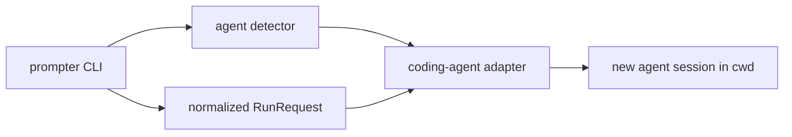

# Prompter Design

`prompter` is a small command module that normalizes how Discobox asks an
already-running coding agent to start work.

The command accepts one stable contract:

- `--session-id`: optional caller-owned persistent session identifier. When
  omitted, the run is ephemeral and the adapter should not persist or resume it.
- `--prompt`: prompt text to run.
- `--agent`: optional provider-specific agent/subagent name.
- `--model`: optional provider-specific model name. `--model-class` remains a
  deprecated alias while callers migrate.
- `--reasoning`: optional provider-specific reasoning/effort hint.
  `--reasioning` remains a deprecated misspelled alias.
- `--service-tier`: optional provider-specific service-tier hint.
- current working directory: the project directory where the new agent session
  should run.

Prompt mode always writes a single JSON object to stdout:

```json
{"text":"final provider response","sessionID":"provider-native-session-id"}
```

`sessionID` is omitted when the provider does not report a session for an
ephemeral run.

The command also supports `--detect-only` as a diagnostic mode. It prints the
detected agent kind and exits without requiring or running the prompt contract.

## Architecture



## Boundaries

- `cmd/prompter` only wires process I/O and exit behavior.
- `internal/cli` owns flag parsing, validation, cwd capture, and user-facing
  command behavior.
- `internal/agent` owns detection, normalized request types, and adapter
  selection.
- `internal/agent.SessionStore` owns mappings from caller session IDs to
  provider-owned session IDs for CLIs that cannot use caller IDs directly. It
  serializes `Get`, `Put`, and `Delete` with an OS-held advisory lock on a
  sibling lock file before reading and replacing `sessions.json`, so concurrent
  prompter processes do not lose mappings during read-modify-write updates.
  Linux, macOS, BSD, and Windows builds provide OS-held locks that are released
  on process exit; unsupported GOOS targets fail session-store operations with
  an explicit unsupported-locking error.
- Agent-specific packages live under `internal/agent/<agent>` and register both
  detector rules and prompt command drivers through `internal/agent/all`.
- `internal/agent.CLIRunner` owns the shared prompt adapter pipeline:
  session-mapping lookup, prompt driver dispatch, command execution,
  provider JSON parsing, and session-mapping persistence.
- Provider-specific prompt command mappings live in each
  `internal/agent/<agent>/prompt_driver.go`; keep `CLIRunner` provider-neutral.

## Detection Strategy

Prompter targets CLI coding agents. Do not add detectors for agents that only
run as IDE extensions, desktop apps, cloud services, or CI platforms unless they
also have a real CLI-agent execution path that can launch child commands.

Detection must be explicit and non-invasive:

1. Honor `DISCOBOX_PROMPTER_AGENT` for tests and controlled deployments.
2. Check stable agent-specific child-process environment markers.
3. Walk sanitized process ancestry when environment markers are absent.
4. Return `unknown` instead of probing credentials, shells, sockets, or remote
   services.

Detection is deterministic, not score-based. A rule either identifies one
supported agent or it does not. Weak context, such as installed config files,
editor workspace files, generic API keys, or generic IDE terminal variables, must
not select an adapter by itself.

Each detector declares whether it needs environment variables, process ancestry,
or both. The global detector evaluates environment-only detectors before any
process-ancestry detectors so common fast checks do not pay for `/proc`/`ps`
lookups. Reusable inputs are cached for the duration of one detection call.

Supported detector packages:

- `claude-code`
- `codex`
- `opencode`
- `gemini-cli`
- `discobot`

Prompt adapters are currently implemented only for:

- `claude-code`
- `codex`
- `opencode`
- `gemini-cli`
- `discobot`

## E2E Detector Tests

`internal/e2e` contains opt-in tests that install real agent CLIs into an
XDG-style cache directory, build the local `prompter` binary, ask each enabled
agent to run `prompter --detect-only`, and assert that the output contains the
expected detector kind.

Agent commands run with a clean, user-like environment rather than inheriting
the Discobot/test session. The harness creates an isolated `HOME` and XDG
cache/config/data directories under the test workspace, preserves only basic
runtime values such as `PATH`, locale, temp and CA certificate variables, and
adds only the credentials required by the selected agent.

These tests are intentionally excluded from normal test runs unless
`DISCOBOX_PROMPTER_E2E_AGENTS` is set, because they download third-party agent CLIs,
require real authentication, may spend model credits, and depend on external
services.

Run examples:

```bash
DISCOBOX_PROMPTER_E2E_LIST=1 go test ./internal/e2e -run TestAgentDetectorE2E -count=1 -v
DISCOBOX_PROMPTER_E2E_AGENTS=claude-code,codex go test ./internal/e2e -count=1 -v
DISCOBOX_PROMPTER_E2E_AGENTS=all go tool task test:prompter:e2e
DISCOBOX_PROMPTER_E2E_PROMPT=1 DISCOBOX_PROMPTER_E2E_AGENTS=codex go test ./internal/e2e -run TestAgentPromptE2E -count=1 -v
```

Credential strategy:

- prefer `OPENAI_API_KEY` for OpenAI-native or provider-configurable agents:
  `codex`, `opencode`, and `discobot`;
- for `codex`, the harness requires `OPENAI_API_KEY` from the user but passes it
  to `codex exec` as `CODEX_API_KEY`, which is the official single-run
  non-interactive API-key environment variable. Codex e2e uses
  `--sandbox danger-full-access` so prompt-mode tests can run nested provider
  CLIs from inside the outer Codex session;
- use provider-specific credentials where the CLI is tied to one provider:
  `ANTHROPIC_API_KEY` for `claude-code` and `GEMINI_API_KEY` for `gemini-cli`;
- prompt e2e optionally passes provider models from
  `DISCOBOX_PROMPTER_E2E_CLAUDE_MODEL`, `DISCOBOX_PROMPTER_E2E_CODEX_MODEL`,
  `DISCOBOX_PROMPTER_E2E_GEMINI_MODEL`, and `DISCOBOX_PROMPTER_E2E_OPENCODE_MODEL`;
- override Discobot's OpenAI model with `DISCOBOX_PROMPTER_E2E_DISCOBOT_OPENAI_MODEL`.

`TestAgentPromptE2E` is a separate opt-in prompt test gated by
`DISCOBOX_PROMPTER_E2E_PROMPT=1`. Prompt behavior lives in
`prompt_e2e_test.go` behind a small prompt-driver registry keyed by the same
agent names as the detector e2e providers. For each enabled agent it:

1. asks the outer agent to run `prompter --prompt ...` with no session ID and
   verifies the normalized JSON text for an ephemeral run;
2. asks the outer agent to run a first persistent prompt with a caller UUID and
   verifies the returned provider session ID;
3. asks the outer agent to run a second prompt with the same caller UUID and
   verifies the response refers to the code word introduced in the first prompt.

The Discobot e2e path uses the local `disco -p` CLI. The detector recognizes
Discobot through `DISCOBOT_SESSION_ID` when present and through `disco` process
ancestry for CLI sessions that do not export a child-process env marker.

Cache behavior:

- default cache root: `os.UserCacheDir()/discobox/prompter-e2e` (`XDG_CACHE_HOME`
  on Linux);
- Node-based agents install with `pnpm` when available, falling back to `npm`;
- override cache root with `DISCOBOX_PROMPTER_E2E_CACHE_DIR`;
- force package updates with `DISCOBOX_PROMPTER_E2E_UPDATE=1`;
- use binaries already on `PATH` with `DISCOBOX_PROMPTER_E2E_SKIP_INSTALL=1`;
- override a binary with `DISCOBOX_PROMPTER_E2E_<AGENT>_BIN`;
- override an agent invocation with `DISCOBOX_PROMPTER_E2E_<AGENT>_COMMAND`, using
  `{prompt}` and `{prompter}` placeholders.

## Adapter Contract

`CLIRunner` is the shared prompt adapter used by all currently supported
providers. `RunnerFor` selects it for the detected `Kind` only when a
`PromptDriver` is registered for that kind. `CLIRunner.Run` performs the common
lifecycle, then dispatches to the provider-specific driver registered from
`internal/agent/<agent>/prompt_driver.go`.

The common lifecycle is:

- if `RunRequest.SessionID` is empty, create an ephemeral run and avoid writing
  session state when the provider supports that;
- if `RunRequest.SessionID` is set, treat it as a caller-owned persistent session
  key and resume the matching provider session when one exists;
- after a new persistent provider session is created, discover the provider's
  native session/thread ID from JSON output and write the caller-to-provider
  mapping to `SessionStore`;
- return normalized `RunResult` JSON with final text and the discovered provider
  session ID;
- run in `RunRequest.Workdir`;
- pass `RunRequest.Agent`, `RunRequest.Model`, `RunRequest.Reasoning`, and
  `RunRequest.ServiceTier` only where the provider has a reasonable native
  interpretation;
- fail clearly when required host-agent capabilities are absent.

Provider-specific prompt drivers may encode native binary names,
JSON-output flags, resume/session flags, and option mappings for `agent`,
`model`, `reasoning`, and `service-tier`. They must not read credentials, probe
remote services, or select a different provider.

Session behavior by inspected CLI:

| Agent | Caller-created ID support | Resume support | Prompter strategy |
| --- | --- | --- | --- |
| `claude-code` | `--session-id <uuid>` for a new conversation; UUID only | `--resume <id>` / `--continue` | Mapping-first. If the caller ID is already a UUID, use it directly and still store the mapping. Otherwise require JSON output to report the provider ID. |
| `gemini-cli` | `--session-id <uuid>` for a new session; UUID expected | `--resume <latest/index>` and `--session-file` | Mapping-first. Use direct UUIDs when possible, otherwise require JSON output to report the provider ID. |
| `codex` | No `codex exec` flag to create an arbitrary session ID | `codex exec resume <SESSION_ID>`; saved sessions can be archived/deleted by ID/name | Start persistent sessions normally, capture Codex's generated ID from `--json`, and map caller ID to it. Use `--ephemeral` when caller ID is empty. |
| `opencode` | No create-with-ID flag found | `opencode run --session <id>`; sessions can be listed/deleted | Start persistent sessions with `--title <caller-id>`, capture the generated ID from `--format json`, and map caller ID to it. |
| `discobot` | Controlled by this project | `--resume <thread-id>` | Target `disco --print --json`; capture returned thread ID and map caller ID to it. |
