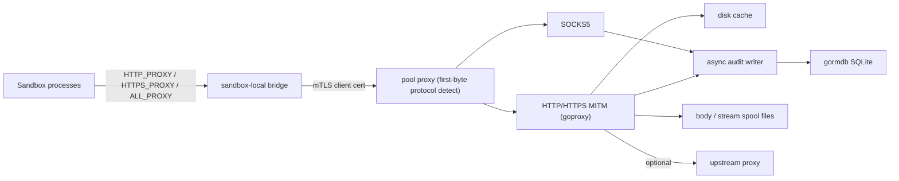
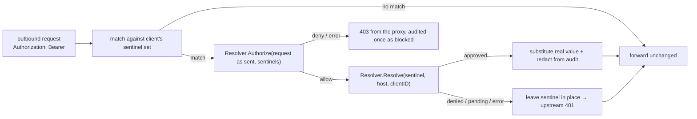
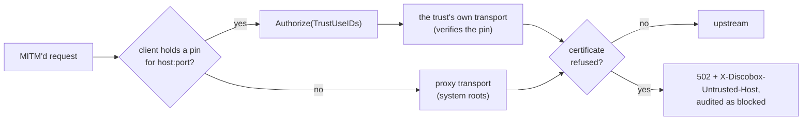

# Proxy Design

## Package Role

`proxy` is the reusable pool-scoped network proxy component.
`pool-agent/proxyagent` runs it and uses its certificate preparation output when
launching sandboxes, but the proxy package owns certificates, traffic policy,
HTTP/SOCKS handling, sentinel secret swapping, disk response caching, and audit
persistence.

The component lives in the root module so pool-agent and sandbox-agent share its
configuration and certificate material contracts without depending on server
internals. It has no logger of its own: the datapath, cache, audit writer, and
retention sweep report through OpenTelemetry spans (`proxy.*`).

## Architecture

The pool proxy requires client certificates. Client identity is the verified
mTLS certificate's CommonName (the sandbox ID; the serial when the CN is empty)
and is attached to every HTTP audit row, SOCKS connect row, header injection
decision, destination policy decision, cache event, and upgraded-stream audit
row. The listener sniffs each connection's first byte: `0x05` is served as
SOCKS5, an ASCII capital letter as HTTP, and anything else (SOCKS4 included) is
closed. Every allowed `CONNECT` is MITM'd with a per-host certificate from the
MITM CA; there is no passthrough tunnel.

The sandbox-local bridge accepts localhost traffic from sandbox processes and
splices it, protocol-agnostic, onto an mTLS connection to the pool proxy
carrying the sandbox's client certificate. It lives in the dependency-light
`proxy/bridge` subpackage so the `sandbox-agent` binary (and
`pool-agent/buildkitagent`'s per-build forwarder) can embed it without pulling
in the full pool proxy stack (goproxy, gormdb, cache, audit). Pool-agent wiring
(`pool-agent/proxyagent`) runs the pool host proxy as a systemd unit, prepares
certificates, stages per-sandbox client material, and publishes sentinel sets
through `ApplyConfig`.

Client identity is the tenant boundary. Rules that can expose or restrict data
must support `ClientIDs`, and audit reads must support querying by client ID so
a caller can retrieve data for a specific sandbox without scanning or mixing
unrelated sandbox traffic.

## Certificate Model

Certificate preparation is independent of running the proxy:

- MITM CA: signs per-host certificates for intercepted HTTPS.
- mTLS CA: signs the pool host proxy server certificate and per-client
  certificates.
- Pool server certificate: presented by the pool host proxy listener.
- Client certificates: issued per sandbox/client identity (CN = client ID) and
  staged into the sandbox by pool-agent.

`PrepareCertificates` creates or reuses this material — reissuing anything within
`RenewBefore` of expiry, and the server certificate when it no longer covers
`ServerHosts` — and returns the `CertificateBundle` plus per-client
`ClientMaterial` (filesystem paths and proxy/CA environment values). Callers may
run it before the proxy process starts so certificates can be distributed during
sandbox setup.

## Persistence

Audit persistence uses `gormdb` with SQLite by default. The proxy package owns
schema migration and repository behavior. `gormdb` owns pool construction and
SQLite pragmas.

The HTTP request path must not block on audit database writes. Audit calls enqueue
bounded events to a background writer (`Recording.QueueSize`, shared by HTTP and
SOCKS rows). If the queue is full, the recorder drops the event and increments
its drop counter instead of stalling network traffic. DNS rows are recorded
through `Server.RecordDNS` by the pool's sandbox DNS server, which runs in the
same process and has no recorder of its own (ADR 0148). They share the
database's client identity, retention and write-ordered cursor (`dns_<row>`),
but not the queue: lookups have one of their own, the single writer takes from
it only when the HTTP and SOCKS queue is empty, and each sandbox has a budget in
it. A lookup past either is dropped and counted apart (`dnsDropped` beside
`dropped` on `/audit/dropped`).

Normal HTTP request and response bodies are streamed to disk spool files. SQLite
stores only relative spool paths, byte counts, format names, metadata, redacted
headers, cache state, policy decisions, authenticated client identity, and the
approved credential uses the request spent. Large
response assets remain in the disk cache, not SQLite.

## Retention

Audit rows, recorded bodies, and upgraded-stream captures are kept for
`Recording.Retention` and then reclaimed. Zero opts out, for an embedder that
manages the database itself; every Discobox pool sets a window, because nothing
else bounds these trees — `DefaultRetention` (48h) unless the pool container's
`DISCOBOX_PROXY_AUDIT_RETENTION` overrides it.

Deleting a sandbox deliberately does **not** reclaim its audit trail. What a
sandbox sent is the question the trail exists to answer, and it is most often
asked after that sandbox is gone, so age is the only thing that reclaims here.

One pass deletes rows by their creation timestamp and spool files by their
modification time, against the one cutoff. Pairing them that way is exact
rather than approximate: a spool file is written across the life of the
exchange it belongs to and that exchange's row is written when it ends, so a
file last modified before the cutoff can only belong to a row that is also
before it. Sweeping files on their own terms — rather than only the ones a
deleted row names — is what reaches the set no row can: spools whose event was
dropped because the audit queue was full, which is the recorder's designed
behavior under burst, and spools left by a crash mid-write. Rows go first, so a
failure part-way leaves unreachable files that the next pass reclaims rather
than rows pointing at files that are gone.

A spool still being written is the one file that reasoning does not cover: an
upgraded stream can sit open and idle past the cutoff, and it has no row until
it closes. The recorder tracks those open and the sweep skips them.

`SweepInterval` derives the pass cadence from the window rather than taking a
second setting: half the window, clamped to [1m, 1h], which bounds how far past
its retention a row survives at 1.5x. The first pass runs at startup, so a proxy
that was down longer than its window reclaims on the way up.

The response cache is not swept. See [Response Cache](#response-cache): its
entries are keyed by content digest and bounded by a byte ceiling, so age says
nothing about what belongs in it.

## Upgraded Streams

HTTP 101 upgrades are supported as generic upgraded streams. The proxy preserves
the upgraded tunnel, spools raw bidirectional payload frames to disk, and audits
protocol type, spool file metadata, drop counters, and client-to-server and
server-to-client byte counts. Raw upgraded payloads are not persisted to SQLite.

The 101 handshake response must reach the client **as one write**, not one per
header fragment. A WebSocket client parses that response itself, before any
framing exists to reassemble it, so whatever read boundaries the proxy creates
are the ones it sees — and writing a header field at a time onto a TLS
connection puts each fragment in its own TLS record. Strict clients count that:
tungstenite (Rust) rejects a handshake arriving in more than 64 reads averaging
under 128 bytes as a slow-loris attempt ("Attack attempt detected"), which
roughly 17 response headers is enough to trigger, and any CDN-fronted endpoint
sends that many. `goproxy` buffers the response head for this reason as of
v1.8.5; `TestHTTPProxyMITMUpgradeHandshakeIsNotFragmented` pins the property
from the client's side so a regression surfaces here rather than as a harness
silently downgrading its transport.

The bytes a client sends in the same write as its upgrade request are the other
property this path has to hold. `net/http` parses the request with a buffered
reader, so that payload is already off the wire when the handler runs, and
stock `goproxy` takes the connection from `Hijack` while dropping the reader
beside it — after which it relays from the raw connection and those bytes reach
nobody, hanging both ends. The `replace` in the root `go.mod` points at a fork
that forwards them, on the plain HTTP path this proxy uses and on the MITM path
alike; `TestHTTPProxyUpgradeEarlyClientBytes` sends a request and a payload in
one write and is what says whether the fork is still needed. Upstream is fixing
only the MITM half (elazarl/goproxy#805), so that landing does not retire the
fork on its own.

A frame in a stream spool is therefore not a payload boundary either: a write
can be recorded as two chunks when part of it came from the parser's buffer and
the rest from the wire. Anything asserting on a spool reassembles the direction
first.

## Sentinel Secret Swapping

Sandboxes are provisioned with **sentinels** — convincing fake credentials
(shaped like real provider keys, e.g. `sk-ant-oat01-…`) injected as environment
variables — instead of real secrets. The proxy detects sentinels in outbound
requests and substitutes the real value, resolved on demand and authorized per
destination host. The real credential never exists inside the sandbox and is
never persisted by the proxy.

Key properties:

- **Detection is exact-set matching, not prefix scanning.** The proxy is pushed
  a per-client set of sentinel strings via `ApplyConfig` (`Config.Secrets`). It
  never parses sentinel structure, so a sentinel can byte-for-byte mimic any
  provider key format. Sentinels are non-secret and carry no embedded identifier.
- **The proxy stays server-agnostic.** It owns detection, substitution, TTL
  caching, and audit redaction. The real value comes from an injected
  `SecretResolver` passed to `NewServer` (implemented by pool-agent, which calls
  the server). A nil resolver disables swapping; the resolver is a construction
  dependency preserved across `ApplyConfig`.
- **Host authorization happens at resolve time.** The sentinel carries no host;
  each distinct destination triggers an on-demand resolution the server maps to a
  secret request that is approved or denied per `(secretID, host)`. Exfiltration
  of a sentinel to another host simply fails to resolve.
- **Fail-closed on the secret, fail-open on the request.** On denial, pending
  approval, or resolver error, the sentinel is left in place; the upstream
  receives the placeholder and rejects it. The real value is never leaked.
- **A request carrying sentinels is authorized before any of them is resolved**,
  as is every request to a host the client trusts by a pin
  ([Host Trust](#host-trust))
  (`Resolver.Authorize`, `Swapper.Match`; [ADR 26-09-22-838](../docs/adr/26-09-22-838-a-dedicated-pool-harness-judges-commands-and-credential-bearing-requests.md) §4).
  Resolution decides whether a credential may go to a host and is cached; the
  judge decides whether *this* request may carry it, so it runs per request —
  and it runs first, because a refused request must not decrypt a credential
  and a value already in the cache must not carry a new operation through on
  the strength of an older one. What it is shown is the request as the sandbox
  sent it, nothing yet substituted: sentinels and never credentials. The uses
  come back with the verdict, since binding a sentinel to a use is the
  resolver's to do and nothing the request says about one could be believed. A
  request it does not allow, or cannot answer for, is refused by the proxy with
  a 403, never sent, and audited once as blocked (`judge: <reason>`) against
  the uses the verdict named. `Match` reports every sentinel the request
  carries, which is a superset of what `Apply` substitutes — an unresolvable
  one is authorized and then left in place — so nothing is substituted without
  having been authorized, which is the direction that matters. The two share
  one definition of the surface they walk (`eachValue`) but walk it twice, so a
  request carrying a sentinel pays the base64 scan over its header values
  twice; for a harness that is every call to its model API, and it is the price
  of not resolving a credential before something agreed to the request. A
  request to a trusted host is authorized against the uses the pin was granted
  for, whether or not it carries a credential, and those come from the pin
  rather than from anything the request said. The pool agent asks the project's
  judge about every use a request spends — the ones bound from its sentinels
  and the ones its destination was pinned for — and allows a request that
  spends none; the destination host is held at resolve time either way.
- **The gate host never reaches the internet** (`Secrets.GateHost`,
  `Resolver.Gate`; [ADR 0140](../docs/adr/0140-a-discobox-reaches-the-discobox-api-through-its-pool-with-a-fixed-role.md) §2).
  A CONNECT to it is intercepted whatever the allowlist says, and a request for
  it is handed to the resolver's `Gate` before the allowlist and before any
  swap. The resolver admits it — answering it from the upstream behind the
  gate — or refuses it with a `GateRefusal`, which the proxy answers with a
  403 carrying the refusal's reason alone, and audits once as blocked
  (`gate: <reason>`): refused, never sent. A gate that fails after letting a
  call in — the control plane unreachable, or gone quiet after the request went
  out — is not a refusal: it is answered 502 and recorded as an ordinary
  exchange, since the call may have been acted on. Every row carries the use
  the call was let in or refused under, where there was one
  (`GateAdmission.UseID`, `GateRefusal.UseID`), as a swapped request's does,
  so `discobox admin audit http --use-id` finds a discobox's API calls by the
  use it made them under. Every other host is sent the
  placeholder when a credential does not resolve; this one fails closed.
- **A request the proxy refuses is its own answer** (`requestMeta.answered`):
  it is audited once, as blocked, and the response path neither records it
  again nor reads it as the upstream's word on a credential.
- **Scope is headers, plus query parameters when `Secrets.ScanQuery` is set**
  (pool-agent leaves it off). Request bodies are not scanned because the
  request-body audit spool would capture the swapped value. When a value is
  swapped into a query parameter, the audit records the pre-swap URL so the real
  value never lands in an audit row.
- **A sentinel is also matched through base64.** Git's HTTP transport sends a
  credential as `Authorization: Basic base64(user:password)`, so a sentinel
  traveling that way is invisible to a literal scan and the upstream is handed
  the placeholder. Every value is therefore scanned twice: as itself, and
  through each base64 token in it — decoded, scanned as text, and re-encoded in
  the alphabet and padding it arrived in, but only when a sentinel was found
  *and* resolved. Because the substitution is over the decoded text, the
  username half, the password half, both halves, and a token that is nothing
  but an encoded sentinel are all the same case, and the proxy learns no
  structure inside the decoded bytes. Decoding is strict and a token that does
  not decode, or holds no sentinel, is passed through byte-for-byte.
- **The token's encoding is read off it where it is observable, defaulted where
  it is not.** The alphabet is visible only in a token that uses character 62/63
  (`+` `/` vs `-` `_`), and the padding only in one that carries `=` or has a
  length that cannot be padded. A token with neither tell is ambiguous, and
  resolves to standard-with-padding — what `Authorization: Basic` is defined to
  carry, and what the Git case lands in. Either way the chosen encoding
  re-encodes the original token to itself, so a token passed through is never
  reshaped; the default is only visible on a token that was rewritten, when the
  real credential needs padding or a 62/63 character the sentinel did not.
- **Caching.** Resolved values are cached per `(clientID, sentinel, host)` until
  the grant expiry (capped by `PositiveTTLSeconds`, 300s by default); a result
  with no `ExpiresAt` is used once and not cached; denials are cached briefly
  (`NegativeTTLSeconds`, 10s by default); transient resolver errors are not
  cached. A resolver may shorten that bound by returning an earlier `ExpiresAt`
  — which is how an ephemeral sentinel's use window is honored, since its grant
  outlives it.
- **Stale-while-revalidate.** Past `RefreshIntervalSeconds` (30s by default) a
  cached value keeps serving while one deduplicated background refresh runs: a
  new value replaces it, a denial replaces it with a cached denial, and a
  transient failure keeps it until its hard expiry, so a control-plane outage
  does not stop a running sandbox's credentials early.
- **A rejected credential is retried once, with a different one.** A swapped
  request that comes back `401` is not the sandbox's error — it holds a
  sentinel, and everything behind it belongs to the control plane — so the proxy
  re-sends it rather than passing the rejection down. It tries a freshly
  resolved value first (the cache was stale across a rotation), then the value
  the last rotation displaced, still within `previousValueGrace` (the proxy
  moved onto a credential the upstream has not started honouring yet). If
  neither differs from what was rejected there is nothing new to send, and the
  401 is passed through. Only header swaps with a body small enough to hold
  (8 MiB) are retryable; see [ADR 0059](../docs/adr/0059-a-rejected-swapped-credential-is-retried-once.md).
  The retry is a credential the first attempt did not carry, so it is
  authorized before it is sent, over `Match` of the request about to go — not
  over what the first attempt managed to resolve, since a sentinel that failed
  transiently resolves on the retry. A refusal there is the third outcome
  beside the two above: nothing is re-sent, the upstream's own 401 is what the
  sandbox gets, and the refusal is recorded as a blocked row carrying that same
  status, because no 403 was ever sent for it.
- **A credential the retry could not save is reported back.** The response path
  is the only place that learns a credential has stopped working, so it tells
  the resolver: `rejected` when there was nothing different to send, and
  `rejected-after-retry` when the other value was refused too. A retry that
  *worked* reports nothing — that is the rotation the retry exists for. A
  swapped request the upstream accepted reports `accepted` only when a rejection
  was reported for that sentinel before it, which is how a credential fixed
  anywhere retracts what was said about it. The report names the sentinel, the
  client and the host, never the value.

  Only a 2xx is an acceptance: a redirect to a sign-in page is how many
  upstreams say a session is *not* good, and taking it as success would retract
  a rejection using the upstream's own way of saying the credential is dead.

  It runs off the request path, through `credentialReporter` — a bounded queue
  that drops rather than blocks and refuses to enqueue once closed, and one
  report per `(client, sentinel, host)` per minute, because a harness that
  believes it is logged out retries hard and every retry is the same fact. What
  it remembers having reported ages out after `reportMemory`, so the set is
  bounded by what has been refused lately rather than by everything ever
  refused — the keys include one per ephemeral sentinel, and the case this
  exists for is a credential that stays refused. The reporter lives on the proxy
  rather than on the `Swapper`, which `ApplyConfig` replaces on every
  ephemeral-sentinel mint.
  See [ADR 0132](../docs/adr/0132-a-credential-rejected-after-its-retry-is-recorded-against-its-secret.md).
- **Ephemeral sentinels are just sentinels here.** Pool-agent mints short-lived
  sentinels per agent-credential use and registers them in the same per-client
  set, so this package needs no concept of them: it matches a string and asks
  the resolver, and the resolver decides what the string means. See
  [ADR 0031](../docs/adr/0031-agent-credentials-are-a-portable-protocol-with-ephemeral-sentinels.md).

Audit redaction covers every header whose value was swapped, in addition to
rewrite-rule headers and credential-like header names.

## Response Cache

The cache is pool-wide. It makes upstream image pulls cheap across a pool,
covering both base-image pulls by the pool-shared builder
(`pool-agent/DESIGN.md`) and a plain `docker pull` in a sandbox, which no build
cache ever sees — see
[ADR 0044](../docs/adr/0044-builds-run-on-a-pool-shared-buildkit.md) §12.

Admission has two arms, and as wired by `pool-agent/proxyagent` both are
restricted to URLs that name their own content:

- **Content-aware**: any registry `GET` whose path contains `sha256:` and
  whose `Accept` names a Docker or OCI media type. This covers blobs and
  digest-addressed manifests alike.
- **Patterns**: the two blob spellings a pull actually sees — the v2 API's
  `/v2/<name>/blobs/sha256:<hex>` and the storage layout's
  `/blobs/sha256/<ab>/<hex>/data`, which is what a redirect to a CDN serves.

The single rule underneath is that **there is no TTL**, so nothing mutable may
be admitted. A digest names its content, so a stored entry can never be stale,
whether it is a blob or a manifest. A *tag* manifest is the opposite — the same
URL answers differently tomorrow — and it carries no `sha256:`, which is exactly
why it falls through both arms. A pull of `busybox:1.36` shows the split
directly: `/manifests/1.36` is refused and `/manifests/sha256:...` is stored.

Sharing across a pool is sound for the same reason: a digest names content
rather than an entitlement, and a pool already shares one set of pull
credentials. Cache events still carry the requesting client's identity for
audit.

Entries are keyed by digest rather than by full URL, so the same content fetched
through different registry mirrors or paths hits once; a URL with no digest keys
on host and path, never the query. Only a `2xx` response without
`Cache-Control: no-store` is stored — with content-aware on, one that also looks
like registry content — and a body whose SHA-256 differs from the digest its URL
names is discarded. A partial response is never stored: a `206` body is a
fragment, and storing it under a key that claims to be the whole object would
serve truncated content to the next reader.

The cache is bounded by an LRU byte ceiling (`Cache.MaxSizeBytes`, 20 GiB by
default) rather than by time, which only holds while every file on disk is
described by the index. Three kinds of file
outlive a crash and are not: a `.tmp-*` entry whose writer is gone, an entry
whose `.meta` sidecar was never written, and a sidecar whose entry was never
renamed into place. The middle one is the dangerous one — the index is keyed by
the cache key that only the sidecar holds, and the entry's filename is a hash of
that key, so such an entry can never be found, counted against the ceiling, or
evicted. `Commit` therefore writes the sidecar *before* renaming the entry into
place, which turns that leak into a stray sidecar of a few dozen bytes, and
`loadIndex` reclaims all three at startup — the one moment nothing is in flight,
so an incomplete entry is known to be abandoned rather than pending. Startup
also evicts down to the ceiling, so a ceiling lowered between runs is honored
without waiting for a store that may never come.

The directory can also be emptied underneath a running proxy: the pool agent
does it when it clears a pool's caches. An indexed entry whose file is gone is
a miss, and `Get` forgets it together with the bytes it was counted for, so the
ceiling does not go on evicting live entries to make room for deleted ones.

## Runtime Policy

Header rewrite rules are deterministic, and at most one applies per request:
the first match in a fixed order. Rules sort by a specificity score — exact
hosts far above wildcards (`*.suffix`, `prefix.*`, `*`), longer patterns higher,
plus weight for each method, path regex, client ID, and header condition — then
by pattern text. Audit records store applied header names and rule identifiers,
not injected secret values.

Destination policy (`Allowlist`) allows everything unless enabled. Enabled, a
host passes only if it matches a global domain/IP/CIDR entry or an entry in a
rule scoped to the requesting client, so an enabled allowlist with no entries
denies everything. HTTP requests it denies are answered `403`; denied `CONNECT`s
and SOCKS connects are refused. All are audited as `host denied`.

Runtime policy changes only through `ApplyConfig`, which hot-swaps the allowlist,
header rules, the sentinel set with its swap tuning, and the host trusts
([Host Trust](#host-trust)). `WatchConfigFile` polls
a JSON config file into it; pool-agent instead calls it directly to publish
sentinel sets and trusts. The proxy does not expose an HTTP configuration API; listener,
certificate, audit database, recording, cache, control, and upstream settings
remain startup-only.

Header audit redaction covers both credential-like header names and every header
name touched by a rewrite rule. This prevents injected secret values from being
persisted even when a configured header name does not look sensitive.

A swapped request records which approved uses it spent. `secrets.ResolveResult`
carries a `UseID` that the resolver fills from the activation behind an
ephemeral sentinel, the `Swapper` carries it through its cache onto `Result`,
and `HTTPExchange.SwappedUseIDs` holds the comma-joined set. That ID is the join
to the control plane's `credential_verdicts` rows, so one identifier reaches
both the verdict that authorized a command and every request that spent the
credential. Reads filter on it with `use_id`, matching a whole element of the
list rather than a substring.

The column holds the use ID and never a sentinel. An ephemeral sentinel is a
live bearer token for the length of its activation window, and this trail is
retained to be read afterwards; a use ID authorizes nothing and only names. A
swap with no agent-credentials activation behind it leaves the column empty,
which is the ordinary injected-sentinel case rather than a gap.

The control API (`ControlHandler`, served by `ListenAndServeControl` only when
`Control.ListenAddress` is set) is read-only. It lists HTTP and SOCKS audit rows
(`GET /audit/http`, `/audit/socks`, filtered by `client_id`, `host`, `since`
and `until` (RFC 3339, both inclusive, compared in UTC because rows are written
in UTC) and `limit` up to 1000; HTTP also takes `use_id`, which the SOCKS route rejects rather than
ignores, because a tunnel the proxy never reads can have spent no credential)
and DNS rows (`GET /audit/dns`, by `client_id`, `name`, `since`, `until`, `order`,
`limit`, and a `dns_` `after_id` or exact `id`, refusing every exchange-only filter and an
`http_` cursor),
reports the dropped-event counter (`/audit/dropped`), and serves
body and upgraded-stream spool files only through the owning HTTP audit row
(`/audit/http/{id}/{request-body|response-body|stream}`), never by path; every
read is narrowed to `client_id` when one is given. When `Control.TrustPublicKey` is configured, every control
request must use a PASETO v4.public bearer token for audience
`discobox-proxy-control` with `audit:read` scope, matching `Control.ProjectID`
and `WorkerID` when set. A token carrying `sandbox_id` *narrows* every read to
that sandbox rather than being compared against a `client_id` the caller was
trusted to send — a comparison only rejects a mismatch, so a request that simply
omitted the parameter would read every sandbox's rows and spooled bodies. A
contradictory `client_id` is still refused, so asking for another sandbox is a
403 rather than a silent read of your own. The proxy stores only the public verification key;
`CreateControlToken` signs with the private key its caller holds.

`ControlClient` is the other half of the control API, in this package so the
paths, parameters, token and response shape have one owner. It signs a fresh
token per call. A sandbox-scoped read carries the sandbox twice, in the token
and as `client_id`: an authenticated proxy narrows by the token (and the two
agree), and a proxy serving the control API without authentication, which
ignores the token, is still narrowed by the query. It also reads recorded
bodies and upgraded streams (`OpenHTTPArtifact`), scoped the same way, and
passes `order=asc` for a follower reading forward from a `since` bound and
`until` for a reader paging back newest first;
`min_status`, `max_status` and `blocked` filter HTTP rows, and the SOCKS route
refuses them.

A row's ID is written `http_<row>` wherever it leaves this package
([`auditid`](../auditid)): `audit.HTTPExchange.ID` is an integer in the database
and in Go, and the prefixed string in JSON and on every path and parameter that
names a record. The integer is what the write order and the cursor need; the
prefix is what makes an ID say which trail it came from, beside the `cvd_` and
`evt_` IDs of the trails that generate their own.

`after_id` is what a follower should actually read by. The row id is the write
order, which is the order rows become readable, while `created_at` is the order
they happened: the recorder stamps an exchange when it ends and writes it from a
queue, so a slow write lands behind a faster one. A reader paging by time has to
re-read a window on every poll to catch those and can still miss one; reading
after an id needs neither, and orders by the primary key. It takes precedence
over `since`, `until` and `order`. A Discobox pool proxy
serves the control API on loopback only, trusting a key the pool agent holds,
and the pool agent is its only reader
([`pool-agent/DESIGN.md`](../pool-agent/DESIGN.md#reading-the-proxys-audit)).

SOCKS5 is a TCP tunnel (no-auth method). It is authenticated by the same mTLS
listener and records connect attempts, destination, allow/deny, and client
identity, but it does not inspect tunneled payloads.

## Host Trust

Upstream TLS is verified against the system roots, so a host whose chain ends in
a private CA — a Kubernetes API server, an internal service — is one no client
can reach until a person pins a certificate for it
([ADR 0149](../docs/adr/0149-a-host-certificate-is-trusted-for-one-sandbox-when-a-person-pins-it.md)).
`Config.Trusts` carries the pins in force, each a `HostTrust` for exactly one
client and one `host:port`. A pin changes only what the proxy accepts
upstream: the sandbox talks only to the proxy and its trust store holds the
MITM CA already. A client that carries its own CA — kubectl's kubeconfig — is
pointed at the MITM CA instead, which moves that client's check of the host to
the proxy rather than removing it.

- **A pin is verified, never a switch.** A `ca` pin builds a root set of
  exactly that CA and verifies as usual, name included — an IP endpoint needs
  an IP SAN. A `leaf-spki` pin, for a chain with no CA in it, matches the
  leaf's public key exactly and its validity window, and nothing else.
- **Every request goes through `roundTrip`** (goproxy's per-request
  `RoundTripper`), which picks the pin's transport or the proxy's own. A
  certificate refused either way is answered here as a `502` naming the
  endpoint in `X-Discobox-Untrusted-Host` and the remedy in the body, and
  audited once as blocked (`upstream certificate not trusted: …`), instead of
  the connection being dropped, which the sandbox saw as an empty reply.
- **An upstream that never answers is a `502` too.** The host unreachable, or
  it — or an upstream proxy in between — closing the connection, used to drop
  the client's connection, which a sandbox saw as an empty reply. `roundTrip`
  answers it with a `502` saying what failed and, behind an upstream proxy,
  naming it in `X-Discobox-Upstream-Proxy`: a pool nested in a discobox is
  refused by its outer proxy, and the remedy is there. It is recorded by the
  response path as an exchange the upstream failed, not as a refusal — the
  request may have gone out — as the gate's failures are.
- **A pinned transport is per `(client, trust)`.** `http.Transport` pools
  connections by host, so a connection verified under one client's pin must
  never serve another client's request for the same host. `buildTrustTable`
  clones the proxy's transport — so a pin leaves through the same upstream
  proxy and exemptions — per trust, keeps a trust's transport across
  `ApplyConfig` while its pin is unchanged, and closes the idle connections of
  one that is gone.
- **A request to a trusted host is judged** against the trust's uses
  (`AuthorizeRequest.TrustUseIDs`), whether or not it carries a credential; one
  that does is judged against both, in the one ask that runs before anything is
  resolved ([Sentinel Secret Swapping](#sentinel-secret-swapping)).
- **`ProbeTLS`** connects to a host the way a client's traffic would, completes
  a handshake with verification off, and returns the chain and whether it
  verifies against the system roots, and which upstream proxy it went through
  (`Via`): behind one that intercepts TLS the chain is that proxy's, not the
  host's. It sends no request, and refuses a host the allowlist denies that
  client (`ErrProbeHostDenied`). The pool agent is
  its caller: the chain a person pins from is the one this proxy meets.

## Upstream Egress

The proxy dials origins directly unless `Config.UpstreamProxy` — or, when that
is empty, the first set variable in `UpstreamProxyEnvVars` (`HTTPS_PROXY`,
`HTTP_PROXY`, `ALL_PROXY`, each upper then lower case) — names an upstream. That
is the nested case: a pool proxy inside a Discobox sandbox has no route off-box
and must hand its egress to the sandbox's own forwarder. Both goproxy egress
hooks (`Transport.Proxy` and `ConnectDial`) route through it, and both honor
`UpstreamNoProxy` (falling back to `NO_PROXY`) with standard `NO_PROXY` matching,
so loopback and control-plane traffic stay direct. `pool-agent/proxyagent`
forwards those variables into the proxy unit rather than setting the fields.
SOCKS5 connects always dial directly.
