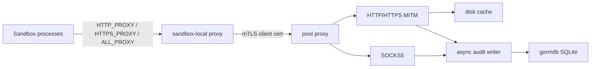
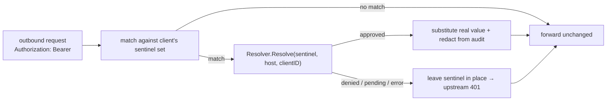

# Proxy Design

## Package Role

`proxy` is the reusable pool-scoped network proxy component. The pool-agent
will run it and use its certificate preparation output when launching sandboxes,
but the proxy package owns certificates, traffic policy, HTTP/SOCKS handling,
disk response caching, and audit persistence.

The component lives in the root module so pool-agent and future launch wiring
can share stable configuration and certificate material contracts without
depending on server internals.

## Architecture

The pool proxy requires client certificates. Client identity is derived from
the verified mTLS certificate and is attached to every HTTP audit row, SOCKS
connect row, header injection decision, destination policy decision, cache event,
and upgraded-stream audit row. The sandbox-local proxy is the intended place to
accept localhost traffic from sandbox processes and forward to the shared pool
proxy with the sandbox's client certificate.

The sandbox-local forwarder lives in the dependency-light `proxy/bridge`
subpackage so the `sandbox-agent` binary can embed it without pulling in the
full pool proxy stack (goproxy, gormdb, cache, audit). Pool-agent wiring
(`pool-agent/proxyagent`) runs the pool host proxy as a systemd unit, prepares
certificates, and stages per-sandbox client material.

Client identity is the tenant boundary. Rules that can expose or restrict data
must support `ClientIDs`, and audit reads must support querying by client ID so
pool-agent code can retrieve data for a specific sandbox without scanning or
mixing unrelated sandbox traffic.

## Certificate Model

Certificate preparation is independent of running the proxy:

- MITM CA: signs per-host certificates for intercepted HTTPS.
- mTLS CA: signs the pool host proxy server certificate and per-client
  certificates.
- Pool server certificate: presented by the pool host proxy listener.
- Client certificates: issued per sandbox/client identity and distributed with
  sandbox launch metadata.

`PrepareCertificates` creates or reuses this material and returns filesystem
paths plus proxy environment values. Callers may run it before the proxy process
starts so certificates can be distributed during sandbox setup.

## Persistence

Audit persistence uses `gormdb` with SQLite by default. The proxy package owns
schema migration and repository behavior. `gormdb` owns pool construction and
SQLite pragmas.

The HTTP request path must not block on audit database writes. Audit calls enqueue
bounded events to a background writer. If the queue is full, the recorder drops
the event and increments drop counters instead of stalling network traffic.

Normal HTTP request and response bodies are streamed to disk spool files. SQLite
stores only relative spool paths, byte counts, format names, metadata, redacted
headers, cache state, policy decisions, and authenticated client identity. Large
response assets remain in the disk cache, not SQLite.

HTTP 101 upgrades are supported as generic upgraded streams. The proxy preserves
the upgraded tunnel, spools raw bidirectional payload frames to disk, and audits
protocol type, spool file metadata, drop counters, and client-to-server and
server-to-client byte counts. Raw upgraded payloads are not persisted to SQLite.

The 101 handshake response must reach the client **as one write**, not one per
header fragment. A WebSocket client parses that response itself, before any
framing exists to reassemble it, so whatever read boundaries the proxy creates
are the ones it sees — and writing a header field at a time onto a TLS
connection puts each fragment in its own TLS record. Strict clients count that:
tungstenite (Rust) rejects a handshake arriving in more than 64 reads averaging
under 128 bytes as a slow-loris attempt ("Attack attempt detected"), which
roughly 17 response headers is enough to trigger, and any CDN-fronted endpoint
sends that many. `goproxy` buffers the response head for this reason as of
v1.8.5; `TestHTTPProxyMITMUpgradeHandshakeIsNotFragmented` pins the property
from the client's side so a regression surfaces here rather than as a harness
silently downgrading its transport.

## Sentinel Secret Swapping

Sandboxes are provisioned with **sentinels** — convincing fake credentials
(shaped like real provider keys, e.g. `sk-ant-oat01-…`) injected as environment
variables — instead of real secrets. The proxy detects sentinels in outbound
requests and substitutes the real value, resolved on demand and authorized per
destination host. The real credential never exists inside the sandbox and is
never persisted by the proxy.

Key properties:

- **Detection is exact-set matching, not prefix scanning.** The proxy is pushed
  a per-client set of sentinel strings via `ApplyConfig` (`Config.Secrets`). It
  never parses sentinel structure, so a sentinel can byte-for-byte mimic any
  provider key format. Sentinels are non-secret and carry no embedded identifier.
- **The proxy stays server-agnostic.** It owns detection, substitution, TTL
  caching, and audit redaction. The real value comes from an injected
  `secrets.Resolver` (implemented by pool-agent, which calls the server). A nil
  resolver disables swapping.
- **Host authorization happens at resolve time.** The sentinel carries no host;
  each distinct destination triggers an on-demand resolution the server maps to a
  secret request that is approved or denied per `(secretID, host)`. Exfiltration
  of a sentinel to another host simply fails to resolve.
- **Fail-closed on the secret, fail-open on the request.** On denial, pending
  approval, or resolver error, the sentinel is left in place; the upstream
  receives the placeholder and rejects it. The real value is never leaked.
- **Scope is headers and query parameters.** Request bodies are not scanned in
  this phase because the request-body audit spool would capture the swapped
  value. When a value is swapped into a query parameter, the audit records the
  pre-swap URL so the real value never lands in an audit row.
- **Caching.** Resolved values are cached per `(clientID, sentinel, host)` until
  the grant expiry (capped by `PositiveTTLSeconds`); denials are cached briefly
  (`NegativeTTLSeconds`); transient resolver errors are not cached.
- **A rejected credential is retried once, with a different one.** A swapped
  request that comes back `401` is not the sandbox's error — it holds a
  sentinel, and everything behind it belongs to the control plane — so the proxy
  re-sends it rather than passing the rejection down. It tries a freshly
  resolved value first (the cache was stale across a rotation), then the value
  the last rotation displaced, still within `previousValueGrace` (the proxy
  moved onto a credential the upstream has not started honouring yet). If
  neither differs from what was rejected there is nothing new to send, and the
  401 is passed through. Only header swaps with a body small enough to hold are
  retryable; see [ADR 0059](../docs/adr/0059-a-rejected-swapped-credential-is-retried-once.md).

Audit redaction covers every header whose value was swapped, in addition to
rewrite-rule headers and credential-like header names.

## Response Cache

The cache is pool-wide. It makes upstream image pulls cheap across a pool,
covering both base-image pulls by the pool-shared builder
(`pool-agent/DESIGN.md`) and a plain `docker pull` in a sandbox, which no build
cache ever sees — see
[ADR 0044](../docs/adr/0044-builds-run-on-a-pool-shared-buildkit.md) §12.

Admission has two arms, and as wired by `pool-agent/proxyagent` both are
restricted to URLs that name their own content:

- **Content-aware**: any registry request whose path contains `sha256:` and
  whose `Accept` is a Docker media type. This covers blobs and
  digest-addressed manifests alike.
- **Patterns**: the two blob spellings a pull actually sees — the v2 API's
  `/v2/<name>/blobs/sha256:<hex>` and the storage layout's
  `/blobs/sha256/<ab>/<hex>/data`, which is what a redirect to a CDN serves.

The single rule underneath is that **there is no TTL**, so nothing mutable may
be admitted. A digest names its content, so a stored entry can never be stale,
whether it is a blob or a manifest. A *tag* manifest is the opposite — the same
URL answers differently tomorrow — and it carries no `sha256:`, which is exactly
why it falls through both arms. A pull of `busybox:1.36` shows the split
directly: `/manifests/1.36` is refused and `/manifests/sha256:...` is stored.

Sharing across a pool is sound for the same reason: a digest names content
rather than an entitlement, and a pool already shares one set of pull
credentials. Cache events still carry the requesting client's identity for
audit.

Entries are keyed by digest rather than by full URL, so the same content fetched
through different registry mirrors or paths hits once. A partial response is
never stored: a `206` body is a fragment, and storing it under a key that claims
to be the whole object would serve truncated content to the next reader.

## Runtime Policy

Header rewrite rules are deterministic. Exact host matches win before wildcard
rules; wildcard rules are sorted by specificity and then pattern text. Audit
records store applied header names and rule identifiers, not injected secret
values.

Runtime policy updates are file-driven. The proxy exposes `ApplyConfig` and a
JSON config file watcher that hot-swap allowlist and header rules. It does not
expose an HTTP configuration API; listener, certificate, audit database, and
cache settings remain startup-only.

Header audit redaction covers both credential-like header names and every header
name touched by a rewrite rule. This prevents injected secret values from being
persisted even when a configured header name does not look sensitive.

The control API is read-only and exists for pool-agent audit retrieval. It
lists HTTP and SOCKS audit rows by client ID, reports dropped audit counters,
and serves body and upgraded-stream spool files only through the owning HTTP
audit row and client ID. When `Control.TrustPublicKey` is configured, every
control request must use a PASETO v4.public bearer token for audience
`discobox-proxy-control` with `audit:read` scope. The proxy stores only the
public verification key; pool-agent owns the private signing key.

SOCKS5 remains a TCP tunnel. It is authenticated by the same mTLS listener and
records connect attempts, destination, allow/deny, and client identity, but it
does not inspect tunneled payloads.
