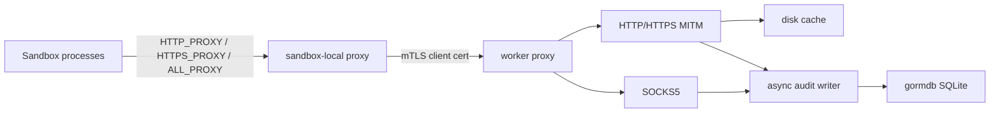

# Proxy Design

## Package Role

`proxy` is the reusable worker-scoped network proxy component. The worker-agent
will run it and use its certificate preparation output when launching sandboxes,
but the proxy package owns certificates, traffic policy, HTTP/SOCKS handling,
disk response caching, and audit persistence.

The component lives in the root module so worker-agent and future launch wiring
can share stable configuration and certificate material contracts without
depending on server internals.

## Architecture

The worker proxy requires client certificates. Client identity is derived from
the verified mTLS certificate and is attached to every HTTP audit row, SOCKS
connect row, header injection decision, destination policy decision, cache event,
and upgraded-stream audit row. The sandbox-local proxy is the intended place to
accept localhost traffic from sandbox processes and forward to the shared worker
proxy with the sandbox's client certificate.

Client identity is the tenant boundary. Rules that can expose or restrict data
must support `ClientIDs`, and audit reads must support querying by client ID so
worker-agent code can retrieve data for a specific sandbox without scanning or
mixing unrelated sandbox traffic.

## Certificate Model

Certificate preparation is independent of running the proxy:

- MITM CA: signs per-host certificates for intercepted HTTPS.
- mTLS CA: signs the worker proxy server certificate and per-client
  certificates.
- Worker server certificate: presented by the worker proxy listener.
- Client certificates: issued per sandbox/client identity and distributed with
  sandbox launch metadata.

`PrepareCertificates` creates or reuses this material and returns filesystem
paths plus proxy environment values. Callers may run it before the proxy process
starts so certificates can be distributed during sandbox setup.

## Persistence

Audit persistence uses `gormdb` with SQLite by default. The proxy package owns
schema migration and repository behavior. `gormdb` owns pool construction and
SQLite pragmas.

The HTTP request path must not block on audit database writes. Audit calls enqueue
bounded events to a background writer. If the queue is full, the recorder drops
the event and increments drop counters instead of stalling network traffic.

Normal HTTP request and response bodies are streamed to disk spool files. SQLite
stores only relative spool paths, byte counts, format names, metadata, redacted
headers, cache state, policy decisions, and authenticated client identity. Large
response assets remain in the disk cache, not SQLite.

HTTP 101 upgrades are supported as generic upgraded streams. The proxy preserves
the upgraded tunnel, spools raw bidirectional payload frames to disk, and audits
protocol type, spool file metadata, drop counters, and client-to-server and
server-to-client byte counts. Raw upgraded payloads are not persisted to SQLite.

## Runtime Policy

Header rewrite rules are deterministic. Exact host matches win before wildcard
rules; wildcard rules are sorted by specificity and then pattern text. Audit
records store applied header names and rule identifiers, not injected secret
values.

Runtime policy updates are file-driven. The proxy exposes `ApplyConfig` and a
JSON config file watcher that hot-swap allowlist and header rules. It does not
expose an HTTP configuration API; listener, certificate, audit database, and
cache settings remain startup-only.

Header audit redaction covers both credential-like header names and every header
name touched by a rewrite rule. This prevents injected secret values from being
persisted even when a configured header name does not look sensitive.

The control API is read-only and exists for worker-agent audit retrieval. It
lists HTTP and SOCKS audit rows by client ID, reports dropped audit counters,
and serves body and upgraded-stream spool files only through the owning HTTP
audit row and client ID. When `Control.TrustPublicKey` is configured, every
control request must use a PASETO v4.public bearer token for audience
`discobox-proxy-control` with `audit:read` scope. The proxy stores only the
public verification key; worker-agent owns the private signing key.

SOCKS5 remains a TCP tunnel. It is authenticated by the same mTLS listener and
records connect attempts, destination, allow/deny, and client identity, but it
does not inspect tunneled payloads.
