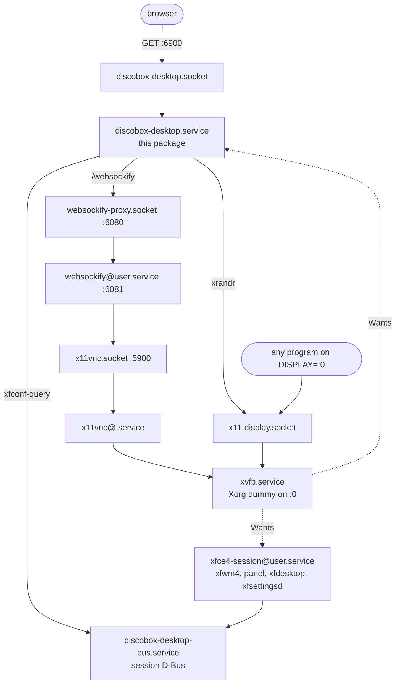

# desktop

The sandbox's desktop, as a page: a branded viewer on `127.0.0.1:6900` that
embeds noVNC, keeps the X screen the same shape and density as the browser
window it is being watched in, and turns a box drawn on that desktop into
something the agent working in the same sandbox can read.

It is the one *user-facing* thing this module serves. Everything else here is an
API a control plane calls; this is a page a person opens.

## How it hangs off the desktop units

The desktop stack is socket-activated, so nothing is running until somebody
wants it. This service joins that stack rather than replacing any of it.



Two edges are the point of the arrangement:

- **`Wants=` from `xvfb.service`.** Whatever starts X — a program that merely
  talked to `:0` — pulls this service up as its companion, so the viewer is
  already there when somebody goes looking for the port. The `boot` package
  writes that drop-in, because it needs the resolved sandbox user's name.
- **No `Requires=xvfb.service` in the other direction**, and nothing else that
  would pull it in either. Reaching this port is not a request for a desktop —
  see below. The `xrandr` edge in the diagram is on demand, not at startup: it
  is a browser that has loaded the page asking for a framebuffer size.  Ordering
  `After=` is kept only so the reverse case, where X came up first and pulled
  this service in as its companion, does not race.

The unit runs `discobox-sandbox-agent desktop` as the sandbox user, through a
`User=` drop-in the same `boot` flow writes, because the annotation record lives
under that user's home and the agent that reads it back runs as the same user.

## One session bus

`discobox-desktop-bus.service` is a `dbus-daemon --session` on a fixed path,
`/run/discobox/desktop/bus`, that both the Xfce session and this service name in
their unit environment.

It exists because **Xfce keeps its settings in xfconf, and xfconf is only
reachable over a session bus.** The density this package sets is an xfconf
property (see below), so the viewer has to reach the same xfconf the session is
reading — which rules out the bus `dbus-run-session` or `startxfce4` would hand
xfce4-session privately. A fixed path in a systemd `RuntimeDirectory` is what
makes it shareable: systemd creates the directory owned by the sandbox user, so
the daemon can bind inside it, and removes it on stop, so a restart never finds
its own stale socket.

It is not exported into the sandbox's environment. A program a person starts
from a terminal inside the desktop inherits it from the session; one started
from a sandbox terminal gets no session bus, as in an image with no desktop, rather than an
address that would be dead whenever nobody had opened the desktop.

## One port

The page, the noVNC client, the brand assets, the VNC websocket and the
annotation API are all on 6900. `/websockify` is a reverse proxy onto the
existing 6080 socket rather than a second connection the page opens itself.

| Route | Does |
| --- | --- |
| `GET /api/session` | Limits, handoff prompt and record path; geometry only if X is already up. |
| `POST /api/display` | CSS box in, framebuffer out (`Display.Resize`). |
| `POST /api/scale` | Device scale; `auto` marks the viewer's detection (`Display.SetScale`). |
| `GET` `POST /api/feedback`, `PATCH` `DELETE /api/feedback/{id}` | List, capture, edit or tick, delete a note. |
| `GET /shots/{name}` | A note's pictures. |
| `/websockify` | Reverse proxy onto 6080. |

That is a deliberate cost — one more hop on the pixel path — bought for one
property: **the desktop is one port to forward and one URL to open.** A page on
6900 pointing its socket at 6080 works locally and breaks the moment either port
is tunnelled without the other.

Port 6080 keeps its own contract for the client that already speaks it,
including the `?x=&y=` resize this package does not use.

## Size follows the window; scale does not

Two properties, deliberately on different footings.

**Size** is the framebuffer, and it tracks the browser window continuously. The
page sends the frame it has in CSS pixels; `Display.Resize` multiplies by the
scale, rounds to a mode boundary and sets it; the page sizes its frame from what
comes back. All the arithmetic is on the server, so there is no pair of
roundings that has to agree forever. Because x11vnc runs with `-xrandr resize`,
the change reaches an attached client as a desktop-size update and the desktop
follows the window on a live session — reconnecting on a query string, which is
what port 6080's client does, would drop the session on every drag.

Every distinct size becomes a modeline that outlives the process, so sizes are
bucketed to 64px and the table is capped. Reaching the cap **evicts the oldest
mode**; it must not refuse the resize. The reachable width × height grid is far
larger than the cap, so a long session finds new sizes as a matter of course, and
erroring would wedge the viewer at whatever size it happened to be — permanently,
since a failed resize is not retried at the same window size. Eviction forgets
unconditionally and asks the server to drop the mode best-effort, which is the
right way round: this table is what has to stay bounded, and the server refuses
to delete a mode in use. A mode the server kept is found again by the existing
`known` check, which re-attaches it instead of recreating it.

**Scale** is an integer, decided once per session, and it is the desktop's
HiDPI-ness. It drives four things that must agree:

| | set through | reaches |
| --- | --- | --- |
| framebuffer × scale | `xrandr` | the browser, which draws it back down onto physical pixels 1:1 |
| `Xft/DPI` = 96 × scale | `xrandr --dpi`, xfconf → xfsettingsd | Xft text, Chromium, Qt |
| `GDK_SCALE` / `GDK_DPI_SCALE` / `QT_AUTO_SCREEN_SCALE_FACTOR` / `XCURSOR_SIZE` / `DISCOBOX_DESKTOP_SCALE` | `scale.env` | GTK, Qt, the cursor, Chromium's flags — at process start |
| xfwm4 theme `Discobox` / `Discobox-Nx` | xfconf | window decorations, live |

Integer only. A fractional scale is a fractional downscale in the browser —
soft, which is the opposite of the point — and `GDK_SCALE` takes integers
anyway, so 1.5 would scale text and not widgets.

**The starting scale is 2×**, or whatever `scale.env` remembers
(`StartingScale`). 2 because HiDPI is the ordinary screen to watch from, so the
common case never pays a restart, and because the scale is not only the
desktop's: every shell the agent starts sources `scale.env`, so the default is
what the agent's own programs draw at. The boot flow writes it before systemd
starts (`boot.seedDesktopScale`), keeping whatever value the file already holds
— including a 1 an earlier image wrote as its default, which the file cannot tell
from a settled scale; existing sandboxes are deliberately left where they are.
The viewer cannot be the first writer: it is
socket-activated and starts only when a browser or an X client first reaches
the desktop, seconds after the harness's login shell has sourced `profile.d`
and found no file.

Two consequences are accepted rather than fixed, because both come from the
scale travelling as environment, which nothing can take back from a running
process or scope to one X server:

- **A later change does not reach the agent's shells.** When a viewer on an
  ordinary screen moves the desktop to 1×, a GTK program the agent launches
  afterwards still holds `GDK_SCALE=2` and `GDK_DPI_SCALE=0.5` against a 96 DPI
  server: 2× widgets around 1× text, the mixed state nothing else may cause.
  Chromium follows the file (its launcher re-reads it) and xterm and Qt follow
  the server, so it is GTK that goes wrong. The session is restarted for exactly
  this; an agent's shell cannot be restarted under it.
- **Another X server inherits the desktop's toolkit variables.** A GTK program
  under `xvfb-run` or an Xvfb of its own gets them too, at that server's 96 DPI,
  so it draws the same mixed state; `GDK_SCALE=1 GDK_DPI_SCALE=1` on that
  command is the way out. Chromium is scoped: its launcher forces the factor
  only for a headed browser on `:0`, and anywhere else drops the inherited
  `GDK_SCALE`/`GDK_DPI_SCALE` before it starts, because Chromium multiplies
  `GDK_SCALE` into its own scale — on a private Xvfb, devicePixelRatio 2 with
  them inherited and 1 without.

`SetScale` writes the durable half first and commits `d.applied` last.
`scale.env` is written before anything that needs an X server, because that file
is what the session and every login shell read when they start and a scale asked
for while X is down should still be the one X comes up at. **`d.scale` is
committed with the file, not after the X work** — the two are one fact read by
different consumers, the file becoming `GDK_SCALE` for the session while
`d.scale` is what `Resize` multiplies the framebuffer by and what the DPI is
asserted from, and a change whose X half times out against a cold display must
not leave them disagreeing. That is the mixed-channel state
[`sandbox-agent/REVIEW.md`](../REVIEW.md) forbids:
2× widgets around 1× text.

`d.applied` is what waits for all of it, and it is the flag that makes a failure
repairable: the unchanged-value short-circuit needs it, so a half-finished change
is retried rather than returned early forever. `d.chosen` is set up front — a
person decided, whether or not applying it then worked — and it outranks the
viewer's detection on the **value only**: an auto report from a chosen display
keeps the chosen scale and then carries on, because a page load is the only
thing that happens on its own and it has to be able to finish an unapplied
choice.

The response to `POST /api/scale` carries `restarted` alongside the geometry.
Picking a density that is already in effect changes nothing and restarts
nothing, and neither does a change made before the session is released — so a
viewer that always warned about losing open windows would be wrong most of the
times it said it.

### The viewer must not start the desktop

`discobox-desktop.service` is socket-activated, so a TCP connection to 6900
starts the *viewer*, and it must start nothing else. Any `xrandr` call connects
to `/tmp/.X11-unix/X0`, which socket-activates the X server, and `xvfb.service`
pulls the Xfce session up behind it — so a viewer that touched X while starting
would let anything that opened a connection to 6900 and went away (a health
check, a port scan, a stray probe) bring up an X server, a window manager, a
panel and a VNC server in a sandbox where nobody had asked to see a desktop.

**Nothing on the viewer's startup path may touch X.** The scale it needs at boot
is a file, not a screen: `scale.env` records what the last run settled on, and
`AdoptScale` writes it back without an X server anywhere in the call. Reading
the display is behind `GeometryIfUp`, which answers "there is none" rather than
conjuring one, so describing the desktop over `/api/session` starts nothing
either. `TestSettlingTheScaleNeverTouchesTheDisplay`,
`TestARememberedScaleIsAdoptedWithoutADisplay` and
`TestTheSessionEndpointDoesNotStartADisplay` pin this against a display that
does not exist.

X starts when something genuinely needs pixels: a browser that has loaded the
page asking for a size, the VNC socket being opened, or any program in the
sandbox talking to `DISPLAY=:0`. That last one is the case the whole
socket-activated stack exists for.

So a bare TCP connect to 6900, a `GET /` and a `GET /api/session` all leave `xvfb.service` and
`xfce4-session@` inactive, while `POST /api/display` and a plain `DISPLAY=:0
xrandr` each bring the whole desktop up.

Those first three are what a *probe* does — connect, maybe fetch, go away — and
they are the case this rule is about. A real browser is not one of them: `boot()`
calls `reportScale()` before it asks for a size, and even the no-op path through
`SetScale` ends in `geometryLocked`, whose `xrandr --query` starts X. That is
correct and deliberate. Somebody whose browser is running this page **is** asking
for a desktop; the thing that must not start one is a connection that never
became a page.

**The X server must not delete its own activation socket.** `x11-display.socket`
binds `/tmp/.X11-unix/X0`; Xorg runs `-nolisten local` and never creates that
path, so `xvfb.service`'s `ExecStartPre` cleans up only `/tmp/.X0-lock`.
Sweeping the socket path as stale state would unlink the file systemd had
already bound: the socket unit would still report itself listening and the
first client through would still work, but every later `DISPLAY=:0` would get
`Can't open display :0` until something restarted the socket unit. `TestTheXServerDoesNotDeleteItsActivationSocket`
reads the units and pins it; `TestTheViewerDoesNotPullUpTheDisplay` pins the
absence of a `Requires=` in the other direction.

### Why the session still waits for the viewer

`xfce4-session@.service` is ordered `After=discobox-desktop.service`, and the
viewer is `Type=notify`, so the session cannot start until the viewer has
written `scale.env` — which is what the session reads `GDK_SCALE` from. The
handshake is purely about that file. It costs nothing and waits for nothing,
because the viewer signals ready as soon as the file is written.

In the image the boot flow has already written the same value, so this
ordering is a backstop for a viewer run anywhere else rather than the source of
the file.

A sandbox whose first ever desktop is watched from an ordinary screen starts its
session at 2× and restarts it at 1× when the browser says so. That is one
restart on one boot, against not starting an X server at all in every sandbox
that never opens a desktop.

### Changing the scale afterwards

A change once the session is running cannot reach `GDK_SCALE`, so the session is
restarted — through `xfce4-session-logout` over the shared session bus, because
the viewer runs unprivileged and cannot restart a system unit, and
`xfce4-session@.service` has `Restart=always`. Windows that were open do not
survive it, which is what the viewer's toast says. Before release this costs
nothing: the session has not started, and it will read the file just written.

The window decorations are the exception that proves the rule. xfwm4 draws from
fixed-size pixmaps and its only built-in HiDPI accommodation is a hardcoded
`Default-xhdpi` substitution that reaches no custom theme, so the image ships
the art pre-scaled and `decorationTheme` picks the variant. That is a single
live channel with no launch-time half, so the decorations follow a scale change
on the windows already open.

### The session applies the server half itself

`scale.env` is only the launch-time half of a scale. The density, the cursor
size and the decoration theme live in xfconf and on the server, and `SetScale`
puts them there only when a viewer calls it. X also starts when any program
talks to `:0` with no viewer at all, and a session started that way would run
`GDK_SCALE=2` programs against the image's 96 DPI.

So `xfce4-session@.service` runs `discobox-sandbox-agent desktop
prepare-session` as an `ExecStartPre`: it reads the starting scale and applies
the server half before the session's first program starts. It writes what
`SetScale` writes, from the same file, so a session restarted by a scale change
just re-applies it. It never sizes the framebuffer, which is the viewer's, and a
restart racing the viewer's resize must not undo it. The `-` prefix keeps a
failure from costing the desktop.
`TestTheSessionPreparesTheServerScaleBeforeStarting` pins the unit.

### Verified

Rendered at 1× and at 2× and compared: the 2× framebuffer downscaled by half
differs from the 1× framebuffer by a mean of **1.12/255**, and the panel's
"Home" label measures 37×10 against 74×20. Same desktop, twice the density.

## How anything knows the desktop is here

The viewer is socket-activated, so nothing runs until a browser asks for the
page. That laziness is easy to lose: the port watcher classifies a port by
connecting to it, and a connection to 6900 *is* the activation — one
classification probe boots the X server, the Xfce session, the VNC server and
the viewer, in every sandbox, whether or not anybody wanted a desktop.

So the port is neither discovered nor probed. The image declares it, in the same
format a repository's `.discobox/services` uses and read by the same code
([ADR 0094](../../docs/adr/0094-an-image-declares-services-in-the-format-a-repository-does.md)) —
`sandbox-agent/image/services/10-desktop.sh`, installed at
`/usr/local/share/discobox/services`:

```sh
#---
# id: ai.discobox.desktop
# name: Desktop
# description: The sandbox's graphical desktop, in a browser tab.
# port: 6900
# protocol: http
# start: never
#---
```

`protocol:` is reported instead of connecting to the port, which is the whole
point. `start: never` says the sandbox starts nothing here — systemd does, on
demand — so the file needs no shebang and no executable bit and is not listed as
a broken service.

`id:` is stated rather than derived from the filename because it is what a
client matches on: the port arrives as `serviceId: ai.discobox.desktop` with
`serviceName: Desktop`, so a client draws a Desktop link in its chrome instead
of listing an HTTP port on 6900. Renaming the file must not change it, and the
`ai.discobox.` namespace is reserved so a repository cannot declare it and take
the link. The constants are `sandboxservices.DesktopID` and
`sandboxservices.IDPrefix` in the root module; the string itself is part of the
API contract for clients outside the sandbox.

The cost of declaring it in the image's filesystem rather than its manifest
label is that the control plane cannot know a harness has a desktop until a
sandbox has booted: labels are resolved at registration without pulling
filesystem layers. The link is only useful against a running sandbox anyway.

### The state is the way back

When the connection dies the status itself becomes the reconnect control — a
real `<button>`, so it is reachable by keyboard and announced as one, and
`disabled` rather than merely unstyled at every other time, so it cannot be
pressed to no effect.

The reconnect button in the far corner stays, for forcing a reconnect on a
session that is up. But it is not where anyone is looking when the desktop has
just gone: they are looking at the thing that says it is gone. A control that is
live but inert the rest of the time teaches people not to press it, which is why
this one only offers itself when there is something to offer.

## What the desktop opens with

Three icons: **Home**, drawn by xfdesktop itself from `show-home` in
`xfce4-desktop.xml`, and **Terminal** and **Web Browser**, which are launchers
seeded into `~/Desktop` by `boot.seedDesktopLaunchers` from
`image/desktop/launchers`.

Seeded on the directory being absent, not per file: `~/Desktop` belongs to
whoever is using the sandbox, and somebody who deletes the browser icon has said
something a per-file check would undo on the next boot. It cannot ride on
`/etc/skel`, which `seedHome` copies only when home is empty — home is a data
volume, so every sandbox that already exists would never get them. The files are
written `0755` because xfdesktop draws a launcher as a launcher only when it is
executable.

Chromium is the browser, and Debian resolves a browser three separate ways —
all three are set, because the desktop uses a different one than a script does:

| | file | used by |
| --- | --- | --- |
| Xfce preferred applications | `/etc/xdg/xfce4/helpers.rc` | `exo-open`, so the panel, Thunar and xfdesktop |
| XDG defaults | `/etc/xdg/mimeapps.list` | `xdg-open` and every GIO client |
| Debian alternatives | `x-www-browser` | `sensible-browser` and scripts |

Two things Chromium needs beyond that, both in `/etc/chromium.d`, which Debian's
launcher sources:

- **`--force-device-scale-factor`.** Chromium derives a scale from `Xft/DPI`
  *and* from `GDK_SCALE` and multiplies them, so a 2× desktop would launch a
  4× browser. `GDK_DPI_SCALE` corrects the same double-count for GTK's text, but
  Chromium does not read it. Naming the scale outright stops the inference, and
  is why `scale.env` carries it as a plain number. Only for a headed browser on
  `:0`: the file exists in every sandbox, and a headless one would otherwise
  come back with twice the pixels it asked for. Anywhere else the launcher also
  drops the desktop's `GDK_SCALE`, which Chromium would otherwise multiply in.
- **`--no-sandbox`, but only when probed.** `chromium-sandbox` is a Recommends,
  which `--no-install-recommends` leaves out, and without it Chromium refuses
  to start at all, so the Dockerfile names it. The flag is added only where
  `unshare --user --pid` fails — a container's seccomp profile commonly refuses the namespace clone
  even to the setuid helper. Nothing is given up where the probe succeeds.

## The annotation record

`~/.discobox/desktop-feedback/` — outside the repository, so nothing here ever
shows up in `git status`, and on the home data volume, so notes survive a
sandbox restart.

```
feedback.md               one section per note, checkbox in the heading
shots/df-0001.png         the marked region, cropped from the framebuffer
shots/df-0001-screen.png  the whole desktop, the region outlined on it
```

**The Markdown is the store, not a rendering of one.** There is no sidecar
index, because what an agent writes after acting on a note — its reply — would
then have to be written back into a second file it does not know about, and the
two would disagree the first time it wasn't.

That choice sets the three rules `feedback.go` follows:

- **Reads are tolerant.** A section this parser no longer recognizes is dropped
  from the listing, never fatal. A listing that failed because somebody rewrote
  a heading would take the capture button down with it.
- **New notes are pure appends.** A file an agent has reformatted still takes
  the next one, and numbering continues from what the file holds rather than
  from a counter in memory.
- **Edits are surgical.** Changing or deleting one note rewrites the bytes of
  that section and nothing else, located by the byte span `parse` reports
  alongside each item. There is deliberately no "rebuild the file from the
  parsed items" path: the agent writes in here too, and regenerating would
  silently delete everything this parser did not understand. A test appends
  prose under a heading of its own and asserts an edit leaves it byte-identical.

Deleting the highest-numbered note frees its number for the next one. That
follows from the file being the only state — not reusing it would need a counter
kept beside the record, which is the sidecar this design rejects, and which
would disagree with the record the first time somebody edited by hand.

### Two pictures of one moment

A capture saves both the cropped region and **the whole desktop with the marked
rectangle drawn on it**, dimmed outside the box the way the marquee dims while
it is being dragged. They are separate files (`df-0001.png` and
`df-0001-screen.png`) and separate fields, and either may be absent.

Neither answers for the other. A crop of a misaligned icon is unreadable as a
location — it could be any toolbar on any window — and the whole desktop at
desktop resolution is too coarse to see two pixels of misalignment in. The agent
picks whichever the question needs, and so does whoever opens the note weeks
later; the dialog shows the full screen first, because *where was this* is the
thing that has gone, and switches to the crop for the detail.

Both are drawn by `web/capture.js`, which is a module of its own rather than
part of `app.js` for one reason: it is the only code on the page that produces
something durable, so it is the only code on the page worth testing directly.

**How it is tested.** `TestTheCapturesABrowserDrawsAreTheBytesTheStoreKeeps`
(`capture_e2e_test.go`) runs headless Chromium against the
real server, imports `/capture.js` the way the page does, paints a framebuffer
with a known pattern, and posts what the real functions return through the real
`POST /api/feedback`. Go then decodes the PNG the store wrote and asserts
pixels. Nothing is stubbed, so the drawing, the data-URL encoding, the handler's
decode and the file on disk are all inside one test — which matters here because
canvas drawing is unreachable from Go and jsdom has no canvas, so no other test
reaches the pictures.

The assertions are about the properties that make the picture usable, not about
an exact image: the region is left **exactly** as it was, everything outside it
is dimmed, and the outline sits entirely outside the region. That last one is
the easy bug — a box drawn on the region covers the misalignment it is pointing
at. Each is confirmed to fail against a deliberately broken `capture.js`.

The test skips when there is no Chromium on `PATH`; `DISCOBOX_TEST_BROWSER`
names one explicitly.

`TestThePageBootsInABrowser` rides the same harness for a cheaper question: does
the page come up at all. `app.js` fetches `/api/session` at import, before it
does anything else, so that request arriving proves the document parsed, every
import resolved and nothing threw on the way in. It is the failure that is
otherwise invisible — a module with no route behind it leaves a blank screen and
writes nothing to the server log. Only noVNC is stubbed there, because it ships
in the image rather than in this repository.

### A note's words cannot break the file

Two line beginnings are structural, and a note's own words can produce either.
`escapeBody` writes both with a leading backslash, which Markdown renders as the
literal character, and the parser undoes it on the way back.

- **`#` is a heading**, and any heading that is not an item ends the item —
  otherwise prose an agent wrote under a heading of its own is read back as the
  previous note's comment. Unescaped, a note reading `# TODO` would truncate its
  own section and orphan every note after it, permanently, since the next write
  splices around a section that then ends in the wrong place.
- **`>` is a reply**, and prose after a reply belongs to it — so, unescaped, one
  pasted blockquote, quoted email or diff context line would move the whole
  remainder of the comment out of the comment, permanently from the first read,
  because the next write re-emits it as a real reply.

The unescape happens in `splitReplies`, on the person's words only, and not while
the body is collected: the `>` has to still be hidden when that switch reads the
line, or the note's own quoted words are reclassified as a reply again. Only the
two sequences `escapeBody` writes are undone — this file is meant to be editable
by hand, and a reader that rewrote arbitrary backslashes would be changing words
nobody asked it to touch.

Both rules are tested on the **untrimmed** line, and the header's reply example
is shown at column 1 for the same reason. These are one contract with two sides:
the reader decides what a reply is, and the header is the only place the agent
writing one is told. If they drift apart the failure is silent twice over — an
indented reply lands in the person's comment, and `Update` then deletes it
outright, since it replaces the comment wholesale.
`TestTheReplyFormatTheHeaderTeachesIsTheOneTheReaderAccepts` reads the example
out of `header` itself, so the two cannot drift.

### A note is a moment, not a place

Saved notes are **not** drawn back onto the desktop. A rectangle placed on the
live framebuffer would quietly claim the note still applied there — and by then
a window has been dragged, a page has scrolled, the resolution has changed, so
the box would point at whatever happened to be under those coordinates rather
than at what the note was about.

The screenshot is the record. Opening a note from the list opens a dialog
showing that picture, the region it was cut from, and the framebuffer size it
was captured against — which is what makes the coordinates mean anything, and
what makes it plain they are not coordinates on the desktop as it stands. The
marquee is still drawn while a box is being dragged, and cleared the moment the
note is saved.

The dialog is also where a note is edited, ticked and deleted: the list row is a
summary, and the thing worth acting on is the picture.

### Who closes a note, and how the agent answers

The viewer offers the tick, in the dialog and nowhere else; the agent is not
given it. `discobox-review`'s skill puts the rule plainly — *"You never close
your own comments. If you resolve your own threads there was no review, only a
checklist"* — and it applies here for the same reason. The agent's half is
making the change; saying the change is right is the half that has to come from
whoever asked for it.

Which means the agent needs a way to answer that is not the checkbox, because
"fixed, the padding was on the wrong element" and "cannot reproduce, they look
aligned to me" are different answers and the box says neither. So a note carries
**replies**: Markdown blockquotes under it, attributed and dated on their first
line.

    > **agent** 2026-01-01T12:00:00Z
    > Fixed: the padding was on the wrong element.

The agent writes them by writing Markdown, which is its whole interface here —
there is no endpoint for it. `splitReplies` divides a section's body at the
first blockquote, so replies are never read as part of the person's own words,
and `renderState` re-emits them, so the person rewording their note does not
delete the answer to it; `TestAnAgentReplySurvivesThePersonEditingTheirNote`
pins that.

That is also why this record is **not** a `discobox-review` review, despite the
obvious kinship. A review comment is located by `path:line` in a diff measured
from a base ref, and approves files; a desktop note is located by a rectangle on
a framebuffer at a given resolution and is about how the running program looks,
not about a change. Converging them would mean `discobox-review` growing a
polymorphic locator and attachments — a proposal for `discobox-ai/review`, which
this image pins by `REVIEW_VERSION`, rather than something to bolt on here.

The handoff is a line of text the page offers to copy, naming the file's
absolute path. Nothing notifies the agent; a person does.

## Assets

| Path | Served from | Why not embedded |
| --- | --- | --- |
| `/` `/app.css` `/app.js` `/capture.js` | `go:embed web` | Owned here, versioned with the code. `TestEveryModuleThePageImportsIsServed` keeps the routes in step with `app.js`'s imports. |
| `/novnc/` | `/usr/share/novnc` | Debian's `novnc` package, 1.7MB of ESM the page imports directly. |
| `/brand/` | `/usr/local/share/discobox/brand` | The repository's `assets/brand`, which this nested module's `go:embed` cannot reach up to. A second copy would be a second thing to keep in step with Illustrator. |
| `/shots/` | the annotation record's `shots/` | Written at run time, into the sandbox user's home. |

## The desktop inside the frame

What this page shows is Xfce, wearing the same palette the page does. The image
side of that lives in [`image/desktop`](../image/desktop) — the Xfce defaults,
the derived GTK and xfwm4 theme, the backdrop — and is described in
[`sandbox-agent/DESIGN.md`](../DESIGN.md).

Two of its decisions are made against *this* page and belong here:

- **The panel is on the bottom edge.** This page's own chrome is a bar across
  the top; a desktop with a panel there too would stack two bars into one thick
  band, and the desktop would start an inch further down than the window
  suggests.
- **The focused window is outlined in the mark's purple**, which is what this
  page does to the desktop it frames. It is also the only thing that can carry
  focus here: both titlebar states have to stay near-black to sit under the
  panel, and near-black against near-black is not a distinction.
