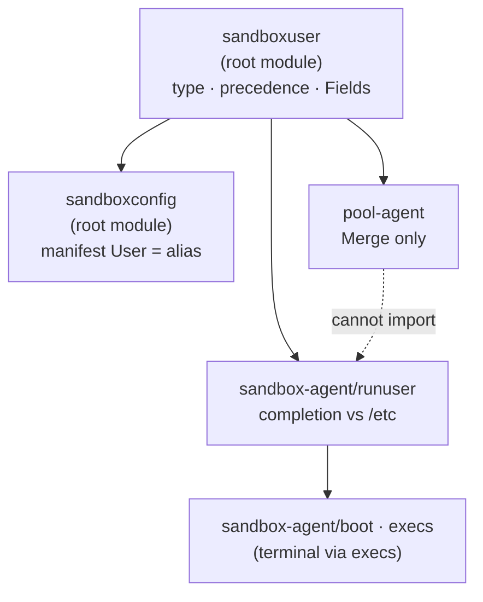

# sandboxuser

The identity a sandbox process runs as: the type, the precedence between the
layers that describe it, and the vocabulary for saying which parts of it a
caller needs.

Decision records: [ADR 0025](../docs/adr/0025-the-sandbox-user-is-one-contract-resolved-inside-the-sandbox.md)
(the rules), [ADR 0033](../docs/adr/0033-user-resolution-is-one-layered-resolver-with-declared-gaps.md)
(where they live).

## Why it is in the root module

Completing an identity means reading the image's own `/etc/passwd` and
`/etc/group`. Only code inside the sandbox can do that, so completion lives in
[`sandbox-agent/runuser`](../sandbox-agent/runuser/DESIGN.md) and this package is
the half that is safe everywhere else.

The split is load-bearing, not tidy. `pool-agent` imports this module and
*cannot* import `sandbox-agent`, so "the host must not resolve" is enforced by
the build graph rather than by a rule someone has to remember.

## The API

| Name | What it is |
| --- | --- |
| `User` | The identity. Ids are `*int64`; `GroupName` is the primary group by name, exclusive with `GID`. |
| `Layers{Image, Manifest, Request}` | The descriptions, most general to most specific: the image's own account, `sandbox.json`, one exec/terminal call. |
| `Merge(Layers) User` | Precedence only, per facet. No lookups. |
| `Named` · `NamesIdentity` · `NamesPrimaryGroup` · `NamesGroups` | Whether a layer says anything, overall or per facet. |
| `Fields` · `Credential` · `Complete` | Which fields a caller requires. `Credential` is uid+gid+groups (enough to `setuid`); `Complete` adds name and home. |
| `UnresolvedError` · `Unresolved` | A required field that could not be determined, naming it. Built by `runuser`. |
| `(*User).Validate` | Rejects the one in-layer contradiction: both `GID` and `GroupName`. |
| `(*User).Clone` · `ID` | Deep copy that trims strings; pointer to a known id. |

## The three facets

An identity is three independent choices, each taken whole from the most
specific layer that names it:

| Facet | Fields | Crosses an identity change? |
| --- | --- | --- |
| Who to run as | `Name`, `UID`, `HomeDirectory` | — |
| Primary group | `GID` or `GroupName` | **No** |
| Supplementary groups | `AdditionalGroups` | Yes |

Choosing each facet whole is what makes a partial request expressible: "the
usual user, but in group `docker`" and "the usual user, plus these groups" each
say something about one facet and nothing about the others.

The primary group does not outlive the identity above it — inheriting a gid
across a change of user would run user A's process in user B's default group.
Supplementary groups do, deliberately: they describe what the *sandbox* may
reach rather than who it is, so naming a user must not silently strip them.

## Rules

- **One predicate.** `Named` (and the per-facet `NamesIdentity` /
  `NamesPrimaryGroup` / `NamesGroups`) is the only test for "did this layer say
  anything". Adding a field to `User` means teaching that function, not five
  call sites.
- **Absent is nil for an id.** Never `0` (which is root), never `-1`. `-1`
  appears only as an argument to `chown(2)`, whose own vocabulary it is. A
  string field is absent when empty after trimming, so whitespace never reads
  as present.
- **An empty group list is not a choice.** Groups are all-or-nothing, so "none
  named" inherits and only a non-empty list replaces.
- **Merge cannot guess**, because it cannot look anything up. That is the point
  of it being a separate function from `runuser.Resolve`.
