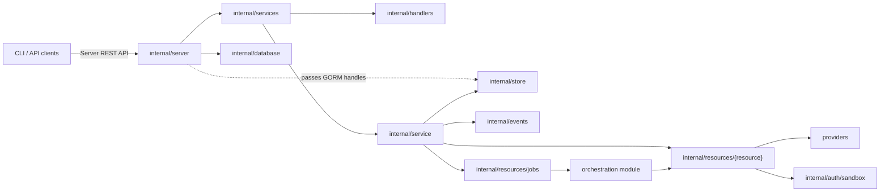
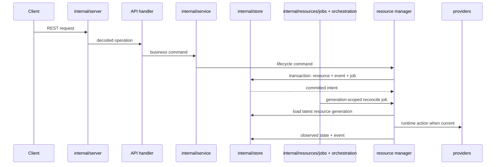

# Server Module Design

The server module is the Discobox control plane implementation. It owns HTTP
composition, single-database persistence, project events, API-facing business logic,
and durable reconciliation submission. Stable contracts and generated API types
come from the root module. Provider contracts and implementations live in this
module so providers can depend on server-owned persistence and manager contracts.

## Module Role

Keep the server as the control plane:

- Persist desired state before external runtime side effects.
- Publish project events and submit durable reconcile jobs in the same intent
  transaction.
- Run generation-scoped reconciliation; cancel stale jobs when newer intent
  supersedes them.
- Treat provider packages as runtime adapters, not as a place for server policy.

## API Boundary

The Server REST API contract is owned by the root module at
`api/openapi/server.yaml`. Server handlers should implement that contract instead
of deriving the contract from Go route registration.

Current transition state:

- `internal/server.NewRouter`, `NewApp`, and `NewOpenAPIRouter`
  compose chi routers around the generated OpenAPI server scaffold.
- `internal/handlers` adapts generated operations to API-facing services and
  constructs the generated OpenAPI server.
- `internal/services` owns service interfaces and aliases generated server DTOs for
  server packages during the generated-server migration.
- Project stream websocket and SSE routes stay hand-wired in
  `internal/projectstream`; generated OpenAPI scaffolding does not own streaming
  transport mechanics, and ogen skips `text/event-stream` operations.

New endpoints should prefer the contract-first generated path. Keep streaming
transports hand-wired unless the generator can own them behavior-compatibly.

### Hand-Wired Sandbox Proxies

Sandbox proxy routes are project-scoped control-plane routes and are authorized
by `ProjectAuthorizer` before the proxy handler runs. They remain hand-wired in
`internal/server` because they forward arbitrary methods, headers, path suffixes,
and query strings through a provider-supplied HTTP client lease instead of using
generated request/response DTOs.

Current proxy routes:

- `/projects/{projectId}/sandboxes/{sandboxId}/git-repositories/{repository}.git...`
  is exposed as `/projects/{projectId}/sandboxes/{sandboxId}/git-repositories/*`
  and forwards to the worker-agent git route
  `/api/project/{projectId}/worker/{workerId}/sandboxes/{sandboxId}/git-repositories/{repository}.git...`.
- `/projects/{projectId}/sandboxes/{sandboxId}/http/{port}/{path...}` forwards
  to the worker-agent route
  `/api/project/{projectId}/worker/{workerId}/sandboxes/{sandboxId}/http/{port}/{path...}`.
  The future worker-agent implementation owns translating that worker-local
  route to `http://localhost:{port}/{path...}` inside the sandbox.
- `/api/projects/{projectId}/sandboxes/{sandboxId}/harness-terminals...` forwards
  to the sandbox-agent terminal runtime API with the same path. The worker-agent
  forwarding layer and sandbox-agent implementation own serving that API; the
  server owns project authorization, scope selection, and lease/token injection
  only.

Proxy handlers must request the narrow worker-agent token scopes needed for the
flow. The git proxy requests `sandbox:read` and `sandbox:write` because Git HTTP
uses method and service-specific read/write behavior. The sandbox HTTP port
proxy requests only `sandbox:http`; worker-agent support for this route must
require that scope rather than accepting the broader sandbox read/write scopes.
The harness-terminal proxy requests `terminal:read` for listing and resource reads
and `terminal:write` for create, attach, and delete because attach streams carry
input, resize, and signal frames.

Authorization must be decidable from request attributes available before body
interpretation: authenticated principal, method, route/path parameters, query
parameters, headers, and resource ownership loaded by those attributes. Do not
require request-body fields to decide whether the caller may access the target
resource; put authorization identity in the URL or other request metadata instead.

Narrow exception: `POST /api/workers/register` is a bootstrap credential
redemption flow, not normal resource access. Its body carries the project ID,
worker ID, optional sandbox compatibility ID, one-time bootstrap token, and
public key because a worker does not yet have a runtime principal or token. The
service may use those body fields only to redeem the short-lived, one-time
bootstrap token against the bootstrapped worker and issue the first runtime
worker token. Subsequent worker authorization must use request metadata and the
authenticated worker principal, such as `/api/workers/{workerId}/status`.
Worker-observed sandbox container loss is reported at
`/api/workers/{workerId}/sandbox-removed` under the same worker-principal rule;
the sandbox ID is runtime evidence, not user authorization input.

## Runtime Observability

`internal/server` owns optional process-level OpenTelemetry metrics startup as
part of HTTP server composition. When `OTEL_METRICS_EXPORTER=otlp` is configured,
startup initializes the global meter provider, exports metrics through OTLP/HTTP
using the standard OpenTelemetry exporter environment variables, and wraps all
HTTP traffic with OpenTelemetry HTTP instrumentation. Local Discobot development
services may provide an OTLP receiver/dashboard, but telemetry must remain
optional so normal server startup does not require an observability backend.

## Intent and Reconcile Flow

API handlers stay thin: decode generated OpenAPI DTOs, call services, and encode
responses. Services own API validation and delegate lifecycle work to resource
managers. Resource managers own intent changes, job submission, generation checks,
and runtime operation progress. `internal/resources/jobs` owns dispatcher infrastructure.

## Package Map

| Package/path | Ownership |
| --- | --- |
| `cmd/discobox-server` | Server binary entrypoint. |
| `internal/server` | HTTP startup, chi router composition, auth middleware wiring, generated route mounting, hand-wired stream transport registration, and application component wiring. |
| `internal/auth` | Request authentication, authorization, and principal context helpers. |
| `internal/server/defaults` | Startup/default identity initialization. |
| `internal/services` | Service interfaces and generated server DTO aliases used across server packages during the generated-server migration. |
| `internal/handlers` | Generated OpenAPI handler adapter methods split by resource; transport DTO conversion only. |
| `internal/resources/jobs` | Server-wide durable job manager and dispatcher lifecycle. |
| `internal/service` | Root API service aggregation, default data initialization, service startup, and job executor registration. |
| `internal/resources/harnessconfigs` | Harness config definition and project-scoped harness config API behavior. |
| `internal/resources/events` | Project event query and subscription service behavior. |
| `internal/resources/projects` | Project read service behavior. |
| `internal/resources/sandboxes` | Sandbox API service behavior, sandbox reconcile executor/payload, sandbox runtime reconciliation, and sandbox provider catalog helpers. |
| `internal/resources/workers` | Worker API service behavior, provider-facing worker manager, worker reconcile executor/payload, and worker runtime reconciliation. |
| `internal/resources/providers` | Provider-instance API service behavior, startup reconciliation, worker provider reconcile executor/payload, and provider-runtime ensure coordination. |
| `internal/database` | Database config, connection setup, and migrations. |
| `internal/store` | Persistence methods, resource transactions, project events, and durable job records. |
| `internal/events` | In-process project event broker for committed resource events. |
| `internal/projectstream` | Websocket/SSE project event streaming transports. |
| `internal/auth/sandbox` | Sandbox access issuer keys and worker/sandbox auth token helpers. |
| `internal/secrets` | Encryption/sealing interfaces and implementations used by server persistence. |
| `internal/config` | Server configuration loading. |
| `internal/apperrors` | Server-owned sentinel and HTTP status errors used by handlers, services, store, and provider adapters. |
| `internal/model` | Server-owned persistence models and migration model list. |
| `internal/sandbox` | Go-level sandbox provider interfaces, provider manager, and shared provider contract types. |
| `providers` | Docker, VM, cloud, and worker-backed sandbox provider implementations. |

## Dependency Rules

- Server code may depend on the root module for public contracts, generated API
  code, and cross-module sentinel errors.
- Server/provider composition may import provider implementations to register
  concrete providers; deeper packages should depend on provider interfaces.
- Provider implementations under `providers` may import `server/internal`
  packages because they are part of this module.
- Worker-agent, sandbox-agent code, CLI code, and root clients must not import
  server internals.
- Cross-module types and errors must live in public root packages or the owning
  public module package, not under `server/internal`.
- Keep GORM access behind `internal/store`; services and reconcilers should not
  query database handles directly.

## Deeper Design Docs

| Package | Design notes |
| --- | --- |
| `internal/auth` | [`internal/auth/DESIGN.md`](internal/auth/DESIGN.md) |
| `internal/database` | [`internal/database/DESIGN.md`](internal/database/DESIGN.md) |
| `internal/model` | [`internal/model/DESIGN.md`](internal/model/DESIGN.md) |
| `internal/projectstream` | [`internal/projectstream/DESIGN.md`](internal/projectstream/DESIGN.md) |
| `internal/resources` | [`internal/resources/DESIGN.md`](internal/resources/DESIGN.md) |
| `internal/resources/harnessconfigs` | [`internal/resources/harnessconfigs/DESIGN.md`](internal/resources/harnessconfigs/DESIGN.md) |
| `internal/resources/events` | [`internal/resources/events/DESIGN.md`](internal/resources/events/DESIGN.md) |
| `internal/resources/jobs` | [`internal/resources/jobs/DESIGN.md`](internal/resources/jobs/DESIGN.md) |
| `internal/resources/providers` | [`internal/resources/providers/DESIGN.md`](internal/resources/providers/DESIGN.md) |
| `internal/resources/projects` | [`internal/resources/projects/DESIGN.md`](internal/resources/projects/DESIGN.md) |
| `internal/resources/sandboxes` | [`internal/resources/sandboxes/DESIGN.md`](internal/resources/sandboxes/DESIGN.md) |
| `internal/resources/workers` | [`internal/resources/workers/DESIGN.md`](internal/resources/workers/DESIGN.md) |
| `internal/auth/sandbox` | [`internal/auth/sandbox/DESIGN.md`](internal/auth/sandbox/DESIGN.md) |
| `internal/service` | [`internal/service/DESIGN.md`](internal/service/DESIGN.md) |
| `internal/store` | [`internal/store/DESIGN.md`](internal/store/DESIGN.md) |
| `providers` | [`providers/DESIGN.md`](providers/DESIGN.md) |

Add lower-level `DESIGN.md` files next to packages when a package gains its own
architecture rules. Keep this module-level doc focused on server boundaries and
cross-package flow.
