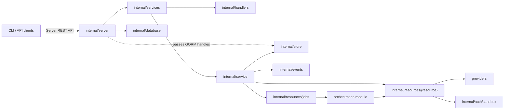
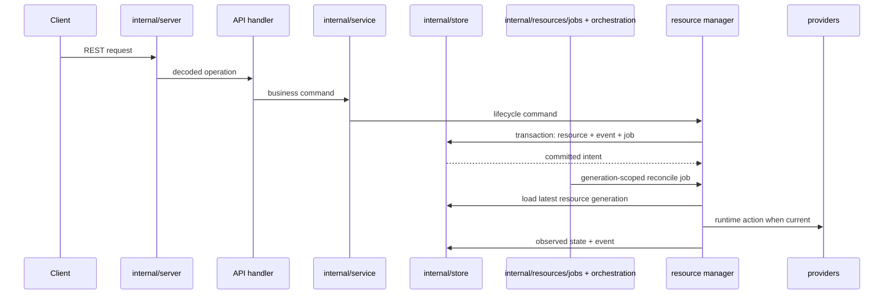

# Server Module Design

The server module is the Discobox control plane implementation. It owns HTTP
composition, single-database persistence, project events, API-facing business logic,
and durable reconciliation submission. Stable contracts and generated API types
come from the root module. Provider contracts and implementations live in this
module so providers can depend on server-owned persistence and manager contracts.

## Module Role

Keep the server as the control plane:

- Persist desired state before external runtime side effects.
- Publish project events and submit durable reconcile jobs in the same intent
  transaction.
- Run generation-scoped reconciliation; cancel stale jobs when newer intent
  supersedes them.
- Treat provider packages as runtime adapters, not as a place for server policy.

## API Boundary

The Server REST API contract is owned by the root module at
`api/openapi/server.yaml`. Server handlers should implement that contract instead
of deriving the contract from Go route registration.

Current transition state:

- `internal/server.NewRouter`, `NewApp`, and `NewOpenAPIRouter`
  compose chi routers around the generated OpenAPI server scaffold.
- `internal/handlers` adapts generated operations to API-facing services and
  constructs the generated OpenAPI server.
- `internal/services` owns service interfaces and aliases generated server DTOs for
  server packages during the generated-server migration.

New endpoints should prefer the contract-first generated path. Keep streaming
transports hand-wired unless the generator can own them behavior-compatibly.

### Hand-Wired Sandbox Proxies

Sandbox proxy routes are project-scoped control-plane routes and are authorized
by `ProjectAuthorizer` before the proxy handler runs. They remain hand-wired in
`internal/server` because they forward arbitrary methods, headers, path suffixes,
and query strings through a provider-supplied HTTP client lease instead of using
generated request/response DTOs.

Current proxy routes:

- `/projects/{projectId}/sandboxes/{sandboxId}/git-repositories/{repository}.git...`
  is exposed as `/projects/{projectId}/sandboxes/{sandboxId}/git-repositories/*`
  and forwards to the pool-agent git route
  `/api/project/{projectId}/pool/{poolId}/sandboxes/{sandboxId}/git-repositories/{repository}.git...`.
  It serves the sandbox's own worktree repository.
- `/projects/{projectId}/sandboxes/{sandboxId}/git-origins/{slug}.git...` forwards
  the same way to the pool-agent `git-origins` route, and serves a
  push-delivered source's origin repository instead — a different repository, on
  its own route rather than a synthesized repository id, because source slugs are
  client-supplied and any suffix convention could collide with a real one. Both
  routes derive scopes identically: `receive-pack` needs `ScopeSandboxWrite`,
  everything else `ScopeSandboxRead`. See ADR 0058 §3.
- `/projects/{projectId}/sandboxes/{sandboxId}/http/{port}/{path...}` forwards
  to the pool-agent route
  `/api/project/{projectId}/pool/{poolId}/sandboxes/{sandboxId}/http/{port}/{path...}`.
  The future pool-agent implementation owns translating that pool-local
  route to `http://localhost:{port}/{path...}` inside the sandbox.
- `/api/projects/{projectId}/sandboxes/{sandboxId}/harness-terminals...` forwards
  to the sandbox-agent terminal runtime API with the same path. The worker-agent
  forwarding layer and sandbox-agent implementation own serving that API; the
  server owns project authorization, scope selection, and lease/token injection
  only.
- `/api/projects/{projectId}/sandboxes/{sandboxId}/tcp/attach?host=&port=`
  forwards the websocket upgrade to the sandbox-agent `/tcp/attach` endpoint,
  which dials `host:port` from inside the sandbox's network namespace and
  speaks `execstream/frame` over it (ADR 0024 §§3-4). It is that tunnel exposed
  at the HTTP edge for clients that are not speaking SSH; `internal/sshd`
  reaches the same endpoint in-process for `direct-tcpip` channels. Everything
  past the handshake is the tunnel's own framing, so the server validates the
  target, authorizes the project, and injects the lease, and owns nothing else.

### Pool Host Console

`/api/projects/{projectId}/pools/{poolId}/console` is hand-wired next to the
proxies above but is not one of them: nothing is forwarded to a pool agent. The
control plane terminates the websocket itself and pumps `execstream/frame`
between the client and a TTY the provider opened on the pool host
(`server/providers/DESIGN.md#pool-host-console`), so the console answers on a
host whose pool agent never came up — the case an operator opens one for.

That is also why it takes no pool-agent token scope: there is no pool-agent
request to scope. Authorization is `ProjectAuthorizer` alone, which today makes
any project member able to open a root shell on that project's pool hosts. It
is an administrative capability waiting on an administrative role
(docs/adr/0051).

The route rejects before upgrading, so a caller whose pool host is unreachable
reads the reason instead of watching a websocket close, and it passes the
terminal size on the open (`?rows=&cols=`) so the first prompt is drawn at the
caller's size.

Proxy handlers must request the narrow worker-agent token scopes needed for the
flow. The git proxy requests `sandbox:read` and `sandbox:write` because Git HTTP
uses method and service-specific read/write behavior. The sandbox HTTP port
proxy requests only `sandbox:http`; worker-agent support for this route must
require that scope rather than accepting the broader sandbox read/write scopes.
The harness-terminal proxy requests `terminal:read` for listing and resource reads
and `terminal:write` for create, attach, and delete because attach streams carry
input, resize, and signal frames. The TCP tunnel proxy requests only
`tcp:connect`, the scope ADR 0024 §3 defines for it.

Authorization must be decidable from request attributes available before body
interpretation: authenticated principal, method, route/path parameters, query
parameters, headers, and resource ownership loaded by those attributes. Do not
require request-body fields to decide whether the caller may access the target
resource; put authorization identity in the URL or other request metadata instead.

Narrow exception: `POST /api/workers/register` is a bootstrap credential
redemption flow, not normal resource access. Its body carries the project ID,
worker ID, optional sandbox compatibility ID, one-time bootstrap token, and
public key because a worker does not yet have a runtime principal or token. The
service may use those body fields only to redeem the short-lived, one-time
bootstrap token against the bootstrapped worker and issue the first runtime
worker token. Subsequent worker authorization must use request metadata and the
authenticated worker principal, such as `/api/workers/{workerId}/status`.

Redemption happens once per pool, not once per agent start. The agent keeps its
identity keypair on the pool's durable storage and reuses it, so a restart
authenticates with the assertion that key signs rather than spending another
one-time token — which the pool no longer has, since nothing re-mints one for a
container that survives. Registering again is reserved for the case where the
control plane no longer recognises the key, and republishes the same key rather
than minting a new identity (ADR 0063).
Agent-observed sandbox state is reported at
`/api/pools/{poolId}/sandbox-states` under the same pool-principal rule; the
sandbox IDs are runtime evidence, not user authorization input.

## Delivering and Re-delivering Source (`disco push`)

A push-delivered source's commits arrive over the `git-origins` proxy above:
create's delivery push (ADR 0001) and every later `disco push` (ADR 0058) write
the same bare repository, which the sandbox fetches from as `origin`. Only
delivery at create involves the control plane's state machine — `awaiting_source`
plus `CompleteSandboxSourcePush`. A re-push is transport and nothing else: no
phase, no completion call, and no server-side validation of what was pushed. The
server stays a byte proxy, as it is for the worktree route.

## Applying Sandbox Commits to a Host (`disco apply`)

`disco apply` (ADR 0014) pulls a sandbox's committed source changes onto the
host working tree they started from. It fetches over the same
git-repositories proxy documented above, now used for read as well as write:
`ScopeSandboxRead` already permitted fetch, so no new proxy surface was
needed.

- **`CompleteSandboxApply`** is a plain generated OpenAPI operation, not a
  hand-wired proxy: the client reports a completed apply after it has already
  landed the commits locally (cherry-pick + fast-forward happen entirely on
  the client), and the server only records the result. It never verifies the
  reported commits against the sandbox's actual Git state, matching
  `CompleteSandboxSourcePush`'s same tradeoff.
- The record is `Sandbox.AppliedCommits`, an append-only list
  (`model.AppliedSourceCommit`: slug, sandbox-side commit, resulting host-side
  commit, host ID, host path, timestamp), surfaced at `runtime.appliedCommits`.
  It carries no lifecycle intent, so it persists through
  `sandboxes.updateSandboxMetadata` rather than `submitSandboxOperation`:
  nothing about desired or observed runtime state changes, so there is
  nothing for the reconcile engine to act on.
- `AcquireSandboxHTTPClient` checks that the sandbox exists and that its pool
  is up, and nothing about whether it is running. A stopped sandbox is started
  on demand by the pool agent when the request reaches it (ADR 0017 §12), so
  gating here would refuse traffic the agent would have served — and would
  only cover the routes that consult the server at all, which the git and HTTP
  proxies do not.

## Listen Endpoints

The server binds local IPC — `unix://` or `npipe://` — and nothing else unless
`DISCOBOX_SERVER_LISTEN` names more. A TCP listener is a machine-wide surface
(and on Windows a firewall prompt) that is opted into, never implied; `PORT`
only supplies the default port for an HTTP endpoint that was asked for.

Nothing in the system requires HTTP. Pool backends reach the control plane over
whatever transport their guest can dial — see
[providers](providers/DESIGN.md#control-plane-reachability) — and the CLI dials
the local socket directly, bridging it to a loopback HTTP address only for the
git subprocesses that cannot speak anything else (see [cli](../cli/DESIGN.md)).
`cfg.Listen` is threaded to the provider factories so a backend picks a
transport this server actually answers on rather than assuming one exists.

`task dev` opts into nothing. It binds the local socket every other server
binds, plus `iroh://` on the platforms whose build carries the transport (ADR
0053), so `disco` reaches a development server with no `--server` and the dev
loop runs the transport users actually get instead of the one nothing ships. A
tool that needs a URL asks for one in `DISCOBOX_SERVER_LISTEN` — from the
environment, not from `.env`, which the server loads with godotenv and which
does not replace a variable already set.

The SSH control-plane ingress (ADR 0024) binds **no listener of its own**. It is
served on the router, at `GET /ssh/connect`, so it is reachable wherever the API
is and there is no second endpoint to configure, publish, or firewall (ADR
0052). `GET /ssh` serves the host key clients pin, and nothing else: there is no
address to discover and no way to turn SSH off. See
[`internal/sshd/DESIGN.md`](internal/sshd/DESIGN.md).

## Single Server Per Data Directory

One server runs against a data directory at a time, enforced by an exclusive
advisory lock on `<data dir>/server.lock` taken before the database is opened.
The lock is scoped to the data directory, not the listen endpoint, because the
database is what two servers corrupt each other over — duplicates reconcile the
same pools against each other and thrash their runtimes. An endpoint-scoped lock
would miss a second server started with a different `DISCOBOX_SERVER_LISTEN`.

Binding proves nothing about who else is running: `endpoint.Listen` unlinks a
unix socket path before binding, so the second server rebinds the path and both
keep serving — the incumbent keeps a listener on an orphaned inode, and because
`/shutdown` is addressed by path, nothing can ever ask it to leave again. The
lock replaces the `EADDRINUSE` reclaim in `listenWithReclaim`, which only ever
fired for TCP endpoints and is dead code for the default unix-only listen set.

A starting server asks the incumbent to shut down, then waits for the lock,
re-requesting and logging the holder on every pass. It never displaces a running
server and never gives up: an incumbent that will not leave is visible in the log
rather than silently duplicated. The lock is advisory and file-based so the
kernel releases it on process death, including `SIGKILL` — a crashed server
cannot strand a lock. `Run` takes it first so its deferred release runs last,
after the listener cleanup has removed the socket the next server will bind.

## Runtime Observability

`internal/server` owns optional process-level OpenTelemetry metrics startup as
part of HTTP server composition. When `OTEL_METRICS_EXPORTER=otlp` is configured,
startup initializes the global meter provider, exports metrics through OTLP/HTTP
using the standard OpenTelemetry exporter environment variables, and wraps all
HTTP traffic with OpenTelemetry HTTP instrumentation. Local Discobot development
services may provide an OTLP receiver/dashboard, but telemetry must remain
optional so normal server startup does not require an observability backend.

## Intent and Reconcile Flow

API handlers stay thin: decode generated OpenAPI DTOs, call services, and encode
responses. Services own API validation and delegate lifecycle work to resource
managers. Resource managers own intent changes, job submission, generation checks,
and runtime operation progress. `internal/resources/jobs` owns dispatcher infrastructure.

## Sandbox Image Pinning

A sandbox pins the image it was built from as `Image` (what to pull) plus
`ImageDigest` (which image that must turn out to be — a config digest, matching
what a local Docker daemon reports as an image ID). The pin is written at create
from the harness config's snapshot and changed only by an upgrade, so a rebuilt
tag never moves a running sandbox.

- **Desired side moves on its own.** `harnessconfigs.SeedBuiltIns` re-inspects
  every built-in image on each server start and refreshes `ImageDigest` whenever
  the reference *or* the digest changed. `RefreshHarnessConfigImage` is the same
  operation for user-registered images, which have no automatic trigger.
- **Availability is derived, never stored.** `services.SandboxUpgrade` compares
  the sandbox's pin to its preloaded harness config on every read and projects
  `runtime.upgrade`. Nothing caches it, so no write path can forget to
  invalidate it.
- **Upgrading is a re-pin and nothing else.** `UpgradeSandbox` writes the
  harness config's current `Image`/`ImageDigest` as intent. That changes the
  spec fingerprint, so the ordinary reconcile carries it to the pool agent,
  which replaces the container that no longer matches — restarting it into the
  new image if it was running and leaving it stopped if it was not (ADR 0021).
  There is no upgrade operation and no upgrade counter.
- **No reconcile ever moves the pin.** A sandbox runs the image it is pinned to
  until somebody upgrades it, in every state. The upgrade is reported through
  `runtime.upgrade` and applied only by the action.
- **An unpinned sandbox is upgrade eligible, not excluded.** Sandboxes created
  before pinning, or while the harness config's digest was unknown, carry an
  empty `ImageDigest`. They report an upgrade like any other; only a missing
  harness config, a config declaring no image, or harness mode `config` opts a
  sandbox out.
- **Enforcement is on the pool host, not here.** The control plane sends the
  pin; `pool-agent/sandboxruntime` resolves images and refuses to launch one
  that does not match it. The server owns policy, the runtime owns identity —
  and whether an image can be obtained at all is knowable only there, so the
  server never gates on it and surfaces the agent's failure instead
  (ADR 0021 §5).

## Observation vs Intent

An observation never becomes intent. The pool agent reports what its containers
are doing on its own channel (`/api/pools/{poolId}/sandbox-states`), and the
control plane records it as observed state: no desired state, no generation, no
operation. A generation versions the spec, and nothing the runtime saw changes
what was asked for.

Recording is not the end of it: a report that actually changes a sandbox's state
or error also publishes a project event, so clients watching the stream see a
sandbox start rather than only learning about it by asking again. Unchanged
reports publish nothing, since the complete sync repeats every sandbox on its
interval. Provisioning progress arrives on the same channel in its own array and
lands on `runtime.provisionProgress`, published the same way; it marks nothing
dirty, because work in flight is not drift (ADR 0039).

The stored blob is the client-facing shape, not the agent-facing one: the two
are separate schemas because they are separate contracts, and the client-facing
one forbids additional properties. Both carry the same phase vocabulary, pinned
to each other by a test — the pull crosses as a struct conversion that stops
compiling if the shapes diverge, but ogen enums are string-typed and a phase
would cross a widening gap in silence.

The one case that looks like an exception is a container that is gone. It is
still an observation — the reconciler learns about it through a dirty mark, and
its idempotent ensure rebuilds the container from the spec already recorded.
What it does not do is invent intent to justify acting.

This is why the ordering guard matters: reports carry the agent's boot ID and a
per-boot sequence, so a delayed delta cannot overwrite a newer complete sync.

See ADR 0017 §§9–10.

## Package Map

| Package/path | Ownership |
| --- | --- |
| `cmd/discobox-server` | Server binary entrypoint. |
| `internal/server` | HTTP startup, chi router composition, auth middleware wiring, generated route mounting, hand-wired stream transport registration, and application component wiring. |
| `internal/auth` | Request authentication, authorization, and principal context helpers. |
| `internal/server/defaults` | Startup/default identity initialization. |
| `internal/services` | Service interfaces and generated server DTO aliases used across server packages during the generated-server migration. |
| `internal/handlers` | Generated OpenAPI handler adapter methods split by resource; transport DTO conversion only. |
| `internal/resources/jobs` | Server-wide durable job manager and dispatcher lifecycle. |
| `internal/service` | Root API service aggregation, default data initialization, service startup, and job executor registration. |
| `internal/resources/harnessconfigs` | Harness config definition and project-scoped harness config API behavior. |
| `internal/resources/projects` | Project read service behavior. |
| `internal/resources/sandboxes` | Sandbox API service behavior, sandbox reconcile executor/payload, sandbox runtime reconciliation, and sandbox provider catalog helpers. |
| `internal/resources/workers` | Worker API service behavior, provider-facing worker manager, worker and pool reconcilers, and worker runtime reconciliation. |
| `internal/resources/pools` | Pool resource API behavior and observed pool status derived from worker rows. |
| `internal/resources/providers` | Provider-instance API service behavior (backend identity only) and startup reconciliation. |
| `internal/database` | Database config, connection setup, and migrations. |
| `internal/store` | Persistence methods, resource transactions, project events, and durable job records. |
| `internal/events` | In-process project event broker for committed resource events. It has no client-facing transport: the events are lossy wake-ups for waits inside this process (ADR 0061). |
| `internal/auth/sandbox` | Sandbox access issuer keys and worker/sandbox auth token helpers. |
| `internal/secrets` | Encryption/sealing interfaces and implementations used by server persistence. |
| `internal/config` | Server configuration loading. |
| `internal/apperrors` | Server-owned sentinel and HTTP status errors used by handlers, services, store, and provider adapters. |
| `internal/model` | Server-owned persistence models and migration model list. |
| `internal/sandbox` | Go-level sandbox provider interfaces, provider manager, and shared provider contract types. |
| `internal/sshd` | SSH control-plane ingress (ADR 0024): listener, session-channel↔exec mapping, direct-tcpip tunnel, host key and authorized-keys handling. |
| `internal/sandboxagentclient` | Pool-agent target-URL builder and lease auth transport shared by the hand-wired HTTP proxies and `internal/sshd`. |
| `providers` | Docker, VM, cloud, and worker-backed sandbox provider implementations. |

## Dependency Rules

- Server code may depend on the root module for public contracts, generated API
  code, and cross-module sentinel errors.
- Server/provider composition may import provider implementations to register
  concrete providers; deeper packages should depend on provider interfaces.
- Provider implementations under `providers` may import `server/internal`
  packages because they are part of this module.
- Worker-agent, sandbox-agent code, CLI code, and root clients must not import
  server internals.
- Cross-module types and errors must live in public root packages or the owning
  public module package, not under `server/internal`.
- Keep GORM access behind `internal/store`; services and reconcilers should not
  query database handles directly.

## Deeper Design Docs

| Package | Design notes |
| --- | --- |
| `internal/auth` | [`internal/auth/DESIGN.md`](internal/auth/DESIGN.md) |
| `internal/database` | [`internal/database/DESIGN.md`](internal/database/DESIGN.md) |
| `internal/model` | [`internal/model/DESIGN.md`](internal/model/DESIGN.md) |
| `internal/resources` | [`internal/resources/DESIGN.md`](internal/resources/DESIGN.md) |
| `internal/resources/harnessconfigs` | [`internal/resources/harnessconfigs/DESIGN.md`](internal/resources/harnessconfigs/DESIGN.md) |
| `internal/resources/jobs` | [`internal/resources/jobs/DESIGN.md`](internal/resources/jobs/DESIGN.md) |
| `internal/resources/pools` | [`internal/resources/pools/DESIGN.md`](internal/resources/pools/DESIGN.md) |
| `internal/resources/providers` | [`internal/resources/providers/DESIGN.md`](internal/resources/providers/DESIGN.md) |
| `internal/resources/projects` | [`internal/resources/projects/DESIGN.md`](internal/resources/projects/DESIGN.md) |
| `internal/resources/sandboxes` | [`internal/resources/sandboxes/DESIGN.md`](internal/resources/sandboxes/DESIGN.md) |
| `internal/resources/workers` | [`internal/resources/workers/DESIGN.md`](internal/resources/workers/DESIGN.md) |
| `internal/auth/sandbox` | [`internal/auth/sandbox/DESIGN.md`](internal/auth/sandbox/DESIGN.md) |
| `internal/service` | [`internal/service/DESIGN.md`](internal/service/DESIGN.md) |
| `internal/store` | [`internal/store/DESIGN.md`](internal/store/DESIGN.md) |
| `internal/sshd` | [`internal/sshd/DESIGN.md`](internal/sshd/DESIGN.md) |
| `providers` | [`providers/DESIGN.md`](providers/DESIGN.md) |

Add lower-level `DESIGN.md` files next to packages when a package gains its own
architecture rules. Keep this module-level doc focused on server boundaries and
cross-package flow.
