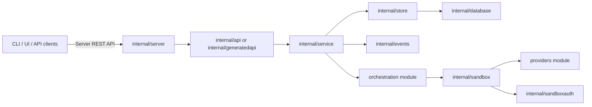
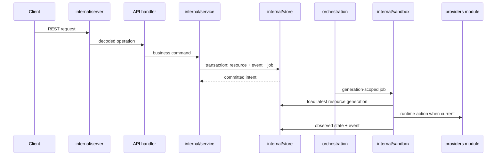

# Server Module Design

The server module is the Discobox control plane implementation. It owns HTTP
composition, tenant-aware persistence, project events, API-facing business logic,
and durable reconciliation submission. Stable contracts and generated API types
come from the root module; provider implementations come from sibling modules and
are wired only at composition boundaries.

## Module Role

Keep the server as the control plane:

- Persist desired state before external runtime side effects.
- Publish project events and submit durable reconcile jobs in the same intent
  transaction.
- Run generation-scoped reconciliation; cancel stale jobs when newer intent
  supersedes them.
- Treat provider packages as runtime adapters, not as a place for server policy.

## API Boundary

The Server REST API contract is owned by the root module at
`api/openapi/server.yaml`. Server handlers should implement that contract instead
of deriving the contract from Go route registration.

Current transition state:

- `internal/server.NewRouter` and `NewApplicationRouter` compose the active Huma
  route registration path.
- `internal/server.NewGeneratedRouter` mounts the generated OpenAPI server
  scaffold through chi.
- `internal/generatedapi` is the adapter layer for endpoint-by-endpoint migration
  from Huma handlers to generated handlers.
- Project stream websocket and SSE routes stay hand-wired in
  `internal/projectstream`; generated OpenAPI scaffolding does not own streaming
  transport mechanics.

New endpoints should prefer the contract-first generated path. When touching old
Huma operations, migrate narrowly and keep behavior-compatible tests.

## Intent and Reconcile Flow

API handlers stay thin: decode generated/Huma DTOs, call services, and encode
responses. Services own validation, intent changes, event creation, and job
submission. Reconcilers own generation checks and runtime operation progress.

## Package Map

| Package/path | Ownership |
| --- | --- |
| `cmd/discobot-server` | Server binary entrypoint. |
| `internal/server` | HTTP startup, chi router composition, middleware wiring, generated/Huma route mounting. |
| `internal/server/middleware` | Authentication, tenant binding, project authorization, and generic authorization middleware. |
| `internal/server/defaults` | Startup/default identity initialization. |
| `internal/api` | Legacy Huma operation definitions and service interfaces during the generated-server migration. |
| `internal/generatedapi` | Generated OpenAPI handler adapter layer for server business logic. |
| `internal/service` | API-facing business logic, default data initialization, intent transactions, and provider catalog behavior. |
| `internal/sandbox` | Server-owned sandbox/worker reconcilers, job submitters, root `sandboxprovider.ProviderManager` injection/usage, and sandbox-service glue. |
| `internal/database` | Database config, tenant/global resolver, migrations, and shard selection. |
| `internal/store` | Tenant-aware persistence methods, resource transactions, project events, and durable job records. |
| `internal/events` | In-process project event broker for committed resource events. |
| `internal/projectstream` | Websocket/SSE project event streaming transports. |
| `internal/sandboxauth` | Sandbox access issuer keys and worker/sandbox auth token helpers. |
| `internal/secrets` | Encryption/sealing interfaces and implementations used by server persistence. |
| `internal/authctx` | Request authentication context helpers. |
| `internal/tenantctx` | Request tenant context helpers. |
| `internal/config` | Server configuration loading. |

## Dependency Rules

- Server code may depend on the root module for contracts, models, generated API
  code, and cross-module sentinel errors.
- Server composition may import provider implementations to register concrete
  providers; deeper packages should depend on provider interfaces.
- Providers, sandbox-agent code, and CLI code must not import server internals.
- Cross-module types and errors must live in public root packages, not under
  `server/internal`.
- Keep GORM access behind `internal/store`; services and reconcilers should not
  reach into database resolver internals directly.

## Deeper Design Docs

| Package | Design notes |
| --- | --- |
| `internal/database` | [`internal/database/DESIGN.md`](internal/database/DESIGN.md) |
| `internal/projectstream` | [`internal/projectstream/DESIGN.md`](internal/projectstream/DESIGN.md) |
| `internal/sandbox` | [`internal/sandbox/DESIGN.md`](internal/sandbox/DESIGN.md) |
| `internal/sandboxauth` | [`internal/sandboxauth/DESIGN.md`](internal/sandboxauth/DESIGN.md) |
| `internal/service` | [`internal/service/DESIGN.md`](internal/service/DESIGN.md) |
| `internal/store` | [`internal/store/DESIGN.md`](internal/store/DESIGN.md) |

Add lower-level `DESIGN.md` files next to packages when a package gains its own
architecture rules. Keep this module-level doc focused on server boundaries and
cross-package flow.
