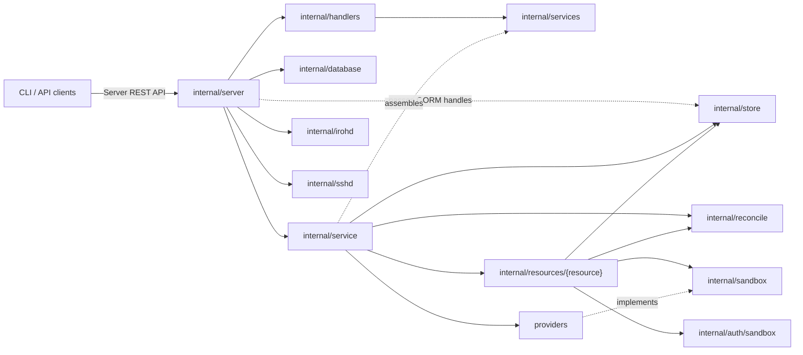
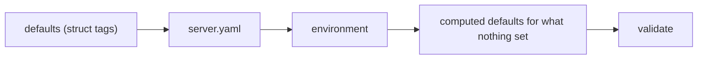
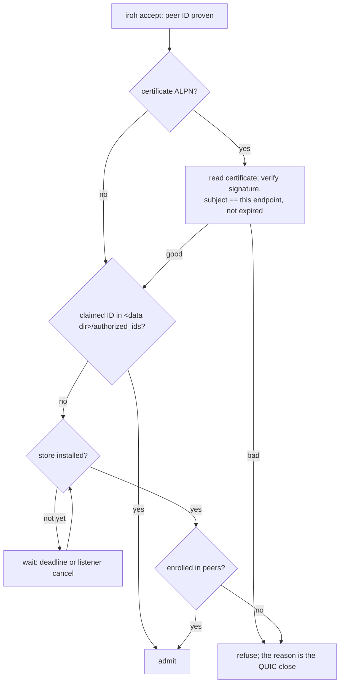
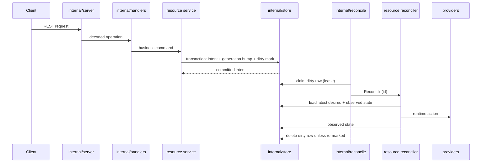

# Server Module Design

The server module is the Discobox control plane implementation. It owns HTTP
composition, single-database persistence, API-facing business logic,
and level-triggered reconciliation. Stable contracts and generated API types
come from the root module. Provider contracts and implementations live in this
module so providers can depend on server-owned persistence and manager contracts.

## Module Role

Keep the server as the control plane:

- Persist desired state before external runtime side effects.
- Persist an intent change and its reconcile dirty mark in the same
  transaction.
- Reconcile level-triggered from the latest persisted state; newer intent
  re-marks the resource rather than cancelling in-flight work.
- Treat provider packages as runtime adapters, not as a place for server policy.

## API Boundary

The Server REST API contract is owned by the root module at
`api/openapi/server.yaml`. Server handlers should implement that contract instead
of deriving the contract from Go route registration.

Composition:

- `internal/server.NewRouter`, `NewApp`, and `NewOpenAPIRouter`
  compose chi routers around the generated OpenAPI server scaffold.
- `internal/handlers` adapts generated operations to API-facing services and
  constructs the generated OpenAPI server.
- `internal/services` owns service interfaces and aliases generated server DTOs for
  server packages.

New endpoints should prefer the contract-first generated path. Keep streaming
transports hand-wired unless the generator can own them behavior-compatibly.

### Hand-Wired Sandbox Proxies

Sandbox proxy routes are project-scoped control-plane routes and are authorized
by `ProjectAuthorizer` before the proxy handler runs. They remain hand-wired in
`internal/server` because they forward arbitrary methods, headers, path suffixes,
and query strings through a provider-supplied HTTP client lease instead of using
generated request/response DTOs.

Current proxy routes:

- `/projects/{projectId}/sandboxes/{sandboxId}/git-repositories/{repository}.git...`
  is exposed as `/projects/{projectId}/sandboxes/{sandboxId}/git-repositories/*`
  and forwards to the pool-agent git route
  `/api/project/{projectId}/pool/{poolId}/sandboxes/{sandboxId}/git-repositories/{repository}.git...`.
  It serves the sandbox's own worktree repository.
- `/projects/{projectId}/sandboxes/{sandboxId}/git-origins/{slug}.git...` forwards
  the same way to the pool-agent `git-origins` route, and serves a
  push-delivered source's origin repository instead — a different repository, on
  its own route rather than a synthesized repository id, because source slugs are
  client-supplied and any suffix convention could collide with a real one. Both
  routes derive scopes identically: `receive-pack` needs `ScopeSandboxWrite`,
  everything else `ScopeSandboxRead`. See ADR 0058 §3.
- `/projects/{projectId}/sandboxes/{sandboxId}/http/{port}/{path...}` forwards
  to the pool-agent route
  `/api/project/{projectId}/pool/{poolId}/sandboxes/{sandboxId}/http/{port}/{path...}`.
  The pool agent owns reaching `{port}` inside the sandbox, and starts a
  stopped sandbox on demand.
- `/api/projects/{projectId}/sandboxes/{sandboxId}/execs...`, `.../services...`
  and `.../harness-hooks` forward their path suffix to the pool-agent sandbox
  route, which reaches the sandbox-agent exec API. The pool agent and sandbox
  agent own serving that API; the server owns project authorization, scope
  selection, and lease/token injection only. An `attach` acquires through
  `AwaitSandboxHTTPClient`, so it waits for a sandbox still coming up
  (ADR 0039); every other route fails fast.
- `/api/projects/{projectId}/sandboxes/{sandboxId}/tcp/attach?host=&port=`
  forwards the websocket upgrade to the sandbox-agent `/tcp/attach` endpoint,
  which dials `host:port` from inside the sandbox's network namespace and
  speaks `execstream/frame` over it (ADR 0024 §§3-4). It is that tunnel exposed
  at the HTTP edge for clients that are not speaking SSH; `internal/sshd`
  reaches the same endpoint in-process for `direct-tcpip` channels. Everything
  past the handshake is the tunnel's own framing, so the server validates the
  target, authorizes the project, and injects the lease, and owns nothing else.
- `/api/projects/{projectId}/sandboxes/{sandboxId}/udp/attach?host=&port=` is
  the same handler for the sandbox-agent's datagram tunnel (ADR 0109): one
  datagram per frame, under `udp:connect`. SSH has no counterpart, so nothing
  in-process reaches it.

### Pool Host Console

`/api/projects/{projectId}/pools/{poolId}/console` is hand-wired next to the
proxies above but is not one of them: nothing is forwarded to a pool agent. The
control plane terminates the websocket itself and pumps `execstream/frame`
between the client and a TTY the provider opened on the pool host
(`server/providers/DESIGN.md#pool-host-console`), so the console answers on a
host whose pool agent never came up — the case an operator opens one for.

That is also why it takes no pool-agent token scope: there is no pool-agent
request to scope. Authorization is `ProjectAuthorizer` alone, which today makes
any project member able to open a root shell on that project's pool hosts. It
is an administrative capability waiting on an administrative role
(docs/adr/0051).

The route rejects before upgrading, so a caller whose pool host is unreachable
reads the reason instead of watching a websocket close, and it passes the
terminal size on the open (`?rows=&cols=`) so the first prompt is drawn at the
caller's size.

### Pool Host Logs

`/api/projects/{projectId}/pools/{poolId}/logs` is hand-wired for the same
reason as the console and shares its authorization story, but it is a plain
streaming `GET`: the bytes travel one way, so there is no framing and no
websocket. `?tail=` bounds it and `?follow=true` keeps it open, and each write
is flushed so a followed log arrives live rather than when the buffer fills.

Two things are the handler's own:

- The body is the host's log and nothing else. What was opened —
  a guest serial console, a Docker daemon journal — is named on
  `X-Discobox-Pool-Log-Source`, because there is no uniform pool host log
  (`server/providers/DESIGN.md#pool-host-logs`) and the bytes alone do not say
  which record they are. Errors after the first byte end the response rather
  than appending an explanation into the log.
- The client disconnecting closes the stream. That is what stops the driver —
  a `journalctl` on the pool host, an SSH connection to a droplet — and a read
  of an idle followed log blocks until the next line, which may never come, so
  the handler cannot wait to notice on its next write.

### Pool Guest Image

`POST /api/projects/{projectId}/pools/{poolId}/guest-image` is hand-wired beside
the console and the host log for the same reason: it goes through the provider
driver rather than the pool agent, and it streams. It rebuilds the guest image
the pool's backend boots, on that pool's own host (ADR 0062 §7); `?source=`
names a checkout to build from and `?restart=true` restarts the host onto the
result. The destination is sent as `X-Discobox-Guest-Image-Destination` before
the build starts; a failure arrives as the `X-Discobox-Guest-Image-Error`
trailer, because the status was written long before the build ends. The client
disconnecting closes the build.

### Proxy Scopes and Authorization

Proxy handlers must request the narrow pool-agent token scopes
(`internal/auth/poolagent`) needed for the flow. The git proxy requests
`sandbox:write` for `receive-pack` and `sandbox:read` otherwise, because Git
HTTP is method- and service-specific. The sandbox HTTP port proxy requests only
`sandbox:http`; pool-agent support for this route must require that scope
rather than accepting the broader sandbox read/write scopes. The exec proxy
requests `exec:read` for reads (execs, services, harness hooks) and `exec:write`
for create, delete, start, stop, and restart; attach requests both, because
attach streams carry input, resize, and signal frames. The TCP tunnel proxy
requests only `tcp:connect`, the scope ADR 0024 §3 defines for it, and the UDP
tunnel proxy only `udp:connect` (ADR 0109).

Authorization must be decidable from request attributes available before body
interpretation: authenticated principal, method, route/path parameters, query
parameters, headers, and resource ownership loaded by those attributes. Do not
require request-body fields to decide whether the caller may access the target
resource; put authorization identity in the URL or other request metadata instead.

Narrow exception: `POST /api/pools/register` is a bootstrap credential
redemption flow, not normal resource access. Its body carries the project ID,
pool ID, one-time bootstrap token, public key, and key type because a pool agent
does not yet have a runtime principal or token. The service may use those body
fields only to redeem the one-time bootstrap token against the bootstrapped
pool and record its public key. Subsequent pool-agent authorization must use
request metadata and the authenticated pool principal, such as
`/api/pools/{poolId}/status`; the actions a pool principal may reach under
`/api/pools/{poolId}/` are an allowlist in `internal/auth`.

Redemption happens once per pool, not once per agent start. The agent keeps its
identity keypair on the pool's durable storage and reuses it, so a restart
authenticates with the assertion that key signs rather than spending another
one-time token — which the pool no longer has, since nothing re-mints one for a
container that survives. Registering again is reserved for the case where the
control plane no longer recognises the key, and republishes the same key rather
than minting a new identity (ADR 0063).
Agent-observed sandbox state is reported at
`/api/pools/{poolId}/sandbox-states` under the same pool-principal rule; the
sandbox IDs are runtime evidence, not user authorization input.

## Delivering and Re-delivering Source (`discobox push`)

A push-delivered source's commits arrive over the `git-origins` proxy above:
create's delivery push (ADR 0001) and every later `discobox push` (ADR 0058) write
the same bare repository, which the sandbox fetches from as `origin`. Only
delivery at create involves the control plane's state machine — `awaiting_source`
plus `CompleteSandboxSourcePush`. A re-push is transport and nothing else: no
phase, no completion call, and no server-side validation of what was pushed. The
server stays a byte proxy, as it is for the worktree route.

## Applying Sandbox Commits to a Host (`discobox apply`)

`discobox apply` (ADR 0014) pulls a sandbox's committed source changes onto the
host working tree they started from. It fetches over the git-repositories
proxy documented above, which serves read as well as write: `ScopeSandboxRead`
permits fetch.

- **`CompleteSandboxApply`** is a plain generated OpenAPI operation, not a
  hand-wired proxy: the client reports a completed apply after it has already
  landed the commits locally (cherry-pick + fast-forward happen entirely on
  the client), and the server only records the result. It never verifies the
  reported commits against the sandbox's actual Git state, matching
  `CompleteSandboxSourcePush`'s same tradeoff.
- The record is `Sandbox.AppliedCommits`, an append-only list
  (`model.AppliedSourceCommit`: slug, sandbox-side commit, resulting host-side
  commit, host ID, host path, timestamp), surfaced at `runtime.appliedCommits`.
  It carries no lifecycle intent, so it persists through
  `sandboxes.updateSandboxMetadata` rather than `recordSandboxIntent`:
  nothing about desired or observed runtime state changes, so there is
  nothing for the reconcile engine to act on.
- `AcquireSandboxHTTPClient` checks that the sandbox exists and is not being
  deleted and that its pool is reachable (not `offline`, and `Ready`), and
  nothing about whether it is running. A stopped sandbox is started on demand
  by the pool agent when the request reaches it (ADR 0017 §12), so gating here
  would refuse traffic the agent would have served.

## Configuration

`config.Load` resolves three layers in order: literal defaults from struct
tags, then the configuration file, then the environment. The environment wins
(ADR 0096).

The file is `<XDG config home>/discobox/server.yaml`, or whatever
`DISCOBOX_CONFIG_FILE` names; an empty value reads none. Its path comes from
the environment and cannot come from the file, because `configDir` is itself a
setting. A missing file at the default path is not an error — the environment
alone configures a server completely — but a file `DISCOBOX_CONFIG_FILE` names
that does not exist is.

`config.Config`'s struct tags are the source of truth. `yaml` is the key, `env`
the overriding variable, `default` the literal default and `doc` the
description; a field tagged `yaml:"-"` is derived rather than configured.
`internal/config/genschema` emits two artifacts from the same walk the loader
binds, so a setting cannot be loadable and undocumented: `server/config.schema.json`
for an editor, and `server/server.example.yaml`, the commented reference listing
every setting at the value it has when nothing sets it. `task verify` fails when
either is stale.

The reference renders "unset" as a bare key rather than an empty value, because
`archiveRetention: ""` is not a duration and `dataDir: ""` would claim the
operator chose the empty string. A key with nothing after it is YAML null, which
the loader reads as saying nothing — so the whole file can be uncommented and
still configure exactly the server that no file configures, which is what a test
asserts.

Decoding is strict: a key nothing defines fails startup naming the key and the
file. That is the capability the environment cannot offer, and the reason the
file exists at all.

Presence is read from the YAML node rather than from the resulting values,
because a field set to its zero value and a field left out mean different
things — `archiveRetention: 0s` is a window that purges on sight, and no key at
all means the package default stands.

Two OpenTelemetry variables are read by hand rather than bound: `OTEL_METRICS_EXPORTER`
names an exporter and `OTEL_METRIC_EXPORT_INTERVAL` counts milliseconds, both
fixed by that specification. The file spells them as a boolean and a duration.

Settings the server holds on a provider's behalf travel as
`dockerworker.ServerDefaults` and `FactoryOptions`, not as environment reads
inside the provider. The one variable that stays a variable is
`DISCOBOX_IMAGE_RETENTION` **on a pool agent container**: that is a wire
between two processes, and the pool agent is a separate binary with its own
contract.

## Listen Endpoints

The server binds local IPC — `unix://` or `npipe://` — and nothing else unless
`DISCOBOX_SERVER_LISTEN` names more. A TCP listener is a machine-wide surface
(and on Windows a firewall prompt) that is opted into, never implied; `PORT`
only supplies the default port for an HTTP endpoint that was asked for.

`DISCOBOX_SERVER_LISTEN` is a comma-separated list, and local IPC is added to
whatever it names unless it names one itself, so a server is never left with
no endpoint the CLI can reach. Each scheme's bare form means the address this
machine derives rather than one the operator chooses: `unix://` and `npipe://`
are the default socket and pipe, and `iroh://` is the identity in the server's
key file. `unix://,iroh://` therefore reads as "where I always listen, plus
iroh".

An iroh endpoint is logged once, as `discobox://` and this server's peer ID
(ADR 0097). That is the whole address: no query string, no direct addresses,
and nothing that names the transport. `iroh://<peer-id>` names the same server
for anyone debugging the transport, and both are accepted wherever an endpoint
is.

Direct addresses are not part of the address. Discovery resolves a peer ID on
its own. For a peer that cannot use discovery, the startup log prints a second
line beside the address — `without discovery, dial …`, the same address with
this host's direct sockets attached as `?addr=` parameters (`irohFallbackURL`,
ADR 0097 §3) — which `Parse` accepts.

### The Server's Own Peer ID

`GET /peer` serves this server's peer ID, resolved when the iroh endpoint was
configured (ADR 0098), and beside it `irohListener`: what the listener is doing
right now (see Transport Logging and Reach). It is the same shape as `GET /ssh`
— a server telling a client who it is, over the transport that client already
has — and it exists because the alternative was grepping the startup log line.

The ID is **absent** on a server that does not listen on `discobox://`: a key
is loaded only for an endpoint that is bound, so such a server has no peer
identity rather than an unused one, and its absence is the answer to "does this
server listen for peers". `serverPeer` refuses to report the zero ID, which
renders as a well-formed address that reaches nothing.

Unlike `GET /ssh` it is **authenticated**. `/ssh` is public because
`ssh-config` reads it before any credential exists; nothing needs a peer ID
before authentication, and a public path is a decision to defend forever. It is
listed in `authenticatedAllowedPaths` for the same reason `/peers` is: the
resource is server-scoped, so no narrower authorizer applies.

The startup log line remains the only way in for the case ADR 0052 §6
described and this route cannot serve: a client whose *only* transport is the
iroh endpoint it is trying to find.

### Transport Logging and Reach

An iroh connection fails in layers and reports only the top one, so
`iroh.logLevel` (`DISCOBOX_IROH_LOG`: off, error, warn, info, debug, trace)
turns on the transport's own account of itself — bind, listen, accept, refuse —
and sets iroh's internal tracing to the same level. One setting for both,
because two knobs for one question is one too many, and both write to this
server's log, which for an autolaunched server is the file
`discobox admin server logs` prints. The client has the same knob as
`discobox --iroh-log`, and `discobox status` asks the same question from the
other end (see [cli](../cli/DESIGN.md)).

Separately and always, a server that listens on iroh watches whether its
listener has a relay (`irohd.ListenerWatch`). A peer ID is resolved through a
relay, so a server without one is reachable only from networks that can route
to its sockets directly — a working deployment, and a completely different one
from what its address implies. The watch polls every 15 seconds in the
background, logs the first reading at startup and every change after it (lost
its relay, back on one and after how long), and serves the latest reading on
`GET /peer` as `irohListener` — so an operator who reaches the server by any
transport can ask about the one that is broken. It is a report and not a step;
nothing waits on it.

### The Port Survives a Restart

The iroh endpoint asks for the UDP ports it had last time. `irohd` keeps the
bound sockets in `<data dir>/iroh_sockets` and offers them back through
`IrohConfig.PreferredBindAddrs`; the endpoint reports what it actually bound
through `IrohConfig.Bound`.

The port is the one part of this server's address a peer ID does not carry and
discovery does not publish, so a client learns it only by connecting, and
remembers it (see [cli](../cli/DESIGN.md#a-client-remembers-where-a-server-answered)).
A fresh port on every start throws that memory away at the moment every client
is reconnecting, which sends all of them back through the relay at once.

- It is a **preference, not configuration**. iroh has no "this port or any":
  a socket given a port gets it or fails the whole bind. So the endpoint binds
  again when it has to, ending on the ordinary bind with fresh ports, and a
  port taken while the server was down costs the old port, never the listener.
- It remembers ports, not which sockets exist. The remembered sockets replace
  iroh's default set rather than adjusting it, so the endpoint first binds
  every family the default asks for — a remembered port where it has one, a
  fresh one where it does not — then the remembered set as recorded, then the
  ordinary bind: up to three attempts, each milliseconds. A start where IPv6
  failed once therefore does not pin the server to IPv4, and a host with no
  IPv6 at all pays for one failed attempt on every start.
- The file is all or nothing, so a torn one offers no ports rather than half.
- Losing a remembered port is logged, because that restart is the one every
  client pays for. Gaining a socket the last start could not bind is not.

A fixed, operator-chosen port is a different feature — one an `iroh://`
endpoint has no spelling for — and this does not provide one: it keeps the
port the OS chose first for as long as nothing else takes it.

## Peer Admission

Which peers may connect is two layers, and `internal/irohd` owns both (ADR
0095). `Admission.Authorize` is the accept-time hook, consulted before any HTTP
exists. A peer ID is written one way everywhere — the address, this file, the
API, the database — so two of them can be compared by eye (ADR 0097 §5):

The identity it is consulted about is the one the peer *claims*, which is not
always the one it dialed from. A client on the `discobox/http/1+cert` ALPN
presents a certificate binding its ephemeral endpoint to an enrolled identity,
and `endpoint` verifies that binding before the policy sees anything (ADR 0104).
So the allowlist below still admits an identity, never an endpoint, and it is
asked exactly once — about the enrolled issuer for a certificate-bearing peer,
and about the endpoint itself for every client that dials the plain ALPN.

The file is the operator's way back into a server whose API is what they are
trying to reach, and is deliberately unreachable from that API. The table is
the managed layer, served by `/peers` and `discobox admin peer`. Both are
read per connection, so enrolling and revoking take effect on the next dial
without a restart, and neither tears down a connection already established.

The wait exists because the server binds before it initializes: `configureIroh`
runs ahead of `database.New`, so the gate is built before there is a store to
ask and is handed one by `SetStore` when `NewApp` returns. A peer arriving in
that window waits rather than being told it is not enrolled — refusing would be
a wrong answer that sends an operator to the wrong file. Startup failure closes
the listener, which cancels the wait and refuses the peers parked on it.

Enrollment is authorized for any authenticated principal, on every listener the
router serves; see [auth](internal/auth/DESIGN.md) for what that costs and why
it is accepted.

Every accept outcome is logged by `endpoint`'s admission hook, because that is
the one place all of them pass through: a server whose log records only
refusals cannot answer "did that client get in at all". Refusals are at `warn`,
admits at `info`, and both are silent unless `iroh.logLevel` turns them on.
The policy itself logs, always, only what it alone knows: an allowlist or
enrollment table it cannot read, and a peer refused for not being enrolled.

A line in `authorized_ids` that does not parse is skipped and **logged** with
its file and line number, once at startup rather than per connection. The
tolerance is `authorized_keys(5)`'s, so one typo does not refuse every other
peer; the logging is what stops a file written before peer IDs replaced hex
from silently costing an operator their break-glass access (ADR 0097 §6).

Nothing in the system requires HTTP. Pool backends reach the control plane over
whatever transport their guest can dial — see
[providers](providers/DESIGN.md#control-plane-reachability) — and the CLI dials
the local socket directly, bridging it to a loopback HTTP address only for the
git subprocesses that cannot speak anything else (see [cli](../cli/DESIGN.md)).
`cfg.Listen` is threaded to the provider factories so a backend picks a
transport this server actually answers on rather than assuming one exists.
A backend whose transport only dials inward has the server open connections
into the guest instead; `internal/transport/carrierhub` serves the same router
over them as one more listener.

`task dev` opts into nothing. It binds the local socket every other server
binds, plus `iroh://` (unless `DISCOBOX_DEV_IROH=0`), which every build
carries (ADR 0067), so `discobox`
reaches a development server with no `--server` and the dev loop runs exactly
the transports users get. A tool that needs a URL asks for one in
`DISCOBOX_SERVER_LISTEN` — from the
environment, not from the env file, which godotenv loads and which does not
replace a variable already set.

`config.LoadEnvFile` reads `.discobox-server.env`, or the file
`DISCOBOX_ENV_FILE` names, before `config.Load` reads the environment. The name
is deliberately not `.env`: a server that loads whatever `.env` sits in the
directory it was started from silently reconfigures a hand-built binary from an
unrelated project's file. Development still wants `.env` — the image watcher
writes development image tags there — so the dev loop asks for it by name
(`.wnb.yaml`, and the `run`/`debug` tasks) instead of the server guessing.

The SSH control-plane ingress (ADR 0024) binds **no listener of its own**. It is
served on the router, at `GET /ssh/connect`, so it is reachable wherever the API
is and there is no second endpoint to configure, publish, or firewall (ADR
0057). `GET /ssh` serves the host key clients pin, and nothing else: there is no
address to discover and no way to turn SSH off. See
[`internal/sshd/DESIGN.md`](internal/sshd/DESIGN.md).

## Startup and Readiness

Listeners bind before initialization, not after it. Opening the database,
migrating it, building the services and seeding the built-in harness configs are
all slow at least once; binding first means a client sees a server that is
still coming up rather than a refused connection it cannot tell from one that
died on startup.

`startupHandler` occupies the listeners from the moment they bind. Every request
is answered `503` with a `health.Status` naming the step in progress, and each
step is logged, so a foreground run and a polling client say the same thing.
When initialization finishes, the real router is swapped in behind the same
handler: nothing rebinds and no connection is dropped.

The **platform prerequisite** is checked before any of this — before the
singleton lock, before anything binds — because it reads the environment and
nothing else. The platform's own pool backend is the default on the host it
belongs to, so a Windows machine without WSL Containers can run no pool at all
(`providers.EnsurePlatformPrerequisites`, a no-op elsewhere), and it is a
startup failure rather than something each sandbox create discovers, because the
platform's own error for a component that is not installed names neither the
component nor the one command that installs it. Running it this early is what
keeps a wrong answer cheap: a refusal after the singleton lock would have
already asked the incumbent server to shut down, costing the user a working
server rather than only the one that will not start. A server that exits here
has not bound its listeners, so the CLI reports it from the launch log
(`endpoint.EnsureRunning`) rather than from a phase.

A server that seeded **no harness** does not hand over at all. Seeding tolerates
an image it cannot inspect, because the harnesses that did seed still run;
seeding none of them leaves a project where every sandbox create refuses
(ADR 0048), so startup fails naming what was wrong with each image
(`harnessconfigs.EnsureHarnessAvailable`) rather than becoming ready and
answering every request with the same error. Any harness config satisfies it,
so a server whose images are briefly unreachable still starts on a project that
seeded on an earlier boot.

Handing over is becoming ready. There are two states
(`health.StatusStarting`, `health.StatusReady`):

| State | API | `/healthz` | Meaning |
| --- | --- | --- | --- |
| `starting` | `503` with the status on every route | `503` | no router yet: the database is being opened or migrated, the services built, or the built-in harnesses checked; `phase` names the step |
| `ready` | every route serves | `200` | the real router is serving |

`startupHandler` answers every route itself until handover. The router's own
`/healthz` (`RegisterHealthRoutes`) answers `ready` unconditionally, because
that router serves only once startup has finished. Nothing that runs after
handover — image staging included (ADR 0069) — holds readiness back.

`health` in the root module owns the payload, because the CLI that polls it is
in another module. `Status.Starting()` is what a client waits out.

## Staging a Pool's Images

The images a sandbox will want are pulled onto a pool when that pool becomes
active, so the first sandbox on it does not wait for them (ADR 0069).

It is its own reconciled resource — `poolImages`, keyed by pool ID — claimed and
leased like anything else the engine runs. The pool's own reconcile marks it
dirty on the way out and a level-triggered scan is the backstop. It creates
nothing: the host is already up by the time this pulls onto it.

Its result is a **condition**, not a state. `Pool.ImagesStaged` and
`Pool.ImageStage` are display data, and a pool whose images are not staged is
active, healthy and schedulable — a sandbox that wants an image its host does not
have pulls it then, exactly as it always did. Staging is a head start, so the
failure mode of staging is that it did not happen. Failures are recorded on the
condition and retried on this resource's own cadence, never returned as a
reconcile error: the engine's failure backoff is for resources that must
converge.

Server startup has nothing to do with any of it.

## Single Server Per Data Directory

One server runs against a data directory at a time, enforced by an exclusive
advisory lock on `<data dir>/server.lock` taken before the database is opened.
The lock is scoped to the data directory, not the listen endpoint, because the
database is what two servers corrupt each other over — duplicates reconcile the
same pools against each other and thrash their runtimes. An endpoint-scoped lock
would miss a second server started with a different `DISCOBOX_SERVER_LISTEN`.

Binding proves nothing about who else is running: `endpoint.Listen` unlinks a
unix socket path before binding, so the second server rebinds the path and both
keep serving — the incumbent keeps a listener on an orphaned inode, and because
`/shutdown` is addressed by path, nothing can ever ask it to leave again.
`listenWithReclaim` still retries every bind on `EADDRINUSE`, but only a TCP
bind reports it, so for the default unix-only listen set the lock is the only
guard.

A starting server asks the incumbent to shut down, then waits for the lock,
re-requesting and logging the holder on every pass. It never displaces a running
server and never gives up: an incumbent that will not leave is visible in the log
rather than silently duplicated. The lock is advisory and file-based so the
kernel releases it on process death, including `SIGKILL` — a crashed server
cannot strand a lock. `Run` takes it first so its deferred release runs last,
after the listener cleanup has removed the socket the next server will bind.

## Runtime Observability

`internal/server` owns optional process-level OpenTelemetry metrics startup as
part of HTTP server composition. When metrics are enabled (`otelMetricsEnabled`,
or `OTEL_METRICS_EXPORTER=otlp`), startup initializes the global meter provider
and exports metrics through OTLP/HTTP every `otelMetricExportInterval`, using
the standard OpenTelemetry exporter environment variables for the destination.
All HTTP traffic is wrapped with OpenTelemetry HTTP instrumentation, which
records into whatever meter provider is installed. Local Discobot development
services may provide an OTLP receiver/dashboard, but telemetry must remain
optional so normal server startup does not require an observability backend.

## Intent and Reconcile Flow

API handlers stay thin: decode generated OpenAPI DTOs, call services, and encode
responses. Resource services own API validation and intent writes — the
generation bump and the dirty mark (`MarkDirtyTx`) in one transaction. Each
resource package registers a reconciler with the engine and owns its generation
checks and runtime progress. `internal/reconcile` owns the engine: the dirty
set, lease-based claiming, failure backoff, and the periodic scan backstop (see
[`internal/reconcile/DESIGN.md`](internal/reconcile/DESIGN.md)).
`internal/resources/jobs` serves the jobs API as a read and force view over that
dirty set; there is no job queue.

## Sandbox Image Pinning

A sandbox pins the image it was built from as `Image` (what to pull) plus
`ImageDigest` (which image that must turn out to be — a config digest, matching
what a local Docker daemon reports as an image ID). The pin is written at create
from the harness config's snapshot and changed only by an upgrade, so a rebuilt
tag never moves a running sandbox.

- **Desired side moves on its own.** `harnessconfigs.SeedBuiltIns` re-inspects
  every built-in image on each server start and refreshes `ImageDigest` whenever
  the reference *or* the digest changed. `RefreshHarnessConfigImage` is the same
  operation for user-registered images, which have no automatic trigger. Both
  reach sandboxes through `applyResolvedImageDigest` (below).
- **Availability is derived, never stored.** `services.SandboxUpgrade` compares
  the sandbox's pin to its preloaded harness config on every read and projects
  `runtime.upgrade`. Nothing caches it, so no write path can forget to
  invalidate it.
- **Upgrading is a re-pin and nothing else.** `UpgradeSandbox` writes the
  harness config's current `Image`/`ImageDigest` as intent. That changes the
  spec fingerprint, so the ordinary reconcile carries it to the pool agent,
  which replaces the container that no longer matches — restarting it into the
  new image if it was running and leaving it stopped if it was not (ADR 0021).
  There is no upgrade operation and no upgrade counter.
- **A stopped sandbox follows its harness image; a live one never moves.** When
  a harness config's resolved digest changes, `applyResolvedImageDigest` runs
  `UpgradeHarnessConfigSandboxes`: the same re-pin as the action, through the
  same `recordSandboxIntent`, for that config's sandboxes observed stopped
  (ADR 0082). A project opts out with `sandboxUpgradePolicy: manual`. No
  reconcile moves the pin; every other sandbox runs the image it is pinned to
  until somebody upgrades it.
- **An unpinned sandbox is upgrade eligible, not excluded.** Sandboxes created
  before pinning, or while the harness config's digest was unknown, carry an
  empty `ImageDigest`. They report an upgrade like any other; only a missing
  harness config, a config declaring no image or no known digest, or harness
  mode `config` opts a sandbox out.
- **Enforcement is on the pool host, not here.** The control plane sends the
  pin; `pool-agent/sandboxruntime` resolves images and refuses to launch one
  that does not match it. The server owns policy, the runtime owns identity —
  and whether an image can be obtained at all is knowable only there, so the
  server never gates on it and surfaces the agent's failure instead
  (ADR 0021 §5).

## Observation vs Intent

An observation never becomes intent. The pool agent reports what its containers
are doing on its own channel (`/api/pools/{poolId}/sandbox-states`), and the
control plane records it as observed state: no desired state, no generation, no
operation. A generation versions the spec, and nothing the runtime saw changes
what was asked for.

Provisioning progress arrives on the same channel in its own array and lands on
`runtime.provisionProgress`. It marks nothing dirty, because work in flight is
not drift, and an attach waiting on the sandbox reads it as the sign that a long
provision is still moving (ADR 0039, ADR 0081).

The stored blob is the client-facing shape, not the agent-facing one: the two
are separate schemas because they are separate contracts, and the client-facing
one forbids additional properties. Both carry the same phase vocabulary, pinned
to each other by a test — the pull crosses as a struct conversion that stops
compiling if the shapes diverge, but ogen enums are string-typed and a phase
would cross a widening gap in silence.

The one case that looks like an exception is a container that is gone. It is
still an observation — the reconciler learns about it through a dirty mark, and
its idempotent ensure rebuilds the container from the spec already recorded.
What it does not do is invent intent to justify acting.

This is why the ordering guard matters: reports carry the agent's boot ID and a
per-boot sequence, so a delayed delta cannot overwrite a newer complete sync.

See ADR 0017 §§9–10.

## Resource Accounting

Pool agents report what their pool and each sandbox on it consume, on their own
channel (`/api/pools/{poolId}/resources`, ADR 0071). It is a third observation
channel alongside sandbox states and sandbox-agent status, and like both it is
telemetry: no generation and no desired state. The pool agent sends it every
thirty seconds.

The report splits across two rows rather than being stored whole. The pool's own
totals and its disk land on `pools.resources`; each sandbox's entry lands on that
sandbox's `sandboxes.resources`, so a client reading one sandbox does not have to
fetch its pool to find out what it is using. Storing the per-sandbox array in
both places would duplicate the bulk of the payload and leave two copies free to
disagree the moment one write succeeded and the other did not.

`resources` and `resources_observed_at` are in `observedSandboxColumns` for the
same reason the state columns are: they are written only by the report path, and
a slow load-modify-save elsewhere must not replay a stale CPU rate over a newer
one.

Rates in the report are comparable within one pool and only within one pool: one
agent differences all of its own sandboxes over one tick, while another pool's
agent ticks on its own schedule.

`pools.resources` measures the pool's own *services* — the agent, BuildKit, the
registry, the proxy — from the pool container's cgroup. It does not include the
sandboxes, which run under a nested runtime with their own cgroups, so a pool's
load is the services plus the per-sandbox figures rather than the services being
a remainder of some larger total (ADR 0071 §6).

Both blobs are stored as open objects and validated only where they are read.
They are written by whatever agent version a pool happens to be running, and a
strictly-typed column made one stale row fail every pool listing with a 500 —
over telemetry nothing schedules on. A reader decodes into the documented shape
and treats a decode failure as "not reported", which the next report heals.

## Package Map

| Package/path | Ownership |
| --- | --- |
| `cmd/discobox-server` | Server binary entrypoint. |
| `cmd/discobox-secret-dump` | Operator-only development tool that decrypts one stored secret through the server's own config and store logic. |
| `internal/server` | HTTP startup, singleton lock, listener binding and startup status, chi router composition, auth middleware wiring, generated route mounting, hand-wired stream transport registration, and application component wiring. |
| `internal/auth` | Request authentication, authorization, and principal context helpers. |
| `internal/auth/poolagent` | Control-plane signed requests to pool agents, and the pool-agent token scopes proxies request. |
| `internal/auth/sandbox` | Sandbox access issuer: per-project trust keys and sandbox access tokens. |
| `internal/services` | Service interfaces and generated server DTO aliases used across server packages. |
| `internal/handlers` | Generated OpenAPI handler adapter methods split by resource; transport DTO conversion only. |
| `internal/service` | Root API service aggregation, default data initialization, service startup, and reconciler registration. |
| `internal/reconcile` | Level-triggered reconcile engine: dirty set, lease-based claiming, failure backoff, periodic scan. |
| `internal/resources/jobs` | Jobs API: a read and force view over the reconcile engine's dirty set. |
| `internal/resources/harnessconfigs` | Harness config definition, project-scoped harness config API behavior, built-in seeding, and the configure-sandbox reaper reconciler. |
| `internal/resources/projects` | Project create, update, delete, set-default, and copying configuration into a new project. |
| `internal/resources/sandboxes` | Sandbox API service behavior, intent writes, the sandbox reconciler, agent observation ingest, and sandbox provider catalog helpers. |
| `internal/resources/pools` | Pool resource API, the pool-agent surface (registration, status, observation and resource reports), the pool and pool-image reconcilers, and the trusted control plane provider drivers call. |
| `internal/resources/providers` | Provider-instance API service behavior (backend identity only) and startup reconciliation. |
| `internal/resources/secrets` | Secret CRUD, the request/grant approval lifecycle, sentinel resolution for the proxy, and the agent credentials broker (ADR 0031). |
| `internal/resources/peers` | Enrolled iroh peers (ADR 0095): the managed half of peer admission. |
| `internal/resources/sshkeys` | Project-scoped SSH keys authorizing SSH to a project's sandboxes (ADR 0024 §5). |
| `internal/harnessdefs` | Seed data for the built-in harness images and the dev image env overrides. |
| `internal/database` | Database config, connection setup, and migrations. |
| `internal/store` | Persistence methods and resource transactions. |
| `internal/secrets` | Encryption/sealing interfaces and implementations used by server persistence. |
| `internal/registryauth` | The keychain for the server's direct registry reads: Docker's credentials, degraded to anonymous when the credential store cannot be read, so a broken helper cannot stop a public image from being pulled. |
| `internal/config` | Server configuration loading: defaults, `server.yaml`, environment. |
| `internal/config/genschema` | Generates `config.schema.json` and `server.example.yaml` from `config.Config`'s struct tags. |
| `internal/irohd` | Server side of the iroh endpoint: peer admission (`authorized_ids` plus enrolled peers), the endpoint key, remembered UDP sockets, and the listener watch. |
| `internal/transport` | `HTTPClientLease`, the provider-supplied client a proxied request rides. |
| `internal/transport/carrierhub` | Serves the API over connections the server opened into a pool guest, for backends whose transport only dials inward. |
| `internal/apperrors` | Server-owned sentinel and HTTP status errors used by handlers, services, store, and provider adapters. |
| `internal/model` | Server-owned persistence models and migration model list. |
| `internal/sandbox` | Go-level sandbox provider interfaces, provider manager, and shared provider contract types. |
| `internal/sshd` | SSH control-plane ingress (ADR 0024, ADR 0057): the `GET /ssh/connect` route, session-channel↔exec mapping, direct-tcpip tunnel, host key and authorized-keys handling. |
| `internal/sandboxagentclient` | Pool-agent target-URL builder and lease auth transport shared by the hand-wired HTTP proxies and `internal/sshd`. |
| `providers` | Docker, VM, cloud, and pool-backed sandbox provider implementations. |

## Dependency Rules

- Server code may depend on the root module for public contracts, generated API
  code, and cross-module sentinel errors.
- Server/provider composition may import provider implementations to register
  concrete providers; deeper packages should depend on provider interfaces.
- Provider implementations under `providers` may import `server/internal`
  packages because they are part of this module.
- Pool-agent, sandbox-agent code, CLI code, and root clients must not import
  server internals.
- Cross-module types and errors must live in public root packages or the owning
  public module package, not under `server/internal`.
- Keep GORM access behind `internal/store`; services and reconcilers should not
  query database handles directly.

## Deeper Design Docs

| Package | Design notes |
| --- | --- |
| `internal/auth` | [`internal/auth/DESIGN.md`](internal/auth/DESIGN.md) |
| `internal/database` | [`internal/database/DESIGN.md`](internal/database/DESIGN.md) |
| `internal/model` | [`internal/model/DESIGN.md`](internal/model/DESIGN.md) |
| `internal/reconcile` | [`internal/reconcile/DESIGN.md`](internal/reconcile/DESIGN.md) |
| `internal/resources` | [`internal/resources/DESIGN.md`](internal/resources/DESIGN.md) |
| `internal/resources/harnessconfigs` | [`internal/resources/harnessconfigs/DESIGN.md`](internal/resources/harnessconfigs/DESIGN.md) |
| `internal/resources/jobs` | [`internal/resources/jobs/DESIGN.md`](internal/resources/jobs/DESIGN.md) |
| `internal/resources/pools` | [`internal/resources/pools/DESIGN.md`](internal/resources/pools/DESIGN.md) |
| `internal/resources/providers` | [`internal/resources/providers/DESIGN.md`](internal/resources/providers/DESIGN.md) |
| `internal/resources/projects` | [`internal/resources/projects/DESIGN.md`](internal/resources/projects/DESIGN.md) |
| `internal/resources/sandboxes` | [`internal/resources/sandboxes/DESIGN.md`](internal/resources/sandboxes/DESIGN.md) |
| `internal/resources/secrets` | [`internal/resources/secrets/DESIGN.md`](internal/resources/secrets/DESIGN.md) |
| `internal/auth/sandbox` | [`internal/auth/sandbox/DESIGN.md`](internal/auth/sandbox/DESIGN.md) |
| `internal/service` | [`internal/service/DESIGN.md`](internal/service/DESIGN.md) |
| `internal/store` | [`internal/store/DESIGN.md`](internal/store/DESIGN.md) |
| `internal/sshd` | [`internal/sshd/DESIGN.md`](internal/sshd/DESIGN.md) |
| `providers` | [`providers/DESIGN.md`](providers/DESIGN.md) |
| `providers/libkrun` | [`providers/libkrun/DESIGN.md`](providers/libkrun/DESIGN.md) |
| `providers/vz` | [`providers/vz/DESIGN.md`](providers/vz/DESIGN.md) |

Add lower-level `DESIGN.md` files next to packages when a package gains its own
architecture rules. Keep this module-level doc focused on server boundaries and
cross-package flow.
