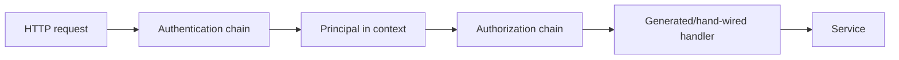

# Auth Design

`internal/auth` owns request authentication, request authorization, and the
request principal context used by server packages.

## Pipeline

HTTP requests pass through auth in two explicit phases before generated handlers:

Public documentation paths bypass both phases via `IsPublicPath`.

## Authentication

`Authentication` runs authenticators in order. The first authenticator that
returns `ok=true` wins and writes a `Principal` into the request context.
Returning `ok=false` means "not applicable" and allows the next authenticator to
try. Returning an error rejects the request as unauthenticated.

Current authenticators:

- `WorkerAuthenticator` applies only to worker runtime status routes. It hashes
  the bearer token, validates it through `store.AuthenticateWorkerAuthToken`, and
  derives the worker ID from the token row. It must not trust the URL or body for
  worker identity.
- `DefaultUserAuthenticator` authenticates requests as the configured default
  user in the current single-user server mode.

## Authorization

`Authorization` runs authorizers in order. The first authorizer that returns
`ok=true` lets the request through. Returning `ok=false` means "not applicable"
and allows the next authorizer to try. Returning an error rejects the request.

Current authorizers:

- `ProjectAuthorizer` authorizes project-scoped routes by authenticated user
  membership. It resolves `/projects/default` and `/api/projects/default` to the
  user's default project before the handler sees the request.
- `WorkerRouteAuthorizer` authorizes authenticated worker principals for worker
  runtime status routes. Operation handlers still verify resource-specific
  authorization, such as matching the authenticated worker ID to the path
  `workerId`.
- `AuthenticatedAuthorizer` authorizes explicitly allow-listed routes for any
  authenticated principal. It exists for routes that require authentication but
  do not have a resource-specific authorizer.

The authenticated allow-list is hard-coded in `authenticatedAllowedPaths`.
Entries ending in `/` are prefixes; entries without a trailing `/` require exact
path equality:

- `/agent-config-definitions`
- `/agent-config-definitions/`
- `/api/workers/register`
- `/projects`
- `/providers/catalog`

`/api/workers/register` is allowed here only as a bootstrap credential
redemption route. It has no authenticated worker principal yet; the service
redeems a short-lived, one-time bootstrap token for a sandbox's preassigned
worker and returns the first runtime token. Do not model ordinary resource
authorization on this route.

Do not authorize by broad exclusion, such as "any route that is not project or
worker scoped." Add an exact path or prefix to the allow-list only when the
route intentionally has no narrower resource authorizer.

Authorization must be decidable from request attributes available before body
interpretation: authenticated principal, method, route/path parameters, query
parameters, headers, and resource ownership loaded from those attributes. If a
body field is needed to identify the resource being authorized, move that
identity into the URL or another request attribute. The only exception is
worker bootstrap registration described above; after bootstrap, worker
authorization must use the authenticated worker principal and request metadata.

## Principal Context

`Principal` is the only request identity stored in context. Use
`WithPrincipal`, `PrincipalFromContext`, and `UserID` to read/write it.

Rules:

- Authentication writes the principal once at the HTTP boundary.
- Project alias resolution happens only in `ProjectAuthorizer`; downstream
  handlers, services, stores, and resource managers must receive concrete
  project IDs and must not branch on the literal `default` alias or the fixed
  default project ID.
- Services may read the principal to enforce operation-specific authorization,
  but should not parse credentials.
- User context means a `Principal{Type: PrincipalTypeUser, UserID: ...}`. Use
  `UserID(ctx)` when service logic needs the authenticated user.
- Worker context means a `Principal{Type: PrincipalTypeWorker, WorkerID: ...}`.
  Worker IDs come from validated credentials, not path or body fields.
