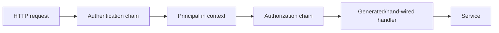

# Auth Design

`internal/auth` owns request authentication, request authorization, and the
request principal context used by server packages. Credential helpers live in
subpackages (see [Subpackages](#subpackages)).

## Pipeline

HTTP requests pass through auth in two explicit phases before generated handlers:

`internal/server`'s `NewApp` installs both as chi middleware on the one router
that serves every listener, in this order:

- `Authentication(PoolAuthenticator, DefaultUserAuthenticator)`
- `Authorization(ProjectAuthorizer, PoolRouteAuthorizer, AuthenticatedAuthorizer)`

Paths matched by `IsPublicPath` bypass both phases: `/healthz`,
`/openapi.yaml`, `/docs`, `/docs/*`, `/ssh` (the SSH endpoint discovery
document), and `/ssh/connect` (SSH carried over HTTP, which authenticates
inside the SSH protocol).

`internal/sshd`'s SSH control-plane ingress (ADR 0024), over either its TCP
listener or `/ssh/connect`, does not use `Authentication`/`Authorization`:
identity is decided during the SSH key exchange. Its `PublicKeyCallback`
records the matched grant in `ssh.Permissions`; after the handshake it builds
an `auth.Principal` from that grant and carries it via `WithPrincipal` on the
connection's context — a transport-specific authenticator. See
[`internal/sshd/DESIGN.md`](../sshd/DESIGN.md).

## Authentication

`Authentication` runs authenticators in order. The first authenticator that
returns `ok=true` wins and writes a `Principal` into the request context.
Returning `ok=false` means "not applicable" and allows the next authenticator to
try. Returning an error rejects the request with 401. If none applies, the
request is rejected with 401.

Current authenticators:

- `PoolAuthenticator` applies only to pool agent runtime routes:
  `/api/pools/{poolId}/{action}` where `action` is in the `poolRuntimeActions`
  allow-list, plus a trailing resource ID only for actions marked as taking
  one. Unlisted routes are not pool routes, so they fail closed; add the action
  in the same change that adds the route. On an applicable route it requires a
  bearer PASETO assertion, loads the route pool, rejects a revoked pool or
  unsupported key type, verifies the assertion with the pool's stored Ed25519
  public key, and requires the signed `project_id` and `pool_id` claims to
  match the route pool. The principal carries the signed `PoolID` and
  `Scopes`. It must not trust the URL or body alone for pool identity.
- `DefaultUserAuthenticator` authenticates every other request as the
  configured default user with `ScopeAll`, in the current single-user server
  mode.

## Authorization

`Authorization` runs authorizers in order. The first authorizer that returns
`ok=true` lets the request through. Returning `ok=false` means "not applicable"
and allows the next authorizer to try. Returning an error rejects the request
with the error's `StatusCode()` if it has one, 404 for `store.ErrNotFound`, and
403 otherwise. If none applies, the request is rejected with 403.

Current authorizers:

- `ProjectAuthorizer` authorizes `/projects/{projectId}/...` and
  `/api/projects/{projectId}/...` routes by user principal and project
  membership. It resolves `/projects/default` and `/api/projects/default` to the
  user's default project and rewrites the path before the handler sees the
  request.
- `PoolRouteAuthorizer` authorizes pool principals on the same allow-listed
  pool runtime routes `PoolAuthenticator` applies to. Services still verify
  resource-specific authorization, such as matching the authenticated
  principal's `PoolID` to the path `poolId`.
- `AuthenticatedAuthorizer` authorizes explicitly allow-listed routes for any
  authenticated principal. It exists for routes that require authentication but
  do not have a resource-specific authorizer.

The authenticated allow-list is hard-coded in `authenticatedAllowedPaths`.
Entries ending in `/` are prefixes; entries without a trailing `/` require exact
path equality:

- `/harness-definitions`
- `/harness-definitions/`
- `/api/pools/register`
- `/peers`
- `/peers/`
- `/peer`
- `/projects`
- `/providers/catalog`
- `/shutdown`

`/peers` is the enrolled-peer resource
([ADR 0095 §1](../../../docs/adr/0095-an-enrolled-iroh-id-is-a-managed-resource.md)).
It is server-scoped, so there is no project membership to authorize on, and an
enrolled peer authenticates as the default user rather than as a principal of
its own — there is nothing narrower for it to be. ADR 0095 §1 accepts the
consequence: this authorizes every principal the pipeline authenticates, on
every listener the router serves, including the carrier hub a pool guest dials.
Such a caller already holds `ScopeAll`, so no new scope is granted; what is new
is that it can mint a durable external credential, and that it can revoke every
enrollment. `authorized_ids` is deliberately unreachable from the API and is
what bounds that. Narrow this entry when a connection carries provenance to
authorize on.

`/peer` serves this server's own peer ID
([ADR 0098](../../../docs/adr/0098-a-server-serves-its-own-peer-id.md)). It is
server-scoped like `/peers`, and the value is one any authenticated caller is
entitled to know.

`/api/pools/register` is allowed here only as a bootstrap credential
redemption route. It has no authenticated pool principal yet; the service
redeems a short-lived, one-time bootstrap token for a preassigned pool and
binds that pool to its self-generated public key. Do not model ordinary
resource authorization on this route.

Do not authorize by broad exclusion, such as "any route that is not project or
pool scoped." Add an exact path or prefix to the allow-list only when the
route intentionally has no narrower resource authorizer.

Authorization must be decidable from request attributes available before body
interpretation: authenticated principal, method, route/path parameters, query
parameters, headers, and resource ownership loaded from those attributes. If a
body field is needed to identify the resource being authorized, move that
identity into the URL or another request attribute. The only exception is
pool bootstrap registration described above; after bootstrap, pool
authorization must use the authenticated pool principal and request metadata.

## Principal Context

`Principal` (`Type`, `UserID`, `PoolID`, `Scopes`) is the only request identity
stored in context. Use `WithPrincipal`, `PrincipalFromContext`, and `UserID` to
read/write it. `WithPrincipal` trims fields and de-duplicates scopes.

Rules:

- Authentication writes the principal once at the HTTP boundary.
- Project alias resolution happens only in `ProjectAuthorizer`; downstream
  handlers, services, stores, and resource managers must receive concrete
  project IDs and must not branch on the literal `default` alias or the fixed
  default project ID.
- Services may read the principal to enforce operation-specific authorization,
  but should not parse credentials.
- User context means a `Principal{Type: PrincipalTypeUser, UserID: ...}`. Use
  `UserID(ctx)` when service logic needs the authenticated user.
- Pool context means a `Principal{Type: PrincipalTypePool, PoolID: ...}`.
  Pool IDs come from validated credentials, not path or body fields.
- Operation-specific scope checks use `Principal.HasScope`: `ScopeAll` (`*`)
  grants every scope and a `prefix:*` entry grants every `prefix:` scope. Pool
  scopes come from the signed assertion (for example `secret:resolve`,
  `credential:broker`); user scopes come from the authenticator (`ScopeAll`
  for the default user, a narrower set for a project-layer SSH key).

## Subpackages

- [`sandbox`](sandbox/DESIGN.md) (`sandboxauth`): the per-project/user sandbox
  access issuer key and the short-lived sandbox access tokens it signs.
- `poolagent` (`poolagentauth`): the server-owned issuer key, stored in
  `server_state` under `worker_agent_request_issuer`, that signs the
  control plane's short-lived PASETO v4.public tokens to pool agents
  (audience `pool-agent`) and sandbox agents (audience `sandbox-agent`), and
  the operation scope names those tokens carry. Pool-to-control-plane
  assertions are the pool agent's `poolauth` package, verified by
  `PoolAuthenticator`.
