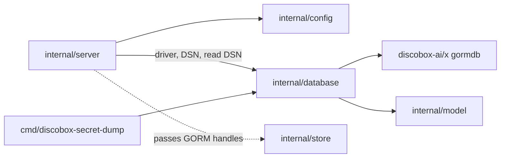

# Database Design

`internal/database` owns physical database connections and migrations. It should
not contain resource persistence logic; keep CRUD and resource transactions in
`internal/store`.

## Boundaries

- Use `gormdb` for opening write/read GORM pools.
- Use `model.AllModels()` from `internal/model` as the migration model list.
- Keep one application database/schema per server process.

## Database Connections

`New(Config)` passes the configured driver, DSN, read DSN, and logger through to
`gormdb.Open` unchanged and returns a `DB` whose exported `Write`/`Read` GORM
handles are backed by pools it owns; `Close` releases them and is nil-safe.
Driver-specific setup belongs to `gormdb`, not here: for SQLite that means
WAL/foreign-key pragmas, a single-connection write pool, and a read-only read
pool (in-memory databases share the write pool); Postgres gets a separate read
pool only when a read DSN is set. The server passes the opened handles to
`internal/store`. `cmd/discobox-secret-dump` opens the same database the same
way, for reading.

## Migration Scope

`DB.Migrate(ctx)` is the only migration entry point and migrates every
application model in one schema; there are no split global/resource or
database-routing migrations. It runs on every startup, so each step is guarded
by what it is looking for and is idempotent:

1. Pre-`AutoMigrate` repairs, for changes `AutoMigrate` would fail on or get
   wrong: deduplicate sandbox names within a project, clear `NULL`
   `sandboxes.runtime_state`, drop an index whose column set changed, and rename
   a column rather than let `AutoMigrate` add a new one beside it.
2. `AutoMigrate(model.AllModels()...)`.
3. Post-`AutoMigrate` data migrations, which need the new columns/constraints:
   index widening, value rewrites (secret types and hosts, provider types),
   dropping a superseded constraint, dropping retired tables and columns, the
   sandbox state split (ADR 0034), and re-keying every sandbox origin to where
   its source came from (`rekeySandboxOrigins`, ADR 0111 §4).

`AutoMigrate` creates tables, adds and widens columns, and creates missing
indexes, but never drops any of them, never alters an index that already exists
under the same name, and cannot tell a rename from an addition. Retiring a column from a model needs an explicit
migration or existing databases keep it — and a retired `NOT NULL` column fails
every write to its table from the moment the model stops populating it. Drop
retired columns with `dropRetiredColumn`, which issues
`ALTER TABLE ... DROP COLUMN` rather than `Migrator().DropColumn`: on SQLite the
latter rebuilds the table from its stored DDL text and quietly drops nothing
unless the identifier is quoted the way GORM writes it. On SQLite it first drops
any index covering the column and runs with `foreign_keys` off on one pinned
connection, because SQLite refuses to drop an indexed column and implements the
drop as a table rebuild.

Tenant-era databases are not migrated in place. The supported replacement path
for an installation that still has `tenant_id` columns, tenant-scoped primary
keys, or tenant indexes is:

1. Back up or export the data with a build that still understands the tenant-era
   schema.
2. Start the current server against a fresh database and let `DB.Migrate` create
   the current single-database schema.
3. Recreate or import the needed resources through current APIs or purpose-built
   one-off tooling that writes the current schema.

Do not add broad compatibility cleanup to `DB.Migrate` for obsolete tenant
schemas. GORM `AutoMigrate` is responsible only for creating/updating the
current schema; it is not a data-preserving tenant-schema converter.

## ID Generation

Generated database row IDs are `<prefix>_<random>`: a short per-resource-type
prefix, an underscore, and 16 random lowercase Crockford base32 characters. The
prefix makes an ID's type recognizable on sight; ordering comes from `CreatedAt`
columns, not the ID. Mint IDs with `id.New(id.Prefix<Type>)` from
`github.com/discobox-ai/x/id` (models do this in their `BeforeCreate` hooks) and
register new prefixes in that package's `id.go`, in the `discobox-ai/x`
repository. Composite keys and fixed well-known rows (e.g. `user_default`) may
use non-generated IDs when that is part of the table design.
