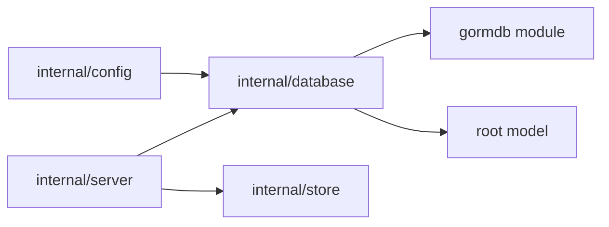

# Database Design

`internal/database` owns physical database connections and migrations. It should
not contain resource persistence logic; keep CRUD, resource transactions, event
records, and durable job records in `internal/store`.

## Boundaries

- Use `gormdb` for opening write/read GORM pools.
- Use root `model.AllModels()` plus `internal/store.JobModels()` for migrations.
- Keep one application database/schema per server process.

## Database Connections

`New` opens the configured write/read database handles and returns a `DB` wrapper
that owns their lifecycle. SQLite uses the configured DSN directly; Postgres uses
the configured connection strings directly. Server composition passes the opened
GORM handles to `internal/store`.

## Migration Scope

`DB.Migrate(ctx)` migrates all application models and durable job queue models
in one schema. Do not reintroduce split global/resource migrations or
database-routing migration entry points.

Tenant-era databases are not migrated in place. The supported replacement path
for an installation that still has `tenant_id` columns, tenant-scoped primary
keys, or tenant indexes is:

1. Back up or export the data with a build that still understands the tenant-era
   schema.
2. Start the current server against a fresh database and let `DB.Migrate` create
   the current single-database schema.
3. Recreate or import the needed resources through current APIs or purpose-built
   one-off tooling that writes the current schema.

Do not add broad compatibility cleanup to `DB.Migrate` for obsolete tenant
schemas. GORM `AutoMigrate` is responsible only for creating/updating the
current schema; it is not a data-preserving tenant-schema converter.

## ID Generation

Generated database row IDs should be lowercase ULID strings. This keeps IDs
globally unique while preserving creation-time locality for indexes and ordered
scans. Composite keys and fixed singleton rows may use non-generated IDs when
that is part of the table design.
