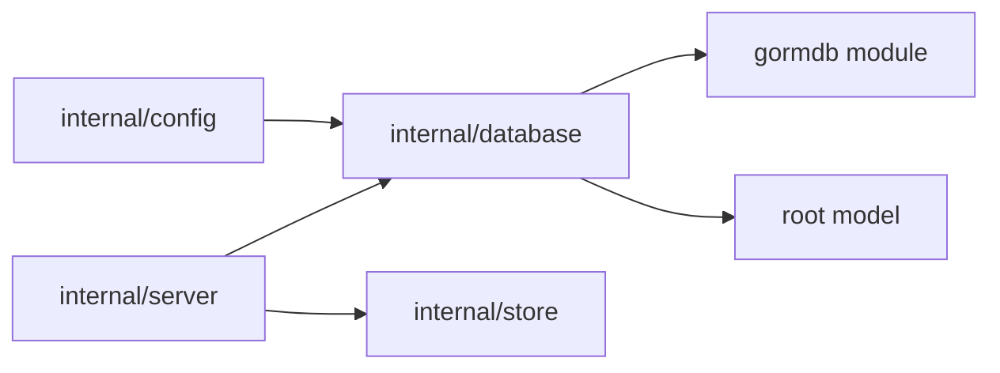

# Database Design

`internal/database` owns physical database connections and migrations. It should
not contain resource persistence logic; keep CRUD, resource transactions, event
records, and durable job records in `internal/store`.

## Boundaries

- Use `gormdb` for opening write/read GORM pools.
- Use root `model.AllModels()` plus `internal/store.JobModels()` for migrations.
- Keep one application database/schema per server process.

## Database Connections

`New` opens the configured write/read database handles and returns a `DB` wrapper
that owns their lifecycle. SQLite uses the configured DSN directly; Postgres uses
the configured connection strings directly. Server composition passes the opened
GORM handles to `internal/store`.

## Migration Scope

`DB.Migrate(ctx)` runs narrow compatibility migrations first, then migrates all
application models and durable job queue models in one schema. Compatibility
migrations may remove obsolete schema constraints such as legacy `tenant_id`
columns that would otherwise survive GORM `AutoMigrate` and reject tenantless
writes. Do not reintroduce split global/resource migrations or database-routing
migration entry points.

## ID Generation

Generated database row IDs should be lowercase ULID strings. This keeps IDs
globally unique while preserving creation-time locality for indexes and ordered
scans. Composite keys and fixed singleton rows may use non-generated IDs when
that is part of the table design.
