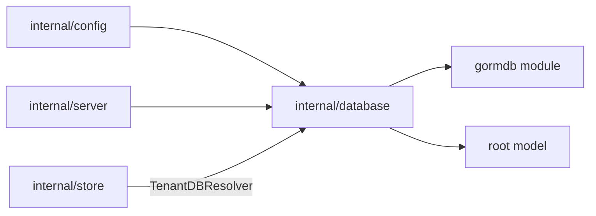

# Database Design

`internal/database` owns physical database connections, migrations, and tenant
database resolution. It should not contain resource persistence logic; keep CRUD,
resource transactions, event records, and durable job records in
`internal/store`.

## Boundaries

- Use `gormdb` for opening write/read GORM pools.
- Use root `model.GlobalModels()` for global migrations.
- Use root `model.TenantModels()` plus `internal/store.JobModels()` for
  tenant-scoped migrations.
- Expose resolver behavior through interfaces consumed by `internal/store`.

## Tenant Database Resolution

Tenant ID is the shard key.

- The global database/schema contains global tables only, currently `tenants` and
  `users`. It must not contain tenant-owned runtime data.
- For Postgres, tenants resolve to tenant-specific schemas in the configured
  database. The resolver derives a safe schema name from the tenant ID and opens
  tenant connections with that schema in `search_path`.
- For SQLite, each tenant resolves to a separate database file. For example,
  `sqlite3:///data/discobox.db` and tenant `tenant-1` resolves to
  `sqlite3:///data/discobox.tenant-1.db`.

The resolver opens global and tenant databases lazily, caches connections, and
can run scoped migrations when each database/schema is first opened.

## Migration Scope

Migrations are intentionally split:

| Method | Scope |
| --- | --- |
| `MigrateGlobal` | Global tables only. |
| `MigrateTenant` | Tenant resource tables and tenant-local durable orchestration tables. |
| `Migrate` | Deprecated compatibility helper; remains tenant-scoped. |

Callers must choose global or tenant migration explicitly. Do not add tenant
models to global migrations.

## ID Generation

Generated database row IDs should be lowercase ULID strings. This keeps IDs
globally unique while preserving creation-time locality for indexes and ordered
scans. Composite keys and fixed singleton rows may use non-generated IDs when
that is part of the table design.

## Tenant Lifecycle Direction

A new local user currently receives a default tenant. Longer term, tenant
ownership should move to an organization-like resource and users should be
invited directly into an existing tenant.

Tenant-owned rows still carry `tenant_id` even when SQLite uses one file per
tenant. This keeps application logic and Postgres behavior consistent and leaves
room for moving tenants between physical shards later.
