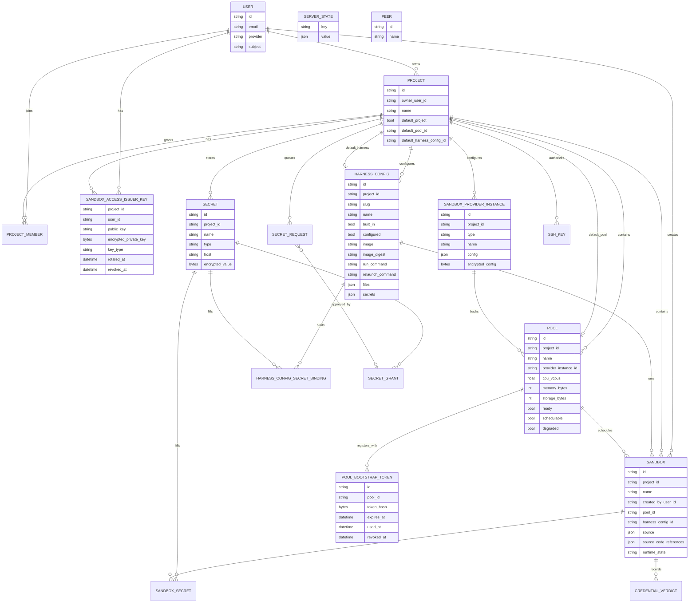

# Model Design

This package contains the server-owned persistence model. The Go structs carry
GORM persistence tags plus JSON, `doc`, and `enum` tags; the API layer converts
them to the generated contract types by JSON round-trip (`services.Convert`).
Public REST API schema types live under the root `api/model` package.

## Core Entities

| Entity | Description |
| --- | --- |
| `User` | Authenticated person. Owns projects and creates sandboxes. |
| `Project` | Group for sandboxes, provider configuration, harness configuration, and pools. Carries the `default` project flag, default pool/harness config, archive retention, and sandbox upgrade policy. |
| `ProjectMember` | Grants a user a role on a project. |
| `ServerState` | Generic key/value state for server preferences and one-time initialization flags. |
| `Sandbox` | Main managed runtime/session resource. Belongs to a project and pool; embeds its spec as `SandboxManifest` (harness config, `harnessMode`, image, source, user) and carries observed runtime state, agent status, and resources. |
| `HarnessConfig` | Project-scoped harness runtime configuration selected by sandboxes. The included harnesses are seeded as `builtIn` configs; a config is selectable only once `configured`. |
| `HarnessConfigSecretBinding` | Binds a harness config env var to a project secret; materialized into `SandboxSecret` rows per sandbox. |
| `SandboxProviderInstance` | Project-scoped backend identity: provider type, credentials, and connection config. Capacity and sharing policy live on `Pool`. |
| `Pool` | User-visible sharing boundary sandboxes are scheduled into, and its own runtime host (ADR-0006). Embeds its spec as `PoolManifest` (name, immutable provider instance, resource envelope); carries the runtime lifecycle, agent identity and public key, `ready`/`schedulable`/`degraded` flags, reported capacity, image staging, resources, and heartbeat. Sandboxes in one pool share a cache, an envelope, and a kernel/host. |
| `PoolBootstrapToken` | Short-lived, one-time token used by a starting pool agent to register its public key. |
| `SandboxAccessIssuerKey` | Per-project, per-user issuer key used by the control plane to sign sandbox access tokens. `ProjectUserKey` is a type alias for it. |
| `Secret` | Project-scoped encrypted credential (`token` or `oauth`). |
| `SecretRequest` | Approval-inbox item for a secret use with no covering grant (reactive or agent-protocol originated). |
| `SecretGrant` | Standing authorization to use a secret, scoped to a sandbox, harness config, or project; optionally carries approved uses. |
| `SandboxSecret` | Binds a sandbox env var to a secret through a sentinel placeholder. |
| `CredentialVerdict` | One judge decision about a command run under an agent credential use (ADR 0091). |
| `SSHKey` | Project-scoped public key authorizing SSH to the project's sandboxes (ADR 0024). |
| `Peer` | Machine permitted to connect to this server, keyed by peer ID (ADR 0095). Not project-scoped. |
| `Job` | Non-persisted, read-only API view of a pending reconcile mark. |

## Persistence Scope

Discobox uses one application database/schema. `model.AllModels()` is the single
migration source for persistent application tables; `server/internal/database`
runs `AutoMigrate` over it plus explicit pre/post migration steps. The reconcile
engine migrates its own `reconcile_dirty` table (`server/internal/reconcile`).

Project-owned resources include `project_id` and should use project boundaries
for uniqueness whenever values are only unique within a project. User-owned rows
include `user_id`. Do not add cross-database routing fields.

## Enums

String-typed state fields use package consts plus a registry slice
(`PoolStates`, `SandboxStates`, `SandboxRuntimeStates`, `GitSourceDeliveries`,
`SandboxUpgradePolicies`, `SandboxDesiredStates`, `PoolDesiredStates`). Field
`enum:"..."` tags and the slices must match `api/openapi/server.yaml`;
`enum_contract_test.go` and `enumsync_test.go` enforce it. An empty value that
means "unset" (runtime state not yet observed, upgrade policy = server default)
is deliberately absent from its slice.

## Deletes

**Deletes are real. No model carries `gorm.DeletedAt`.** Deleting a row removes
it, so "deleted" needs no qualifier: a query cannot forget to exclude tombstones,
and a raw SQL or debug query sees the same state the application does.

Do not add `gorm.DeletedAt`, ad-hoc `deleted` booleans, or nullable deletion
timestamps. A tombstone still occupies every unique index its table has, so it
silently makes the deleted thing unrecreatable — deleting a secret would burn its
name, deleting a pool its name, deleting a project its name, deleting a user
their email address. Recreating any of them fails with a constraint error rather
than doing the obvious thing.

Nothing records the deletion either: there is no event table (ADR 0081). An
audit trail is a feature with its own requirements — what is worth keeping, and
for how long — and belongs to whoever asks for one. Nothing in the system offers
undelete, and reviving a row is not a feature to add by leaving tombstones lying
around: it is a restore path that should be explicit if it is ever wanted.

See ADR 0010.

## Shared Lifecycle Shape

Orchestrated resources embed `ResourceLifecycle` (`lifecycle.go`): `Sandbox`
and `Pool`. Only `generation`/`observedGeneration` are the orchestration
contract; the rest belong to the resource's reconciler and the API (ADR 0017).

Lifecycle fields:

- `desiredState`: requested existence — `present`, `archived` (sandbox only,
  ADR 0022), or `deleted`. Power state is never requested.
- `state`: observed existence state, written only by the resource's reconciler.
- `generation`: latest accepted intent.
- `observedGeneration`: latest generation the reconciler finished acting on.
- `stateChangedAt`: stamped by `SetState` only on an actual change; anchors
  state timeouts.
- `errorMessage`: failure for the observed generation; cleared by `RecordIntent`.

Helpers: `SetState`, `RecordIntent`, `IncrementGeneration`, `Converged`,
`RecordFailure(state, message)` (the caller picks the failure state), and
`SetDefaults`.

Specs are embedded anonymously and stay flat (ADR 0017 §11): `SandboxManifest`
holds exactly the fields whose change requires a container rebuild, and
`SandboxManifest.Fingerprint()` is the drift check; `PoolManifest` holds the
pool host spec.

A sandbox's power state is a separate axis (ADR 0034): `runtimeState`
(`starting`/`running`/`stopping`/`stopped`, empty = not observed) is written
only by pool-agent reports through `Store.ApplySandboxStateReports`.
`SandboxIsLive` answers "is anything relying on this container" across both
axes.

## Relationship Sketch

Auth flows are documented in
[`server/internal/auth/sandbox/DESIGN.md`](../auth/sandbox/DESIGN.md).
Database resolution and migration are documented in
[`server/internal/database/DESIGN.md`](../database/DESIGN.md).

## Pool Scheduling Status

The pool agent reports three scheduling-relevant booleans directly on the pool
row:

- `ready`: the pool host/runtime is healthy.
- `schedulable`: the pool is willing to accept new sandbox work.
- `degraded`: the pool should be used only as fallback capacity. Stored and
  served; placement does not read it.

The agent also reports `available*` capacity and an opaque `conditions` JSON
blob for display and diagnostics; the control plane does not interpret either
for scheduling. Placement is a gate, not a search (`Store.SchedulablePoolForSandbox`):
the sandbox's pool must be unrevoked, desired `present`, not `offline`, ready,
and schedulable. No capacity is gated; sandboxes share the pool's overcommitted
envelope (ADR 0029). `imagesStaged` is a condition, never a scheduling gate.

## Pool Deletion

Pool rows are stateful runtime records. A pool must not be deleted or have its
runtime removed while any sandbox row still has `pool_id` pointing at it; the
pool reconciler records `state=failed` with an error instead. Failed active
reconciliation marks a never-created pool `failed` and a created pool
`offline` only when its heartbeat is stale; otherwise it records `errorMessage`
and keeps the state. It never converts the pool to deleted.

Pool delete is intent-based: `desiredState=deleted` is recorded while `state`
stays put until runtime cleanup succeeds. Only successful cleanup may set
`state=deleted`, clear the scheduling flags, revoke the pool, clear runtime
state, and delete the row. `Pool.BootstrapTokens` declares `OnDelete:CASCADE`
in the GORM relationship because registration credentials have no identity
without their pool; deleting the pool must remove live and spent
bootstrap-token rows in the same database operation.

Pool repair is not delete. Repair is an in-place recovery operation that
replaces the runtime under the same pool identity and must preserve the pool
row and pool-local state (named volumes).
