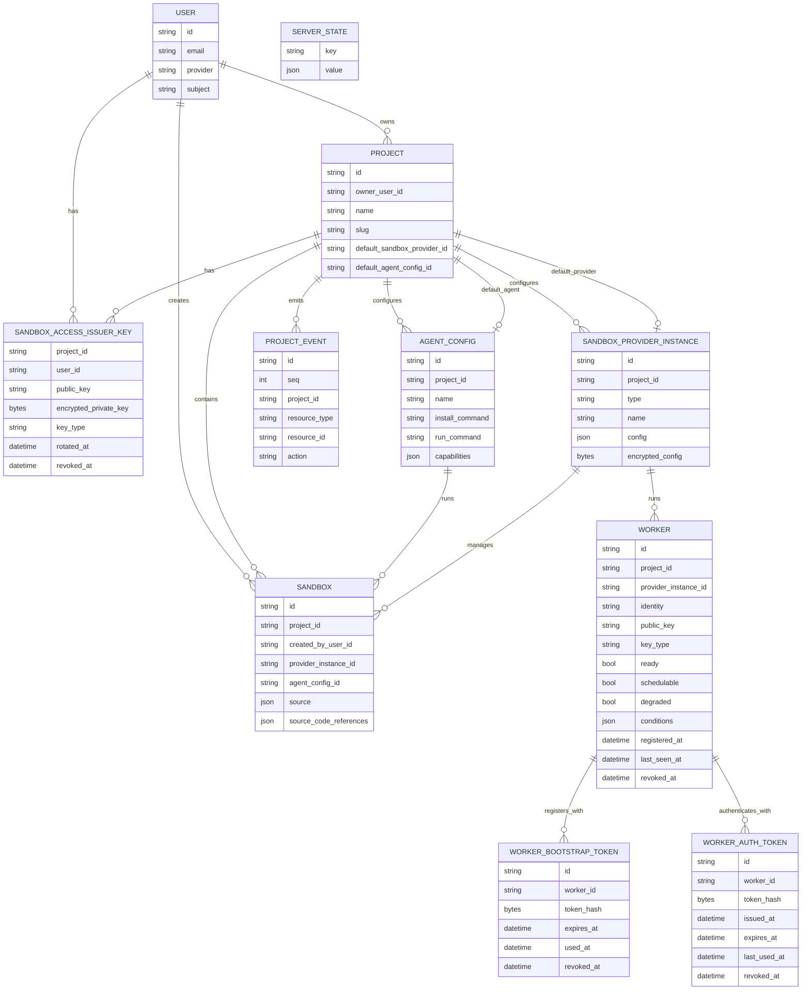

# Model Design

This package contains the server-owned persistence model. The Go structs carry
GORM persistence tags and JSON tags used for persisted event payloads and server
internal conversions. Public REST API schema types live under the root
`api/model` package.

## Core Entities

| Entity | Description |
| --- | --- |
| `User` | Authenticated person. Owns projects and creates sandboxes. |
| `Project` | Group for sandboxes, provider configuration, agent configuration, workers, and project events. |
| `ServerState` | Generic key/value state for server preferences and one-time initialization flags. |
| `Sandbox` | Main managed runtime/session resource. Belongs to a project and is orchestrated. |
| `AgentConfig` | Project-scoped agent runtime configuration selected by sandboxes. |
| `AgentConfigDefinition` | Non-persisted, well-known template used by the UI/API to create an `AgentConfig`; definitions are not selectable by sandboxes. |
| `SandboxProviderInstance` | Project-scoped provider configuration for creating and managing sandboxes. |
| `Worker` | Provider-backed runtime worker for launching sandboxes. Has its own identity and public key; private key stays on the worker. Workers belong to a provider instance/pool and can host many stateful sandboxes. Scheduling uses `ready`, `schedulable`, and `degraded` columns; detailed condition data is opaque JSON for display. |
| `WorkerBootstrapToken` | Short-lived, one-time token used by a new worker to register its public key. |
| `WorkerAuthToken` | Legacy runtime token table retained for migration compatibility; active worker runtime auth uses signed assertions against `Worker.PublicKey`. |
| `SandboxAccessIssuerKey` | Design-level name for the current `ProjectUserKey`: per-project, per-user issuer key used by the control plane to sign sandbox access tokens. |
| `ProjectEvent` | Append-only project-scoped resource event for list/watch sync. |

## Persistence Scope

Discobox uses one application database/schema. `model.AllModels()` is the single
migration source for persistent application tables; server store job models are
migrated alongside them by `server/internal/database`.

Project-owned resources include `project_id` and should use project boundaries
for uniqueness whenever values are only unique within a project. User-owned rows
include `user_id`. Do not add cross-database routing fields.

`AgentConfigDefinition` is non-persisted catalog data and only supplies defaults
for creating persisted `AgentConfig` instances.

## Deletes

Mutable resource models use GORM's native soft-delete support by including a
`gorm.DeletedAt` field tagged with `gorm:"index" json:"-"`. Normal GORM
queries automatically exclude soft-deleted rows, while `Unscoped()` is reserved
for explicit administrative, recovery, or purge paths.

Do not add ad-hoc `deleted` booleans or nullable deletion timestamps for primary
resources. Use `gorm.DeletedAt` so deletes flow through GORM's built-in
`Delete` behavior and query scoping. Append-only/audit rows and operational
state rows that intentionally rely on hard deletes, such as project events or
server initialization state, should document that exception instead of adding
soft-delete fields.

`AgentConfig` intentionally hard-deletes. Disabling an agent config is modeled as
removing that project-scoped name so the same definition name can be enabled
again without colliding with a hidden soft-deleted row.

## Shared Lifecycle Shape

Orchestrated resources embed `ResourceLifecycle`.

Current/proposed orchestrated resources:

- `Sandbox`
- `Worker`

Lifecycle fields include:

- `desiredState`: requested steady state.
- `phase`: observed user-facing state.
- `activeOperation`: current queued/running operation.
- `lastOperationStatus`: pending, running, success, or failed.
- `generation`: latest accepted intent.
- `observedGeneration`: latest reconciled generation.

## Relationship Sketch

Auth flows are documented in `server/internal/sandboxauth/DESIGN.md`.
Database resolution is documented in `server/internal/database/DESIGN.md`.

## Worker Scheduling Status

Workers report three scheduling-relevant booleans directly on the worker row:

- `ready`: the worker agent/runtime is healthy.
- `schedulable`: the worker is willing to pull new sandbox work.
- `degraded`: the worker can still accept fallback work but should not be
  preferred.

Any richer Kubernetes-style conditions or pressure details are stored as an
opaque `conditions` JSON blob for display and diagnostics. The control plane
does not interpret that blob for scheduling.

The worker decides when local compute/storage/memory pressure should change
`schedulable` or `degraded`. The control plane uses a coarse preference:

- preferred: `ready=true`, `schedulable=true`, `degraded=false`.
- degraded: `ready=true`, `schedulable=true`, `degraded=true`.

## Worker Deletion

Worker rows are stateful placement records. A worker must not be deleted or have
its runtime removed while any non-deleted sandbox row still has `worker_id`
pointing at that worker. Failed worker reconciliation marks the worker failed or
unschedulable; it does not convert the worker to deleted. The narrow automatic
delete case is an unregistered worker that never hosted a sandbox.

Worker delete intent uses `phase=deleting` until runtime cleanup succeeds. Only
successful cleanup may set `phase=deleted`, revoke the worker, and clear runtime
state. Purge logic may remove only terminal deleted workers that were
successfully revoked.

Worker repair is not delete. Repair is an active-worker recovery operation for
assigned workers and must preserve the worker row, worker ID, and worker-local
state.
- unavailable: not ready, not schedulable, drained, deleted, or revoked.
