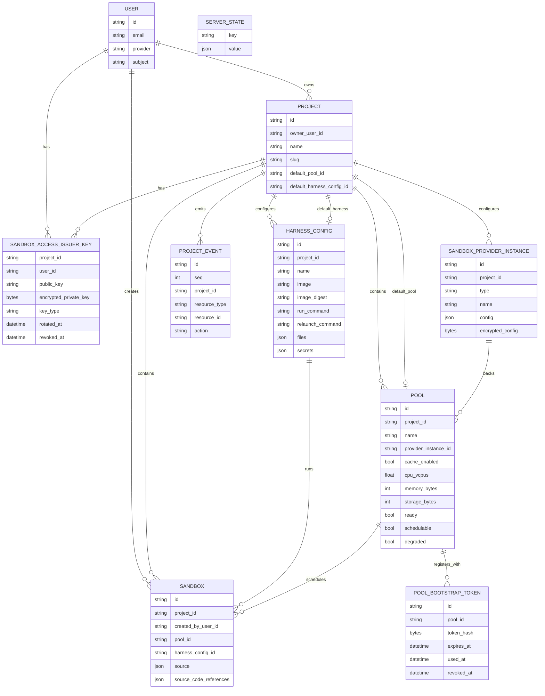

# Model Design

This package contains the server-owned persistence model. The Go structs carry
GORM persistence tags and JSON tags used for persisted event payloads and server
internal conversions. Public REST API schema types live under the root
`api/model` package.

## Core Entities

| Entity | Description |
| --- | --- |
| `User` | Authenticated person. Owns projects and creates sandboxes. |
| `Project` | Group for sandboxes, provider configuration, harness configuration, pools, and project events. |
| `ServerState` | Generic key/value state for server preferences and one-time initialization flags. |
| `Sandbox` | Main managed runtime/session resource. Belongs to a project, selects an image-backed `HarnessConfig`, and persists `harnessMode`. |
| `HarnessConfig` | Project-scoped harness runtime configuration selected by sandboxes. |
| `HarnessDefinition` | Non-persisted catalog entry for an included harness image; definitions are not selectable until registered as a project HarnessConfig. |
| `SandboxProviderInstance` | Project-scoped backend identity: provider type, credentials, and connection config. Capacity and sharing policy live on `Pool`. |
| `Pool` | User-visible sharing boundary sandboxes are scheduled into, and its own runtime host (ADR-0006). Binds immutably to one provider instance; carries the resource envelope, shared-cache flag, the full runtime lifecycle (desired state/phase/generation), agent identity and public key, `ready`/`schedulable`/`degraded` scheduling flags, reported capacity, and heartbeat. Sandboxes in one pool share a cache, an envelope, and a kernel/host. |
| `PoolBootstrapToken` | Short-lived, one-time token used by a starting pool agent to register its public key. |
| `SandboxAccessIssuerKey` | Design-level name for the current `ProjectUserKey`: per-project, per-user issuer key used by the control plane to sign sandbox access tokens. |
| `ProjectEvent` | Append-only project-scoped resource event for list/watch sync. |

## Persistence Scope

Discobox uses one application database/schema. `model.AllModels()` is the single
migration source for persistent application tables; server store job models are
migrated alongside them by `server/internal/database`.

Project-owned resources include `project_id` and should use project boundaries
for uniqueness whenever values are only unique within a project. User-owned rows
include `user_id`. Do not add cross-database routing fields.

`HarnessDefinition` is non-persisted catalog data and only supplies defaults
for creating persisted `HarnessConfig` instances.

## Deletes

Mutable resource models use GORM's native soft-delete support by including a
`gorm.DeletedAt` field tagged with `gorm:"index" json:"-"`. Normal GORM
queries automatically exclude soft-deleted rows, while `Unscoped()` is reserved
for explicit administrative, recovery, or purge paths.

Do not add ad-hoc `deleted` booleans or nullable deletion timestamps for primary
resources. Use `gorm.DeletedAt` so deletes flow through GORM's built-in
`Delete` behavior and query scoping. Append-only/audit rows and operational
state rows that intentionally rely on hard deletes, such as project events or
server initialization state, should document that exception instead of adding
soft-delete fields.

`HarnessConfig` intentionally hard-deletes. Disabling a harness config is modeled as
removing that project-scoped name so the same definition name can be enabled
again without colliding with a hidden soft-deleted row.

## Shared Lifecycle Shape

Orchestrated resources embed `ResourceLifecycle`.

Current/proposed orchestrated resources:

- `Sandbox`
- `Pool`

Lifecycle fields include:

- `desiredState`: requested steady state.
- `phase`: observed user-facing state.
- `activeOperation`: current queued/running operation.
- `lastOperationStatus`: pending, running, success, or failed.
- `generation`: latest accepted intent.
- `observedGeneration`: latest reconciled generation.

## Relationship Sketch

Auth flows are documented in `server/internal/sandboxauth/DESIGN.md`.
Database resolution is documented in `server/internal/database/DESIGN.md`.

## Pool Scheduling Status

The pool agent reports three scheduling-relevant booleans directly on the pool
row:

- `ready`: the pool host/runtime is healthy.
- `schedulable`: the pool is willing to accept new sandbox work.
- `degraded`: the pool can still accept fallback work but should not be
  preferred.

Any richer Kubernetes-style conditions or pressure details are stored as an
opaque `conditions` JSON blob for display and diagnostics. The control plane
does not interpret that blob for scheduling. Placement is a gate, not a
search: the sandbox's pool must be ready, schedulable, and fit the request
within its reported capacity.

## Pool Deletion

Pool rows are stateful runtime records. A pool must not be deleted or have its
runtime removed while any non-deleted sandbox row still has `pool_id` pointing
at it. Failed pool reconciliation marks the pool failed (never created) or
offline (created); it does not convert the pool to deleted.

Pool delete is intent-based: `phase=deleting` until runtime cleanup succeeds.
Only successful cleanup may set `phase=deleted`, revoke the pool, clear
runtime state, and soft-delete the row.

Pool repair is not delete. Repair is an in-place recovery operation that
replaces the runtime under the same pool identity and must preserve the pool
row and pool-local state (named volumes).
