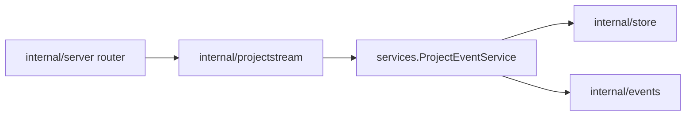

# Project Stream Design

`internal/projectstream` owns project-scoped event streaming transports. It
adapts the project event service to websocket and SSE protocols; it does not own
resource persistence, event creation, or authorization policy.

## Transport Boundary



- Register HTTP routes from `internal/server`.
- Read resource snapshots through `services.ProjectEventService`.
- Subscribe to live events through the same service/broker path used by the rest
  of the server.
- Keep transport-specific concerns here: protocol framing, subscription state,
  filtering, list behavior, and connection lifecycle.

## Routes

The canonical project event transport is the multiplexed websocket route:

```text
GET /projects/{projectId}/stream
```

Clients subscribe by sending JSON control messages over the socket. The initial
supported stream is `sandbox`; future resource streams should use explicit stream
names and tests before clients depend on them.

Static subscriptions are also exposed through the OpenAPI-documented SSE route:

```text
GET /projects/{projectId}/stream/sse
```

SSE subscriptions are configured entirely by query string. Reconnecting clients
may receive current resource data, which is the default, or opt out with
`history=false`; live detail events are emitted only from connection time onward.

## Subscription Lifecycle

Each active websocket subscription is keyed by stream-specific subscription
fields and tracked by a per-subscription token. Cleanup paths must remove or
cancel only the same token they created. Do not delete by key from async cleanup
paths, because a newer subscription may have reused the same key while older
cleanup was still in progress.

Intentional key-only cancellation is limited to explicit replacement or client
unsubscribe behavior, where the current subscription for a key should be
canceled.

## Origin Checks

Websocket routes must use the default origin validation from the websocket
library. Do not set insecure origin-check bypass options; browser-accessible
project streams must reject cross-origin websocket requests unless a future
explicit origin policy is added and tested.
