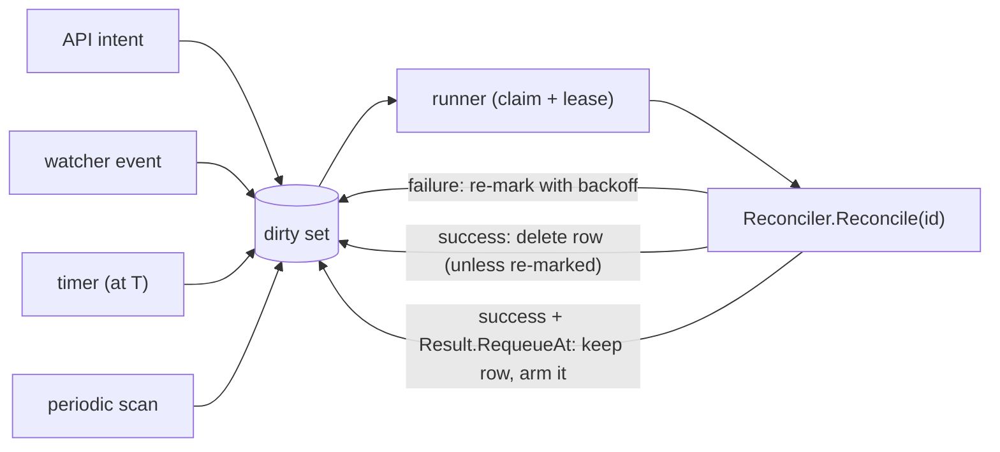
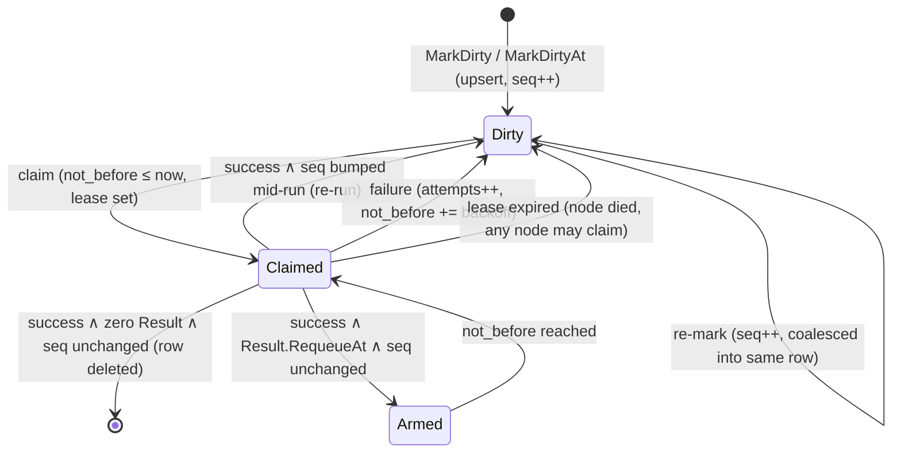

# Reconcile Engine

A small level-triggered reconciliation core. It replaces the edge-triggered
orchestration job queue for resource lifecycle work: instead of appending typed
job rows with payloads, results, and attempt bookkeeping, callers **mark a
resource dirty** and a registered **reconciler** converges it by reading the
latest persisted state.



## Concepts (all of them)

- **Reconciler** — one per resource type. `Reconcile(ctx, id) (Result, error)`
  reads current desired + observed state from the store and converges. It must
  be idempotent; it may block for the duration of the work.
- **Result** — what a successful reconcile reports beyond "no error". The zero
  value settles. `Result.RequeueAt` asks to run again at an instant only the
  reconciler can know, and is the **only** way for it to schedule its own
  re-run (see Self-marking).
- **Dirty set** — one row per `(resource_type, resource_id)` that may need
  attention. Marking is coalescing by construction (primary-key upsert): a
  thousand marks while a reconcile is queued collapse into one row.
- **Runner** — every node runs one. Claims dirty rows with a lease and calls
  the reconciler. No leader election: nodes are competing consumers, so
  multi-node scales out rather than merely failing over.

There are deliberately no job types, payloads, priorities, results, terminal
observers, or max-attempt counters. A reconcile's "payload" is the resource id;
its "result" is the status it writes on the resource; its retry policy is
"stay dirty with backoff until convergence succeeds".

## Marking

```go
MarkDirty(ctx, tx, "sandbox", id)          // reconcile as soon as possible
MarkDirtyAt(ctx, tx, "sandbox", id, at)    // reconcile no earlier than `at`
```

- Both accept the caller's transaction so intent writes and the dirty mark
  commit atomically (the transactional-outbox property the old
  `submitExistingLifecycle` provided).
- Every mark bumps the row's `seq`. `seq` is how the engine detects "marked
  again while a reconcile was already running" (see Completion).
- `MarkDirtyAt` is the timer primitive **for other resources**. Marking earlier
  than an existing `not_before` pulls the row forward; marking later never
  pushes it back. A reconciler's own timer is `Result.RequeueAt`, which assigns
  `not_before` outright — pull-forward would let one stale past value pin the
  row as permanently claimable.

### Self-marking

A reconciler must never mark the resource it is currently reconciling.
`MarkDirtyAtTx` rejects it with `ErrSelfMark`, detected from the in-flight
resource the engine puts on the reconcile context — so it is caught however
deep in the call stack the mark is made.

This is a correctness rule, not style. Completion deletes the row under a `seq`
guard, and a self-mark bumps `seq`, so the delete misses **every time**: the row
survives, `attempts` resets to 0, and it is re-claimed with no delay and no
backoff. It is an unbounded hot loop, not a slow retry. Marking a *different*
resource stays ordinary — that is how work propagates.

Return `Result.RequeueAt` instead. The engine arms the row it already holds,
under the same `seq` guard, so newer intent still wins.

## Claiming and leases (multi-node)

Rows are claimed opportunistically by any node:

1. Select candidate rows: `not_before <= now` and unclaimed **or lease
   expired**.
2. Atomically claim one: `UPDATE ... SET claimed_by=me, lease_expires_at=now+lease
   WHERE type=? AND id=? AND seq=? AND (claimed_by IS NULL OR lease_expires_at < ?)`.
   RowsAffected = 1 wins; 0 means another node got it — move on.
3. While the reconcile runs, the runner renews the lease
   (`UPDATE ... WHERE claimed_by=me`) at half the lease interval.

Worker identity is a per-process id (hostname + random suffix). A dead node's
rows become claimable when their lease expires — no separate stale-job
scanner, no orphan state, no leader.

**Single-node optimization** (SQLite): `Options.SingleNode` clears every claim
at startup, because no other process can hold a valid lease. This restores the
old fast-recovery behavior without a distinct code path anywhere else.

## Completion, failure, re-marks



- **Success** → `DELETE WHERE key AND seq = <claimed seq>`. If the delete hits
  0 rows, the resource was re-marked mid-run; the claim is released and the
  row stays dirty, so the reconciler runs again and observes the newer state.
  This is the entire supersede story — no generation-assert pre-checks, no
  successor-cancellation rules.
- **Success + `RequeueAt`** → the row is kept and `not_before` is **assigned**
  (not pulled forward): the reconciler just read the resource, so it is the
  authority on when it next needs attention. Same `seq` guard, so a mid-run mark
  makes the update miss and its own earlier `not_before` stands — intent beats
  the timer.
- **Failure** → release the claim, `attempts++`,
  `not_before = now + backoff(attempts)` (exponential, capped). The row stays
  dirty until a reconcile finally succeeds. This also serves as flap damping
  for hot resources: a resource that keeps failing backs off automatically.
- **Panic** → recovered and treated as failure.

## Periodic scan (the backstop)

A reconciler may implement:

```go
type Scanner interface {
    ScanDirty(ctx context.Context) ([]string, error) // ids needing attention
}
```

The engine calls it on `ScanInterval` and upserts marks for the returned ids.
The canonical implementation is one query:
`SELECT id FROM <resources> WHERE desired_generation > observed_generation`.
This is the level-triggered safety net the old system lacked: a lost edge
(crashed watcher, missed notify, driver that forgot to reschedule) heals on
the next scan instead of stranding the resource forever.

## Concurrency

- **Per-resource**: serialized by construction — one row, one claim.
- **Per-type**: `WithConcurrency(n)` caps simultaneous reconciles of a type on
  one node (defaults to 4).
- **Cross-node**: the same resource cannot run twice (claim is atomic); total
  throughput scales with node count.

## What callers look like

```go
// API handler / service: intent + mark, one transaction.
store.Transaction(ctx, func(tx *gorm.DB) error {
    sb.DesiredState = model.SandboxDesiredStateRunning
    sb.Generation++
    if err := tx.Save(sb).Error; err != nil { return err }
    return engine.MarkDirtyTx(ctx, tx, "sandbox", sb.ID)
})

// Watcher (drift): one line.
engine.MarkDirty(ctx, "sandbox", sandboxID)

// Cross-resource chaining: a pool reconcile marking one of its sandboxes.
engine.MarkDirty(ctx, "sandbox", sandboxID)

// A reconciler's own deadline — retention, a park timeout, a registration
// timeout. Returned, never marked: see Self-marking.
return reconcile.RequeueAt(sb.StateChangedAt.Add(retention)), nil
```

## Migration order

1. `pool.reconcile` (no generation guard; exercises MarkDirtyAt and
   chaining-target).
2. `sandbox.reconcile` (generation guard, watcher call sites).
3. `sandbox.reconcile` (largest; deletes the `resources/jobs` submit plumbing).
4. Remove `orchestration/`, `store/jobs.go`, `resources/jobs/`.

During migration both engines coexist safely: serialization is per-resource
and each resource type is fully owned by exactly one engine at a time. All
triggers for a type must flip in the same change.
