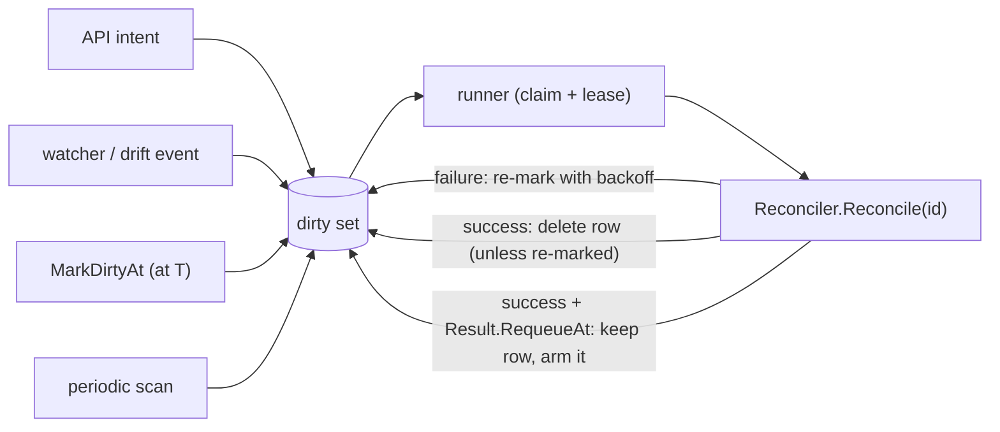
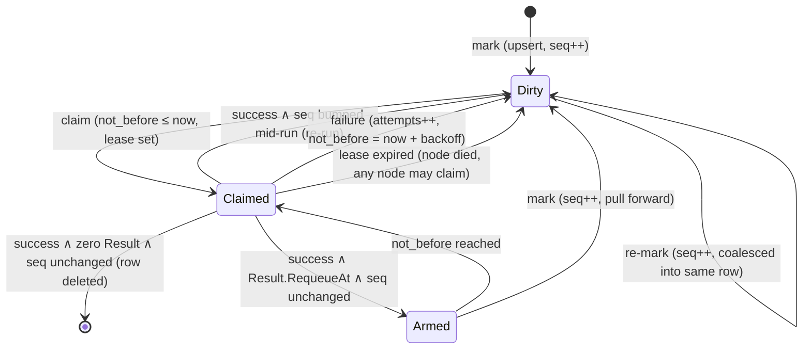

# Reconcile Engine

A small level-triggered reconciliation core, and the only runner of resource
lifecycle work. There is no job queue: callers **mark a resource dirty** and a
registered **reconciler** converges it by reading the latest persisted state.



## Concepts (all of them)

- **Reconciler** — one per resource type. `Reconcile(ctx, id) (Result, error)`
  reads current desired + observed state from the store and converges. It must
  be idempotent; it may block for the duration of the work. The id is opaque to
  the engine; the registering package defines its shape.
- **Result** — what a successful reconcile reports beyond "no error". The zero
  value settles. `Result.RequeueAt` (helpers `RequeueAt(at)`,
  `RequeueAfter(d)`) asks to run again at an instant only the reconciler can
  know, and is the **only** way for it to schedule its own re-run (see
  Self-marking).
- **Dirty set** — the `reconcile_dirty` table, one row per
  `(resource_type, resource_id)` that may need attention. Marking is coalescing
  by construction (primary-key upsert): a thousand marks while a reconcile is
  queued collapse into one row.
- **Engine / runner** — every node runs one `Engine` over the shared database.
  `New` migrates the table, `Register` installs reconcilers (before `Start`),
  `Start` launches the claim, lease-renewal, and scan loops, `Stop` waits for
  in-flight reconciles. No leader election: nodes are competing consumers, so
  multi-node scales out rather than merely failing over.

There are deliberately no job types, payloads, priorities, results, terminal
observers, or max-attempt counters. A reconcile's "payload" is the resource id;
its "result" is the status it writes on the resource; its retry policy is
"stay dirty with backoff until convergence succeeds".

## Marking

```go
MarkDirty(ctx, "sandbox", id)              // reconcile as soon as possible
MarkDirtyAt(ctx, "sandbox", id, at)        // reconcile no earlier than `at`
MarkDirtyTx(ctx, tx, "sandbox", id)        // MarkDirty in the caller's transaction
MarkDirtyAtTx(ctx, tx, "sandbox", id, at)  // MarkDirtyAt in the caller's transaction
MarkDirtyDrift(ctx, "pool", id)            // drift mark: never cuts a failure backoff
```

- The `Tx` forms take the caller's transaction so intent writes and the dirty
  mark commit atomically (transactional outbox).
- Every mark bumps the row's `seq`. `seq` is how the engine detects "marked
  again while a reconcile was already running" (see Completion).
- A mark wakes this node's claim loop at once; otherwise the loop polls every
  `PollInterval`.
- `MarkDirtyAt` is the timer primitive **for other resources**. Marking earlier
  than an existing `not_before` pulls the row forward; marking later never
  pushes it back. A reconciler's own timer is `Result.RequeueAt`, which assigns
  `not_before` outright — pull-forward would let one stale past value pin the
  row as permanently claimable.
- `MarkDirtyDrift` is for observers ("the world may have moved"), not new
  intent. It differs only on a failing row (`attempts > 0`): it does not pull
  `not_before` forward, so watchers of a broken resource cannot cancel its
  backoff and turn it into a hot retry loop. It still pulls an armed
  `RequeueAt` timer forward. Intent marks (`MarkDirty`, `MarkDirtyTx`) always
  preempt a backoff.

### Self-marking

A reconciler must never mark the resource it is currently reconciling. Every
mark variant rejects it with `ErrSelfMark`, detected from the in-flight
resource the engine puts on the reconcile context — so it is caught however
deep in the call stack the mark is made.

This is a correctness rule, not style. Completion deletes the row under a `seq`
guard, and a self-mark bumps `seq`, so the delete misses **every time**: the row
survives, `attempts` resets to 0, and it is re-claimed with no delay and no
backoff. It is an unbounded hot loop, not a slow retry. Marking a *different*
resource stays ordinary — that is how work propagates.

Return `Result.RequeueAt` instead. The engine arms the row it already holds,
under the same `seq` guard, so newer intent still wins.

## Claiming and leases (multi-node)

Rows are claimed opportunistically by any node, only for types with free
per-node concurrency:

1. Select up to 8 candidate rows, oldest `not_before` first: `not_before <= now`
   and unclaimed **or lease expired**.
2. Atomically claim one: `UPDATE ... SET claimed_by=me, lease_expires=now+lease
   WHERE resource_type=? AND resource_id=? AND seq=? AND (claimed_by IS NULL OR lease_expires < ?)`.
   RowsAffected = 1 wins; 0 means another node got it — try the next.
3. The runner renews every lease it holds (`UPDATE ... WHERE claimed_by=me`)
   every third of the lease interval (at least 1s).

Worker identity is a per-process id (hostname + random suffix). A dead node's
rows become claimable when their lease expires — no separate stale-job
scanner, no orphan state, no leader.

**Single-node optimization**: `Options.SingleNode` clears every claim at
startup, because no other process can hold a valid lease, so rows claimed by a
crashed previous run are claimable at once instead of after their lease. The
server sets it (`internal/server/router.go`); nothing else branches on it.

## Completion, failure, re-marks



- **Success** → `DELETE WHERE key AND seq = <claimed seq>`. If the delete hits
  0 rows, the resource was re-marked mid-run; the claim is released and the
  row stays dirty, so the reconciler runs again and observes the newer state.
  This is the entire supersede story — no generation-assert pre-checks, no
  successor-cancellation rules.
- **Success + `RequeueAt`** → the row is kept and `not_before` is **assigned**
  (not pulled forward): the reconciler just read the resource, so it is the
  authority on when it next needs attention. Same `seq` guard (plus
  `claimed_by = me`), so a mid-run mark makes the update miss and its own
  earlier `not_before` stands — intent beats the timer.
- **Failure** → release the claim, `attempts++`, `last_error = err`,
  `not_before = now + backoff(attempts)` (`BackoffBase` doubling per failure,
  capped at `BackoffMax`). The row stays dirty until a reconcile finally
  succeeds, which resets `attempts` and clears `last_error`. This also serves
  as flap damping for hot resources: a resource that keeps failing backs off
  automatically. There is no attempt cap.
- A future `not_before` therefore means one of two things, told apart by
  `attempts`: a failure backoff (`attempts > 0`, `last_error` set) or an armed
  reconciler timer (`attempts == 0`). Observers (`ListDirty`, the
  [jobs API](../resources/jobs/DESIGN.md)) must not read every future
  `not_before` as a failure.
- **Panic** → recovered and treated as failure.
- **`ErrSuperseded`** (`Superseded(msg)`) is a reconciler-side sentinel for a
  generation-guarded write lost to newer intent. The engine does not
  special-case it: a reconciler maps it to a zero `Result` to settle cleanly
  (the newer intent's mark re-runs it); returned as-is it is an ordinary
  failure.

## Periodic scan (the backstop)

A reconciler may implement:

```go
type Scanner interface {
    ScanDirty(ctx context.Context) ([]string, error) // ids needing attention
}
```

The engine calls it every `ScanInterval` and marks the returned ids with
`MarkDirty`. The canonical implementation is one query, e.g.
`SELECT id FROM sandboxes WHERE generation > observed_generation`. This is the
level-triggered safety net: a lost edge (crashed watcher, missed notify, driver
that forgot to reschedule) heals on the next scan instead of stranding the
resource forever.

## Concurrency

- **Per-resource**: serialized by construction — one row, one claim.
- **Per-type**: `WithConcurrency(n)` at `Register` caps simultaneous
  reconciles of a type on one node (defaults to `Options.DefaultConcurrency`).
- **Cross-node**: the same resource cannot run twice (claim is atomic); total
  throughput scales with node count.

## Options

| Option | Default |
| --- | --- |
| `WorkerID` | hostname + random suffix |
| `SingleNode` | false |
| `Lease` | 30s |
| `PollInterval` | 5s |
| `ScanInterval` | 60s |
| `BackoffBase` / `BackoffMax` | 2s / 5m |
| `DefaultConcurrency` | 4 |

## Registered resource types

| Type | Owner | Scanner |
| --- | --- | --- |
| `sandbox` | [sandboxes](../resources/sandboxes/DESIGN.md) | generation mismatch, plus archived sandboxes past retention |
| `pool` | [pools](../resources/pools/DESIGN.md) | every pool |
| `poolImages` | [pools](../resources/pools/DESIGN.md) | ready pools with images not staged |
| `harnessConfig` | [harnessconfigs](../resources/harnessconfigs/DESIGN.md) | none |

## What callers look like

```go
// API handler / service: intent + mark, one transaction.
s.store.Transaction(ctx, func(txStore *store.Store, txDB *gorm.DB) error {
    sandbox.IncrementGeneration()
    sandbox.RecordIntent(desiredState)
    if err := txStore.UpdateSandbox(ctx, sandbox, store.WithGeneration(previous)); err != nil { return err }
    return s.engine.MarkDirtyTx(ctx, txDB, SandboxResourceType, SandboxDirtyID(projectID, sandboxID))
})

// Watcher (drift): one line.
s.engine.MarkDirtyDrift(ctx, PoolResourceType, PoolDirtyID(projectID, poolID))

// Cross-resource chaining: a pool reconcile marking its image staging.
r.pools.engine.MarkDirty(ctx, PoolImagesResourceType, poolID)

// A reconciler's own deadline — retention, a registration timeout, a source
// await. Returned, never marked: see Self-marking.
return reconcile.RequeueAt(pool.StateChangedAt.Add(poolRegistrationTimeout))
```
