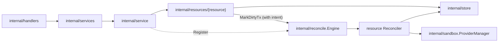

# Resources Design

`internal/resources` contains resource-owned behavior. Each child package owns
the API-facing service for one resource area and, where that resource has a
lifecycle, the lifecycle intent and the reconciler that converges it.

## Packages

| Package | Owns | Reconcile type |
| --- | --- | --- |
| [harnessconfigs](harnessconfigs/DESIGN.md) | Project-scoped harness configs and the configure flow | `harnessConfig` |
| [jobs](jobs/DESIGN.md) | Jobs API, a projection of the reconcile engine's dirty set | none |
| `judges` | The project's judge: the discobox that answers judging asks (ADR 0149) | `judge` |
| `peers` | Enrolled peers: machines permitted to connect to this server | none |
| [pools](pools/DESIGN.md) | `Pool` API (`Service`) and trusted pool intent (`ControlPlane`, the `sandbox.PoolManager` handed to drivers) | `pool` |
| [projects](projects/DESIGN.md) | Projects and the default-project flag | none |
| [providers](providers/DESIGN.md) | Provider-instance API and startup reconciliation | none |
| [sandboxes](sandboxes/DESIGN.md) | Sandbox API, lifecycle intent, and reconciliation | `sandbox` |
| [secrets](secrets/DESIGN.md) | Credentials, their approval lifecycle, and sandbox delivery | none |
| `sshkeys` | Project-scoped SSH keys authorizing SSH to a project's sandboxes | none |

`peers` and `sshkeys` are plain store-backed CRUD services with no design doc of
their own.

`judges` has no API of its own: nothing a client calls creates, lists or deletes
a judge. It converges one per project against what the project says — a pool for
it, recorded when the project's first pool was made, and a configured default
harness, which is its image, its settings and the credential it answers with —
and is marked by whatever changes those. Its reconcile id is a project ID,
because a project has one judge, and its scan names every project so a judge
converges even when whatever changed did not think to say so.

Judging is off until a server opts in (`judgeCredentials`). It is a server's
decision rather than a project's, because it puts a model in front of every
credential-bearing request, and a server that has not asked for that keeps
resolving credentials as it always did. While it is off, no project wants a
judge, so the convergence makes none and takes away any made while it was on —
the same path as removing the project's default harness. A pool that asks
anyway is refused before a judge is looked for.

A judge is an ordinary discobox in judge mode. Judge mode is a create body's to
ask for like any other, so what makes one *the project's* judge is that the
project points at it (`Project.JudgeSandboxID`), written by this package and by
nothing else — the mode alone would also match one somebody made themselves.

Routing a job to a judge is this package's other half (`route.go`). A pool asks
the control plane — `POST /api/pools/{poolId}/judge`, on the credential
broker's own scope, since deciding whether a credential may be used is what
that scope is for — and the control plane forwards to the pool hosting the
project's judge over the channel it already uses to create and start
discoboxes there.

What a pool asks with is which discobox is spending which approved use, and
what its proxy observed. It does not say what that use allows. The sentence
being judged against, the credential's name and the host it is approved for are
read here from the live grant the use belongs to (`secrets.ApprovedUse`), so
nothing a pool or a sandbox sends can widen its own question. The same read
happens again after the verdict, because a verdict takes a while and a grant can
be revoked inside one. The question is composed only once a judge is found: a
project with no judge refuses whatever the use turns out to say.

Pools never call each other: they sit behind NAT, in clouds, and inside VMs,
and the only thing every pool can reach is the control plane.
That is what lets a pool whose own discoboxes are whole VMs of another
operating system judge at all. Every refusal on that path is the same answer —
no verdict — and the reason travels back so the pool can say why.

Judge-mode discoboxes are left out of listings unless asked for
(`store.IncludingJudges`, the API's `includeJudge`, `discobox admin box ls
--include-judge`): a judge runs no terminal and holds no work, so it is not
what asking what is in a project means. For the same reason it is not counted
against a pool or a project being deleted: a judge is not work anybody would
lose.

Naming one is another matter — the CLI's ID resolution includes judges, so a
judge can be got, shelled into, stopped and taken away like any other discobox.
Taking it away is not permanent: the convergence makes another, which is how a
judge is rebuilt after its harness image changes. The one thing it will not do
is run its harness, which the sandbox agent refuses in judge mode (see
[`sandbox-agent/DESIGN.md`](../../../sandbox-agent/DESIGN.md)): launching it
would run the project's agent, with the judge's own credential, in the discobox
whose purpose is to have no work in it.
Everything else — pool and harness resolution, the image pin, the harness
credential's sentinel — is the ordinary create, which is the point of a judge
being a discobox at all.

## Boundaries

- Resource packages call stores for simple CRUD. Sandbox and pool lifecycle
  intent (generation bump plus `MarkDirtyTx`) commits in one store
  transaction.
- Each reconcile type is a `reconcile.Reconciler` registered on
  `internal/reconcile.Engine` by `internal/service` at startup:
  `sandboxes.Service.RegisterJobs`, `pools.ControlPlane.RegisterJobs`, and the
  `harnessconfigs.Service` itself. The engine's semantics are in
  [../reconcile/DESIGN.md](../reconcile/DESIGN.md).
- A reconciler reads the latest persisted state by resource id and owns the
  generation-guarded writes for its resource area, returning
  `reconcile.Superseded` when newer intent wins.
- Provider runtime side effects go through `internal/sandbox.ProviderManager`
  (harnessconfigs reaches sandboxes through its `SandboxRuntime` seam instead);
  resource packages never import `server/providers`.
- Keep HTTP transport adaptation in `internal/handlers`, service contracts and
  DTOs in `internal/services`, and persistence in `internal/store`.

## Not-Found Mapping

`apperrors.NotFound(err, message)` is the single way a resource package turns a
store not-found into the 404 the API serves. It keeps the sentinel as the status
error's `Cause`, so a server-side caller — a reconciler reaping something that
is already gone, most of all — can still match it with
`errors.Is(err, store.ErrNotFound)`. Never build that 404 with
`apperrors.NewStatusError`: the sentinel is lost, and every in-process caller
that tolerates a missing resource starts failing instead.
