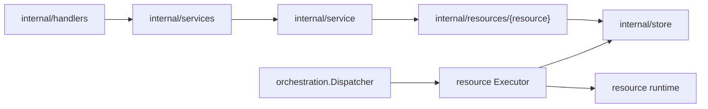

# Resources Design

`internal/resources` contains resource-owned behavior. Each child package owns
the service, manager, executor, payload, and reconciliation code that applies to
one resource area.

## Boundaries

- Resource packages may call stores for simple CRUD and use managers for
  lifecycle side effects.
- Reconcile executors own payload decode, generation checks, and resource
  reconciliation for their resource area.
- Keep HTTP transport adaptation in `internal/handlers`, service contracts in
  `internal/services`, and persistence in `internal/store`.

## Not-Found Mapping

`apperrors.NotFound(err, message)` is the single way a resource package turns a
store not-found into the 404 the API serves. It keeps the sentinel as the status
error's `Cause`, so a server-side caller — a reconciler reaping something that
is already gone, most of all — can still match it with
`errors.Is(err, store.ErrNotFound)`. Never build that 404 with
`apperrors.NewStatusError`: the sentinel is lost, and every in-process caller
that tolerates a missing resource starts failing instead.
