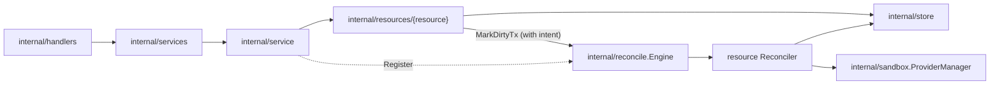

# Resources Design

`internal/resources` contains resource-owned behavior. Each child package owns
the API-facing service for one resource area and, where that resource has a
lifecycle, the lifecycle intent and the reconciler that converges it.

## Packages

| Package | Owns | Reconcile type |
| --- | --- | --- |
| [harnessconfigs](harnessconfigs/DESIGN.md) | Project-scoped harness configs and the configure flow | `harnessConfig` |
| [jobs](jobs/DESIGN.md) | Jobs API, a projection of the reconcile engine's dirty set | none |
| `peers` | Enrolled peers: machines permitted to connect to this server | none |
| [pools](pools/DESIGN.md) | `Pool` API (`Service`) and trusted pool intent (`ControlPlane`, the `sandbox.PoolManager` handed to drivers) | `pool`, `poolImages` |
| [projects](projects/DESIGN.md) | Projects and the default-project flag | none |
| [providers](providers/DESIGN.md) | Provider-instance API and startup reconciliation | none |
| [sandboxes](sandboxes/DESIGN.md) | Sandbox API, lifecycle intent, and reconciliation | `sandbox` |
| [secrets](secrets/DESIGN.md) | Credentials, their approval lifecycle, and sandbox delivery | none |
| `sshkeys` | Project-scoped SSH keys authorizing SSH to a project's sandboxes | none |

`peers` and `sshkeys` are plain store-backed CRUD services with no design doc of
their own.

## Boundaries

- Resource packages call stores for simple CRUD. Sandbox and pool lifecycle
  intent (generation bump plus `MarkDirtyTx`) commits in one store
  transaction.
- Each reconcile type is a `reconcile.Reconciler` registered on
  `internal/reconcile.Engine` by `internal/service` at startup:
  `sandboxes.Service.RegisterJobs`, `pools.ControlPlane.RegisterJobs`, and the
  `harnessconfigs.Service` itself. The engine's semantics are in
  [../reconcile/DESIGN.md](../reconcile/DESIGN.md).
- A reconciler reads the latest persisted state by resource id and owns the
  generation-guarded writes for its resource area, returning
  `reconcile.Superseded` when newer intent wins.
- Provider runtime side effects go through `internal/sandbox.ProviderManager`
  (harnessconfigs reaches sandboxes through its `SandboxRuntime` seam instead);
  resource packages never import `server/providers`.
- Keep HTTP transport adaptation in `internal/handlers`, service contracts and
  DTOs in `internal/services`, and persistence in `internal/store`.

## Not-Found Mapping

`apperrors.NotFound(err, message)` is the single way a resource package turns a
store not-found into the 404 the API serves. It keeps the sentinel as the status
error's `Cause`, so a server-side caller — a reconciler reaping something that
is already gone, most of all — can still match it with
`errors.Is(err, store.ErrNotFound)`. Never build that 404 with
`apperrors.NewStatusError`: the sentinel is lost, and every in-process caller
that tolerates a missing resource starts failing instead.
